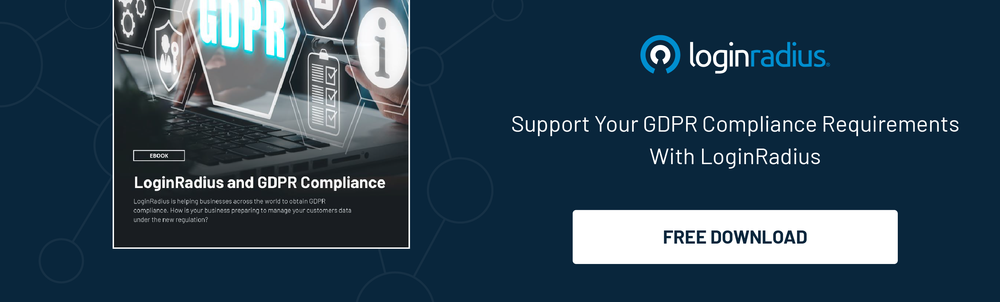

## Introduction

Trade transcends physical boundaries, weaving through the intricate web of the internet in the modern business landscape. As global economies become increasingly interconnected, the significance of cybersecurity in digital trade negotiations cannot be overstated. 

Cybersecurity serves as a protective measure and a potential unifying factor, fostering trust and cooperation among trading nations. 

Identity security is a critical aspect of this cybersecurity landscape, which hinges on robust [Customer Identity Management](https://www.loginradius.com/blog/identity/customer-identity-and-access-management/) (CIAM) solutions. Let’s dive into the role of cybersecurity, with a particular focus on identity security, in harmonizing digital trade negotiations.

## The Nexus of Cybersecurity and Digital Trade

Digital trade involves the exchange of goods, services, and information through digital means. As businesses and consumers rely heavily on digital platforms, the threat landscape expands, encompassing cyberattacks, data breaches, and identity theft. These threats can undermine the integrity of digital trade, erode trust, and lead to significant economic losses.

Cybersecurity, therefore, becomes essential in safeguarding digital trade. It ensures that transactions are secure, data is protected, and parties involved in trade can trust the digital environment. 

When countries engage in digital trade negotiations, prioritizing cybersecurity can serve as common ground, as all parties are vested in maintaining the security and integrity of their digital transactions.

## Cybersecurity as a Unifying Factor

In the realm of digital trade negotiations, cybersecurity can act as a unifying factor in several ways:

1. **Shared Interests**: All nations participating in digital trade have a shared interest in ensuring the security of their digital ecosystems. Negotiators can find common ground by prioritizing cybersecurity and working towards mutually beneficial agreements.

2. **Standardization and Best Practices**: Negotiations can lead to the adoption of standardized cybersecurity practices and frameworks. These standards can help harmonize security measures across borders, making international digital trade more seamless and secure.

3. **Trust Building**: Robust cybersecurity measures, including [identity security through CIAM](https://www.loginradius.com/blog/identity/what-is-identity-security/), build trust among trading partners. When countries can trust their digital interactions are secure, they are more likely to engage in and expand digital trade.

4. **Economic Stability**: Secure digital trade contributes to the stability and growth of the global economy. Negotiators can help protect economic interests and foster sustainable development by emphasizing cybersecurity.

## Identity Security: The Foundation of Cybersecurity

Identity security is a cornerstone of cybersecurity. It involves protecting the identities of individuals and entities engaged in digital interactions. In the context of digital trade, identity security is crucial for verifying the authenticity of parties, preventing fraud, and ensuring compliance with regulatory standards.

A robust Customer Identity Management (CIAM) solution plays a pivotal role in achieving comprehensive identity security. CIAM systems manage and secure customer identities, providing a [seamless and secure experience](https://www.loginradius.com/customer-experience-solutions/) for users while safeguarding their data. Key features of an effective CIAM solution include:

1. **Authentication and Authorization**: CIAM solutions ensure that users are who they claim to be through multi-factor authentication (MFA) and other verification methods. They also manage user permissions, ensuring only authorized individuals can access sensitive information.

2. **Data Privacy and Compliance**: CIAM systems help businesses comply with [data governance](https://www.loginradius.com/data-governance/) regulations such as GDPR and CCPA. They ensure that customer data is collected, stored, and processed in accordance with legal requirements, thereby fostering trust and reducing the risk of regulatory penalties.

3. **User Experience**: A robust CIAM solution balances security with user experience. It provides a frictionless login process, personalized experiences, and consistent access across multiple channels, enhancing customer satisfaction and loyalty.

4. **Fraud Detection and Prevention**: CIAM solutions employ advanced analytics and machine learning to detect and prevent fraudulent activities. By monitoring user behavior and identifying anomalies, they can thwart identity theft and other cyber threats.

## Conclusion

Cybersecurity, with a strong emphasis on identity security, is paramount in the digital trade landscape. 

A robust Customer Identity Management (CIAM) solution, like LoginRadius,  is critical in ensuring the security and integrity of digital interactions. By prioritizing cybersecurity in digital trade negotiations, nations can find common ground, establish trust, and work towards a more secure and prosperous digital economy. 

As digital trade grows, cybersecurity will undoubtedly play a central role in shaping its future, unifying diverse stakeholders in pursuing a safe and reliable digital world.

