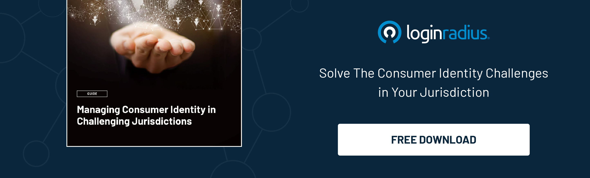

---
title: "Unveiling the Benefits of Identity Verification for Online Retailers "
date: "2023-08-31"
coverImage: "identity-verification.jpg"
tags: ["identity verification","biometric authentication", "cx"]
author: "Vishal Sharma"
description: "In the dynamic realm of online retail, establishing trust while countering cyber threats is paramount. Identity verification emerges as a game-changer, bolstering security, trust, compliance, and even personalization. Dive into the advantages it brings to businesses navigating the digital landscape."
metadescription: "Discover how identity verification is changing online retail by enhancing security, building trust, ensuring compliance, and enabling personalized experiences."
metatitle: "Unlocking Benefits: Identity Verification in Online Retail"

---
## Introduction

Establishing trust is a cornerstone of success in this ever-expanding online retail world. However, the increasing threat vector and sophistication of attacks have created certain challenges for online retailers while they put their best foot forward in establishing customer loyalty and trust. 

Hence, with the rise of cyber threats, fraud, and privacy concerns, businesses are compelled to adopt robust measures to ensure the security and authenticity of every transaction. 

One such measure that has emerged as a game-changer is identity verification, which has revolutionized the entire retail industry to deliver flawless and secure customer experiences. 

Let’s dive into the benefits of identity verification for online retailers. 

### 1. Enhanced Security and Fraud Prevention

The digital landscape has potential risks, including identity theft and payment fraud. Identity verification acts as a formidable shield against these threats by confirming the identity of users making transactions. 

Multi-factor authentication, [biometric recognition](https://www.loginradius.com/blog/identity/what-is-mob-biometric-authentication/), and document verification ensure that customers are who they claim to be, reducing the chances of fraudulent activities and unauthorized access.

### 2. Trust and Credibility

Trust is the cornerstone of online retail success. Implementing identity verification mechanisms instills confidence in customers that their personal information and financial details are safeguarded. 

When consumers trust a business to prioritize their security, they are more likely to complete transactions and establish long-term relationships, thus boosting customer loyalty.

### 3. Compliance with Regulations

In an increasingly regulated digital landscape, businesses must adhere to strict compliance standards to protect customer data and maintain operational legality. 

Identity verification aids in complying with various data security and privacy regulations, ensuring that businesses operate within legal boundaries and avoid penalties. These regulations include the EU’s GDPR and California’s CCPA. 

### 4. Reducing Chargebacks and False Positives

Chargebacks, where customers dispute legitimate transactions, and false positives, where legitimate customers are incorrectly flagged as fraudulent, can be costly and damaging to businesses. 

Identity management systems minimize these occurrences by accurately identifying genuine customers, resulting in smoother transactions and fewer disputes.

### 5. Personalized Customer Experiences

Identity verification isn't solely about security – it can also contribute to [creating personalized customer experiences.](https://www.loginradius.com/customer-experience-solutions/) 

By confirming user identities, businesses can access valuable insights that help tailor recommendations and marketing efforts, enhancing the shopping journey.

### 6. Streamlined Operations

Manual review processes can be time-consuming and resource-intensive. Identity verification automates the verification process, allowing businesses to streamline operations, allocate resources more efficiently, and focus on core tasks.

### 7. Expansion of Global Reach

For businesses eyeing international markets, identity verification is crucial. Different regions have varying authentication requirements, and integrating identity verification systems helps companies cater to each market's unique needs while expanding their global footprint.

### 8. Adaptation to Changing Consumer Behavior

Consumer behavior is evolving, and shoppers are becoming more cautious about online security. Implementing identity verification aligns with these changing behaviors and demonstrates a commitment to customer well-being.

## Conclusion

In the hyperconnected world of online retail, where trust and security are paramount, identity verification emerges as a linchpin for success. The benefits of identity verification for online retailers – from heightened security and compliance to personalized experiences – make it an indispensable tool for businesses striving to thrive in the digital marketplace. 

As technology advances and consumer expectations evolve, identity verification will remain a cornerstone of online retail's future.

