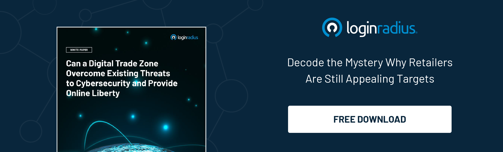

Online security is one of the biggest concerns for ecommerce stores. This is why every ecommerce business should make additional efforts to ensure that their websites, data stores, and clients' data remain as guarded as possible to enhance the [customer experience in retail](https://www.loginradius.com/blog/fuel/customer-experience-retail-industry/). 

According to a report, more than [90% ](https://expertinsights.com/insights/the-top-5-biggest-cyber-security-threats-that-small-businesses-face-and-how-to-stop-them/)of online small businesses face a data breach. Hence when you get your ecommerce store up and running, creating security authentication for ecommerce should never be a one-time task.

## Top 10 Ways to Boost Your E-Commerce Security

Given below are some measures for protecting an E-Commerce business by generating a strong customer authentication:

### 1. Use HTTPS

HTTPS has become the industry standard for online security, and sites that continue employing the traditional HTTP protocol may suffer adverse repercussions and threats to their online safety. Also, earlier businesses used HTTPS only for their payment gateways that dealt with confidential information. 

However, given the rising password security issues in modern times, ecommerce store owners are shifting their entire site with HTTPS. It ensures that not only their payment areas but also every other page on their website remain secure. 

Moreover, site security entails more than just safeguarding payment information as it likewise entails protecting the data of your customers. 

### 2. Never save credit card data.

To keep your E-Commerce store guarded against all the online threats and vulnerabilities, ensure that you never save credit card data online. As E-Commerce payments get processed through external vendors, it can sometimes pose a substantial threat to the credit card data of your company and clients. 

### 3. Remain equipped with safety plugins.

Plugins are a gift to E-Commerce dealers everywhere who run their websites on platforms that allow it. Wordfence Security, for example, is a plugin that blends E-commerce stores into a robust security system that is compatible with the web application firewall. 

This plugin not only prevents your website from being hacked but also gives you a real-time view of your traffic and all possible hacking attempts.

### 4. Assist your customers in protecting themselves.

Although you inevitably should maintain your customers' information secure on the tail end, there are still serious risks of specific customer accounts getting hacked. 

While you cannot stand over your clients' head and instruct them on ways to build a secure account, you can impose standard safety characteristics such as [CIAM authentication](https://www.loginradius.com/authentication/) or robust password prerequisites to guard your clients' online data. 

### 5. Keep your admin dashboard secure.

There are several ways for hackers to access your eCommerce site, but perhaps the simplest is to gain access to your Admin Side. It only takes one simple- password for hackers to begin poking around your admin panel, finding the information they seek—and even locking you out of your site. 

Too many site owners leave their admin dashboard login details as simple as "admin" for the username and "password" for the passcode, only to be surprised when someone gains access to their admin panel. When eCommerce sites get set up, the predefined username is Admin, and many vendors are so engrossed in the whirlwind of starting work that they never change it.

### 6. Always make a copy of the database.

It is never a good feeling to discover that your eCommerce store website got hacked and your personal information has been adversely affected. It's unnerving to know that someone has been poking around your webpage, and it is even more disconcerting that you don't know what they have done. 

Attackers can do anything from simply copying your data to more maliciously corrupting it and making sure you can't use it again.

### 7. Regularly conduct PCI scan.

Proactive security inspection (PCI) helps you detect problems before they cost you clients and resources. Regardless of how well-known your eCommerce website host is, you should conduct routine PCI scans. These scans recognise perils and vulnerabilities that could leave your eCommerce store open to data breaches and the shot of malware and viruses.

### 8. Monitor your ecommerce website carefully.

Site confidentiality is not a passive activity, and you must routinely inspect your eCommerce store to detect any unusual activity. Sure, you can automate certain aspects of your site's safety, such as programmed backups and routers, but there's a lot more to security trust that you must remain aware of. 

### 9. Use multi-factor authentication.

Gone are the times when online security remained confined to only one factor of user authentication for ecommerce. Nowadays, it has become crucial for all E-Commerce businesses to switch to [multi-factor authentication](https://www.loginradius.com/blog/identity/multi-factor-authentication-a-beginners-guide/) to ensure you leave no room for hackers to attack your website. 

### 10. Never underestimate your security.

Apart from taking care of your E-Commerce store, it is imperative to secure your private online data. It is because if imposters fail to find your online site, they might attempt to invade your privacy and confidential data. 

## The Bottom Line 

Keeping your E-Commerce store guarded against online malpractices is not a tedious task if you follow the safety measures. Also, keep in mind the points above and keep your business and customer data protected against breaches. 

