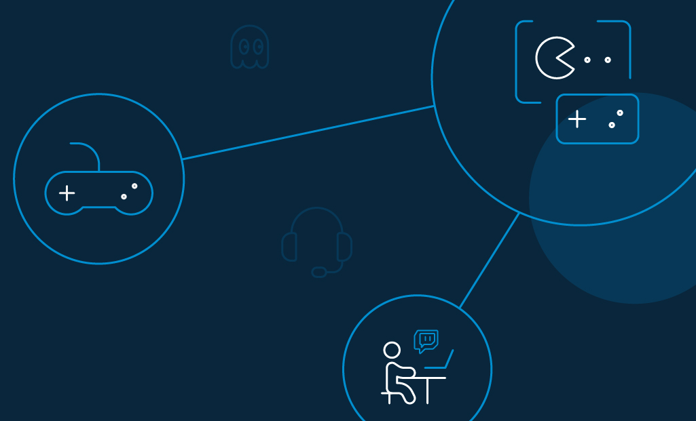

The gaming industry has been leveling up since it entered the mainstream in the 1980s. Exciting advancements in online streaming and Virtual Reality (VR) appear to lead the way. Yet, without a seamless user experience, game popularity can suffer. Here are some trends in improving customer experience that can help your gaming or streaming business win and retain more customers.

## Online Gaming Industry Growth

In 2019, [a report by SuperData](https://venturebeat.com/2020/01/02/superdata-games-hit-120-1-billion-in-2019-with-fortnite-topping-1-8-billion/), found that the gaming industry made over $120 billion dollars. And experts at [Newzoo](https://newzoo.com/insights/articles/newzoo-adjusts-global-games-forecast-to-148-8-billion-slower-growth-in-console-spending-starts-sooner-than-expected/) say the gaming market will grow to $189.6 billion by 2022. Newzoo’s report also stated that collectively, mobile and console games contribute around 80% of this revenue. In response to this demand, [Google and Microsoft](https://www.theverge.com/2019/6/19/18683382/what-is-cloud-gaming-google-stadia-microsoft-xcloud-faq-explainer) announced their own cloud gaming services. This means that [players can stream games](https://www.theverge.com/2019/6/19/18683382/what-is-cloud-gaming-google-stadia-microsoft-xcloud-faq-explainer) as easily as streaming a movie.

## The Top 5 Gaming Industries

Since people of all ages and demographics play digital games, the global community is massive. [Microsoft estimates over two billion active gamers](https://www.businessinsider.com/video-game-industry-120-billion-future-innovation-2019-9) play everything from free mobile games to high-tech computer games. As new platforms, technology, and genres emerge, that figure is likely to grow. 

_For now, here are some fun facts about the most popular gaming genres._

**1\. Gambling**

Gambling has been a popular recreation for generations, so there’s no wonder that [online gambling is so lucrative](https://www.loginradius.com/blog/2020/06/online-casino-and-gambling-cyber-threat/). Here are some interesting facts about the online gambling market.

[Grand View Research](https://www.prnewswire.com/news-releases/online-gambling-market-worth-102-97-billion-by-2025--cagr-11-5-grand-view-research-inc-300907362.html) predicts that this niche may be worth $102.97 billion by 2025.

Currently, the [EU leads online gambling](https://www.egba.eu/eu-market/) and will likely continue this well into 2020. 

The Asia Pacific Digital Gaming market is expected to [reach +$241 billion](https://newzoo.com/insights/articles/newzoo-games-market-numbers-revenues-and-audience-2020-2023/) (due to a rise in disposable income) by 2023. 

**2\. Shooter or survivor games**

Shooter and survivor games give players a first-person point-of-view of a solider or apocalyptic survivor. Popular shooter games include Counter-Strike, Quake 4, Halo 2, and Battlefield 2. As a “build and survive” game, [Minecraft led video-game popularity](https://www.theverge.com/2019/12/5/20996849/minecraft-youtube-rewind-fortnite-grand-theft-auto-roblox-biggest-games-views) on Youtube in 2019.

Gaming trivia: In 2018, [some parents hired “Fortnite tutors”](https://www.usatoday.com/story/tech/2018/08/01/fortnite-tutors-thing-and-yes-parents-paying-them/882305002/) to teach their kids to play better. Talk about helicopter parenting! 

**3\. Educational games**

Schools, universities, government agencies, and businesses support the educational gaming industry. The [Global Game-Based Learning Market report by Metaari](https://www.gamesindustry.biz/articles/2018-08-08-metaari-game-based-learning-market-will-reach-usd17-billion-by-2023) predicts that this gaming genre will hit $17 billion by 2023. 

**4\. Cross-platform online games** 

In cross-platform gaming, AKA cross-play games, players on multiple platforms and devices can get together and play at the same time. 

The popularity of cross-play is huge. That’s why vendors in the [cloud-based gaming marketplace](https://www.digitaltrends.com/gaming/what-is-cloud-gaming-explained/) are making games compatible on all platforms, including smartphones, PCs, laptops, and tablets. Some popular cross-play games include Call of Duty: Modern Warfare (Xbox One, PS4, PC), Minecraft (Xbox One, Switch, PC, mobile), and Fortnite (Xbox One, PS4, Switch, PC, mobile).

**5\. Virtual reality games** 

[Virtual Reality (VR), Augmented Reality (AR), and Mixed Reality (MR)](https://www.forbes.com/sites/bernardmarr/2019/07/19/the-important-difference-between-virtual-reality-augmented-reality-and-mixed-reality/#15d83bad35d3) are making exciting strides in gaming technology. In fact, [Polaris Market Research](https://www.polarismarketresearch.com/industry-analysis/virtual-reality-vr-in-gaming-market) predicts that VR in the gaming industry will become a $48.2 billion-dollar market by 2026. 

## Improving Customer Experience in the Gaming Industry  

There’s no denying that gamers expect frictionless gameplay. That’s why in 2020, digital customer experience is vital to a game's popularity. 

_Here are the top things to consider when improving a gamer's user experience:_

**Gamers expect 100% uptime.** 

When a game crashes, it ruins the overall momentum of the game. Players know they can switch to a competitor anytime they want—and _they will_. Don’t assume they’ll return to your games once they find a better experience elsewhere.

Here’s how to prevent that from happening. Look for cloud-based CIAM solutions like LoginRadius that offer [automated failover systems](https://www.loginradius.com/engineering/failover-systems-and-loginradius-99-99-uptime/) and a scalable infrastructure that handles surges. This will ensure that your game is available even during peak loads. 

**Gamers exchange opinions on gaming forums.** 

As the gaming industry continues [to grow](https://www.forbes.com/sites/ilkerkoksal/2019/11/08/video-gaming-industry--its-revenue-shift/), it’s important to engage with your customers. A good way to increase engagement is to be present in various forums so that you can solve their technical queries.

In case you can’t be there to solve them, reward forum members who provide answers to other gamers for you. 

**Gaming is an emotional experience.**

Due to the emotional aspects of gaming, players see gaming as not just a product, but an experience. They forge friendships around gaming and often enjoy connecting to players around the world. In fact, a gaming trend called "[PC Bangs](https://www.researchgate.net/publication/228294342_PC_bang_Inc_The_Culture_and_Business_of_PC_bangs_in_Korea)" (translation: PC Rooms) gives gamers a dedicated gaming room. Many other countries are also jumping on the “gaming bar” trend, which also includes eSports cafes. 

Whether you own one of these gaming bars, or the games the guests are playing, you’ll want to keep players happy with great customer support. 

**Gamers are willing to pay more for a great experience.**

In short, the more invested the player is in the experience, the more upset they’ll be if the experience is subpar. That’s why most gamers are willing to pay more for a great user experience, better support, and top-notch security. 

## Making Data Security a Priority in the Gaming Industry

Compared to TV, music, and film, the gaming industry is becoming one of the biggest industries in digital entertainment. In order to play their favorite games, players trust gaming companies with their personal information. 

That’s why [data security](https://www.cpomagazine.com/tech/data-security-in-the-online-gaming-industry/) should be taken seriously. Here are the most common gaming security issues and how to remedy them.

- **Weak authentication:** An average gamer needs to manage multiple accounts for multiple games. This means that players must remember multiple passwords for all of these games. As a result, they end up with weaker passwords or reusing the same password for multiple accounts. This, of course, makes hacking a gamer’s account “child’s play.”

To protect gamer accounts cybersecurity measures like [multi-factor authentication](https://www.loginradius.com/blog/identity/what-is-multi-factor-authentication/) (MFA), password management, and firewalls should be applied. 

- **Phishing**: Phishing campaigns have been used to hack gamers. Hackers will set up a fake login page and send malicious links. Falling prey will result in a takeover of the player’s account or stealing possessions of a character. 

To protect players, educate them about phishing. Prevent account takeovers by using Risk-based Authentication (RBA). This detects unusual IPs or behavioral anomalies so you can block fake users from accessing accounts.

- **Child identity theft**: Kids tend to be more [vulnerable to identity theft](https://www.lifelock.com/learn-identity-theft-resources-teens-risk-identity-theft.html) for numerous reasons. This makes the gaming industry a hunting ground for security abuse. Gaming companies can [leverage role management](https://www.loginradius.com/role-management/) to manage access, giving guardians the right to limit a child’s access.

Customer Identity and Access Management (CIAM) platform LoginRadius offers [out-of-the-box compliance](https://www.loginradius.com/integrations/age-verification/) for COPPA, CCPA, and GDPR. This prevents any user under the age of 13, as indicated by the date of birth, from completing registration. 

### Conclusion 

No matter what platform or game, players demand a seamless experience with no downtime. With a CIAM solution from LoginRadius, you don’t have to compromise security to provide it. 

