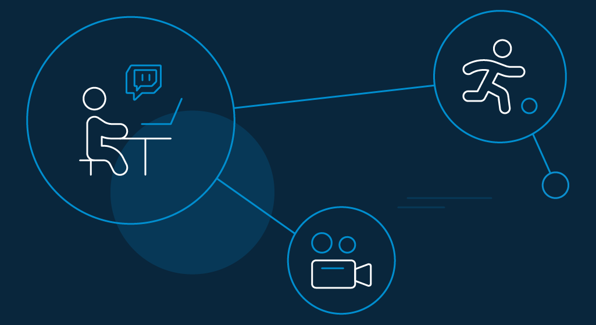

It is an unprecedented time in the corona-hit world of sports. As franchises are preparing for a new age of fan experience in the sports industry, digital transformation is helping them give their fans newer and better ways to interact with their team. 

Dedicated phone applications are available for fans who cannot make it to the stadium. Today, they can monitor ball-by-ball action close-up in virtual reality or connect via social media with friends and even players in real-time. And still, if they want to enjoy traditional radio commentary, they can hook themselves on their wireless headsets. 

As ever more immersive technological platforms become available, the sports industry motivates more avid fans to attend games, interactions, increase retention rates, etc.

As the home experience becomes more genuine and advanced with high-definition televisions, one significant element of fan engagement today is entertaining viewers with the most advanced and exciting games. 

Moreso, with immersive technological platforms taking the lead, the sports industry motivates avid fans to attend sporting events under futuristic facilities. Today, they get access to free Wi-Fi, social media presence, HD scoreboards, and digital ticket concessions, among others.

This leads to the fact that digital identity plays an important role in their willingness to engage as fans online. A[ customer identity and access management (CIAM) solution](https://www.loginradius.com/blog/2019/06/customer-identity-and-access-management/#:~:text=CIAM%20simplifies%20every%20business%20task,%2C%20business%20intelligence%2C%20and%20services.) can help sports franchises discover new ways to interact with fans inside the stadium and out. 

According to a report by Capgemini, nearly 70% have already enhanced their overall viewing experience. That's a big number! 

## Key Issues in the Sports Industry

The potential is immense. Fans are becoming more willing to connect with their favorite clubs and leagues after months without sports. The Premier League eSports league alone secured over [150 million cumulative video views](https://www.esportstalk.com/news/premier-league-esports-invitational-secures-more-than-150-million-views/) when in lockdown. It is inevitable that this growth in digital participation will continue, and it is high time leagues, and teams understand that. 

But then, there are a few hiccups. Here are some of the key issues that may hinder the fan experience in the sports industry. 

### Dealing with a fan-less gallery.

The lack of a physical audience is already making it very difficult for sports broadcasters to catch the emotional content of the game. The breathless hush is being missed that have always said more than a roar. 

Yet technology can provide players with a sense of stability and consistency that is preferable to disturbing during a time of social isolation. 

### Taking creativity to the next level.

Post corona, the other incentive that media partners will continually pursue to enrich fan experience in the sports industry is to make live programming much more innovative than it is at present. If we can put cameras in the locker room, for example, and capture players' real-time emotions, that will be great. 

Another option is the use of Spidercam to interview a player in real-time. It will capture real-time emotions and make broadcasting even more engaging and interactive.

### Home is the new gallery.

COVID-19 has created an incentive for broadcasters to shift their formulaic approach to sports. Broadcasters should consider the possibility of showing images of fans cheering from the comfort of their home during the telecast.

The fans on the sofa will replace the fans in the stands. TV and [streaming devices](https://www.loginradius.com/blog/2020/05/streaming-applications-secure-customer-data/) can display fans' emotions—nervous, worried, and happy as they see their favorite player in action. 

## 5 Best Practices to Enhance Fan Experience in Sports Industry

To begin, the basics. Sports franchises should make sure that their fans are safe and secure. Because digital is embedded in every aspect of the business, you don't want your fans to have second thoughts about their identities online.

Below are a few practices that will boost fan experience in the sports industry.

### A data-driven approach in sports.

If you are looking to deliver a positive fan experience and reach maximum engagement, paving the way for a data-driven approach will be helpful. Here's how you can take control.

*   **Assess**: Figure out what information you have at present and recognize the gaps. 
*   **Build**: Harness the data available with [personalized experiences](https://www.loginradius.com/blog/2018/10/digital-transformation-safeguarding-customer-experience/) to create new fan journeys. 
*   **Develop**: Catch the missing data to offer on-demand personalization. 
*   **Define**: Set a data plan, build a new operating model, and outline the architecture for the target technology.

Like a good coach studying the opponent to formulate a game plan, customer data helps franchisees learn how fans are engaging with the team and what to offer them. A CIAM platform can help you formulate just that with a better approach to cybersecurity. 

### Offer a personalized smart-stadium experience.

The future of the fan experience in the sports industry relies on a more streamlined and strategic approach to sensing, data analytics, and networks, which sees the stadium as a value-integration hub. 

IT strategy is not a tertiary feature in this case. The future of stadium entertainment is key to it. Emphasize more on offering contextual, convenient, and personalized smart-stadium experiences. 

### Reliable uptime standards.

For games and betting apps to sustain in the competition, they require reliable real-time platforms to go live. Missing merely sixty minutes in a year can be terrible for the fan experience and disastrous business. It will even lead to failed fan loyalty and irreparable repercussions. 

The solution? 100 percent uptime.

### Esports is getting bigger.

The esports industry is disrupted continuously by new games—some hit popularity almost immediately. For example, the closed beta of the new game Valorant released in April 2020 was [viewed by 1.7 million peak players](https://www.theverge.com/2020/4/8/21212567/valorant-riot-games-twitch-record-viewers) on the same day for 34 million hours.

But then, the esport fans aren't homogenous audiences. A CIAM solution can help segment the fan journey as:

*   Fans of mature esports (League of Legends) are interested in e-commerce, business, and fast cars. 
*   Fans of newer esports (Fortnite) are inclined towards outward appearance. 
*   Fans of sports simulation games (FIFA) are strongly interested in a wide range of sports. 
*   Niche esports (StarCraft II) fans are interested in literature and information gathering, traveling, and using intelligent computers.

### Embrace the new generation

The new generation connects with their favorite brands differently. They switch from one outlet to another and want to be completely involved. These are fluid fans that are quickly becoming the industry's favorite. As they are[ omnichannel](https://www.loginradius.com/blog/2020/04/omnichannel-customer-experience/), they are more likely to discover new games. 

Businesses are approaching identity management platforms to understand the journey of these fluid fans and create strategies to get them involved.

## How LoginRadius Can Help You to Improvise Customer Experience for Your Fans 

LoginRadius helps businesses use the data they collect to the fullest by creating unified profiles for each fan. The CIAM platform allows for the storage of highly customizable data fields, as well as custom objects, which track more dynamic sets of data such as purchase history. From there, the progressive profiling feature provides robust fan insights in order to segment them for more personalized and targeted campaigns.

Personalized mobile apps and services are a great way to enhance the fan experience in the sports industry. But forcing fans to create multiple accounts in order to engage with the various components of these apps is disruptive and can lead to a lack of adoption for those services.

With the [single sign-on (SSO)](https://www.loginradius.com/blog/identity/what-is-single-sign-on/) function of the LoginRadius solution, fans can access each team platform with a single set of credentials. And for third-party domains, such as ticketing platforms, LoginRadius offers federated SSO to push a fan's credentials to that platform to maintain a frictionless experience.  

With SSO in place, fans can go from watching highlights of their favorite player to buying their jersey to purchasing tickets for their next game, all under a single account.

## Conclusion

Much has been added to the fan experience in the sports industry in a recent couple of years. The truth is that there is no beginning or end. It's just a matter of adjusting. 

Having said that, fans will speculate the sports industry in a very different light in the post-pandemic world. To improve the fan experience in the sports industry, you need to be observant of what's happening in the market... And get real! 

