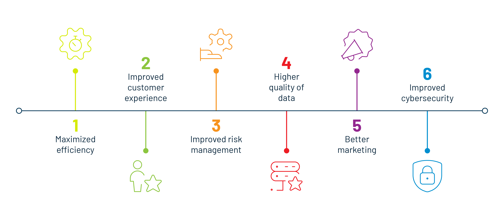
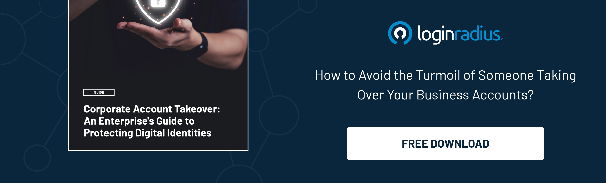

## Introduction

We’re in a digital-first era where data is the essential fuel that ensures a business stays up and running even in unpredictable times. While businesses are collecting enormous amounts of customer data, their primary focus is to ensure [robust security](https://www.loginradius.com/customer-security/) for their customers rather than driving value and generating revenue streams. 

However, once an organization understands the true potential of valuable customer insights, it can easily enhance its ROI without altering its sales and marketing strategies. 

But the question is, how to leverage valuable customer insights? Here’s where the true potential of digital privacy comes into play! Let’s understand the advantages of incorporating digital privacy for today’s modern digital businesses. 

## Huge Data Reserves to Revenue Streams 

Global businesses typically emphasize customer satisfaction by delivering a rich and secure experience across every digital touchpoint, and as such, prioritizing digital privacy drives customer trust and loyalty by showing them that the confidentiality and security of their digital information is a paramount concern for your organization. 

Moreover, as businesses hustle towards an era with a privacy-first approach and mindset, they are open to doing the following more easily: 

* building trust, 
* managing compliances, and 
* retaining customers. 

Customers share their details with brands they have trusted for decades when they purchase or consider any online service. Brands can collect crucial user/customer data to build marketing strategies, including information about customer behavior and preferences. 

On the other hand, a <a rel="nofollow" href="https://www.mckinsey.com/business-functions/risk-and-resilience/our-insights/the-consumer-data-opportunity-and-the-privacy-imperative"> survey </a> from McKinsey reveals that 36% of customers rely on a business that promotes privacy for its product, portraying the importance of building trust in clients. 

Once brands build trust in their customers through security and privacy, the next step is to leverage their data to provide personalized journeys and suggestions for growth. 

The list is endless when discussing the [ROI aspects of digital privacy](https://blog.loginradius.com/growth/what-is-digital-privacy/). But not all returns on investment are financial; other benefits also should be considered. Here are some of the ways that prioritizing digital privacy can have a positive impact on your organization. 

### 1. Increases organizational efficiency

Leveraging the true potential of digital privacy is the key to unlocking the power of untapped customer data that further enhances organizational efficiency. Understanding the critical user trends and behaviors helps you better streamline in-house processes. 

When a business complies with data privacy and security regulations, the information security team could focus more on areas within the organization. For instance: 

* **Saves time and resources:** Saving an organization’s time and resources is perhaps one of the significant benefits of incorporating [GDPR compliances](https://www.loginradius.com/gdpr-and-privacy/) as a part of your digital privacy policy. Businesses need not spend more time and resources on managing privacy and security within the organization.  
* **Reduced maintenance costs:** Complying with global data regulations like CCPA and GDPR helps reduce your organization’s information security maintenance costs. 

### 2. Protects your sensitive data assets

Data is the fuel that keeps businesses up and running. Hence, its security must be the top priority for organizations striving for digital transformation. 

With digital privacy, brands can ensure their crucial information isn’t compromised and can simultaneously secure customer identities. Here’s how they can achieve the same: 

* **Authorization and authentication:** Relying on customer identity and access management (CIAM) solutions like [LoginRadius CIAM](https://www.loginradius.com/) for managing compliance can eventually reinforce authorization and authentication processes. Hence, helping you ensure robust data security. 
* **Risk-based authentication (RBA):** When brands choose a CIAM solution, they get high security for data in high-risk situations. RBA automatically adds a stringent layer of protection if unusual activity or access is demanded from a particular account. This safeguards sensitive business data and customer identity. 

### 3. Helps you figure out how to better manage and reduce costs

The global average data breach cost was $<a rel="nofollow" href="https://www.statista.com/statistics/987474/global-average-cost-data-breach/">4.24 million </a> U.S. dollars in 2021. Hence, digital privacy becomes the need of the hour for managing costs. 

Let’s understand how businesses can minimize direct and indirect expenses with digital privacy: 

* **No in-house customer identity management:** A reliable [customer identity management](https://blog.loginradius.com/identity/customer-identity-and-access-management/) solution kills two birds with a single stone as it minimizes the need to manage identities within the organization and helps meet compliance. You not only get privacy, security, and compliance, but you save all the expenditure of incorporating each aspect. 
* **Reduced IT costs:** One of the significant costs associated with in-house data privacy and security management is the regular maintenance of passwords. And IT team has to ensure that they offer an immediate response to a password recovery request, which utilizes resources and time. With privacy management through a CIAM solution, businesses can deploy a complementary [passwordless authentication](https://www.loginradius.com/passwordless-login/) solution that removes the need to remember long passwords. An example of a passwordless authentication solution is a login feature of LoginRadius customer identity and access management solution, which can be incorporated into any website or application to offer a seamless login experience without passwords. 

### 4. Mitigates non-compliance related costs and lawsuits

Businesses that collect critical customer data shouldn’t ignore the importance of compliance with different global data and privacy regulations. The consequences of non-compliance could be enormous and may require a business to pay heavy fines or penalties. Failing to do this could even result in lawsuits by customers whose personally identifiable information (PII) has been compromised by a data breach. 

A recent example of such lawsuits is Adtech firm Criteo, which recently faced a proposed fine of <a rel="nofollow" href="https://www.complianceweek.com/regulatory-enforcement/adtech-firm-criteo-facing-61m-gdpr-fine-in-france/31956.article"> 60 million Euros (U.S. 61.4 million) </a> from France’s Data Protection Authority (DPA) for non-compliance with the GDPR. 

## How to Measure ROI by Adopting Digital Privacy

Incorporating digital privacy has offered various business benefits to brands providing online services to their customers across the globe. And there are several ways brands can measure their progress in the form of ROI. 

Here are some of the metrics for measuring the return on investment (ROI) of digital privacy:

### 1. Track the number of returning customers 

Your loyal customers speak a lot about your services and the trust you have built with them over time. A recent <a rel="nofollow" href="https://www.adobe.com/content/dam/cc/in/about-adobe/newsroom/pdfs/2022/Adobe_Trust_Report_Press_Release_APAC_%20India_8th_June_2022_IN_20220608.pdf"> survey from Adobe </a> reveals that customers are concerned about how brands utilize and manage their personal information; hence, they like to spend more on brands they trust. 

If a brand has a consistent flow of returning customers, it’s already on the right path to generating revenue through the potential of digital privacy. 

In a nutshell, if your online platform has many returning customers after incorporating new digital privacy policies and procedures, you’ve already achieved your biggest goal. 

### 2. Monitor how many users give data management consent 

Customer data keeps businesses running even in the most challenging and unpredictable times. Complying with data privacy laws and regulations can help build trust in your customers. And if you are compliant and customers aren’t hesitant to [provide consent](https://www.loginradius.com/consent-management/) for the collection, processing, and usage of data, it’s a clear indication of success.

Data management is crucial for generating revenues since customers willing to share their consent portray that they trust a brand on how they utilize their personal information. 

### 3. Keep tabs on your overall conversion rates 

If a brand is converting a lot of users, it’s the most straightforward metric to measure ROI through digital privacy. Brands that can generate more leads but aren’t able to convert should consider incorporating digital privacy that helps them build customer trust and drive value over time.

Please put in the time and effort to communicate your prioritization of protecting their data to make them aware of what you’re doing. Once digital privacy is incorporated and users know it, businesses start their overall growth journey. 

## Thinking of Leveraging Digital Privacy? Here’s What You Need to Do! 

Incorporating digital identity has endless business advantages. Let’s have a look at some of the ways you can enhance your overall business growth with digital privacy:

### 1. Properly manage your users’ digital identities

Proper management of digital identity means you must be able to leverage the true potential of digital privacy and ensure data security from the moment a customer interacts with your brand. Implementing the following to your platform can help:

* Add an extra layer of authentication for your customers for more robust security.
* Allow customers to log in with third-party platforms instead of traditional passwords for a seamless login experience and maximized privacy.
* Enforce international regulations concerning privacy and consent management, including GDPR and CCPA.
* Gather and manage consumer permissions and preferences more efficiently.
* Provision data access rights of your customers. 

### 2. Conduct regular risk assessments

Regular cyber risk assessments could help your team better understand the areas of improvement and prioritize mitigating risks that can lead to data privacy breaches. 

Once businesses assess and identify their areas of weakness, the next step is to incorporate tools and applications that can decrease the likelihood of privacy breaches. 

Apart from this, an enterprise can create secure backups and ensure specific configurations of the overall IT infrastructure and network to ensure robust customer data security and privacy. This helps in reducing overall IT costs. 

And when you learn the risks, it’s time to create a strategy that helps you mitigate the threat vectors in advance. Also, when you’re aware of potential threats, you can create better data handling policies to ensure robust data security. 

For instance, implementing a mechanism like [risk-based authentication](https://blog.loginradius.com/identity/risk-based-authentication/) (RBA) could help maintain robust security in high-risk situations. And at the same time, it provides insights into the threat vectors and how an unauthorized person attempted to gain access. 

Once the origin of the threat is identified, the next step is to work on increasing the layers of security around that particular vulnerability. 

## In Conclusion 

Digital privacy has offered endless possibilities for businesses embarking on a transformation journey by providing valuable insights regarding customer preferences and past choices. 

Businesses need to start working on their marketing strategies and ensure to leverage the true potential of digital privacy by incorporating a robust identity management solution that provides quick insights into user preferences. 

