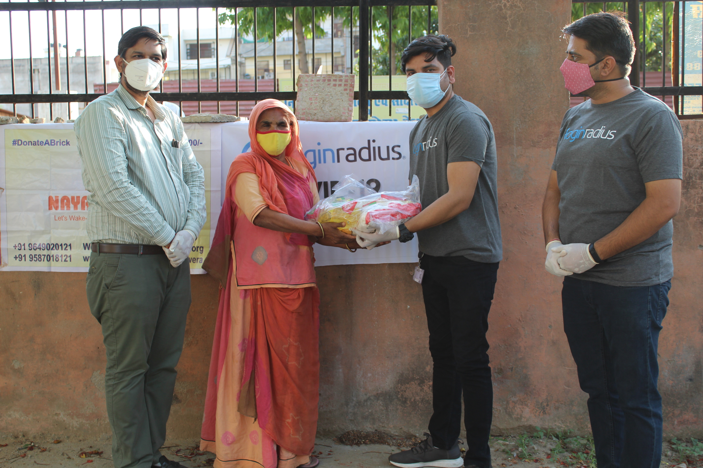
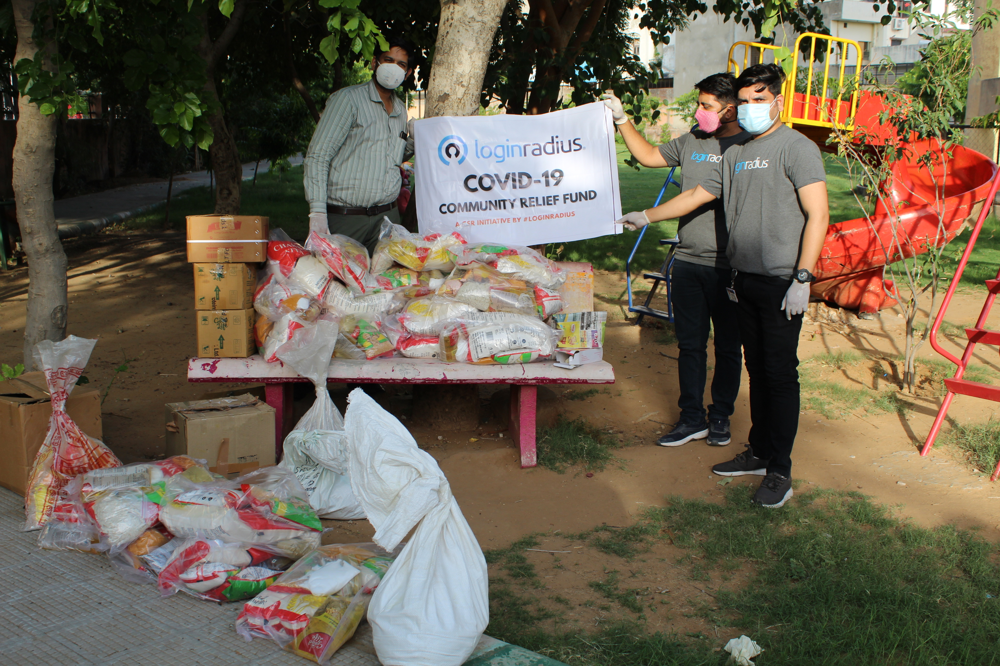
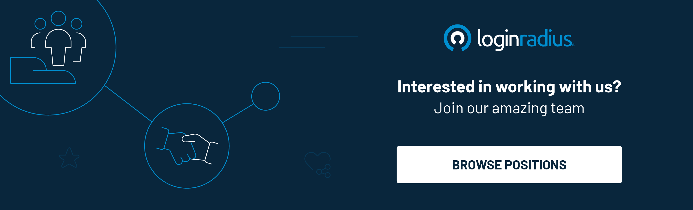

_Hi,_ I am the Senior Operations Manager and feel really proud of being a part of the socially responsible company, _LoginRadius._ 

The concept of CSR is essentially based on the notion that organizations should not only strive to optimize profits and shareholder value but should also make a conscientious effort to minimize or eliminate impact on the environment and society.

Society has changed how it interacts with companies. Consumers have become more aware and educated about the impact that businesses have on society. They are looking for corporations that positively address the needs of society. 

At LoginRadius, we check all the boxes in the category with our sustainable and thriving Corporate Social Responsibility (CSR) culture. The company has been carrying out CSR activities since its inception and has been focused on giving back in any way possible to society.

## A Little Backdrop

LoginRadius is a leading cloud-based CIAM solution that empowers organizations to deliver a delightful consumer experience. The company was established in 2012 by Mr. Rakesh Soni and is headquartered in San Francisco with offices in Jaipur and Hyderabad, India.
 

The company offers customizable login interfaces, open-source SDKs, best-in-class data security products, and integrations with over 150 third-party applications. We are already loved by 3,000 businesses with 1.17 billion consumers worldwide and raised $17 million in Series A funding from Microsoft.

## Building A Sustainable CSR Program

**In addition to focusing on economic growth, the founders also have a personal desire to contribute to the community. According to them, it is imperative to integrate social and environmental concerns into the organization and support the community. They also believe in strengthening the roles and responsibilities of the employee to drive the CSR Program.**

I will always be thankful to them for encouraging me to voice my views on carrying out the CSR exercises.

## Corporate Responsibilities, Endorsed from All Angles

As we strive to contribute towards a better future, we have partnered with Naya Savera, a socially oriented organization that aims to empower economically backward communities.

We always focus on our employees to make a difference in the community. This allows them to volunteer or give back to their community. For example, our _[Dhan Utsav](https://loginradius.org/)_ is an event where we encourage employees to donate clothes, toys, shoes, stationery, utensils, etc., to the kids of Naya Savera in the spirit of Diwali.

Our _Kick for a Cause_ initiative is a one-day friendly football tournament to raise funds for underprivileged women. We also help them sell their handicrafts by hosting exhibits in various hotspots within Jaipur.

Through Naya Savera and Kartavya NOG, we're currently supporting the education of ten and five children respectively each year, and we're committed to giving more children a chance at a great education in the coming years.

## Driving Initiatives in the Times of COVID-19

We also extended a helping hand to people by financially supporting them at times of economic breakdown and unemployment.

We extended our support at the time of the Covid-19 pandemic, which led the central and state governments to announce lockdowns from March 2020 throughout the country. This economic slump led to thousands of people losing their jobs and creating a financial crunch in many families. 

During this challenging time when it was difficult for the poor and unemployed to arrange food for themselves, we distributed ration to 200 families of laborers, construction workers, and local migrants who live in slum areas of Jaipur with the help of local NGOs.

Apart from our community initiatives, we are proud to contribute significantly to the PM Cares Fund. 

## Bottom line: It is Difficult to Describe a Culture Without Being a Part of It.

I remember the day when I joined LoginRadius. My first impression was that it was a beautiful, diligent company, and everyone in the organization was very dynamic, humble, and driven with a commitment to excellence. _I am proud that I stand true to my option to this day._

## I would like to conclude that working with Loginradius has helped me develop a better understanding of corporate citizenship. The company empowers its employees to go above and beyond the call of duty. Its social initiatives encourage us all to individually make a difference in society.

Engaging in civic and social activities also re-energizes us in the workplace. The more we participate in these activities, the better we feel about our work. We gain a sense of accomplishment that we have contributed something toward the welfare of others.

We are an organization that's committed to working for the good of the people. We believe in community development and will continue to make a difference.

I feel honored to be a part of the LoginRadius family :)   

