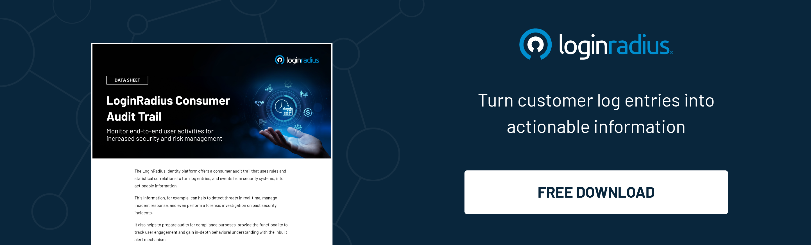

## Introduction

In today's digital landscape, security threats are ever-evolving, posing significant risks to businesses and their customers. 

At LoginRadius, we recognize the critical importance of staying ahead of these threats. Our proactive stance is not just about reacting to incidents but anticipating potential vulnerabilities and addressing them before they can be exploited. 

We understand that the trust our clients place in us is paramount, and this trust hinges on our ability to provide a secure and resilient [identity management](https://www.loginradius.com/blog/identity/customer-identity-and-access-management/) solution.

Our commitment to proactive security measures and responsible disclosure is a testament to our dedication to safeguarding our clients' data and enhancing their overall security posture.

## Understanding Proactive Security Measures

Proactive security measures involve anticipating potential threats and addressing vulnerabilities before they can be exploited. 

This approach is fundamental in[ creating a robust security framework](https://www.loginradius.com/customer-security/) that defends against known threats and mitigates risks associated with emerging vulnerabilities. 

At LoginRadius, we integrate proactive security measures into every aspect of our operations, ensuring that our clients can trust the integrity and safety of our services.

## The Role of Responsible Disclosure

Responsible disclosure is a critical component of our security strategy. It involves the timely identification, reporting, and remediation of security vulnerabilities by collaborating with the cybersecurity community, including ethical hackers, researchers, and other stakeholders. 

This collaborative effort helps us maintain high security and transparency, reinforcing our commitment to protecting our clients' sensitive information. 

## How LoginRadius Implements Proactive Security and Responsible Disclosure

### 1. Regular Security Audits and Penetration Testing

At LoginRadius, we conduct regular security audits and penetration tests to identify and address system vulnerabilities. 

These assessments are carried out by both internal security teams and external experts, ensuring a comprehensive evaluation of our security posture. By continuously testing our defenses before they are exploited, we can proactively address potential weaknesses.

### 2. Timely Security Updates and Patches

When vulnerabilities are identified, our team acts swiftly to develop and deploy security updates and patches. By addressing these issues promptly, we minimize the window of opportunity for malicious actors to exploit them. 

Our clients are kept informed about critical updates and are provided with clear instructions on how to implement them, ensuring their systems remain secure.

### 3. Comprehensive Employee Training

Security is a collective responsibility that extends beyond our IT department. We provide comprehensive security training to all our employees, ensuring they understand the importance of proactive security measures and responsible disclosure. 

This training includes best practices for identifying and reporting potential security issues fostering a security-conscious culture throughout our organization.

### 4. Bug Bounty Programs

We have established a [bug bounty program](https://www.loginradius.com/bug-bounty/) that incentivizes ethical hackers to identify and report security flaws in our platform. 

This program not only helps us uncover vulnerabilities that might have been overlooked but also fosters a culture of transparency and collaboration within the cybersecurity community. Participants in our bug bounty program are rewarded for their efforts, which encourage ongoing engagement and contribution to our security initiatives.

### 5. Transparent Communication with Clients

Transparency is key to building trust with our clients. We maintain open lines of communication, providing regular updates on our security initiatives and any identified vulnerabilities. 

Our clients are informed about the steps we are taking to address security issues, ensuring they are aware of our commitment to protecting their data.

## The Impact of Proactive Security and Responsible Disclosure

Our proactive approach to security and commitment to responsible disclosure has yielded significant benefits for our clients and our organization. 

These measures have helped us maintain a strong security posture, reducing the [risk of data breaches](https://www.loginradius.com/blog/identity/how-to-handle-data-breaches/) and other security incidents. Moreover, our collaborative efforts with the cybersecurity community have enhanced our ability to quickly identify and address emerging threats, ensuring that our clients' data remains protected.

## Conclusion

At LoginRadius, we understand that security is an ongoing journey, not a destination. Our proactive security measures and commitment to responsible disclosure reflect our dedication to providing a [secure and reliable CIAM solution](https://www.loginradius.com/) for our clients. 

By staying ahead of potential threats and fostering a culture of transparency and collaboration, we are able to deliver the highest level of security for our customers, ensuring their trust and confidence in our services.

In a world where digital threats are constantly evolving, LoginRadius stands as a beacon of proactive security, demonstrating that a vigilant and responsible approach is essential for safeguarding the digital identities of businesses and their customers.

