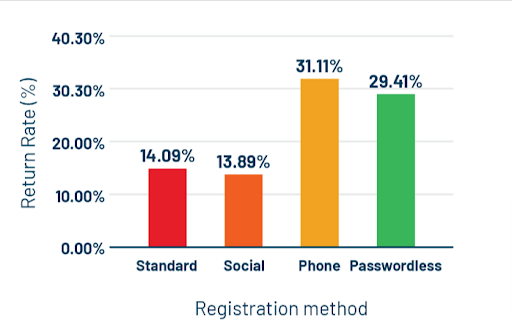

## Introduction

One of the essential aspects of CRO (Conversion Rate Optimization) is making the checkout process streamlined and hassle-free for consumers. Often users are in a hurry or want to capitalize on the exciting offers by completing the checkout process as quickly as possible.

This creates [consumer authentication](https://blog.loginradius.com/identity/what-is-authentication/) challenges for businesses that want to be best at their conversion rate optimization game. According to the <a rel="nofollow" href="https://baymard.com/lists/cart-abandonment-rate"> Baymard study </a>, user authentication and account creation is the second most reason why consumers abandon the checkout process.

Consumer data authentication is a process that entails user identity verification where provided data is inspected against the data of the user who logged in. If the malicious users login using valid user data, it can leave severe implications and wreak havoc on your digital business. That’s why using modern consumer data authentication methods is vital.

Before we get into that, let’s understand what role consumer data authentication plays in conversion rate optimization:

## Importance of Consumer Data Authentication In CRO

User authentication is important for brands because it plays a vital role in spotting fraud and abuse cases and improving the checkout process for higher conversions. Often [confused with authorization](https://blog.loginradius.com/identity/authentication-vs-authorization-infographic/), authentication is a way to verify users’ identity of who they claim to be. The process can involve various methods such as username and password or answering a secret question to confirm your identity.

While these methods were, of course, used excessively for user authentication, we don’t live in the stone age anymore. Those methods took so much time and required so much effort from users. Password-based or knowledge-based authentication have proven to be not so effective methods since they hinder the checkout process.

Modern consumer authentication methods have made the buying process stress-free and conducive for consumers. Moreover, they play a huge role in conversion rate optimization and <a rel="nofollow" href="https://www.superoffice.com/blog/what-is-crm/"> improve customer relationships </a>.

Want to know how? Let’s get to it then:

## How to Master CRO While Taking Care of Consumer Data Authentication?

### 1. Implement social login/signup

Social login or Social Sign-on is a method for authentication of users by allowing them to log in from third-party social networking sites. Here, organizations can facilitate consumers to use the existing information from their social accounts to authenticate consumers during the signup or sign-in process.

The process simplifies the registration for consumers and offers a convenient alternative to account creation. Since the social login doesn’t mandatorily require credentials and allows users to skip the cumbersome process, it improves their overall experience and your bottom line.

With almost instant consumer data authentication enabled by secure social authentication APIs, you can streamline your checkout process. This hassle-free experience will ensure your digital business sees fewer checkout abandonment and higher conversions.

### 2. Biometric authentication for streamlined access

Biometric authentication has been one of the popular and user-friendly ways to authenticate the identity of consumers. It uses biometric data such as fingerprints, face, voice, iris, and palm recognition for identity validation to allow safe access to accounts. It’s often the most secure and quickest way to provide access to a service or product without endangering physical or information security.

Biometric login eliminates the friction for consumers to reach the end of the checkout and goes a long way toward increasing conversions. Since users don’t need to remember passwords, biometrics effectively reduces frustration and saves time in user authentication.

Furthermore, our [study on consumer digital identity](https://www.loginradius.com/resource/consumer-digital-identity-trend-report-2022) found that a passwordless registration method like biometric authentication has the second highest consumer return rate. Thus, it not only helps in CRO but also improves the customer retention rate.

### 3. Use cloud authentication like SSO

In a constant effort to offer a seamless user experience, cloud authentication methods like [Single Sign-On (SSO) strategies](https://www.loginradius.com/blog/identity/sso-business-strategy/) have become the need of the hour. In addition to the flawless experience, it offers the highest level of security and efficiency.

SSO refers to a consumer data authentication process where users can access different applications using one set of credentials. Coupled with SAML (Security Assertion Markup Language), SSO provides a convenient, faster, and seamless experience.

Moreover, it’s easy to use, secure, requires users to remember only one set of credentials, and does not waste time logging into different applications. This effectively reduces password reset requests and improves the chances of users getting to the end of the checkout process.

### 4. Certificate-based authentication

As we have established, passwords are not a reliable authentication method. A good alternative for the same is to use digital certificates. These certificates are often derived using cryptography for user authentication.

Here, the consumers are provided with a private key along with the certificate, which can be stored in a physical device or computer. The biggest benefit of certificate-based authentication is it offers ease of deployment and can quickly identify the users or devices with digital certificates.

Moreover, thanks to the simplicity it brings for consumer data authentication, users can easily sign in whenever they want without worrying about credentials. Such a trouble-less experience helps boost their experience and will surely bolster your CRO.

### 5. SSL Integration for improved CRO

Many businesses might not be able to implement or execute the above-mentioned consumer data authentication methods. However, they can still enhance the security of their website and applications with digital security certificates like SSL. SSL authentication is used for creating a secure HTTPS connection for user-server interactions.

Security is a primary concern of users when entering sensitive information during checkout. They refrain from entering sensitive information like credit card or financial data before purchasing anything on websites they do not trust. SSL makes the web transaction safer, giving users ease of mind for completing the transaction without much hindrance.

## Final Words

Organizations today need strong enforcements to master conversion rate optimization. While it’s necessary for them to provide a streamlined way for consumers to convert, they need to adopt modern consumer authentication methods to make it effortless and [future-proof the data security](https://www.loginradius.com/blog/identity/consumer-data-privacy-security/).

That’s where the methods like social login, biometric authentication, SSO, certificate-based authentication, and SSL integration come in. With respect to these methods, credential-based and knowledge-based authentication feels like stoned-aged ones. Thus, these methods not only offer significant enhancement in user experience but also aid you in your CRO improvement game.

