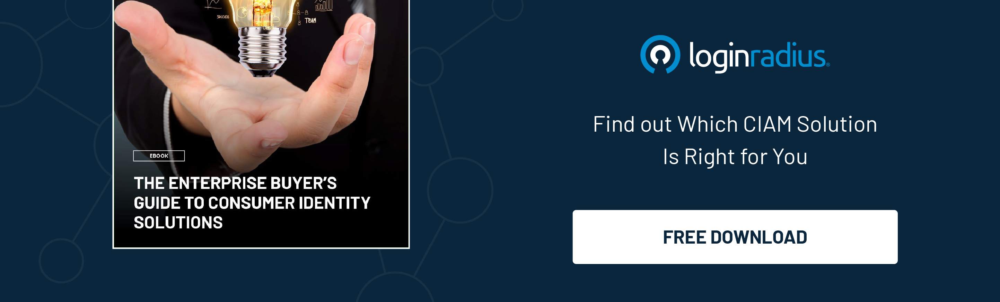

---
title: "Unleash the Power of Your Identity Projects: A Guide to Maximizing ROI"
date: "2023-04-25"
coverImage: "maximize-roi.jpg"
tags: ["digital identity","roi","identity management","cx"]
author: "Rakesh Soni"
description: "In today's digital age, managing digital identities securely is critical for businesses across various industries. Implementing an identity project can be costly and time-consuming, making it essential to maximize ROI. By defining clear goals, and monitoring performances, businesses can unleash the full potential of their identity projects."
metadescription: "Managing digital identities securely without compromising user experience is critical for businesses across industries. Here’s what you need to know."
metatitle: "How To Maximize The ROI Of Your Identity Projects?"
---
## Introduction
We’re in an era where our digital identity unlocks the doors of possibilities in the ever-expanding modern digital world. And when it comes to handling digital identities, things become pretty sensitive for businesses. 

Whether in an OTT business or retail e-commerce, managing your customers’ digital identities securely without hampering user experience is an uphill battle. 

Since many aspects may contribute to the overall success of an online business, deploying a robust identity project shouldn’t be ignored. Identity projects are a critical component of any organization's digital strategy. They are designed to provide a seamless and [secure user experience](https://www.loginradius.com/blog/growth/4-tips-secure-frictionless-ux/) while safeguarding sensitive information.

However, identity management projects can be costly and time-consuming, making maximizing the return on investment (ROI) essential. Let’s discuss how you can unleash the power of your identity projects and maximize your ROI.

## 5 Tips To Maximize The ROI Of Your Identity Projects

### 1. Define Your Goals

To maximize ROI, you must start with a clear understanding of your goals. Identify what you want to achieve with your identity projects. 

For instance, you might want to improve user experience, reduce fraud, or increase productivity. Most businesses compromise user experience for security. At the same time, others may ignore security for user experience. For instance, you might want to improve user experience, reduce fraud, or increase productivity. 

However, a [good identity strategy](https://www.loginradius.com/blog/growth/grow-business-with-right-identity-strategy/) can help create a perfect symphony between user experience and security. Hence, you must define the goals well before considering your identity security. 

Once you have established your goals, you can develop a roadmap.

### 2. Align Your Identity Projects with Business Objectives

It's essential to align your identity projects with your organization's broader business objectives. For example, if your company is focused on increasing revenue, then your identity projects should be designed to enhance customer experience and [reduce cart abandonment](https://www.loginradius.com/blog/growth/ciam-prevents-abandoned-carts/) rates. 

Similarly, if your company wants to cut costs, consider implementing an identity solution that reduces manual data entry and improves accuracy.

### 3. Choose the Right Identity Solution

You must choose the right identity solution for your organization to maximize ROI. Several types of identity solutions are available, including single sign-on (SSO), multi-factor authentication (MFA), and [passwordless authentication](https://www.loginradius.com/passwordless-login/). 

Depending on your needs, you should consider implementing one or more of these solutions. For instance, if you want to improve user experience, you might consider implementing SSO, which allows users to access multiple applications with a single set of credentials.

On the other hand, if you want to increase security, you might consider implementing MFA or passwordless authentication.

And if you wish to create a perfect balance between user experience and security, you can choose a cutting–edge customer identity and access management solution like LoginRadius. 

LoginRadius CIAM helps businesses reinforce their identity strategy by offering the highest level of customer and business information security level while maintaining a seamless user experience across multiple channels. 

### 4. Focus on User Adoption

To maximize ROI, it's essential to focus on user adoption. Even the most advanced identity solution will only deliver ROI if users adopt it. 

You must ensure that your identity solution is user-friendly, easy to understand and that users receive adequate training. Consider implementing a user adoption strategy that includes incentives, rewards, or gamification to encourage users to adopt the solution.

### 5. Monitor and Optimize

You must continually monitor your identity solution's performance. Identify key performance indicators (KPIs) such as adoption rates, user satisfaction, and security metrics, and track them regularly. 

A robust CIAM like [LoginRadius](https://www.loginradius.com/) would help you monitor and optimize your KPIs that further thrive business growth. 

It will also help you identify areas where you can optimize and improve your solution, maximizing ROI.

## To Conclude 

In today's digital age, managing digital identities securely is critical for businesses across various industries. Implementing an identity project can be costly and time-consuming, making it essential to maximize ROI. 

By defining clear goals, aligning identity projects with business objectives, choosing the right identity solution, focusing on user adoption, and monitoring performance, businesses can unleash the full potential of their identity projects. 

A customer identity and access management solution like LoginRadius can help businesses perfectly balance user experience and security, thereby maximizing their ROI. 

By following these guidelines, businesses can reap the benefits of their identity projects, including improved user experience, reduced fraud, increased productivity, and enhanced customer satisfaction.

