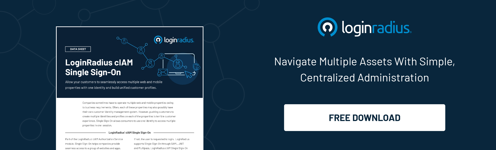

## Introduction 

The modern e-commerce driven world has almost ceased the conventional brick and mortar retail, and it’s now left grappling with associated issues, including high rentals and lofty prices.

On the other hand, online retail and multi-brand e-commerce have emerged as a powerful medium to reach a broader consumer base with endless possibilities and huge inventory. 

Buyers on e-commerce giants like Amazon can now switch brands within the platform and explore a whole new world of accessories, apparel, gadgets, and more with a single click/tap. 

The rich consumer experience across diverse verticals of a single e-commerce platform like Amazon is undoubtedly one of the significant success drivers for the multi-trillion dollar company. 

However, not every retailer has jumped on the multi-brand e-commerce bandwagon to deliver a frictionless experience of switching brands through a single platform. 

Here’s where the need for a [single sign-on](https://www.loginradius.com/single-sign-on/) (SSO) arises. 

SSO bridges the gap between multiple interconnected platforms and cuts the need for re-authentication for a consumer for a seamless and secure experience. 

Let’s understand how SSO is paving the path for the next generation of e-commerce giants to deliver rich multi-brand experiences across their platforms. 

## What is Single Sign-On? 

Single Sign-On (or SSO) is a unique authentication method that allows users to access multiple applications with a single set of credentials, like a username and password. 

SSO products are usually designed to simplify the verification process and create a seamless environment when accessing multiple apps, portals, and servers.

The simplest and most common life example of SSO is Google and its connected platforms. For instance, when you sign in to your Gmail on a web browser, and then you open YouTube or Google Drive, you’re already signed in from the same Gmail id you’ve recently signed in. 

Of late, SSO tools have become an integral part of enterprises' and developers' security landscape. 

Simply put, these implementations have entirely removed the need for users to enter their login credentials for individual applications. Alternatively, users sign in once, and the interface sends the necessary credentials to the assigned systems through various proxies and agents. 

## Single Sign-On for E-commerce- The Need of the Hour

Single sign-on authentication, or SSO, is becoming more commonplace as the digital revolution evolves. 

With numerous benefits for customers and e-commerce companies alike, SSO helps streamline the user experience, aid movement between applications and services, and secure pertinent customer information between organizations.

Consumers always switch from one brand to another, and they can’t tolerate any friction, especially in authenticating themselves repeatedly. This may impact the overall conversion rate since consumers switch to other brands for a better experience. 

In a nutshell, SSO helps e-commerce companies to build a one-brand experience by eliminating any friction between two platforms of a single company offering diverse categories of products. 

## Why is it the Best Time to Use SSO for Your E-Commerce Store? 

SSO, if implemented correctly, through a reliable [consumer identity and access management (CIAM) solution](https://www.loginradius.com/blog/identity/customer-identity-and-access-management/), can do wonders for your ecommerce store. Let’s understand why online retailers should put their best foot forward in adopting SSO. 

*Also download*: 

### 1. Consumers expect SSO

Today’s customers expect SSO. They might not be able to articulate this expectation in words, but as a matter of course, many customers already use single sign-on authentication in services every day. 

This means that the customer-facing features of SSO are now considered to be a minimum standard of customer convenience. Simply put, SSO is a service that most customers expect from every online company.

If you have more than one website or service that requires logging in, you need a single sign-on if you don’t want to annoy your customers and appear behind the times. You can eliminate several common roadblocks that can hurt your business with a single sign-on.

### 2. SSO improves conversion rate

By leveraging Single Sign On (SSO), brands can reduce the barriers to entry for users and bring them onto a single platform. That’s one login, one set of credentials, one [consistent experience](https://www.loginradius.com/customer-experience-solutions/).

Easy site navigation is the key to making a site user-friendly. The process should be quick and straightforward, allowing users to get in and get out without hassle.

Now businesses can link their consumers to their own applications in just one click, making it easy to log in with their chosen service.

Faster, less cluttered sign-ups result in more loyal users. No wonder SSO is gradually becoming the new, industry-standard solution to increase conversion rates across the web and mobile properties.

### 3. SSO cuts down churn rate

You need to focus fiercely on consumer retention during the initial days of your business. If you’re not in the top 10, you’re nowhere. 

That means that you need to convince your users to stick around and keep using your service from day one.

According to [a Localytics study](https://andrewchen.com/new-data-shows-why-losing-80-of-your-mobile-users-is-normal-and-that-the-best-apps-do-much-better/), if you can keep 80% of your users around after Day 1, you're on track to be in the top 10. But, if you can't keep 40% around after Day 1, you won't make the top 100.

Although your frequent users are unlikely to lose their log-in credentials, a third of your user base isn't yet daily. If they forget their details, there's a good chance you'll never see them again.

SSO enables your users to come back to your app seamlessly [without any need for passwords](https://www.loginradius.com/blog/identity/passwordless-authentication-the-future-of-identity-and-security/). It's like leaving the porch light on for them: it makes them feel involved.

## Ready to Experience the Next Level of Cutting-Edge SSO with LoginRadius? 

LoginRadius goes beyond a single sign-on solution with its broader consumer identity and access management functions, but it is an excellent platform for SSO nonetheless. 

Its simple-to-use one-click access works great for small to large-scale, consumer-facing deployment. The added 2FA/MFA security protects data—both in-house and consumers.

Moreover, LoginRadius guarantees unparalleled uptime 99.99% every month. The[ cloud-based identity provider](https://www.loginradius.com/) manages 180K logins per second, 20 times more than its major competitors!

Reach us for a quick, personalized demo today. 

