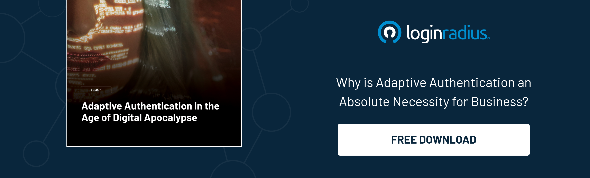

## Introduction

In today's digital landscape, businesses strive to deliver seamless and secure customer experiences. One crucial aspect of this journey is the [sign-in process](https://www.loginradius.com/blog/growth/power-of-login-box-for-seamless-user-experience/), which is a gateway to online services and personalized experiences. 

Traditional authentication methods may cause friction and inconvenience for customers, leading to frustration and potential abandonment. To address these challenges, businesses are turning to adaptive authentication, a dynamic approach that tailors the authentication process based on various risk factors and user behavior. 

Let’s learn how adaptive authentication can revolutionize customer sign-in journeys, enhancing security and user experience.

## The Limitations of Traditional Authentication

[Traditional authentication](https://www.loginradius.com/blog/identity/what-is-standard-login/) methods, such as username and password combinations have been the foundation of online security for years. However, they are not without their limitations. 

Customers often need help with password fatigue, resulting in weak or reused passwords that make them vulnerable to account compromises. Additionally, traditional authentication must account for contextual factors and adapt to evolving security threats, potentially causing unnecessary friction during the sign-in process.

## Understanding Adaptive Authentication

Adaptive authentication takes a proactive approach to verify user identities by analyzing various factors in real time. These factors include location, device information, IP reputation, behavior patterns, and more. 

By considering these contextual cues, adaptive authentication creates a risk profile for each authentication attempt, enabling businesses to make informed decisions about the level of security needed.

## Benefits of Adaptive Authentication for Customer Sign-In Journeys

### Enhanced security

Adaptive authentication strengthens security by implementing multi-layered authentication measures based on risk assessment. Higher-risk activities, such as access from an unfamiliar device or location, can trigger additional authentication steps, such as [biometric verification](https://www.loginradius.com/blog/identity/biometric-authentication-mobile-apps/) or one-time passcodes. This ensures that only legitimate users gain access to sensitive accounts and data.

### Frictionless user experience

Adaptive authentication can streamline the sign-in process by analyzing user behavior patterns and context. Low-risk activities can be expedited with minimal or no additional authentication steps, reducing friction and improving the overall user experience. This balance between security and convenience boosts customer satisfaction and encourages repeat usage.

### Real-time risk assessment

Adaptive authentication continuously evaluates risk factors during sign-in. If suspicious activity is detected, such as multiple failed login attempts or an unknown location, the system can respond by stepping up security measures or triggering alerts for further investigation. This proactive approach minimizes the potential damage caused by unauthorized access attempts.

### Personalized customer journey

Adaptive authentication allows businesses to customize the customer sign-in experience based on user preferences and risk levels. By offering a range of [authentication options](https://www.loginradius.com/authentication/), such as biometrics, SMS verification, or social media logins, businesses can cater to individual user preferences while maintaining robust security standards.

## Implementing Adaptive Authentication

Implementing adaptive authentication requires businesses to adopt customer identity and access management (CIAM) solutions incorporating adaptive authentication features. These CIAM platforms utilize advanced algorithms and machine learning techniques to analyze vast amounts of user data, behavior patterns, and contextual factors in real time. 

By leveraging this wealth of information, the adaptive authentication system can accurately assess the risk level associated with each authentication attempt and determine the appropriate authentication measures to apply.

To implement adaptive authentication, businesses typically follow a few key steps. Firstly, they must evaluate their existing authentication infrastructure and identify areas that can benefit from adaptive authentication. This may involve thoroughly analyzing their current authentication methods, user behaviors, and security risks.

Once the evaluation is complete, businesses can select a suitable CIAM solution that offers adaptive authentication capabilities. Choosing a solution that aligns with their specific security requirements, compliance needs, and customer experience goals is crucial. Integration with existing systems and seamless user experience should also be considered during selection.

After [selecting the CIAM solution](https://www.loginradius.com/), businesses must configure and customize the adaptive authentication settings based on risk tolerance and user preferences. 

This involves defining the rules and thresholds for triggering additional authentication steps based on risk factors, such as location anomalies or suspicious login patterns. Regular monitoring and fine-tuning of these settings are essential to maintain an optimal balance between security and user experience.

Finally, businesses should communicate and educate their customers about implementing adaptive authentication. Clear communication regarding the benefits, security enhancements, and potential changes in the sign-in process can help users understand and embrace the new authentication measures.

## Conclusion

In a digital world where customer experience and security are paramount, adaptive authentication emerges as a powerful solution to enhance customer sign-in journeys. 

By leveraging real-time risk assessment and personalized authentication measures, businesses can strike a balance between security and convenience, reducing friction and fortifying their defenses against evolving threats. 

By embracing adaptive authentication through CIAM solutions, businesses can establish trust, foster loyalty, and provide customers with the seamless experiences they desire in 2023 and beyond.

