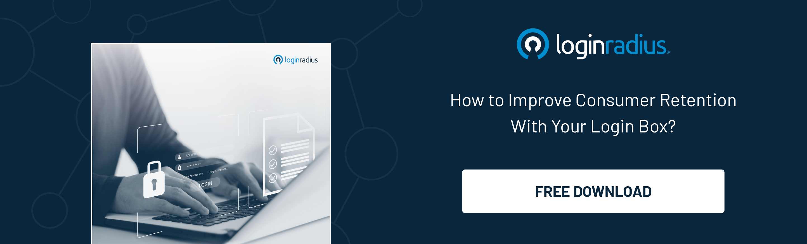

## Introduction

A great user experience is what everyone seeks. No matter your excellent services or products, you'll lose the game if your platform fails to impress users in the first interaction! 

Whether it’s a mobile app or a web platform, users expect a seamless experience from the moment they first interact with the platform until checkout. And this entire [customer journey](https://www.loginradius.com/blog/identity/seamless-customer-journey-identity-management/) must be smooth, flawless, and harmonious. 

Although businesses emphasize building great customer experiences by considering specific aspects, including website loading speed, ease of access, and quick payments, they often ignore their login box, perhaps the most crucial element of crafting a seamless UX.

Most users switch platforms because they can’t authenticate quickly and easily. And here’s where the crucial role of social login comes into play! 

Brands have been using social login for years to create seamless user journeys that could engage customers and ensure they convert. Hence, every business must emphasize building a great customer experience. Let’s dig deeper into this. 

## The Overlooked Element: The Login Box

The log-in box, often overlooked in pursuing a seamless user experience, is a crucial element that can significantly impact user engagement and retention. 

Many businesses prioritize aspects like website loading speed, accessibility, and payment processing but fail to recognize the login box as a make-or-break moment for potential customers. 

However, the login box serves as the gateway for users to access your platform, and it is their first interaction with your brand. If the login process is cumbersome, time-consuming, or confusing, users will likely abandon your platform and seek alternatives.

On the other hand, a well-designed login box coupled with a quick authentication mechanism like social login, which is visually appealing, user-friendly, and streamlined, can enhance user satisfaction and encourage them to continue engaging with your platform.

## The Role of Social Login in Seamless User Experiences

[Social login](https://www.loginradius.com/social-login/), also known as social sign-in, allows users to log in to your platform using their existing social media credentials, such as Facebook, Google, or Twitter. It offers a streamlined and simplified registration process, reducing friction and increasing conversion rates.

Picture this: a user visits your platform, eager to explore what you have to offer. But wait, they're greeted by a lengthy registration form demanding a new username and password. Frustrated, they contemplate abandoning the ship before they even set sail. Enter social login, the secret ingredient to creating seamless user experiences that captivate and convert.

With social login, the power of convenience lies at your users' fingertips. By leveraging their existing social media credentials, such as Facebook, Google, or Twitter, you can whisk them away from the tediousness of traditional registration processes. 

In just a few clicks, they can gain instant access to your platform without creating another account.

But the [benefits of social login](https://www.loginradius.com/blog/identity/what-is-social-login/) don't end there. It catalyzes engagement, driving users deeper into your platform. You gain valuable insights into their interests, preferences, and connections by tapping into their social media profiles. 

Armed with this treasure trove of information, you can curate personalized experiences that resonate with your users profoundly.

## Benefits for Businesses and Users

The benefits of social login are significant for both businesses and users. For businesses, it eliminates the need for users to fill out lengthy registration forms or remember yet another set of login credentials. 

This frictionless experience enhances user satisfaction and reduces the likelihood of user abandonment. From a user perspective, social login offers convenience and saves time.

## Leveraging User Data for Personalization

By implementing social login, businesses can also tap into valuable user data. With [user consent](https://www.loginradius.com/consent-management/), you can access demographic information, interests, and social connections, enabling you to personalize the user experience and target your marketing efforts more effectively. 

This data-driven approach enhances user engagement and allows you to gain insights into user behavior and preferences.

## Striking the Right Balance: Offering Options

However, it is crucial to strike the right balance when implementing social login. While it offers numerous benefits, it should not be the sole option for user authentication. 

Some users may prefer traditional registration methods, as they value their privacy or do not have social media accounts. Therefore, offering alternative registration options, such as email sign-up and social login, is essential.

## To Conclude 

Your platform’s login is critical to crafting a seamless user experience. And social login offers significant benefits for businesses and users, simplifying the registration process, saving time, and leveraging user data for personalization. 

However, offering alternative registration options and prioritizing user privacy and data security is essential. By striking the right balance, businesses can boost their brand and retain users, ensuring a positive and engaging customer journey from the first interaction. 

