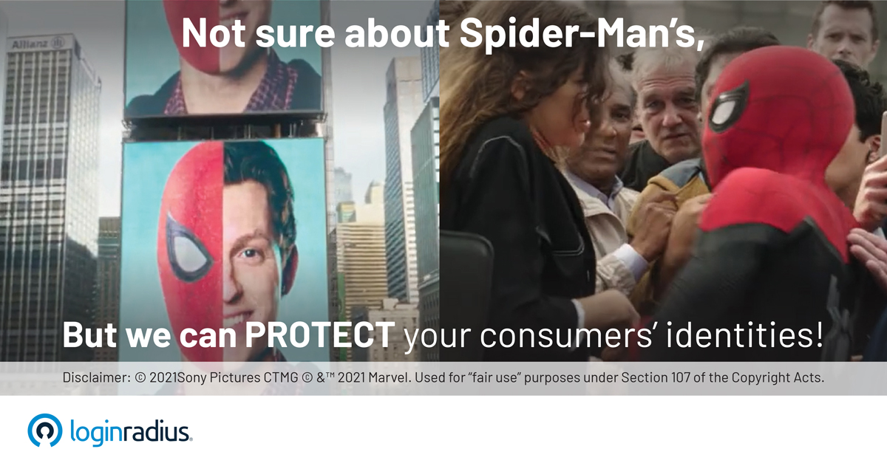

## Introduction

In any business, it is crucial to keep trade secrets confidential. Companies implement laws for data preservation while handling sensitive information. Along with these laws, employees need to be reassured that the information is retained in an appropriate space. Disclosure of the consumer's identity can be due to any breach of privacy. Such a breach can lead to loss of business, market reputation, and clients. Also, such acts destroy the employees' trust and impact their loyalty towards the company. To avoid such huge losses, you must [apply strict data protection rules](https://www.loginradius.com/blog/start-with-identity/maintaining-quality-data-security-practices/) while dealing with private information.  

You can easily relate the loss in this situation with the story of Spiderman. **Identity disclosure** of Spiderman was a turning point in the story. Before this event, everything was smooth sailing in Spiderman's life; however, things went downhill when his true identity was revealed. 

## What Happened After the Identity Disclosure of Spiderman

Peter supported the Superhuman Registration Act and worked as a superhero. He unmasked himself in public to reveal his identity and his association with Stark. Initially, revealing the identity brought an abundance of popularity and praise for Spiderman; however, it did not turn out as expected. 

With time, Peter understood that he had made a big mistake. After his big identity reveal, Peter Parker faced a bundle of troubles in his personal life. His Aunt May and Mary Jane were at risk all the time. Also, this event destroyed his relationship with Mary Jane and cancelled their marriage. Due to all these controversies, Peter Parker's initial glory went for a toss, and he ended up in a constant state of dread.

## What are the Consequences of Identity Disclosure in Business

Just as Spiderman struggles in Spider-Man: No Way Home, for any business too, identity disclosure can be destructive as it can lead to multiple losses. The major consequences of disclosure of identity for an enterprise are:

### 1. Trust of clients

Once you disclose the identity of a consumer, it will lead to other existing clients losing faith in your company. If clients do not believe in your services, they will not recommend you to others. Thus, the chances of the [growth of your business](https://www.loginradius.com/blog/fuel/how-customer-retention-can-help-businesses-grow/) will reduce drastically, which in turn can lead to bankruptcy in extreme conditions. 

### 2. Business reputation

The identity disclosure of a consumer will damage a business' market reputation. Maintaining relationships with clients keeps your business booming, however, one incident of identity theft can hinder your cash flow. Such an incident will also impact employees' payment cycles and influence your reputation before them, affecting their loyalty towards the company.

### 3. Personal liability

When dealing with personal information in business, it is crucial to be extra careful to prevent identity disclosure. Any criminal breach of your business information will harm your personal liability and can disturb your survival in the market. 

### 4. Late payments

In a business theft, if you lose a significant amount of income, it will cause a delay in the salaries of the employees and other staff members. There might be certain situations where you might need to cut your operating expenses and reduce your budget. In some cases, the thieves can also impact your business credit score. Thus, it will draw your credit reports into negative scores. Such an event can drastically shake the trust of people for your company.             

## How to Recover from Identity Disclosure in Business

If you have been a victim of identity disclosure, you will end up in danger of compromised information. However, there are a few points that will help you in recovering from identity misuses. 

* Alert the business credit bureaus so that they can stop the use of business information by the fraudsters. 
* Report your case to the local police station. 
* Keep an eye out for any suspicious behaviour of anyone in the company. 

## Tips to Prevent Identity Disclosure in Business

[Protecting the identities of users](https://www.loginradius.com/security/) is critical for any business. Mentioned below are a few methods to prevent identity disclosure as a business:

* **A switch to digital payments**: Switching to digital modes of transaction ensures you close one of the susceptibility areas for your business.

* **Ensure you use strong passwords and tools like MFA**: Tools like MFA and [adaptive authentication](https://www.loginradius.com/blog/start-with-identity/adaptive-authentication/) ensure your accounts are protected at all times. Depending on your risk factors, tools like adaptive authentication can increase the authentication requirements.

* **Adopt the best digital security practices**: In today’s digital world, you must use strong firewalls and train your employees to use the best digital security practices.

[LoginRadius](https://www.loginradius.com/) provides you with the perfect tools to secure your identity. Being the world's first no-code identity platform, it ensures seamless data security to its customers. The platform supports global regulatory compliance to deliver frictionless customer experience. A few of the common ones are:

* **PCI DSS-PCI SSC** administered standard for payment transactions.
* **ISO 27001:2013** – Information security management system.
* **ISO 27017:2015** – Information security for cloud services.
* **ISO/IEC 27018:2019** – PII Protection.
* **US Privacy Shield** - Complaint resolution for EEA citizens.
* **NIST Cybersecurity Framework** – Standardized security framework to manage and reduce cybersecurity risk.
* **ISAE 3000** – International attestation standard for assurance over non-financial information.
* **AICPA SOC 2 (Type II)** – System-level controls for Trust Services Criteria – security, availability, process integrity, confidentiality, and privacy.

## Conclusion

Your consumer data privacy and security plan should keep up with technological advancements and the rise of cyber-attacks. To future-proof your consumer data protection plan, consider investing in accordance with the most recent regulations. [Contact us](https://www.loginradius.com/contact-sales) for more information on how we have been securing billions of identities globally. 

