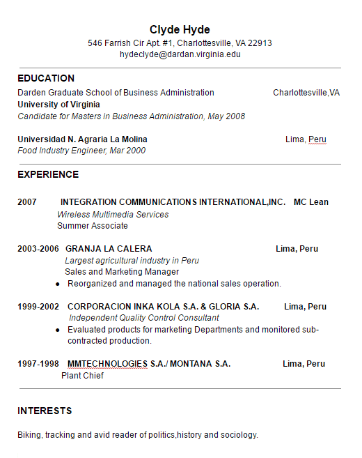
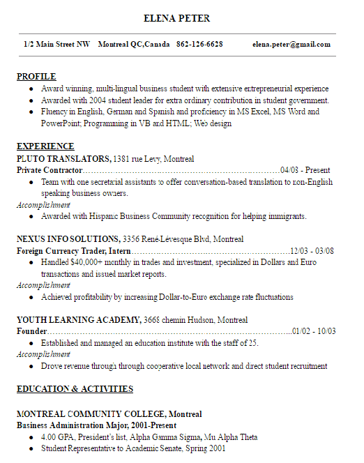
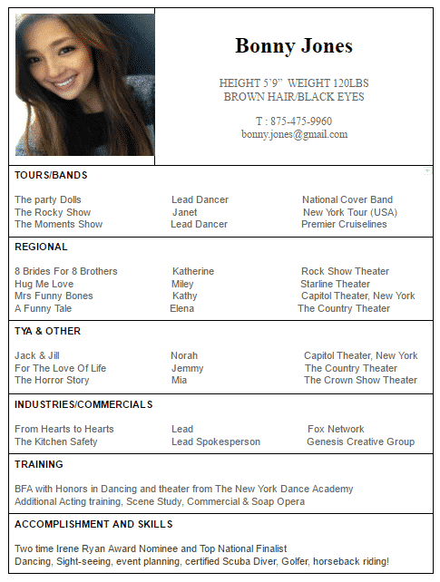

_“__Can you look at my resume and see what is missing?__”_

Earlier if I had charged one dollar each time when I’ve been asked this question, Surely I wouldn’t be rich. But today recruiters are so much in demand that this single question is enough to make them a millionaire. Today, every job seeker wants an expert advice on how he should depict all his career summary on a single piece of paper.

Being a helping hand in the hiring process at LoginRadius, I encountered so many new learnings and what mostly attracts my attention in this entire process, is the art of**writing a perfect resume**. I was surprised  that a single piece of paper has so much potential that it alone can direct your career. This involved me in lots of research and I started discussing about the deeper insights of **writing a perfect resume** with my friends who belong to recruitment industry. In the long process of learning I got in touch with big HRs, founders and many old colleagues. You will be surprised to know that despite of not being an HR or a recruiter, I managed to hire around 30% staff at LoginRadius and that too without burning a hole in my pocket!

Well, here I am not going to explain a complete guide of job interview preparation but most definitely you will find some fruitful tips of mine about how one should create an awesome resume.  This article is a conclusion of whatever I have learnt by experience and what an employers looks for.

But before we start, let’s have a look at some questions that I have summed up here and that I personally think is required to be cleared before hand.

So let’s dig in!

**Why are people so much obsessed with their resume?**

Resumes are the very first thing that come in mind when we plan a job. Also, it is  the first touch point for employer to know about you and people spend so much of their time, money and effort to get it done since it is the only thing that will reflect your achievements and skills. Interviewers, instead of picking up the calls and scheduling face-to-face interviews, first look at the resumes and then shortlist a pool of potential candidates. So your resume is crucial to get you the green card for a Face-to Face interview and then the real game begins where only your personality speaks.

**What makes a great resume?**

Even when everyone knows **how to write a resume** they often land up with lots of confusion thinking what should they add and what should they avoid in order to get an effective resume.

But without knowing the exact purpose of a resume you can’t figure out what to include. So first understand what a resume is?

> _“In simple terms a resume or a curriculum vitae is a structured outline of your professional and educational history. Your resume is your self advertisement tool that clearly reflects your skills, work experiences and achievements. Along with this it should also match the job role and its responsibility.”_

Let’s say you are going for an interview. There you are selling yourself as a product and your resume is your marketing medium. Hence it should be precise, descriptive and impressive.

Now let’s have a look at some of my **resume writing tips** which I personally think are required to be placed on a resume.

**An ideal resume should have:**

### **1\. A good cover letter :**

Cover letters: They may send thrilling vibes in the heart of billions and uttering the phrase only can make a grown man cry. Interesting yeah? A good cover letter is like a protective jacket for your resume. It is like that cheat sheet in a blind date that omits almost everything about whom you are going to establish a relationship with. So now you can see the value of this white paper piece that goes along with your resume.

Cover letter not only supports your resume but also gives you an opportunity to make you stand out from the crowd and forces recruiters to consider you for the next round. So make sure you [create an impressive cover letter](https://visme.co/blog/cover-letter-template/) because every piece of information written over there is going to decide your next foot in the door.

**2\. A one or two line intro of yours**

Give the most common “objective column” a ditch and grab the attention with a short career summary. A short professional synopsis that speaks about your experience, job history, and your major achievements.

**3\. Clear explanation of your skill set and work experience**

The very first thing a hiring manager wants to know is whether you posses the required skill set or not. An experience section will highlight that you already have some accomplishments in that particular work profile which is good enough to attract the attention of hiring manager. So mention these two sections on top of your resume. And remember mention only those skills in which you have full command and are relevant to the job you are applying for. Don’t be fake in your resume. And along with your work experience also mention your job responsibilities that you had during your time of employment. But do not stretch this section so long that your interviewer get confused and start thinking that you are “Jack of all and Master of none”. So keep it short and to the point.

**4\. A glance at your achievements and accomplishments :**

Your achievements are definitely the outcome of your hard work so don’t hesitate to boast them. In fact, it is always better to add those that matter and are relevant into your achievements which will also help you to add benefits in the offered job role. You can also mention things like meeting deadlines, managing teams and other hurdles that you have tackled wisely in your previous job responsibility.

**5\. Education counts but not for much:**

Education obviously matters if you are a fresher, looking for a job. The top section of your resume should be dedicated to add the good grades that you get in your academic years. But if you are an experienced person and looking for a job change there is hardly any need to add this but if you really wish to add it then list it last. Because the hiring manager will hardly have a look at it and other technical person won’t even care about it.

**6\. Any other information that is related to your job profile:**

Your relevant skills and talents are always welcomed in your resume but it should be of quality. Do not write anything that will harm your image in front of the interviewer.

**7\. Your updated contact Information:**

Your resume must possess at least one of your updated phone number along with your Email Id that you most frequently use. Well you can also specify links of your social media profiles since these profiles are the best source to present you in front of a recruiter. But for a resume just stick to the addition of only your professional LinkedIn and Twitter Profile. But exceptions are there if you are applying for job related to marketing or social media**,** you can also opt the addition of your Pinterest account.

On top of all do not stretch the length of resume too much by adding all these social media profiles. To keep your resume short and sweet you can just add the link of your [about.me profile](https://about.me/princekapur) which is your online portfolio with all your contact information.

**8\. Interests and other activities:**

Keep this section as short as possible and present only those things that make you unique. And don’t be childish while mentioning your interests like don’t mention watching TV, shopping etc. as these all things nowhere imply that you are well-suited in the team.

**Now let’s talk about some common resume mistakes!**

Even after being so much careful, there are chances that you might make some mistakes. Here I am explaining some of those mistakes which are very common in resumes. So let’s have a look at them:

**1\. Typos and Grammatical errors:**

Such errors are not at all tolerable. This leaves an impression that either you can’t write well or you don’t care enough. So be highly alert while drafting your resume. There is no doubt that your resume is going to be checked or proofread by recruiters who are proficient in English and in that case your silly spelling mistakes and grammatical errors can cause you a loss at job opportunity.

**2\. Poor Formatting:**

A great layout definitely draws attention that is why build your resume in a well structured format. Make use of bullets and tables to highlight your specifications.

**3\. Length of the resume:**

It is idiotic to think that if you fill up your resume with the exaggeration of your work ethics you will get hired. In fact, how you explain your abilities within one or two pages is what shows your real potential. So sum up all your skills, experiences, achievements in the limit of two pages to maximize your chances to get hired.

**4\. Adding Photo:**

Pasting your photo along with your resume is just useless for recruiters since they are looking for a candidate who meets up their requirement and they don’t care how you look.

But if you really have an urge to show off your face you can direct recruiters to your About.me profile where they can praise your good looks and can find your other details that you might forget to add in your resume.

**5\. Know your resume:**

It is actually funny if you can’t even answer to what you have written in your resume. I can say this because this thing has happened to me once when I was interviewing a candidate. I asked him about his favorite writer that he mentioned in his resume and I was shocked to know his answer as it was totally different from the name mentioned in his resume. So the perils of not knowing your resume can be imagined. Hence I suggest you to know your resume and know why you are mentioning things so that if someone questions you on a particular point you can answer him with confidence.

So now that you know what should be included and what not, let’s know some quick tips that help you to make a one page resume.

- A4 page size with a margin to 1.27 cm. is the ideal layout for your resume that will give you enough space within the document.
- Use bullet point to precisely point out what you want to mention.
- Show your data with tables as tables have more space and yes you don't require words here. You can make use of tables to show your education and grades.
- Be very wise in choosing the right words for your resume and get rid of extra words that are not useful.
- The text alignment of your resume should be left except the header portion which should be center aligned. Also set the line spacing or line height of 1.5 and 2 points.
- Your text in the resume is what that an interviewer closely examines so it should be clearly visible. You can use maximum two font styles for your text. Times New Roman, Arial or Calibri is a pretty good choice. The font size must be 11 or 12 and for headings, keep it in between 14 to 16 but not more than these.
- The text color throughout your resume should be uniform and use only solid black color for this. Remember to remove blue hyperlinks in your resumes that comes by default when you place your email id.
- For the topmost portion of your resume that is known as header where you mention your name, email id, address and phone number use bigger size for the fonts like 14 or 16 so that it is properly highlighted.

**Some real life examples of what makes a great resume :**

Data used in the examples is only for reference purpose.

**1\. Resume Example #1**

 

![real-life-resume-examples-1]

**What I liked :** The resume is easy to read and the way, Alfred has mentioned his objective and qualifications right up front, amused me.

**What I didn’t like :** There is no GPA and his work experience isn’t much to write about depending on the job profile he is applying for.

**2\. Resume Example #2**

 

**What I liked :** The classic resume format is always loved.

**What I didn’t like :** He has put education right upfront which is like the wastage of a valuable real estate and there are not much details about Clyde in person.

**3\. Resume Example #3**

 

**What I liked :** The resume of Elena has almost everything I would like to see. She has well highlighted her “profile” portion right upfront, followed by work experience and at last education.

**What I didn’t like :** If it was me, I would have removed the earliest work experience and expand a bit more to interests field.

**4\. Resume Example #4**

 

**What I liked :** The resume of Bonny is quite unique and is the perfect example of how the resume of an actor should look like. The resume well highlights Bonny as an actress through tours, plays, commercials and training. She has also used a professionally shot picture to grab the attention of a casting director.

**What I didn’t like :** Absolutely nothing! :**D**

Though as a tip, I would suggest Bonny to send her resume in .pdf format instead of word format in order to maintain the alignment. 

 

Well I guess I have covered up almost everything though if you have something I missed on, share it in the comments, I will surely add to make this article more worthy.
