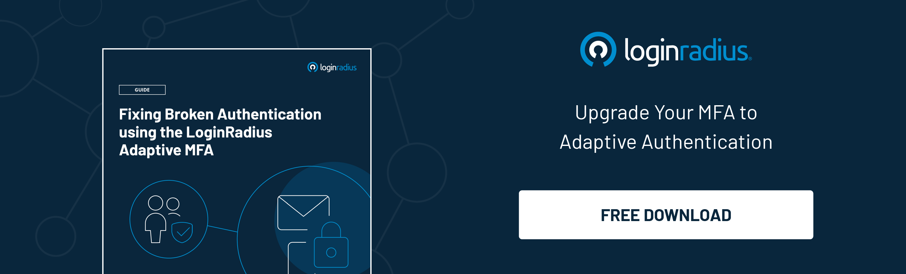

With the increasing involvement of people in online gaming, there have been many disruptions in the cyber world that's causing major security concerns—malware, unwanted software, credit card, personal information theft, etc. In fact,  the number of people affected by cyber threats related to gaming has increased multifold recently. 

The gaming authorities take different measures to protect the gaming industry from these threats, including **risk-based authentication.** In this article, we are going to discuss what it is and how it works. 

## What is Risk-Based Authentication

[Risk-based authentication](https://www.loginradius.com/blog/identity/risk-based-authentication/) (RBA), also called adaptive authentication, monitors consumers’ identity and access using a set of stringent rules. The objective is to authenticate a user profile before allowing it access to ensure that it is not a threat. These restrictions become more stringent with increasing risks. 

## How Does RBA Works

Risk-based authentication works on a model that requires permission and response. A user asks for permission to access a file or software. In response, the file or software responds by presenting options to log in using either an ID and password method or by sending mail or OTP to a registered contact number. 

While performing the authentication, RBA analyses the following factors: 

* The device used to gain access, i.e., mobile or laptop. 
* The location of the device. It includes components such as the physical address of the server. 
* Network. This refers to the IP address of the user. 
* How sensitive is the data? Is the required data general or significant?

If the system detects any risk, then it follows either of the following measures: 

* The system blocks the user if any risk is observed.
* The system uses [multi-factor authentication](https://www.loginradius.com/blog/identity/multi-factor-authentication-a-beginners-guide/) to authenticate the user identity, i.e., using SMS or Google authenticator. 

## How to Use RBA in the Gaming Industry

A significant amount of people play games online. This includes people of different ages, geographical areas, and criminal backgrounds. This can result in increased cybercrime related to gaming. 

To counter these crimes, the gaming industry should put **risk-based authentication** to use. But how can it help in gaming? The answer is mentioned below: 

### Verifying location

In the USA, only the bettors within the state are allowed to participate in online betting games. Anyone participating from other states may have to face the consequences. RBA can authenticate the user location by asking questions or tracing IP addresses to distinguish the necessary information. 

You can also use this to track users who come from places where incidents of cybercrime are common. 

### Authenticating age

Age is another factor that can be verified using RBA. Many games have a certain age limit that you should follow. By identity verification, the authorities can confirm the age of the users. 

Authorities can use [digital identity verification](https://www.loginradius.com/blog/identity/what-is-identity-verification/) to gather data from the user. The data may include name, address, and date of birth. RBA can check this data against existing records to see whether the information is correct or not or has been changed recently. 

### Avoiding money laundering with KYC

Many people use money from criminal proceedings and money laundering in online gaming or betting. Know our customer (KYC) and anti-money laundering initiates are taken into account in these cases.

The KYC is usually not required at the time of signing in but when the suspicion arises. Suspicion may arise in the cases where the user pays a huge amount of money in one go. 

Identity verification is done at the time of KYC, and it requires identity verification via documents and photos of a user. Incorporating AML and KYC at the time of payment for gaming makes the entire risk mitigation process smarter. 

## What Should You Look for in a Risk-Based Authentication System

An effective RBA can make a huge difference between a safe and unsafe gaming experience. When you are choosing an RBA, look for the following features: 

* **Real-time data:** Access to real-time data helps identify the risk at the earliest and prevent potential threats that may affect the gaming system.
* **User analytics:** User analytics include all the information related to a user, like their name, address, and age. This analytics helps in profiling potential cybercriminals. 
* **Multi-factor authentication or verification:** If any risk is detected or a user seems questionable, RBA can use extra authentication. It includes asking for additional information that may reveal useful insights about the background of a user.
* **Configuration policies:** Passwords are widely used for authentication, but other configuration policies help set up advanced technology like RBA that ensures the security and smart functioning of the gaming industry. 

The focus is to confide the users' personal information, and with LoginRadius, you will find more than just one solution to your digital predicaments. [Contact us](https://www.loginradius.com/contact-sales) to know more. 

