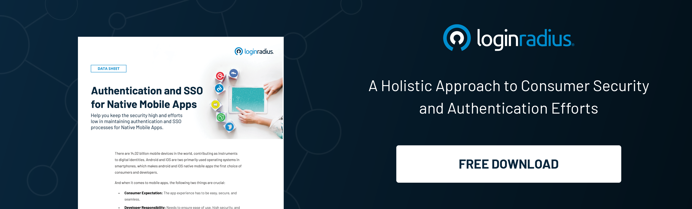

## Introduction

Digital marketing is integral to a business's success in today's world. It can be used to drive growth and increase reach, but it can also help you target your customers more effectively and provide them with the products they want.

As a result, enterprises have started collecting data on their customers to understand their preferences and behaviors better, leading to the development of more data-driven digital marketing strategies.

But how do enterprises know the preferences of their potential customers, and how can they track their behavior? 

[Single sign-on (SSO)](https://www.loginradius.com/single-sign-on/) is perhaps the backbone for laying the groundwork for collecting, storing, and analysis of valuable user insights! 

With SSO, enterprises can understand their target audience's needs, preferences, and behavior when they land on their platform for the first time. And this helps them in creating winning digital marketing campaigns to foster growth. 

Let’s figure out how SSO is reshaping the digital marketing landscape and why businesses must implement a robust SSO authentication mechanism in 2023. 

## What is Single Sign-On (SSO), and How is it Reshaping the Future of Digital Marketing in 2023 & Beyond?

Single Sign-On (SSO) is an authentication method that allows users to log into multiple interconnected applications or services with a single login credential (username and password). 

Instead of having to remember different usernames and passwords for each application, SSO provides users with a streamlined and secure experience.

The main goal of SSO is to improve the customer experience while enhancing security. With a centralized authentication system, digital marketing teams can more easily manage user access. This also reduces the risk of [password-related security breaches](https://blog.loginradius.com/identity/common-vulnerabilities-password-based-login/), as users are less likely to reuse or write passwords down, making them more secure.

Besides security and user experience, one of the most critical aspects of deploying an SSO authentication into your system is that it offers you many marketing benefits that can improve your conversion and customer retention rates. 

Let’s examine some marketing advantages of incorporating SSO into your online platforms/applications. 

### 1. Improves Customer Retention 

Delivering a rich customer experience is the key to business success in today's era. And SSO removes barriers in the authentication within related applications.

SSO (Single Sign-On) helps companies reduce the number of passwords customers need to remember when accessing their systems, which improves customer retention and satisfaction.

In addition to improving [customer retention](https://blog.loginradius.com/growth/how-customer-retention-can-help-businesses-grow/), SSO also reduces costs for companies by eliminating duplicate workflows and automating tasks that require human intervention.

### 2. It helps Understand User Behavior 

Businesses that choose a reliable customer identity and access management (CIAM) platform for SSO can quickly get valuable insights into user behavior. 

SSO allows businesses to track how users interact with their platform, as well as what preferences they have. This information can be used to understand better how users feel about the product or service, which helps companies make decisions about changes they may want to make in the future in their digital marketing strategy.

Apart from this, it also tracks user behavior on different devices so that companies can see how customers are accessing their sites from other devices at different times of day or night—allowing them to better serve their customers' needs by knowing when they're likely to be logged in at any given time.

### 3. Increased Leads & Conversion Rates

The primary purpose of digitally marketing your business is to increase new leads and optimize conversion rate. SSO is a way to streamline the login process, so users only have to go through it once. This can help improve conversion rates because more users can access your site. 

When you're trying to get people in and out quickly, it's essential that they can easily navigate the site and find what they need without getting lost.

Another thing SSO does is reduce barriers for users. By leveraging single sign-on (SSO), brands can bring users onto a single platform by allowing them to use their existing credentials from one location.

That means one login, one set of credentials, and one consistent experience—and we all know how important consistency is when converting new users. 

### 4. Helps Craft Personalized Experiences 

A reliable CIAM is the backbone of personalized marketing and customer experience. The data collected from the CIAM platform can create a complete and relevant customer journey, ultimately leading to increased revenue and profitability.

Every user interacts with huge brands, including Apple, Amazon, Google, and Microsoft. And they know what great personalized experience means. Hence, they expect a similar experience from other brands when they land on their platform. 

With a reliable [CIAM platform](https://www.loginradius.com/), brands can implement SSO that captures insightful customer data that can be used to create personalized customer journeys, which boosts your overall marketing program.

## Final Thoughts 

While SSO offers a convenient, secure, and efficient way for users to access multiple applications with a single login credential, it also paves the way for marketers to leverage user insights to create winning marketing campaigns. 

Brands that are thinking about accelerating their digital marketing efforts shouldn’t wait, and just put their best foot forward in implementing SSO into their website/mobile applications. 

