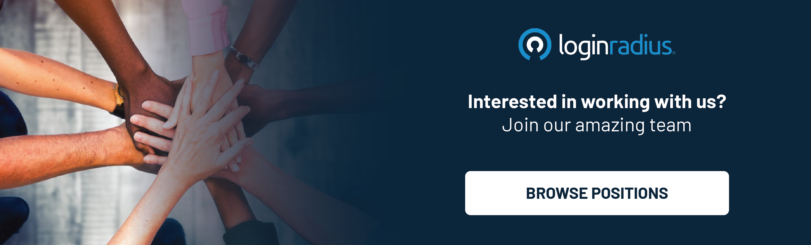

## Introduction

At LoginRadius, [corporate responsibility goes beyond the boardroom](https://www.loginradius.com/blog/growth/loginradius-csr-activities/). It extends to the heart of our communities, where we can make a meaningful difference. Recently, we initiated a Sanitary Pad Donation Drive in collaboration with the Hope Basket Foundation to support underprivileged girls and women in our community. This initiative is special because we raised funds from our dedicated employees, who understand the importance of giving back to society.

## The Harsh Realities

In our journey to support underprivileged girls and women in Jaipur, we uncovered some harsh realities highlighting the critical need for initiatives like ours. Despite living in an age of progress and technology, many women still use clothes as a makeshift alternative to sanitary pads. The reasons behind this choice often revolve around comfort and ingrained habits.

### 1. Comfort vs. Hygiene

Many women still prefer using clothes during their menstrual cycles due to concerns related to comfort and long-standing habits. This preference poses significant health risks, as using cloth instead of sanitary pads can lead to infections and other health complications.

### 2. Inflated Market Prices

The market prices of sanitary pads are often beyond the reach of underprivileged women and girls. The high cost of these essential hygiene products forces them to compromise their health and well-being.

### 3. Stigma and Shyness

Women often feel uncomfortable discussing menstrual hygiene and their challenges when using cloth as an alternative. The stigma attached to menstruation prevents open conversations about these critical issues. Additionally, many women shy away from buying sanitary pads from medical stores, further complicating their access to proper menstrual hygiene products.

## Our Approach:

In response to these findings, LoginRadius, in collaboration with Hope Basket Foundation, decided to launch the Sanitary Pad Donation Drive. Our goal is to break down the barriers that prevent underprivileged girls and women from accessing sanitary pads and raise awareness about the importance of proper menstrual hygiene. 

Our donation drive is being carried out in phases, targeting different underprivileged areas in Jaipur. In each step, we provide sanitary pads and educate women about their benefits. By shedding light on the potential health risks of using cloth instead of a sanitary pad, we encourage women to make safer and more informed choices.

## Acknowledging the Heroes:

None of this would have been possible without the dedication and commitment of our operations team and volunteers who stepped up to make a difference. We thank Naveen, Vikas, Shreya, Soniya, Sudhey, and Pankaj for their invaluable contributions to this noble cause.

## Conclusion:

At LoginRadius, we are not just a company but a community that cares. Our Sanitary Pad Donation Drive is a testament to our commitment to positively impacting the lives of underprivileged girls and women. We are working towards a future where all women and girls can experience their menstrual cycles with dignity, comfort, and safety.

Join us in our mission to create a positive change in our community. We can empower women and girls to embrace better menstrual hygiene practices and lead healthier, happier lives.

Stay tuned for updates on our Sanitary Pad Donation Drive and the impact we're creating in the lives of underprivileged girls. Together, we can make a difference.

