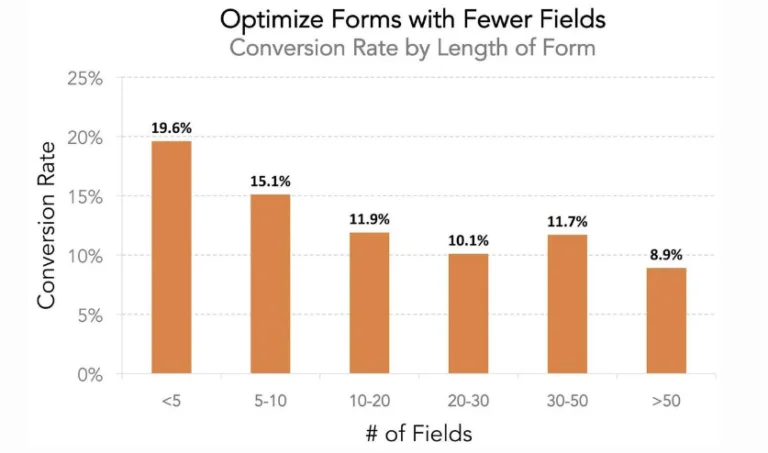
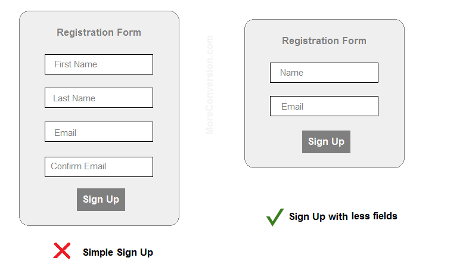
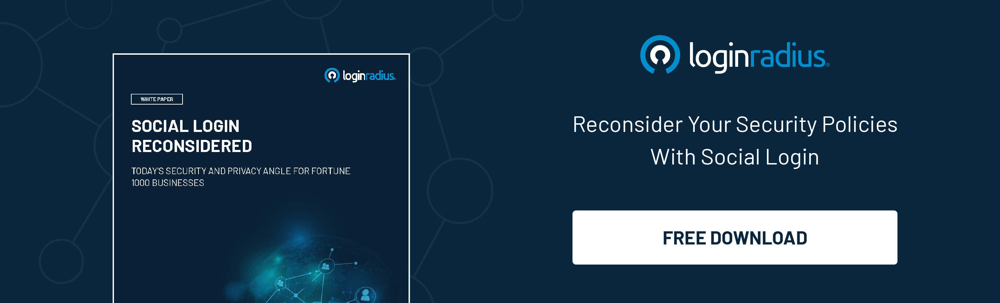

The marketing funnel's very last step includes some sign-up process if you want to increase your conversion rate, generate leads, or make a sale. But, just because you got them this far doesn't mean that if your type isn't optimized at least as well as the rest of the funnel, your prospects won't bolt in a second.

When using your sign up forms, the following tips will help you [maximize your prospects' experience](https://www.loginradius.com/blog/start-with-identity/2020/05/customer-experience-retail-industry/) and plug in the leaks that arise so frequently at the critical endpoint of your funnel.

Your sign-up form should be transparent and quick to understand. Avoid using confusing areas that frustrate users. When they fill out the form, tell the users what to do, don't wait until they have made a mistake. Near the area, put specific instructions so that they understand what they have to do.

**_9 mantras to increase your sign up rates:_**

1. Reduce the number of fields for the form 

2. Create a secure sign-up form

3. Using Signup Popup Forms 

4. Add live chat to your site

5. Allow social signups

6. Be creative with sign-up CTAs

7. A/B testing for CTAs

8. Distraction free Signup experience

9. Show clear Value prop

**_Let's dive in!_**

## 1. Reduce the number of fields for the sign-up form

You need to make the signup forms as short as possible to convert the users.

If these forms are lengthy and need so much data to be completed, individuals may not take the time to fill them out.

Shorter forms are not only easier to fill out, but the visitor is also less intrusive.

Longer forms need more details. But the visitor to the website may be unwilling to provide you with any information about themselves.

Source: wingify

Your sign-ups might be crazy high if your sales team doesn't get all the lead details they need to follow up, but your close rate would be garbage. To find the correct balance between having the key lead details and holding fields to a minimum. Just make sure every sector plays a critical role. Drop it, if not.

## 2. Create a secure sign-up and registration form

Many developers and website owners overlook the value of providing a safe login form on websites. The incompetence of these web developers can cause a lot of harm to their guests without understanding the dangers of their actions.

[Securing a login](https://www.loginradius.com/blog/start-with-identity/2020/12/login-security/) form for any website may seem like a tiny move towards web security. Still, users get a negative impression of the safety of the website without taking this step. On the opposite, you are rewarding user perceptions regarding web protection by securing a website's login type.

The key here is as much as possible to lower the barrier to entry. You don't want your guests to worry about it until they've agreed to sign up. An unsafe sort of website is a chance to change their minds.

To find the best balance between customer experience and protection, the LoginRadius Identity Platform provides a full range of [customer registration and authentication options](https://www.loginradius.com/authentication/).

Source: moreconversion

## 3. Using Signup Popup Forms

Your conversion rate will be Skyrocket by one shift. To get the highest conversion rate from them, here are some few tips:

*   Try many things before finding a good piece of content that increases conversion for your site (PDFs, premium content, etc.).
*   But a delay timer of 15 seconds on the pop-up prevents them from being distracting.
*   Make it easy for the pop-up to close.
*   Set a cookie so that only once per user will the pop-up appear. You can do this with most pop-up tools.

This combination will provide you with a massive conversion boost and keep your complaints to zero. You're not going to bother anybody, and you get all the perks.

## 4. Add live chat to your site.

Items and their characteristics often confuse consumers. Offering options in real-time helps speed up their purchase decisions. When interacting with a real person, this is particularly true.

Customers want to feel listened to, and that's just what it brings to live chat. Rapidly addressing challenges in a tailored manner leaves clients happy and positively affects their purchase decisions.

On any platform, live chat tools are simple to add and have an instant boost to your versions, just like a pop-up.

## 5. Allow social logins

For users, [social login](https://www.loginradius.com/social-login/) is easy to use and improves the conversion rate for registrations.

Nevertheless, with social sign-up, the user's privacy is again in the spotlight. Most of them do not realize that, with this registration form, they agree to the use of their data by businesses. An opportunity that companies take to sell the product that best fits their preferences and desires to each customer, in a much more segmented and customized way.

Few advantages of using social signups:

*   It improves the signing up process- The registration and login processes are quicker, from 1 minute to 1 second. This would have an effect on your conversion rate for sign-up.
*   Enabling social functionality is beneficial- By typing their credentials, users can post, comment, or even play games without building an account or wasting time.
*   It doesn't require a new password to be created- This method uses the users' social media information, so they have one less password to handle. This is something that they enjoy so much.
*   This suggests fewer failed logins- They have to press the social network that they want to use. They won't, therefore, incorrectly fill in their details. Smartphone users may be the most appreciative of this choice, as it is often inconvenient to use this computer to type this information.

## 6. Be creative with sign-up CTAs.

One of the most critical sections of your sign-up forms is your CTA button. It should attract the attention of the consumer and motivate them to take a specific action. From the form's background color, pick a bright color contrast. 

Make sure it has a simple value proposition when writing a copy of your sign-up button. Using "Book a free demo" or "start your free trial" instead of using just a simple "sign up" or "download" button. The subsequent copy explains to the customer what they can get when they sign up.

## 7. A/B testing for CTAs

Your CTA button is one of the essential parts of your sign-up forms. Signup form CTAs are the ideal candidate for a/b testing.

You can evaluate several different components of a CTA, such as:

1. Dimension
2. Placement
3. Colour
4. Fonts
5. Text

Having small modifications can have a significant effect on your conversions. Make sure that you measure only one item at a time.

If your A/B checks have been completed, you can rest assured that your CTA signup form is designed for high conversions.

## 8. Distraction Free Signup experience

Building a high-converting form has always been difficult, even though most of the web's traffic was from the desktop, one that eliminates friction by making it very easy. The share of smartphone users has overtaken the desktop in recent years, creating an additional degree of complexity for designers who now have to build forms with a mobile-first mindset. It comes with its own special collection of issues to conceptualise a signup experience for a smaller screen.

Speed in UX is crucial when it comes to forms, too. Users do not want to bother with tedious types, nor do they feel like typing their passwords from scratch, especially where it is harder to do so on mobile devices.

## 9. Show clear Value prop

One of the most critical sections of your sign-up forms is your CTA button. It should attract the attention of the consumer and motivate them to take a specific action.

Make sure it has a simple value proposition when writing a copy of your sign-up button. Using "claim your free trial" or "start your free demo" instead of using just a simple "sign up" or "download" button. The subsequent copy explains to the customer what they can get when they sign up.

### **Conclusion**

Following the tips and examples shown in this article is your next move. If you can get it right, you can build better sign-up forms for conversion and increase the number of quality leads created.

