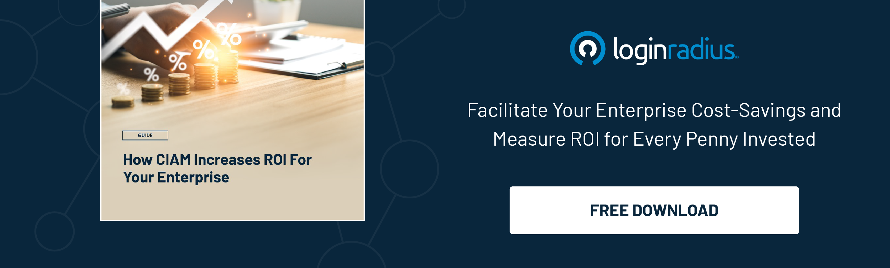

## Introduction

Modern technology and tools can broaden the horizons of marketers and sales professionals, enhancing business growth.

Whether it’s client acquisition or lead generation, technology has played a pivotal role in improving overall business performance regardless of niche and industry. 

However, in the modern SaaS sales landscape, [single sign-on](https://www.loginradius.com/blog/identity/what-is-single-sign-on/) (SSO) is undeniably a game-changer, helping marketers create winning strategies and tap new possibilities. 

While SSO helps create seamless user experiences, it also comes with various business advantages that can help sales professionals gain valuable insights for improving their overall sales performance. 

## Understanding the Modern SaaS Sales Landscape

Before diving into the specifics of SSO for SaaS businesses, it's essential to grasp the current landscape of SaaS sales. 

The demand for [SaaS solutions](https://www.loginradius.com/single-sign-on/) has skyrocketed, driven by flexibility, scalability, and cost-efficiency. Enterprises are constantly seeking software solutions that can streamline their operations, improve productivity, and enhance collaboration among teams.

However, with this surge in demand comes a saturated market with numerous providers offering similar services. This fierce competition has made it challenging for SaaS businesses to differentiate themselves based solely on their offerings. In such a scenario, customer experience and ease of use have become critical factors that can make or break a sale.

## Single Sign-On (SSO) is Swiftly Changing the SaaS Landscape

Single Sign-On (SSO) technology is swiftly becoming a cornerstone of the SaaS landscape, and for good reason. 

SSO allows users to access multiple applications with a single set of login credentials, eliminating the need to remember multiple usernames and passwords. This not only enhances user convenience but also improves security by reducing the risk of password-related vulnerabilities.

For SaaS businesses, implementing SSO means providing customers with a seamless and [frictionless login experience](https://www.loginradius.com/blog/growth/4-tips-secure-frictionless-ux/). 

This simplicity translates into higher user adoption rates and increased customer satisfaction. In a competitive market where user experience is a key differentiator, SSO can be the factor that sets a SaaS business apart from its rivals.

## Benefits of Leveraging a Reliable Single Sign-on Solution

The benefits of leveraging a reliable SSO solution for SaaS businesses are manifold:

* **Enhanced User Experience:** SSO streamlines the login process, allowing users to access multiple applications with a single click. This simplicity improves user experience and encourages greater adoption of SaaS products.

* **Improved Security:** With SSO, users no longer need to remember multiple passwords, reducing the likelihood of password-related security breaches. Additionally, SSO solutions often come with robust security features such as multi-factor authentication, further enhancing data protection.

* **Increased Productivity:** By eliminating the time wasted on managing multiple logins, [SSO boosts productivity](https://www.loginradius.com/blog/identity/benefits-single-sign-on-sso/) for both end-users and IT administrators. Users can quickly access the tools they need, while IT teams spend less time on password resets and support requests.

* **Scalability:** As SaaS businesses grow and add more applications to their ecosystem, SSO scales effortlessly to accommodate new services. This scalability ensures that user access remains seamless, regardless of the size of the organization.

* **Cost Efficiency:** SSO reduces the burden on IT support teams, leading to lower operational costs. Additionally, the time saved by users in managing passwords translates into tangible cost savings for enterprises.

## How LoginRadius SSO Offers Competitive Advantage to SaaS Enterprises?

Among the many SSO solutions available in the market, LoginRadius stands out as a trusted partner for SaaS businesses looking to enhance their offerings. With its robust and user-friendly SSO platform, LoginRadius offers a range of features that provide a competitive edge:

* **Customization:** LoginRadius allows SaaS businesses to customize the SSO experience to align with their brand identity. From branded login pages to personalized user journeys, businesses can ensure a seamless and on-brand experience for their customers.

* **Multi-Factor Authentication:** Security is paramount, and LoginRadius offers advanced security features such as [multi-factor authentication (MFA)](https://www.loginradius.com/multi-factor-authentication/) to safeguard user accounts. This added layer of protection enhances trust and mitigates the risk of unauthorized access.

* **Developer-Friendly:** For SaaS businesses with complex integration needs, LoginRadius provides developer-friendly APIs and SDKs. This makes it easy to integrate SSO into existing applications and ensures a smooth deployment process.

* **Analytics and Insights:** Understanding user behavior is crucial for optimizing SaaS products. LoginRadius offers detailed analytics and insights into user logins, allowing businesses to make data-driven decisions to improve their offerings.

* **Reliability and Support:** With a reputation for reliability and exceptional customer support, LoginRadius offers peace of mind to SaaS enterprises. From [onboarding assistance to ongoing support](https://www.loginradius.com/blog/growth/smooth-onboarding-positive-user-impression/), businesses can rely on LoginRadius to be a trusted partner in their SSO journey.

## Conclusion

In the fast-paced world of SaaS sales, the significance of Single Sign-On (SSO) cannot be overlooked. As SaaS businesses strive to differentiate themselves in a crowded market, providing a seamless and secure user experience is paramount. SSO not only enhances user convenience but also improves security, productivity, and scalability for enterprises.

For SaaS businesses looking to gain a competitive advantage and boost sales, investing in a reliable SSO solution like LoginRadius is a strategic move. With its customizable features, advanced security, developer-friendly approach, and exceptional support, LoginRadius empowers SaaS enterprises to deliver an unparalleled user experience.

In the evolving SaaS landscape, where user experience is the ultimate differentiator, SSO for SaaS businesses is not just a convenience—it's a necessity for success.

