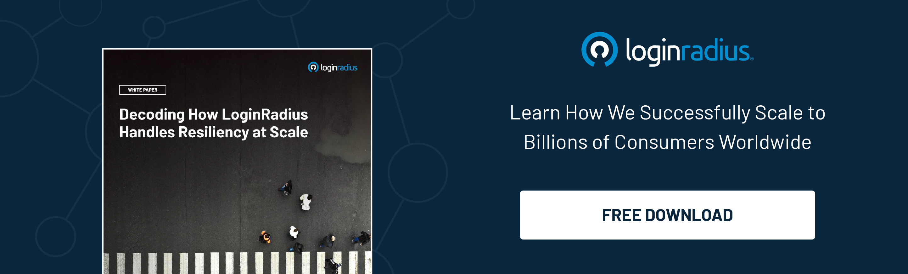

## Introduction

In today's digital landscape, organizations face the ongoing challenge of optimizing three crucial aspects: cost, security, and user experience. Balancing these factors is no easy task, as they often seem to pull in different directions. 

However, with the advent of identity orchestration, a powerful solution has emerged that offers a harmonious approach to achieving this delicate balance. 

Let’s explore how organizations can leverage identity orchestration to effectively manage costs, enhance security measures, and deliver a [seamless user experience](https://www.loginradius.com/blog/identity/seamless-customer-journey-identity-management/).

## How to Balance Cost, Security, and UX with Identity Orchestration?

### 1. By understanding identity orchestration

Identity orchestration refers to the practice of centrally managing and coordinating user identities, access controls, and authentication mechanisms across various systems and applications. 

By streamlining these processes, organizations can achieve greater efficiency and control over their digital ecosystems. It involves leveraging technologies such as [single sign-on](https://www.loginradius.com/single-sign-on/) (SSO), multi-factor authentication (MFA), and identity and access management (IAM) systems to ensure a cohesive and secure user experience.

### 2. Cost optimization through identity orchestration

Implementing identity orchestration can lead to significant cost savings for organizations. By centralizing [user management](https://www.loginradius.com/user-management/) processes, organizations can eliminate the need for redundant user accounts and associated maintenance costs. 

Additionally, streamlined authentication and access controls reduce the complexity of managing multiple systems, resulting in reduced operational overheads. With a holistic view of user identities and access permissions, organizations can effectively allocate resources, optimize licensing, and streamline user provisioning workflows, further contributing to cost reduction.

### 3. Enhancing security with identity orchestration

Identity orchestration plays a vital role in strengthening security measures within organizations. By implementing a robust [identity management framework](https://www.loginradius.com/identity-experience-framework/), organizations can enforce strong authentication mechanisms, such as MFA, across their digital assets. 

This helps safeguard sensitive data and mitigate the risk of unauthorized access. Furthermore, identity orchestration enables organizations to establish granular access controls, ensuring that users have the appropriate level of privileges based on their roles and responsibilities. 

Centralized monitoring and auditing capabilities provided by identity orchestration solutions also enhance visibility into user activities, enabling quick detection and response to potential security threats.

### 4. Delivering an enhanced user experience

User experience is a critical aspect of any digital solution. Identity orchestration simplifies the user login experience by enabling single sign-on (SSO) functionality. With SSO, users can access multiple applications and services with a single set of credentials, eliminating the need for remembering and managing multiple usernames and passwords. 

This seamless authentication process enhances convenience and reduces user frustration, ultimately improving user satisfaction and productivity. Furthermore, identity orchestration allows for personalized user experiences by tailoring access permissions and [preferences based on individual roles](https://www.loginradius.com/role-management/) and profiles.

### 5. Streamlining compliance and regulatory requirements

Identity orchestration solutions often incorporate features that help organizations meet compliance and regulatory requirements. With the ability to enforce consistent access controls and track user activities, organizations can easily demonstrate adherence to data protection and privacy regulations. 

Identity orchestration also provides centralized reporting and auditing capabilities, simplifying the process of generating compliance reports and facilitating internal and external audits.

### 6. Scalability and flexibility

Identity orchestration offers scalability and flexibility to accommodate organizational growth and changing business needs. 

As organizations expand their digital footprint or undergo mergers and acquisitions, identity orchestration solutions can seamlessly integrate new systems and applications while maintaining a unified identity management framework. 

This scalability enables organizations to efficiently manage user identities and access controls across a dynamic and evolving technology landscape.

### 7. Seamless integration with existing infrastructure

One of the key benefits of identity orchestration is its ability to integrate with existing IT infrastructure. Organizations can leverage identity orchestration solutions that support standard protocols such as SAML (Security Assertion Markup Language) and OAuth (Open Authorization), allowing for seamless integration with various applications and systems. 

This integration ensures a smooth transition and minimizes disruption to existing workflows, making it easier for organizations to adopt identity orchestration without significant infrastructure changes.

### 8. Collaboration and productivity

Identity orchestration fosters collaboration and enhances productivity by providing a unified user experience across different applications and systems. With single sign-on capabilities, users can seamlessly switch between various tools and platforms, reducing the need for repeated authentication. 

This streamlined experience empowers employees to work more efficiently, saving time and effort. Additionally, identity orchestration enables secure external collaboration by granting temporary access to partners, contractors, or clients, ensuring that sensitive data remains protected.

## Conclusion

Achieving the perfect balance between cost, security, and user experience is a constant challenge for organizations. However, by leveraging the power of identity orchestration, organizations can effectively navigate this balancing act. 

By optimizing costs, strengthening security measures, and delivering an enhanced user experience, identity orchestration becomes a crucial component of a modern and successful digital strategy. Embracing this approach enables organizations to unlock the full potential of their digital ecosystems while maintaining a competitive edge in today's dynamic business landscape.

