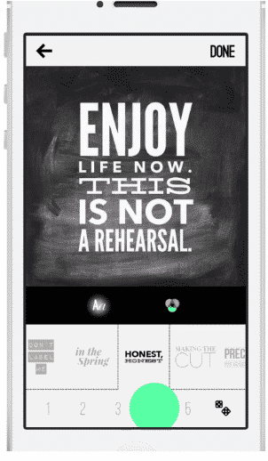
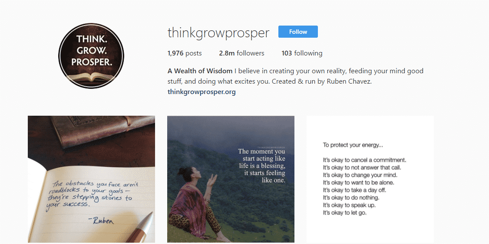
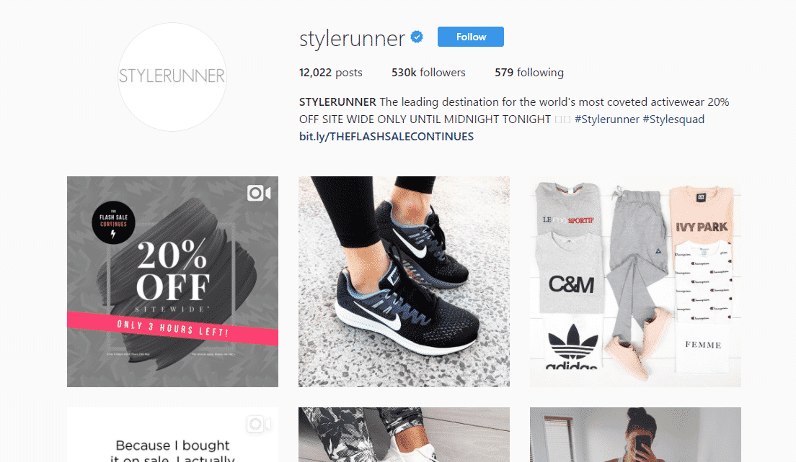
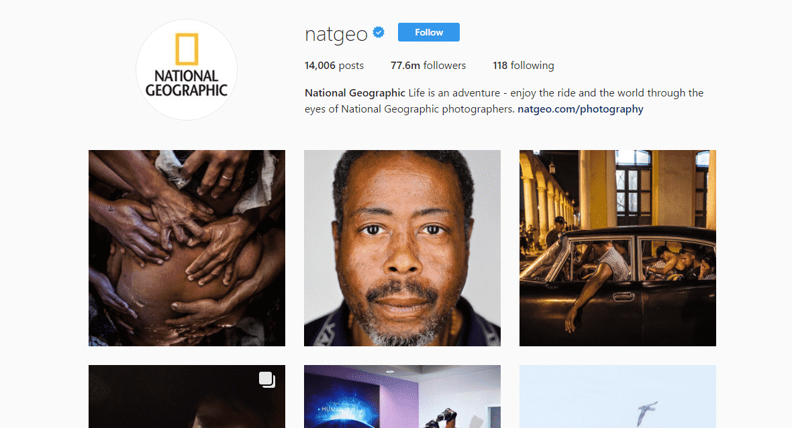

Before starting, I hope you guys have already gone through the [first installment](https://www.loginradius.com/blog/fuel/2017/05/the-insta-bible-chapter-1/)_ _of the series (recommended) where I spoke about how to start with an Instagram account._ 

In this article, you will learn how to create a compelling content that looks amazing and spreads very easily. This chapter will describe all the simple yet effective hacks to create the above mentioned type of content.

### **Importance of Your first 10 posts**

In this section, I am going to reveal you the significance of your first 10-20 posts. Well, I cannot stress much on the fact how important it is for you to deliver the best ten images in your first ten posts on your profile. No matter what ever images you post, they should be nicely designed and artistically stunning.

Whenever, a potential customer or a target arrives at your account, your first appearance factors in the most. People will decide in a snap time whether to follow your profile if:-

- Your profile’s artistry are stunning
- Your content seems relevant to them
- They want to share your posts

Moreover, your first ten posts will set your audience’s expectations. Other than these aspects, you need to maintain a consistent theme all over your profile.

#### **Some common mistakes you should not make**

- Not taking aesthetics of your profile seriously
- Not branding your images
- Not maintaining a uniform theme on your profile

Hence, before going into other processes of Instagram, it is very important to collect your first best ten images to post.

### **Now, How to Post an Image**

- Select the Camera icon. Now, you can take a picture or select images from your gallery
- Click on Next and it will show the ‘Filters’ options. Set filters if you desire
- Click ‘Next’ and it will take to ‘Add a Caption’ page. Enter your caption and click on Share.

And that’s how you will see the post on your Instagram profile. 

In a nutshell, never post bad quality or irrelevant (to your niche) photos to your account.

### **Apps for Content Creation**

Applications are certainly useful in creating stunning images. They help you to put good graphics in your images to make them visually astonishing. Additionally, apps make it very easy to create a treat to watch images. Here’s how you can use an application to create the image.

You can choose any app for creating images or adding effects to your images (if you don’t want to learn photoshop to do it).

Here, I am going to show how to create images in both iOS and Android. 

For iOS, you can use **Typorama** to create a quote image

- Download [**Typorama**](https://itunes.apple.com/us/app/typorama-text-on-photo-editor-typography-maker/id978659937?mt=8) from app store
- Install and open typorama, then select a background image from the gallery
- Now, edit the textual section by tapping on the image
- Write your quote or Copy and paste a quote in the image
- Now, choose the type of font you want from different text styles and resize the quote according to the image.
- Click on _Ok > Share and Save it to Gallery_ 

Now, I am going to introduce another app ‘[**Word Swag**](http://wordswag.co/)’.

You can also use Word Swag to enhance the artistry of your image. I am going to continue the process through it and add the name of person who quoted the quote and watermark.

- After downloading and installing **Word Swag**, open it and select the previous image from Gallery.
- Now, add the required text and select the font from different font styles
- You can also choose different colors.
- Click done and now select ‘**Add Watermark/ Logo**’ and you are allowed to select your logo image from your Gallery. You can also adjust the transparency of your logo according to your image. Thus, your image is ready to be uploaded in Instagram.

Now, for Android users, there is an app called [**Phonto**](http://www.phon.to/) for editing photos. The process to edit your images is pretty much same. You can also use [**Ezy Watermark**](http://ezywatermark.whizpool.com/) to include your logo in your image.

### **Good Content on Instagram** 

The golden rule to follow while creating a content is -

> **_Your content should Trigger an Emotion_**

You need to know your audience and niche and put some effort in your content. Examples of accounts that have good content are as follows:-

- **[IncomeTips](https://www.instagram.com/Incometips/)****\-** where you can find smart quotes images with tips to improve your business and entrepreneurial skills.   
- **[ThinkGrowProsper](https://www.instagram.com/thinkgrowprosper/)****\-** You can find awesome quotes images related to life, inspiration and wisdom.   
- **[StyleRunner](https://www.instagram.com/stylerunner/)****\-** You will find Images related to active life, health and fitness.   
- **[National Geographic](https://www.instagram.com/natgeo/)****\-** Visually Appealing Content on nature.   

Thus, as you can see from the above accounts, you have to create a character in front of your audience and then, you can promote your products or business.

Therefore, the rule to advertise your products on Instagram is Creating Value Content and then Push your Business.

### **Posting Consistently Pays**

Instagram honors your activities. This means if you are not consistent in your posting activities, the number of your followers will gradually decrease. Hence, post daily (highly recommended) on Instagram to increase and maintain your followers.

### **Build a Posting Strategy**

As I have discussed with you that posting consistently is very much important, make a note of this simple yet effective rule-

> **_The More You Post on It, The Faster You Grow With It_**

You can accumulate your photos for a week and then start posting on regular basis. The frequency of posting is your choice still I recommend you to post at least thrice a day. The [best time to post](https://later.com/blog/best-time-to-post-on-instagram/) will between 11 am to 1 pm and in the evening i.e 7 pm to 9 pm. Test your profile with various content and strategies and see what is in your favor. Afterwards, commit to the most effective methods.

**Note:-** You can use tools like [Iconosquare](https://pro.iconosquare.com/) as your Instagram Analytics to analyze your audience engagement and much more.

### **Commenting Pays As Well**

As in the previous chapter- Insta Bible Series: Chapter 1, I told you to create a list of the top ten influential accounts in your niche and start your efforts to get into their radar, commenting on their accounts can help you. It is a tactic that you can use to grow your Instagram account. Comment daily on other accounts that are influential in your market or niche. It will help to create a relationship with them and also provide better exposure to your page.

Owning a successful Instagram page does not only mean having good number of flowers or generating ample leads. It is also about making your mark in the market.

#### **So, how do you comment?**

Go to an influential account, select the post you want to comment on and comment on it. You don’t have to be cheesy while commenting. Just follow your guts and you will do good.

Comment twice at least in a day to enhance your influence.

### **Finding Images**

You don’t need to pay for an image. You just need to find the right source. To know where to get the right image for you, check out this [**list of free stock photo websites**](https://www.loginradius.com/blog/fuel/2017/04/copyright-free-images-at-no-cost/)**.**

You can also use Google Images for free stock photos. You just need to modify usage rights by clicking on Usage Rights > choose ‘Labelled for reuse‘.

Hence,

- Download and save a good number of high quality images on your google drive or dropbox
- Modify them with the apps and
- Use them on your Instagram account.

### **How to Clean up Your Feeds**

Cleaning up comes once your account is a month old. It is obvious that you will require to delete your unimportant photos down to the trash. It is just like shedding dry leaves. So, just go through your account and see coming up in your favor and what’s not. Hence, delete such images every month to maintain a curated feed.

### **Resizing Images**

[_Standard size_](https://colorlib.com/wp/size-of-the-instagram-picture/) _of an Instagram Picture_

**_Square Image:_** _1080px in width by 1080px in height_

**_Vertical Image:_** _1080px in width by 1350px in height_

**_Horizontal Image:_** _1080px in width by 566px in height_

Hence, if your selected image does not meet the standards of Instagram, you may have to crop the image to fit the screen. You can also use tools like [whitagram](https://itunes.apple.com/us/app/whitagram/id523481129?mt=8) for cropping your favorite images.

Kudos! You are another step closer to create an artistically stunning image.

### **Adding Videos on Instagram**

Videos are considered to have the [best ROI by 52%](https://theblog.adobe.com/seo-for-success-in-video-marketing/) marketers. Moreover, videos are more engaging than images. Hence, it is a good idea to put some effort in finding and posting a video which will give you more engagement and followers on your account. Make sure that you provide credits to the source of your video on your profile.

### **Posting Video Ads**

Posting video ads on Instagram can be great idea to promote your business. Video ads can provide a good amount of views and shareability to your brand. So, if you miss posting a video, you will miss out a great amount of exposure those small videos can provide to you.

### **How To Keep Your Engagement Elevated**

- Post daily. No matter if it’s raining or sunshine, you should post daily. And don’t forget to use your hashtags.
- Comment daily on other accounts
- Engage with your audience. Talk to people who are interacting with you on your account.

### **Posting During All Time Zones**

So, here’s the question. Why should I post during all timezones?

The answer: _Because your consistent posting will generate a snowball effect and will increase your followers._

Posting during different time zones will pay and you will see increment in the number of followers on your profile. There are some tools available for reducing your efforts.

- [ScheduGram](https://schedugr.am/)
- [Later](https://later.com/)
- [Onlypult](https://www.onlypult.com/)

### **Using Instagram for Multiple Product Pushes**

Instagram has a massive audience. Hence, you should utilize it and turn your followers into revenue through multiple product pushes. More importantly, add multiple images for a single product and promote them effectively on your profile.

Hence, that’s all folks about how to create an appealing content for your Instagram account. Cling on for more articles about Instagram. Also, share your experience on the comments below. Till then, keep posting on Instagram!
