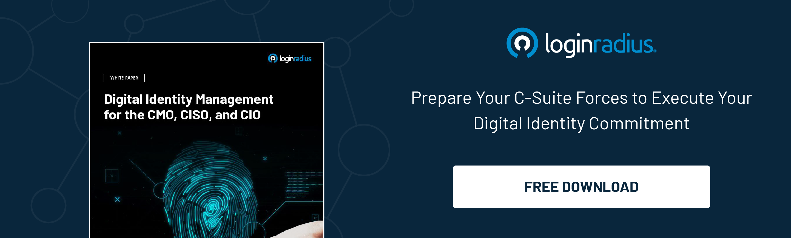

## Introduction

Cybersecurity is becoming increasingly complex, and thus, the job responsibilities of CISOs aren’t just limited to securing sensitive business information; they have to overcome the challenges of identity security. 

Organizations face financial and reputational losses yearly due to data breaches. And now things are even worse — they have to deal with the issues related to [identity theft](https://www.loginradius.com/blog/identity/identity-theft-impact-on-businesses-in-2023/). 

So, what does it mean? Well, CISOs and security heads need to gear themselves to overcome the challenges of identity security in today’s era. And for this, they must convey to the board members the importance of a robust identity security mechanism. 

While most CISOs are now concerned about the risks associated with customer identity security and identity thefts, they’re struggling to create a strategy to convince the board members to prepare beforehand. 

And to help CISOs present a compelling identity security strategy to board members, we’ve compiled a list of some helpful tips. Let’s have a look. 

## 7 Tips on How to Communicate Identity Security to CISOs

### 1. The Art of Aligning Security Objectives with Business Goals

As a CISO, the initial step to present the importance of identity security to board members is to demonstrate a crisp alignment between security objectives and business goals. 

Remember, your end goal isn’t just securing sensitive business information but ensuring your customers’ details are securely managed, stored, and transferred. And a little loophole in managing their details that may lead to identity theft could be fatal to your organization’s growth.

Hence, you must articulate how identity security measures could contribute to your organization’s long-term success, reputation, and [customer trust](https://www.loginradius.com/customer-security/). 

So, framing identity security as a business strategic enabler rather than an expense could help board members understand the broader impact of their investment. 

### 2. Be Transparent

Your board members are always eager to learn about finances, security, and customer service risks. And they always look for ways to minimize the business impact of the risk. 

Keeping your points with complete transparency can help you make them understand investing in [customer identity security](https://www.loginradius.com/security/) best practices. 

### 3. Speak your Board’s Language 

Just because you’re good at technical skills and managing the robust security of your business doesn’t necessarily mean that your complex acronyms can convince your board members.

Hence, you must avoid using technical jargon and complex terms when presenting your identity security plan to board members. 

You could translate technical concepts and terms into business terms that resonate with your C-level executives’ expertise. And it would be great if you could focus on tangible risks, potential financial and reputational implications, and regulatory compliance, as this will facilitate more productive and meaningful conversation. 

### 4. Provide Real-World Examples 

Convincing your C-level executives without real-world examples could be an uphill battle. Most executives won’t take identity security seriously if they haven’t seen any organization facing the negative impacts of not incorporating the same. 

Presenting some concrete recent examples of [identity security incidents](https://www.loginradius.com/blog/identity/secure-data-amidst-identity-crisis-via-identity-based-access/), both external and internal industry, which can effectively illustrate potential risks and consequences could be a great idea to portray the need for robust identity security solutions. 

### 5. Evaluate and Present the Impact of Identity Breaches

Another great way to convince your board regarding incorporating identity security into your organization is by evaluating the potential impact of identity breaches. 

Once you evaluate the total financial cost of identity theft, including direct expenses and indirect costs like reputational damages and regulation fines, you can present the same to board members. This will help them grasp the seriousness of the threat and the importance of incorporating a robust identity security system. 

### 6. Highlighting Compliance and Regulatory Mandates 

Data compliance is swiftly becoming the need of the hour for businesses thinking to step ahead of the competition. However, building the future of data compliance requires stringent [data privacy and security policies](https://www.loginradius.com/blog/identity/consumer-data-privacy-security/) and best practices. 

One of the biggest reasons organizations must comply with privacy regulations is to avoid heavy fines. The ones that don’t implement the privacy regulations could be fined up to millions of dollars and face penalties for years.

Due to increased regulations, including the EU’s GDPR and the United States’ CCPA, that protects unauthorized access to crucial data, privacy compliance is now essential for every business.

Also, the increased number of cybersecurity threats about customers’ crucial information has impacted businesses; businesses must incorporate a robust security mechanism for better protection. And you just need to present the current stats to your board members! 

### 7. Present a Comprehensive Identity Security Solution 

Once you’ve done with the steps mentioned above, the final step is to present a well-defined, comprehensive identity security solution. 

And to present your security solution and strategy, you must have a roadmap for enhancing identity and access management along with robust security features, including [multi-factor authentication](https://www.loginradius.com/multi-factor-authentication/), risk-based authentication, and data encryption.

A clear plan with a reliable identity security solution like [LoginRadius](https://www.loginradius.com/) would help board members visualize the organization’s commitment to proactively addressing identity-related security risks. 

## Conclusion

While cybercriminals are hunting new ways to exploit consumer identities, CISOs must adopt cutting-edge security mechanisms to safeguard their customers and business reputation.  The tips mentioned above would help you convince your C-suite executives to emphasize identity security as a part of their overall security strategy. 

And with a reliable customer identity and access management (CIAM) solution in place, security heads can ensure their customers’ identities are safe, and their board members don’t need to worry about the consequences of identity thefts. 

