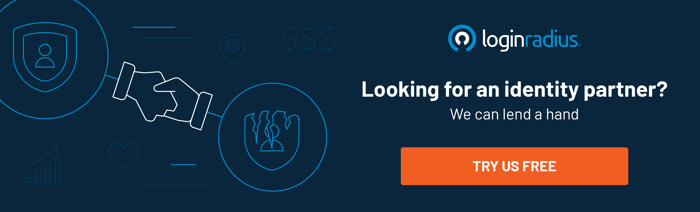

---
title: "Top 3 CIAM Indicators That You’ll Get the Consumer Satisfaction You Deserve"
date: "2021-07-06"
coverImage: "ciam-loginradius.jpg"
category: ["loginradius"]
featured: false 
author: "Vishal Sharma"
description: "CIAM offers the luxury of a centralized database to provide a secure and seamless consumer experience. In this post, we’ve discussed the CIAM indicators that ensure you’re getting adequate ROI and eventually safeguarding consumer satisfaction."
metadescription: "Winning consumer trust is easy with a reliable Consumer Identity and Access Management solution. Here’s the list of CIAM indicators depicting consumer success."
metatitle: "Top 3 CIAM Indicators That You’ll Get the Consumer Satisfaction You Deserve"
---

The changing data landscape and the propagation of credential-based security threats coupled with stringent regulatory compliances push enterprises to deploy a consumer identity and access management (CIAM) system.

However, many enterprises aren’t able to leverage the full value of a CIAM since they [confuse it with the conventional IAM](https://www.loginradius.com/blog/start-with-identity/iam-vs-ciam/) (identity and access management) that only emphasizes identity management within an organization network and not for consumers/clients.

On the other hand, only a few businesses are well-versed with the technological advancements that a CIAM can thrive. The rest just consider it as a way to secure consumer identities and enhance overall security.

So, how can one decide which is the best CIAM for their business? Or in a nutshell, what are the CIAM indicators that ensure you’re getting adequate ROI and safeguards consumer satisfaction?

Let’s learn in detail what CIAM is, what value it offers to your business, and the aspects that indicate you’re relying on the most refined consumer identity and access management solution.

## What is Consumer Identity and Access Management (CIAM)?

Consumer identity and access management (CIAM) is a digital identity management software solution for businesses that combines login verification with consumer data storage. CIAM aims to improve the consumer's sign-up and login experience while securely managing consumer identities.

CIAM offers the luxury of a centralized consumer database that links all other apps and services to provide a secure and seamless consumer experience.

Moreover, a cutting-edge CIAM solution like LoginRadius offers a seamless login experience through Social Login, Single-Sign-On (SSO), and [Passwordless Login for customers](https://www.loginradius.com/passwordless-login/).

## CIAM Indicators that Describe Your Consumers Love Your Platform

Enterprises embarking on a journey to digitally transform themselves need to understand that security isn’t just the only thing that guarantees consumer success, user experience coupled with the highest level of security is what makes a business stand ahead of the curve.

However, not every business utilizing the best in class CIAM solution is aware of CIAM clutches’ potential.

Here’s the list of features in a CIAM solution that assures consumer success and satisfaction:

## 1. Reinforced Security through Adaptive Authentication

When it comes to maintaining consumer trust, protecting critical consumer details is something that brands shouldn’t ignore.

Since consumer identity thefts are rising substantially, especially in the most unpredictable times of COVID-19, enterprises that are just relying on multi-factor authentication should reconsider their first line of defense.

Attackers are exploiting consumer credentials to bypass security layers that result in brand tarnishing and losses worth millions.

Hence, an innovative and robust system should be in place that adds a strong fence around the network without hampering the user experience.

One such security feature is [“Adaptive Authentication” or “Risk-based Authentication](https://www.loginradius.com/blog/engineering/What-is-adaptive-authentication/).”

It’s a method to send notifications or prompt the consumers to complete an additional step(s) to verify their identities when the authentication request is deemed malicious according to your organization's security policy.

Multi-Factor authentication alone, on the other hand, creates a lengthier authentication process for the consumers, which causes lower consumer conversation at your application.

Adaptive Authentication only triggers an elevated-risk situation while keeping the frictionless authentication process in place for normal conditions.

In a nutshell, adaptive authentication authenticates a user whenever there's suspicious activity and not just every time a user tries to log in.

This helps maintain the highest level of security and, at the same time, ensures users get the best navigation experience.

Brands leading the market already leverage CIAM with adaptive authentication like LoginRadius to safeguard consumer data and offer a flawless user experience.

## 2. Privacy and Compliance: The Best of Both Worlds

Privacy compliance is the line between legal and illegal. Privacy laws and regulations help protect consumers in different countries by ensuring data is handled appropriately.

Privacy compliance law states how organizations (regardless of their industry) meet regulatory and legal requirements for collecting, processing, and maintaining personal information.

So, if your CIAM isn’t compliant, you’ll end up losing your client base as consumers don’t trust brands that aren’t securely managing their sensitive information.

Privacy compliances like EU’s GDPR and California’s CCPA ensure data is securely managed and stored, and hence consumers can share their details while signing up without any second thought.

The ones that aren’t yet compliant should know the fact that a breach in data privacy can lead to legal consequences and may be followed by investigations and fines.

As a leading GDPR-compliance-ready CIAM platform, LoginRadius works seamlessly for any business model.

LoginRadius simplifies data privacy compliance by bringing all the consumer data under a single roof, which enables complete profile management of an individual consumer in a single intuitive admin console.

## 3. Availability and Scalability: To Stay Ahead of the Competitions

Since consumers and businesses have transitioned to online platforms amidst the global crisis, there’s a huge possibility that the number of logins and the creation of new accounts will surge.

Without a highly scalable infrastructure to handle the increasing account creations and logins coupled with availability (uptime), peak loads can dramatically impede performance and hamper consumer experience.

For this, you need to ensure you have a robust identity solution that grows at the same pace.

If your CIAM isn’t available to cater to the increasing demands of your consumers, you’re heading in the wrong direction.

With 100% uptime and 35 data centers across the globe, [LoginRadius’ cloud-based platform](https://www.loginradius.com/blog/engineering/effective-cloud-management-platform/) can scale to 100s of millions of users in a couple of seconds.

This is what consumers in today’s era actually want since nobody would like to revisit a website or application that offers a poor user experience due to unavailability.

## Final Words

Businesses need to understand the true potential of a CIAM solution. A reliable CIAM reinforces security and compliances and eventually enhances user experience throughout the consumer onboarding journey.

The aspects above depict the role and responsibilities of a robust CIAM that can guarantee consumer trust and help scale business growth.

If you wish to experience the ease of consumer onboarding that increases consumer satisfaction and boosts your business revenues, it’s time to  [experience the LoginRadius CIAM](https://www.loginradius.com/contact-sales/).

