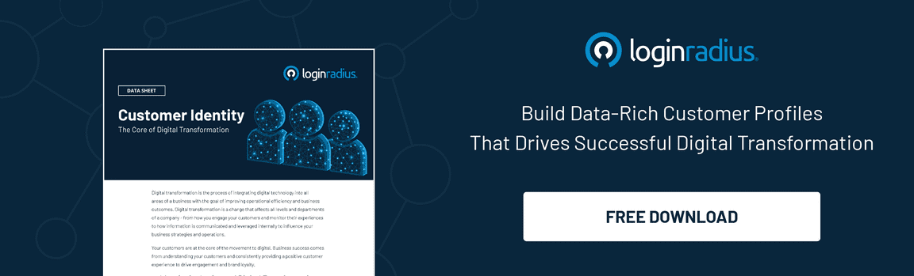

---
title: "8 Common Challenges With Your SaaS Business that CIAM Can Solve"
date: "2021-09-10"
coverImage: "saas-business-app.jpg"
category: ["loginradius"]
featured: false 
author: "Rashmi Mathur"
description: "To be successful, your SaaS needs to use the right application performance management software. CIAM is the first step you need to take to avoid common challenges like lack of compliance, and incompetent onboarding."
metadescription: "While there are several benefits of a CIAM platform, read about the eight principal challenges associated with deploying a SaaS business app that a CIAM can solve."
metatitle: "Top 8 CIAM Challenges With Your SaaS Business App"
---

Digital communication between clients and a company is now a regular practice across various industries. Businesses capitalize on these synergies to stimulate repeated sales or client reliability. Also, companies collect customer information to better interact with the clients and keep a record of sales.

  

The data gathered in databases can be vulnerable to cyber attacks that result in stolen customer and business identities. Hence, businesses look to increase their cybersecurity with the help of SaaS-based CIAM business solutions.

## Top Challenges With SaaS Apps and How CIAM Overcomes Them

While there are several [benefits of CIAM](https://www.loginradius.com/blog/start-with-identity/customer-identity-and-access-management/) that every organization can leverage, there are eight principal challenges associated with using and deploying SaaS business applications that a CIAM can solve. They are:

  

-   Keeping business app integrations up-to-date
    

  

Centralized user administration and single sign-on require building integrations with various applications and tracking the maintenance specifications for advanced versions of every application. Also, for several enterprises, making the IT team manage its compilation of application integration in a continually evolving landscape can be inefficient and unrealistic.

  

Also, when it comes to application integration, every new vendor may need a new approach, especially related to user authentication and management. This is why businesses must use the [best CIAM solution](https://www.loginradius.com/) to warrant that their application integration always remains functional and up to date.

  

-   Lack of insight into best practices and sub-optimal utilization
    

  

One principal reason for the exponential rise of cloud-based SaaS applications is that recurrent subscription models have substituted the upfront bulk payment of the conventional, on-premises software license acquisition. However, with no centralized insight into the usage of these applications, financial and IT managers cannot control these subscription acquisitions. Also, they might hold no or little idea whether they are spending more than they use. This is where cloud-based top CIAM solutions  for retail help businesses get better visibility into software utilization and help your IT team optimize the enterprise SaaS subscription.

  

-   Different management models for diverse applications
    

  

When looking at the top trends in CIAM solutions, it becomes evident that cloud-based applications become more convenient and less costly to get executed. However, it can likewise create new challenges for an IT team as there is no central point to manage applications and users or present analytics and reports.

-   Lack of compliance
    

  

A business must conduct all its activities as per the applicable regulations, laws and in conformance with in-house rules and guidelines. Visibility regarding compliance likewise pertains to the highest degree for CIAM (Customer Identity and Access Management). Moreover, an organization must comprehend who holds access to business data and apps, who has granted this access and how it gets employed.

  

-   Employees get confused between several passwords
    

  

Even though the SaaS business models make it more comfortable for users to access and manage their business applications, the rise in complexity of this method corresponds to the expansion in applications. Also, every application holds separate password controls and expiration periods.

  

The diversity of password controls coupled with different expiration times can lead to a poor user experience. Moreover, your employees also require more time to manage, remember, and reset these constantly changing passwords and access permissions in their applications.

  

-   Incompetent onboarding and defective offboarding
    

  

Usually, the IT team grants an employee access to the file server, corporate network, email account etc., when a new employee joins a company. However, since multiple SaaS applications get administered at a departmental level, access gets rendered by a person responsible for the application and not the IT department. This can point to a fragmented process and employee dissatisfaction. A good CIAM can get the job done efficiently.

  

Also Read: [The ABCs of a Successful Saas Onboarding Process](https://www.loginradius.com/blog/fuel/successful-saas-onboarding-process/)

-   Siloed user lists for every application
    
Many companies have made a notable investment in a corporate directory to control access to on-premises system resources. As businesses adopt cloud-based assistance, they must leverage this investment and move it to the cloud rather than building an identical list and access control support for new SaaS applications.

-   Controlling access across different browsers and devices
    

One of the surpassing advantages of cloud applications is that admittance is obtainable from any device over the internet. However, more apps mean more URLs, passwords and devices. Hence, IT teams must provide and control access across several devices without jeopardizing security that can be difficult with existing systems.

To summarize, we can say that a cloud-based CIAM service should present accurate visibility of user access. Also, providing your customers with the required protection against identity theft is crucial in preserving your company prominence. This is why it is vital to overcome these challenges to better leverage the benefits of CIAM to protect your business and clients.
