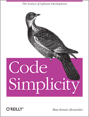

It doesn’t count if you are a pro-developer or a newbie who has took his few steps in the world of software or web designing. You need to be on your toes to grasp new changes and demands in technologies. You are not only supposed to produce great codes but also your products have to work better from your previous creation. Hence, reading blogs from your niche can help you upskill yourself and stay ahead of the game but how can you know which ones are worth reading; _well, you don’t have the time to experiment._ So, utilize your precious time at other productive works and follow this list of best blogs for developers and designers to avail the best online resources.

### Coding Horror 

[Coding Horror](https://blog.codinghorror.com/) is a blog by Jeff Atwood, an experienced web developer. Although, the blog consists of all types of security and software development related topics, Jeff personally concentrates on the human participation in software development. The author firmly believes that one also needs to focus on the people who are going to use the code and understand them while preparing the code.

### Joel on Software 

[ Joel on software ](https://www.joelonsoftware.com/) was found by Joel Spolsky in 2000. There is a lot to talk about this blogger. Joel Spolsky worked as a program manager in Microsoft. Later he became the co-founder of StackExchange, a site for programming Q&A. Programming world also recognizes him as the founder of Fog Creek Software and maker of the software Trello. You will love this blog if you love topics related to software development, business, and management.

### Code Simplicity 

[Code Simplicity](http://www.codesimplicity.com/) talks about introducing simplicity in code designs. The author, Max Kanat-Alexander (who has also written the book “_Code Simplicity: The Science of Software Development_”) believes in simple software designs and considers complex designs stupid. He is an experienced software engineer working at Google. He has also lead the team behind Bugzilla project.

### Scott Hanselman 

You can look upon [Scott Hanselman’s blog](http://www.hanselman.com/blog/) if you want helpful, concise and clear advices on web, development culture, gadgets, code, technology and anything related to a developer’s interest. His experience as a professor and also at Microsoft can be clearly seen in his articles. Moreover, his articles reflect his personality. You can also follow him at his Youtube channel and three podcasts.

 

### Specky Boy 

The [blog](https://speckyboy.com/) was found in 2007 by Paul Andrew with a notion to provide useful information related to various design resources and talk about latest web technologies. Now, the blog has developed into a great design magazine which can guide developers and designers with all kinds of useful resources, time-saving techniques and online tutorials.

### SitePoint 

[SitePoint](https://www.sitepoint.com/) is very popular tutorial site for fields related to product creation, programming, development, SEO, web designing and entrepreneurship found in 1999. The site from also consists of numerous video tutorials which may require premium membership in the website.

 

### Six Revisions 

[Six revisions](http://sixrevisions.com/) though has minimal look but focuses on publishing awesome contents since 2008. The blog is followed by developers and designers where you can find many blog posts related to WordPress, design, JavaScript, HTML, CSS and many more. The posts are added few times in a month. You can also enjoy different free tutorials and tools in this blog.

### Federico Cargnelutti 

Any developer will love [Federico’s blog](https://blog.fedecarg.com/). The blogger himself is a professional web and mobile developer. He regularly posts about agile development, software architecture and coding (especially PHP). He includes tutorials and Twitter posts to share his insights on the respective fields.

### Paul Graham’s Essays 

[Paul Graham’s Essays](http://www.paulgraham.com/articles.html) are excellent guide for developers who want to understand and  develop businesses based on SaaS. The author is the man behind Viaweb (a SaaS based company founded in 1995) and co-founder to Y-combinator. The blog will provide you insight of your role as a developer in the world of business.

### DailyJS 

The [blog](https://medium.com/dailyjs) was made to provide daily updates on everything about JavaScript. Alex Young, the author of the blog creates content consisting of worked examples and hands-on tips about JavaScript.

### Ajaxian 

[Ajaxian blog](http://ajaxian.com/) comes in the must read list for many developers because of the diversity of topics it contains (ranging from XML to .Net development). The blog produces engaging content on different components of development especially AJAX and JavaScript. The team consists of 12 members (core developers) who have gathered experience from working with big guns like Google.

### Pontikis 

You will find many guides and how to articles in [Pontikis](http://www.pontikis.net/). Christos Pontikis, the author of the blog provides detailed content about different languages, frameworks alongside his insights on MySQL, jQuery and PHP. so, if you a knowledge driven developer, this blog site is for you.

 

### David Walsh 

The [blog by David Walsh](https://davidwalsh.name/) focuses on front end technologies and talks about languages like CSS, JS and HTML/5. You will find many engaging and honest posts which supports trial and error development and open source contribution. FYI, David Walsh is a part of core developing team of [MooTools JavaScript Framework](https://mootools.net/) and is a seasoned web developer in Mozilla.

### WebAppers 

[WebAppers](http://www.webappers.com/) is another blog which supports collecting and sourcing open source resources and tools. Besides offering guides and helpful advice to web designers and developers, the blog also provides nearly 700 plugins to facilitate their needs.

 

### Codrops 

You may not find new posts periodically on [Codrops](https://tympanus.net/codrops/) but it shines with its USP of innovative, inspiring and most useful content. Codrops offers awesome content, freebies, blueprints and tutorials based on latest techniques and trends in web development and designing.

### Tuts+ Tutorials 

[Tuts+](https://webdesign.tutsplus.com/) is a place where you can find in-depth tutorials about web design, coding, and illustration. Moreover, you can follow these tutorials at your comfort and various topics about CSS, UX and HTML, design tools and resources available in the blog will help you increase your skills in web designing. The blog is maintained by Envato.

 ### Eric Sink 

You can find roundups, useful advice and views by [Eric Sink](http://ericsink.com/) in his blog. Eric Sink has worked at SourceGear and also been a part of the development team of Internet Explorer. He talks about everything related to software development.

### The Daily WTF 

Enjoy your breaks by reading these amazing articles by [The Daily WTF](http://thedailywtf.com/). It’s not so monotonous tone offers you humorous contents with deep insight about programming and development. My personal favorite sections from the blog are ‘disastrous development stories’ and ‘how not to guides’.

### Silk and Spinach 

[Silk and Spinach](https://silkandspinach.net/) is a great blog for advice related to agile development. Kevin Rutherford (author) has a vast experience in agile development which he acquired by working as a Scrum Master and freelancer developer. He has a membership in Agile Alliance as well.

 

### PragDave 

Dave Thomas, a publisher and an experienced coder, believes in learning forever ideology. Thus, he propagates the idea through [his blog](https://pragdave.me/) by creating a different approach by adding philosophy of martial arts in coding. He has termed it as [CodeKata](http://codekata.com/).  He provides latest updates, views, guides and tutorials about development through his blog and tweets.

### Jonathan Kohl 

Jonathan Kohl shares his expertise in developing mobile application and business opportunities surrounding the technology through [his blog](http://www.kohl.ca/blog/). His blog can be interesting for those developers who are also interested in business aspects of application development.

 

### Succeeding with Agile 

 

Another awesome [blogpost](http://www.mountaingoatsoftware.com/blog) for someone following agile development. The blogger, Mike Cohn with his 20 years of knowledge in handling Scrum projects, strongly supports agile projects. So, if you want to enhance your agile processing capabilities, you should read this blog.

 

### Hongkiat 

[Hongkiat](http://www.hongkiat.com/blog/) has some great resources for designers. Hongkiat Lim launched this blog in 2007 because he wanted to do something more interesting than his monotonous job. Presently, Hongkiat serves more than 10 million visitors in a month and is one of the most popular blogs in the world. The blog often covers topics like various design tools, WordPress, CSS, HTML and Photoshop.

### CSS Tricks 

[CSS-Tricks](https://css-tricks.com/) created by Chris Coyier concentrates on fancy CSS tricks. It provides forums, code snippets, videos and articles related to CSS. You can also have a look on a calendar for developers which information about generally known CSS properties and selectors.

 

### Designr Fix 

Now, when talking a site about fancy design or a site for design junkies, there is nothing better than [Designr Fix](http://designrfix.com/). The blog takes art seriously as a source for inspiration in making awesome designs. It offers resources, deals, tutorials and freebies.

### Smashing Magazine 

[Smashing Magazine](https://www.smashingmagazine.com/) is an outstanding blog dedicated to development and designing. You can find great posts about responsive design issues, Andriod, iOS, WordPress, JavaScript, HTML, CSS and other latest techniques. You can also buy e-books through smashing magazine.

### Scott Berkun 

The [blog](http://scottberkun.com/blog/) by Scott Berkun majorly focuses on insights related to his work experience in WordPress and Microsoft. The author also offers content related to philosophy, leadership and creativity.  So, the blog can prove to be an interesting venue to you, if you are bored of monotonous contents in technical blogs. The blog can help you transform into a better programmer as well as a better person.

### HTML5 Doctor 

[HTML5 Doctor](http://html5doctor.com/) has good collection of HTML5 resources which is being maintained by a group consisting of Ian Devlin, Oli Studholme, Remy Sharp, Bruce Lawson, Steve Faulkner and Rich Clark. The inspiration behind the launch of blog was the lack of resources related to HTML5. Interactive sessions are encouraged in HTML5 doctors where you can ask them to debug your code or a simple question.

### Smashing Hub 

 

[Smashing Hub](http://smashinghub.com/) shares content related to designing issues in WordPress. You go for its directory of design giveaways and [freebies](http://smashinghub.com/category/freebies/giveaway-freebies). The blog is a great help for developers and designers.

### Jon Skeet's coding blog 

Last but not the least, Jon Skeet is known by the name ‘human compiler’ in the world of programming. [His blog](https://codeblog.jonskeet.uk/) is a miscellaneous baggage of content and books related to C#,  Java, F#, Stack overflow, and other general topics of coding. His blog also provides reviews of different books.

And that’s all folks! It is not so easy to find the perfect blog but you can do it with this list of blogs with exceptional content. So which blogs did you like the most or do you think I missed to enter some useful blogs in the list? Please address in the comments below.

Wish you a great designing and developing experience.
