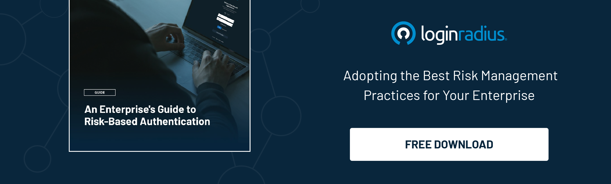

## Introduction

In today's digital landscape, businesses rely heavily on online platforms and data storage. Ensuring robust security measures is paramount, especially when data and privacy breaches are rising. 

One critical aspect of this security framework is effective [user access management](https://www.loginradius.com/user-management/). Yes, secure access management is undeniably the need of the hour since it not only ensures secure data management but eventually offers compliance with various global regulations. 

By implementing user management best practices, businesses can significantly reduce the risk of data breaches, unauthorized access, and other security threats. 

Let’s explore the seven essential user access management best practices to optimize business security.

## 7 User Access Management Best Practices For Business Security

### 1. Implement Role-Based Access Control (RBAC)

[Role-Based Access Control (RBAC) ](https://www.loginradius.com/role-management/)is a fundamental principle in user access management. By assigning specific roles to users based on their responsibilities within the organization, businesses can regulate access to sensitive data and systems. 

This approach ensures that users only have access to the resources necessary for their roles, minimizing the risk of unauthorized data exposure.

### 2. Regularly Review and Update User Permissions

User permissions should not be static. Conducting regular reviews of user access rights and updating permissions as needed is crucial. 

Employees' roles and responsibilities may change over time, necessitating adjustments to their access levels. By regularly auditing and updating user permissions, businesses can maintain a secure access environment and prevent potential security loopholes.

### 3. Enforce Strong Password Policies

Weak passwords are a common entry point for cyberattacks. Implementing strong password policies, such as requiring complex passwords and regular password changes, can significantly enhance security. 

Additionally, consider implementing [multi-factor authentication](https://www.loginradius.com/blog/identity/what-is-multi-factor-authentication/) (MFA) to add an extra layer of protection against unauthorized access.

### 4. Risk-Based Authentication (RBA) 

With risk-based authentication, businesses can define adaptive authentication policies that tailor authentication requirements based on the assessed risk level. 

For low-risk access attempts, users may only need to provide basic credentials, while high-risk attempts may trigger additional authentication factors, such as biometric verification or one-time passwords.

### 5. Provide Security Awareness Training

User education is an integral part of any security strategy. Provide comprehensive security awareness training to employees to educate them about the importance of security protocols, safe browsing habits, and the risks associated with unauthorized access. 

By fostering a culture of security awareness, businesses can empower employees to play an active role in [safeguarding sensitive data](https://www.loginradius.com/blog/identity/cybersecurity-best-practices-for-enterprises/).

### 6. Utilize User Activity Monitoring

Monitoring user activity is crucial for proactively detecting and mitigating security threats. Implement real-time user activity monitoring tools that track user actions, logins, and access attempts. 

Businesses can identify suspicious behavior patterns by analyzing user activity logs and taking timely action to prevent potential security incidents.

### 7. Regular Security Audits and Compliance Checks

Regular security audits and compliance checks are essential for assessing the effectiveness of user access management practices and ensuring compliance with industry regulations. 

Conduct comprehensive security audits to identify vulnerabilities, assess the integrity of user access controls, and promptly address any non-compliance issues.

## Final Thoughts 

Optimizing business security requires a proactive approach to user access management. By implementing these seven essential user management best practices, businesses can establish a robust security framework that safeguards sensitive data, mitigates security risks, and ensures compliance with regulatory requirements. 

Prioritize security and invest in comprehensive user access management strategies to protect your business from evolving cyber threats.

