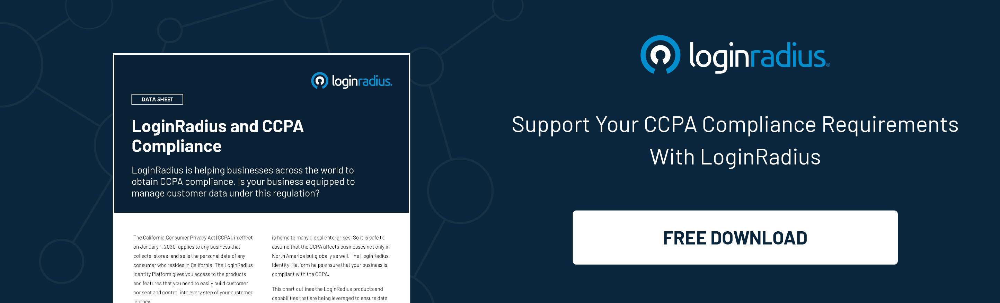

---
title: "The Future of Customer Experience is All About Advanced Identity"
date: "2022-09-08"
coverImage: "cx-identity.jpg"
category: ["customer experience", "identity management", "compliance"]
author: "Vishal Sharma"
description: "Since customer journeys are becoming increasingly complex, brands should focus more on improving their identity management infrastructure. This blog explains the aspects of identity management and how to deliver a rich and secure CX across multiple touchpoints."
metadescription: "Digital identity has paved the way for business success. Learn how advanced identity management helps brands stay ahead of the competition."
metatitle: "What Advanced Identity Means For Your Customer Experience?"
---

## Introduction

Our digital lives are expanding into more devices, interactions, environments, and experiences every day. Delivering rich customer experiences to build trust and loyalty isn’t a luxury anymore; it’s an absolute necessity. 

And the ultimate objective of any online platform today is to deliver a personalized and differentiated customer experience that strengthens customer loyalty while [reducing customer churn](https://www.loginradius.com/blog/growth/how-customer-retention-can-help-businesses-grow/).

Since customer journeys are becoming increasingly complex as more digital touchpoints are added, brands should focus more on improving their identity management infrastructure. 

A terrible authentication experience or a little friction in switching between applications is the worst thing that none of our customers would ever tolerate. And they eventually switch!

Here’s where the typical and crucial role of advanced identity management solutions comes into play. 

Let’s understand the aspects of identity management and how it paves the path for delivering a rich and secure customer experience across multiple touchpoints. 

## Identity Strategy for Today, Tomorrow, and Beyond 

Gone are the days when [identity management](https://www.loginradius.com/blog/identity/what-is-iam/) was only limited to a specific organization or a limited number of customers; it’s now at a new level. 

Billions of identities are now being managed, stored, and secured every second, and that’s how identity management works in the 21st century. 

However, some businesses aren’t yet leveraging the true potential of a robust identity management system that can thrive business success by accelerating user experience. 

We’re constantly interacting with multiple brands and platforms from a user perspective. However, most of these platforms are already authenticated with a single identity. No one favors creating numerous identities across multiple platforms and remembering complex passwords. 

On the other hand, with great identity and access management features, including [single sign-on](https://www.loginradius.com/single-sign-on/) (SSO) and social login, switching between multiple applications without re-authenticating feels like a breeze. 

So, what’s the biggest lesson that brands should learn? 

A rich customer experience begins when users interact with their platform for the first time! And to ensure it’s fabulous, brands must leverage a customer identity and access management solution. 

Besides, global data privacy and security compliances, including the GDPR and CCPA, are more stringent than ever. Hence, to comply with these regulations, brands should adopt a robust identity management solution to continue delivering services to their customers. 

## Your Customers Know What to Share What Not

As we already discussed, global data privacy and security compliances are becoming more stringent; they’re also spreading awareness among customers regarding how brands collect, store, and manage their data. 

Users don’t wish to share their personal data with platforms they aren’t familiar with or applications they don’t trust. 

Again, the trust factor begins with the first interaction. And if it isn’t a seamless interaction, users won’t give consent to use their personal details. Moreover, they won’t share their details. 

Hence, delivering personalized customer experiences becomes an uphill battle for brands since they cannot collect crucial information. 

However, things completely change when businesses have incorporated a robust customer identity and access management platform. 

With a CIAM, businesses can gradually and consistently collect crucial information about users through progressive profiling. 

[Progressive profiling](https://www.loginradius.com/progressive-profiling/) ensures a rich customer experience where customers can share their details gradually over time since they’re not bombarded with complicated registration forms at their first interaction. 

This helps build trust over time and ensures customers share their complete details, including preferences, to help brands deliver a rich and customized experience. 

## Final Thoughts 

The power of identity management is helping brands navigate their digital transformation journey. However, many businesses yet have to witness its true potential since they’re relying on conventional modes of collecting and storing user information and authentication. 

With a reliable customer identity and access management solution, brands can ensure they stand ahead of the curve by delivering rich customer experiences backed with robust security. 

