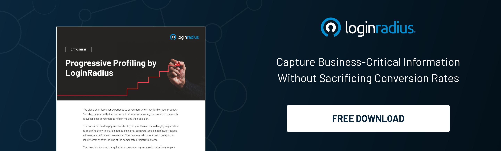

In the ever-evolving landscape of digital marketing, change is the only constant. With the phasing out of third-party cookies, businesses face a new challenge – how to target and engage their audience in a cookieless world effectively.

In this shifting paradigm, zero-party data emerges as a beacon of hope for marketers seeking innovative and ethical ways to understand and connect with their customers.

Let’s understand how marketers can overcome the challenges of the cookieless world by embracing zero-party data. 

## The Era of Cookieless Marketing

In the past, third-party cookies served as the backbone of online advertising, allowing businesses to track user behavior across websites and enabling targeted ads. 

However, [increasing privacy concerns and regulatory changes](https://www.loginradius.com/blog/identity/data-privacy-compliance-future/) have paved the way for a cookieless future. As a result, businesses are compelled to find alternative methods to gather customer data and deliver personalized experiences.

### Enter Zero-Party Data: A Paradigm Shift in Customer Interaction

Zero-party data, unlike first-party and third-party data, is voluntarily shared by the customers themselves. It includes preferences, feedback, and other explicit information provided willingly by users. This data type is a goldmine for marketers as it offers genuine insights into customer preferences and intent, allowing for hyper-personalized marketing strategies.

## Benefits of Zero-Party Data

### 1. Enhanced Personalization

Zero-party data enables businesses to tailor their marketing messages to individual customer preferences, leading to a more personalized and meaningful customer experience.

### 2. Building Trust and Transparency through Progressive Profiling 

Progressive profiling helps businesses collect useful customer details gradually over time. When customers willingly share their data, it fosters a sense of trust and transparency between the brand and the consumer. By respecting user privacy and preferences, businesses can create lasting relationships with their audience. 

### 3. Improved Customer Engagement

With accurate insights from zero-party data, marketers can create engaging content and offers that resonate with the target audience, leading to higher conversion rates and customer satisfaction.

### 4. Ethical Marketing Practices

Zero-party data is collected with the explicit consent of the users, ensuring ethical and responsible data usage. This approach aligns with the evolving privacy regulations and demonstrates a commitment to customer privacy.

### Embracing Innovation and Adaptability

In the face of challenges posed by a cookieless world, embracing innovation and adaptability becomes paramount for businesses. By investing in technologies that facilitate the collection and analysis of zero-party data, companies can gain a competitive edge. 

Machine learning algorithms and artificial intelligence tools can help interpret vast amounts of data, allowing marketers to uncover valuable patterns and trends. This data-driven approach not only enhances marketing strategies but also fosters a [deeper understanding of customer behavior](https://www.loginradius.com/customer-insights/), enabling businesses to anticipate needs and preferences proactively.

Furthermore, collaboration and knowledge sharing within the industry are essential components of navigating the cookieless landscape successfully. Marketers can learn from one another's experiences, experimenting with different approaches to zero-party data collection and analysis. 

### The Human Touch in a Digital World

While data and technology play pivotal roles in the cookieless era, the human touch remains indispensable. Building genuine relationships with customers goes beyond data points and algorithms. 

Brands that invest in understanding the emotions, aspirations, and challenges of their audience can create compelling narratives that resonate on a profound level. By combining the insights derived from zero-party data with the creativity and empathy of human-driven marketing, businesses can craft authentic stories and experiences that capture the hearts and minds of their customers.

## Strategies for Utilizing Zero-Party Data Effectively

### 1. Interactive Content

Create quizzes, surveys, and polls encouraging users to share their preferences and opinions. This interactive content not only engages the audience but also provides valuable zero-party data.

### 2. Incentivized Surveys

Offer incentives such as discounts or exclusive content in exchange for filling out surveys. This mutually beneficial approach encourages users to share their preferences willingly.

### 3. Preference Centers

Develop preference centers where users can specify their interests and communication preferences. This allows businesses to send relevant content and offers, [enhancing the user experience](https://www.loginradius.com/customer-experience-solutions/).

### 4. Transparency and Consent

Communicate how the collected data will be used and seek explicit consent from users. Being transparent about data usage builds trust and encourages users to share their preferences.

### The Road Ahead: Embracing Zero-Party Data for Marketing Success

As we navigate the cookieless landscape, zero-party data emerges as a powerful tool for marketers, offering customer insights while respecting user privacy. 

By adopting innovative strategies to collect and utilize zero-party data effectively, businesses can unlock unprecedented marketing success, ensuring personalized and engaging customer experiences. 

Embracing this paradigm shift not only meets the demands of the evolving digital ecosystem but also establishes a foundation for ethical and customer-centric marketing practices, leading to long-term brand loyalty and business growth.

