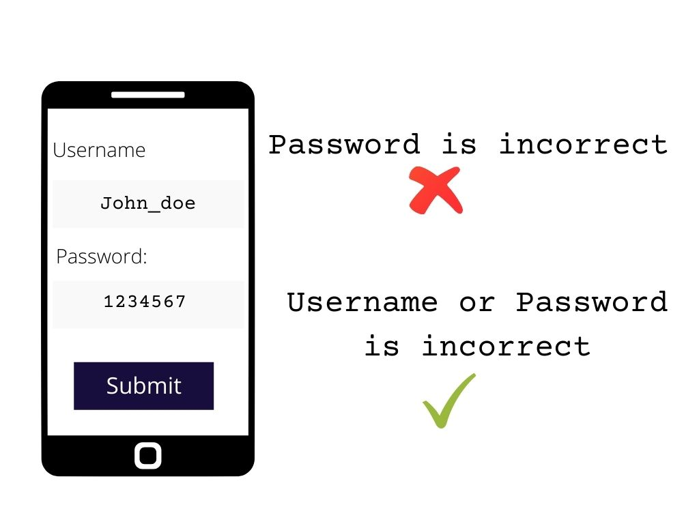
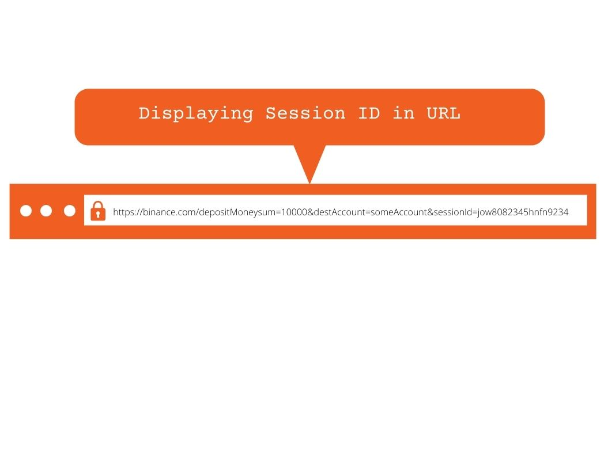

Authentication is the process of confirming a user's or process's identity. When authentication is breached, attackers can gain access to the user's data or information, causing damage to your application. Authentication is one of the ways attackers can gain access to a user's data and your application.

Authentication security is an important aspect of web app development that is often overlooked while creating a product. However, if you intend to submit your application online, it is a top priority. In this article, I'm going to explain some of these mistakes and how to fix them.

When it comes to authentication, there are Ten common flaws to avoid:

1. Displaying Error Messages
2. Integrating Session IDs into a URL
3. Incorrect form validation
4. Low form sanitization
5. Weak password plan
6. Not using a Two-Factor Authentication (2FA)
7. Improper Password Reset
8. Insecure Logout
9. Brute Force Attack
10. Using weak Security Question

## Displaying Specific Error Messages

Displaying a specific error message is very dangerous as it can allow an attacker to guess a person's username or password using an automated trial and error approach.

When authenticating a form on your web application, you must be very careful not to display just one error message when a user types in an incorrect detail for example: "Your password is incorrect". 

In that example, you are displaying a specific error message "Your password is incorrect" This may lead the attacker to believe that the email address or user id is real but the password is incorrect, allowing the attacker to suggest a password for that user. 

Instead of displaying "Incorrect password", display "Incorrect username or password" or "incorrect login details" this will make.

Below is a diagram of “Displaying Generic Error Message”

**How to prevent this flaw**

* Never display a specific error message on the authentication page, this allows the user to know the missing data and suggest the missing data using a brute force attack.
* Always display generic messages like "incorrect login details" instead of displaying a specific message of the login error such as  "incorrect password"

## Integrating Session IDs into a URL

A session ID is a number that is assigned to a single user by a Web site's server for the duration of that user's visit (session)

The chance of an attacker obtaining and abusing a session token if it is placed directly in the URL is increased. Although the risk is lower when utilizing HTTPS to connect to the webserver, there is still a danger. HTTPS URLs are encrypted while in transit, although they are frequently kept in server logs.

Below is a diagram example of “Integrating Session IDs into a URL”

**How to prevent this flaw**

* Validate the session ID on the server-side
* To create the token, make sure you're using a safe enough random generator.
* To remove the Session ID from a URL, use Filter.

## Incorrect form validation.

Injection attacks, memory leaks, and compromised systems can occur if data provided into a form input is not properly checked or formatted. Because a form can be submitted without the user filling out all of the needed information. Validating of form is necessary for your application. It helps in confirming that the information required have been inputted, before submitting it to the server.

**How to prevent this flaw**

* Make sure the email has email address formatting.
* Ensure the user has met the criteria for the form submission before submitting
* Validate the form from the backend and frontend using an updated library or framework

Some of the suggested  libraries for form validation are:

* validator
* just-validate
* Pristine

## Low form Sanitization 

The process of keeping your form input clean, filtered, and sanitized from a malicious agent is known as form sanitization. Sanitizing your input is a must because it prevents injection flaws. A well-sanitized form input can prevent the flowing attack:

* Script Injection 
* XSS
* SQL Injection 

**How to prevent this flaw**

* It's considerably easier and safer to utilize a whitelist for well-defined inputs like numbers, dates, or postcodes. In that manner, you may explicitly state what values are allowed and what values are not.
* Use the predefined whitelisting logic in the built-in data type definitions with HTML5 form validation.

## Weak Password Plan

It's not unusual to come across a website that doesn't have a strong password plan in order. I recently tried an application that required a five-character minimum password length. As developers struggle to strike the right mix between security and usability, this vulnerability is becoming increasingly widespread.

Below is an example of a strong password:

**Strong password:** I@h8te&ch6se

The password above is a very strong password, it has a mixture of symbols, numbers, and text.

**How to prevent this flaw**

* Make your password input require a minimum of eight characters.
* Passwords incorporating usernames or corporate names should be avoided for the sake of security and usability.
* Upper and lowercase letters should be mixed.
* Use a library to calculate the password's strength, be cautious while selecting, and check for minimal dependencies and maintainability.
* When a person has a public profile, use a different display name and avoid using the user's email address as the display name because this invites spam.

## Not using a Two-Factor Authentication

The lack of extra security safeguards is another common vulnerability I see with web authentication mechanisms. Two-factor authentication is rarely used by developers, especially for top accounts. Two-factor authentication helps in adding a second layer of protection to your application.

Two-factor authentication is critical for web security since it eliminates the hazards of compromised credentials right away. When a password is cracked, guessed, or even infected with malware, it is no longer sufficient to grant access to an intruder without approval at the second authentication factor.

Below is a diagram example of “Two-factor authentication”

**How to Implement Two-Factor Authentication**

* There are a variety of ways to use 2FA encryption, RSA tokens, code generators like Google Authenticator and Duo, and SMS text sending of one-time codes are all options for implementing 2FA technology.

## Improper Password Reset

This isn't that often, but now and then I test a web application that has this capability implemented incorrectly. This is frequently due to the password being provided to the end-user through email or the token being used for the reset is weak.

Sending the plaintext password back to the end-user is another issue that affects password resets.

This is terrible for a variety of reasons, one of which is that the password was sent by email, which is considered unsafe. This could mean that the password was stored in the database without sufficient blanching and hashing, or that it was stored in a reversible format like base64.

**How to prevent this flaw**

* Always encrypt user passwords before storing them, do not store them in their raw form.
* Only send transactional emails after validating and verifying email addresses by checking for valid characters and sending a verification link with a token.

## Insecure Logout

This is another vulnerability that can cause great havoc to an application. To avoid session hijacking attempts, it's also critical to provide your users with a safe logout option.

If you're storing the session identifier on the server-side, the logout method should invalidate it and erase the session cookie in the browser. This safeguards against attackers who try to intercept session cookies and use a stolen cookie to re-establish a session.

**How to prevent this flaw**

* When logging out a user ensure to clear the session cookie in the browser, and invalidate the session identifier if you are storing it on the server-side
* During logout, user sessions and authentication tokens should be correctly invalidated.

## Brute Force Attack

Brute Force is a hacking technique used to find out the user credentials by trying various possible credentials. In this attack, hackers try to guess passwords to get past the authentication for a single account. Using scripts that try a large number of regularly used passwords from a dictionary as well as millions of leaked passwords gathered from prior data breaches, these attempts have a better probability of succeeding.

**How to prevent this flaw**

* Limit login attempts to a defined IP address or range by blocking access to the authentication URL.
* Use no terms from dictionaries in any language. Rather than using words, it is preferable to use random character strings.
* Block malicious IP addresses with CAPTCHAS.
* keep track of a user's failed login attempts and lock the account.

## Using weak Security Question

A security question or memorable word can also assist guard against automated attacks. I have encountered security questions that are weak and have predictable responses, which allows an attacker to suggest or guess answers and obtain access to the user's data.

**How to prevent this flaw**

* Do not rely on security questions as the sole mechanism to authenticate a user
* Always use security questions when logging in, and resetting a forgotten password
* Store the answers using a secure hashing algorithm such as Bcrypt

## Why Loginradius is Ideal for Preventing Authentication Flaws

LoginRadius has the world's most secure, dependable, and easy-to-implement user authentication solution. With built-in advanced security capabilities and world-class protection for your application, user accounts, and data. LoginRadius helps enterprises to create a wonderful customer experience.

There are diverse solutions and websites to help you prevent authentication flaws in your application, and Loginradius is one of the best solutions for your application. They offer free authentication solutions to get started. 

## Conclusion

These are the most typical authentication flaws I detect on online application penetration tests, as stated in the blog title. Other vulnerabilities affect web application authentication mechanisms, but in my experience, these are less widespread. Hopefully, this article has highlighted those flaws as well as how to fix them.

