In this tutorial, I’ll talk about adding authentication in a Svelte application using LoginRadius Authentication APIs. You'll understand step by step how to:

- create forms in Svelte;
- add reactivity to it;
- configure routing for our Svelte app; and,
- setup protected routes for authenticated users.

You'll also learn how to consume REST APIs in a Svelte app using Fetch API and update user information in your Svelte store.

## What is Svelte?

[Svelte](https://svelte.dev/) is a lightweight and minimal JavaScript compiler that ships a single JavaScript bundle to your application without any internal code of its own. This results in smaller bundle size and often a faster running application. It was also the [most loved framework of 2021](https://insights.stackoverflow.com/survey/2021#section-most-loved-dreaded-and-wanted-web-frameworks).

But what's the first feature you'd add in a Svelte application? Authentication! It's the gateway for your users to interact and use your website.

So in this post, I’ll talk about how to add authentication in a Svelte application.

## Svelte Project Demo

You'll learn how to create forms in Svelte and add reactivity to it. You'll also understand how to conditionally render different UI components and set up protected routes for authenticated users in a Svelte application.

To speed things up, you won't build your own authentication services from scratch. Instead, you'll use [LoginRadius](https://www.loginradius.com/) to quickly configure an authentication backend for your Svelte App.

Here's a little demo of what your Svelte App would look like by the end of the tutorial:

<video controls width="700" align="center" src="./Svelte-Auth-LoginRadius-Demo.mp4"/> </video>

Looks exciting? Let's jump right into it!

## Setup a Svelte App

Let's start by creating a new Svelte project and adding some boilerplate code.

### Create a New Svelte Project

Navigate into the directory of your choice and create a new Svelte project by running:

```
npx degit sveltejs/template svelte-auth-app
```

That should create a new Svelte project with a simple starter template.

Additionally, you'll need to install [svelte-navigator](https://github.com/mefechoel/svelte-navigator) package to set up routing in your Svelte app:

```
npm i svelte-navigator
```

### Configure Environment Variable Support

You need to add environment variable support in your Svelte app to store and use your LoginRadius API Keys and Secrets.

First, install a package called [dotenv](https://www.npmjs.com/package/dotenv) that let's create and use a special `.env` file to define your environment variables.

```
npm i dotenv
```

Next, head over to the `rollup.config.js` file. Here, make some configurational changes on the `plugins` property, so your Svelte app can read those environment variables on the client-side:

```javascript
	...
	plugins: [
		replace({
			// stringify the object
			__myapp: JSON.stringify({
			  env: {
				isProd: production,
				...config().parsed // attached the .env config
			  }
			}),
		  }),
    ...
	],
```

You can refer to the complete `rollup.config.js` file for this project [here](https://github.com/LoginRadius/engineering-blog-samples/blob/master/Svelte/SvelteAuthApp/rollup.config.js).

### Create Files and Folders

Besides the initial set of files, your project will have the following directory structure:

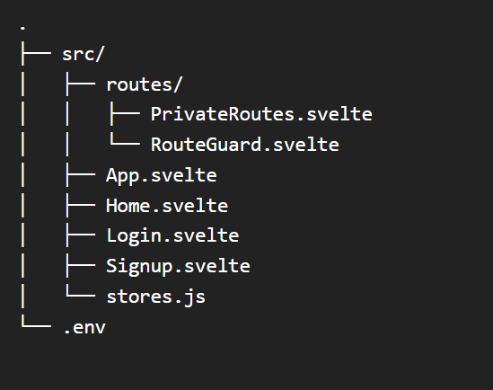

So go ahead and create those files and folders accordingly. I'll talk about each of these as you start filling them with some code.

### Add Project Styles

Your starter template should come with the following styles inside your `App.svelte file`:

```css
main {
  text-align: center;
  padding: 1em;
  max-width: 240px;
  margin: 0 auto;
}

h1 {
  color: #ff3e00;
  text-transform: uppercase;
  font-size: 4em;
  font-weight: 100;
}

@media (min-width: 640px) {
  main {
    max-width: none;
  }
}
```

However, I have also added some additional styles inside the global stylesheet inside the `/public/build/global.css` file. You can copy those styles from [here](https://github.com/LoginRadius/engineering-blog-samples/blob/master/Svelte/SvelteAuthApp/public/global.css).

## Global Data Store for Authenticated User

Your Svelte app will store the authenticated user's data in a global data store to easily access and modify that data from any component within your application. Svelte provides you with the `writable` function inside the `svelte/store` dependency.

Create a global object called `user` inside your `/src/stores.js` file:

```javascript
import { writable } from "svelte/store"

export const user = writable(
  localStorage.user ? JSON.parse(localStorage.getItem("user")) : null
)
```

You have also synced the above `user` object with the browser's local storage so that this data persists on page reloads. If you're unfamiliar with what local storage is, [check out my guide on Local Storage vs. Session Storage vs. Cookies](https://www.loginradius.com/blog/async/guest-post/local-storage-vs-session-storage-vs-cookies/) that dives deeper into browser storage and other related concepts.

## The App Component Boilerplate

The root component in your Svelte app is the App Component. This is located inside `/src/App.svelte`.

It has the following imports declared inside:

```javascript
<script>
  /** IMPORTS */ import Login from './Login.svelte'; import Signup from
  './Signup.svelte'; import Home from './Home.svelte'; import PrivateRoute from
  "./routes/PrivateRoutes.svelte"; /** VARIABLES */ const sdkoptions = {}
</script>
```

It also has an `sdkoptions` variable that will store the environment variables that you can easily pass to different components as and when they need it. You can get rid of any additional HTML inside the `App.svelte` file generated by the starter template.

## The Login Component

Let's head over to the `/src/Login.svelte` file to create the Login Page.

### Create Login Form

Here's what the HTML of your Login Form consists of:

```html
<h3>Login</h3>
<form on:submit|preventDefault="{handleSubmit}">
  <input
    class="form-field"
    bind:value="{email}"
    type="email"
    placeholder="Email"
  />
  <input
    class="form-field"
    bind:value="{password}"
    type="password"
    placeholder="Password"
  />
  <button class="form-field">
    Login
  </button>
</form>
<p>
  Don't have an account?
  <strong class="link" on:click="{navigateToSignup}">Sign up</strong>
</p>
```

You have a login form with two input fields for email and password and a submit button. The form also has an `on:submit` handler with an event modifier to prevent the default reloading action of the form when it gets submitted.

After the form, you have a simple link with an `on:click` handler that allows the user to navigate to the Signup page.

### Login Form Field Bindings and Handlers

Inside the script of your Login component, create two variables — `email` and `password` — to handle the bindings to the input fields. Also, make the `sdkoptions` variable exportable since you'll receive it as `props` from the App component.

```javascript
<script>let email; let password; export let sdkoptions;</script>
```

You also need to create a function called `handleSubmit` that is the `on:submit` handler for your Login form:

```javascript
<script>
	...
    const handleSubmit=(e)=>{
       let loginFields={email,password};
	   console.log(loginFields)
    }
    const navigateToSignup=()=>{}
</script>
```

At the moment, you're simply encapsulating the `email` and `password` bindings into a JavaScript object. Later, you'll send a request to your Login API here. You also have an empty `navigateToSignup` function that I'll come back to once you set up your routes.

Let's render the Login component inside your `App.svelte` file:

```html
<main>
  <Login />
</main>
```

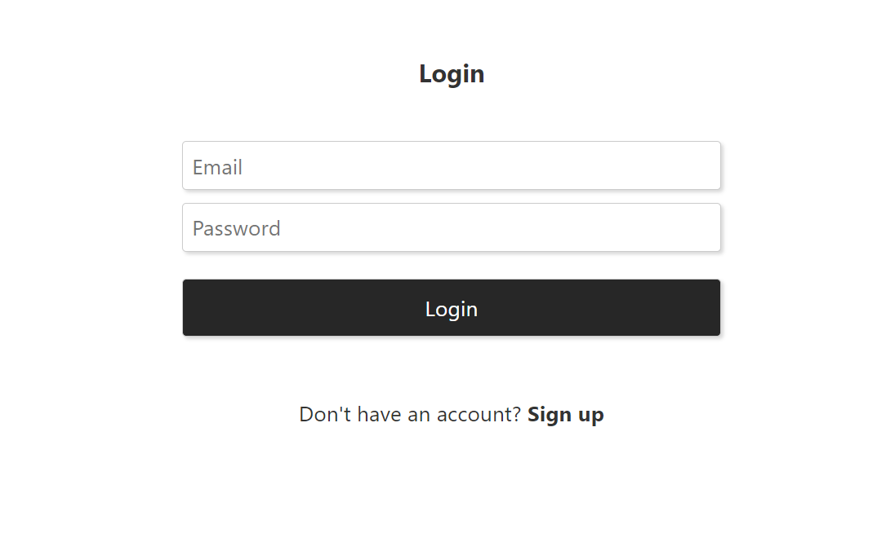

Awesome! Let's follow the same process to create your Signup form.

## The Signup Component

Head over to the `/src/Signup.svelte` file to create your Signup Page.

### Create Signup Form

Similar to the Login Form, the Signup Form will have the following HTML:

```html
<h3>Create a New Account</h3>
<form on:submit|preventDefault="{handleSubmit}">
  <input
    class="form-field"
    bind:value="{firstName}"
    type="text"
    placeholder="First Name"
  />
  <input
    class="form-field"
    bind:value="{lastName}"
    type="text"
    placeholder="Last Name"
  />
  <input
    class="form-field"
    bind:value="{email}"
    type="email"
    placeholder="Email"
  />
  <input
    class="form-field"
    bind:value="{password}"
    type="password"
    placeholder="Password"
  />
  <button class="form-field">
    Signup
  </button>
</form>
<p>
  Already have an account?
  <strong class="link" on:click="{navigateToLogin}">Login</strong>
</p>
```

The only difference is now you have two additional fields — first name and last name. You also have a link just below the signup form that takes the user to the login page.

### Signup Form Field Bindings and Handlers

Here's what the script section of your `Signup.svelte` file should look like:

```javascript
<script>

	let email;
    let password;
    let firstName;
    let lastName;
    let loading;


    export let sdkoptions;

    const handleSubmit=()=>{
        const signupFields={
            "FirstName": firstName,
            "LastName": lastName,
            "Email": [
                {
                "Type": "Primary",
                "Value": email
                }
            ],
            "Password": password
     }
     console.log(signupFields)
   }

   const navigateToLogin=()=>{}
</script>
```

Your `signupFields` object has a specific format because it aligns with the structure of your Signup API's request. It would make complete sense when you hook your Signup API here.

Let's render the Signup component inside your `App.svelte` file:

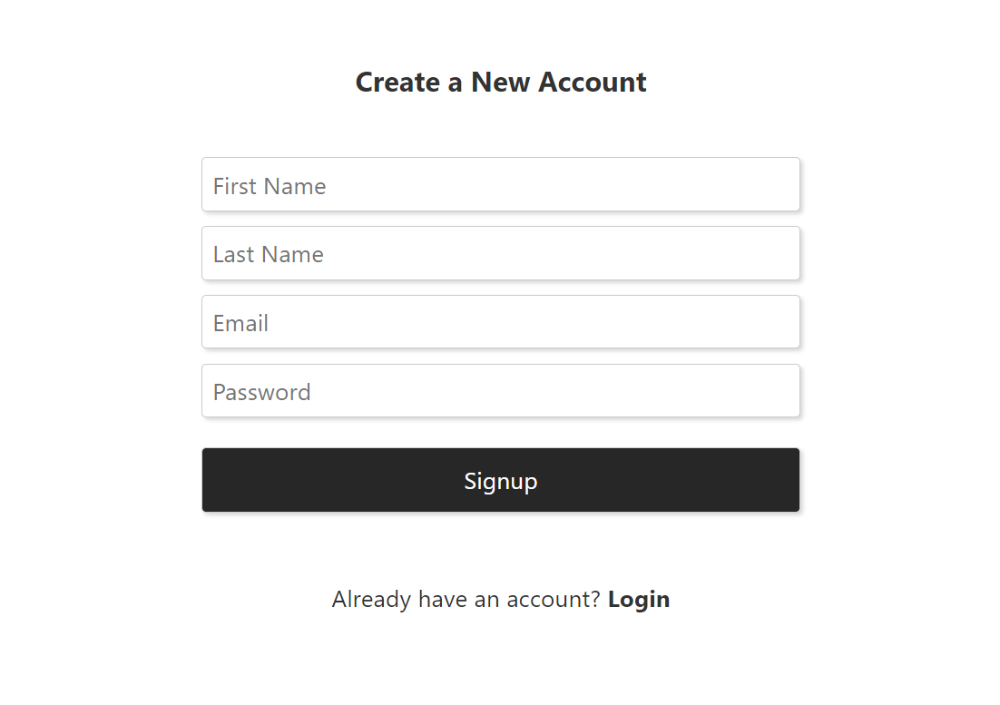

## The Home Component

Let's create your Home component or the page where you'll redirect an user on a successfull login. Inside `/src/Home.svelte` file, add the following HTML:

```html
{#if user && _user}
<h3>Welcome {_user?.profile?.FullName}</h3>
<button on:click="{logout}">Logout</button>
{/if}
```

In the above HTML, you simply use some Svelte conditionals to render the user's name and a logout button. The script part of your Home component looks like this:

```javascript
<script>
    import {user} from './stores';

    let _user;

    user.subscribe(data=>_user=data)
    const logout=()=>{
        user.set(null);
        localStorage.clear();
    }

</script>


```

You import the global `user` object from your Svelte store and store it inside your Home component's state `_user`. For the `logout` function, you simply set this `user` object in your store to null and clear the local storage.

## Setup LoginRadius

The next step is to set up LoginRadius, so you can start using its Authentication APIs from your Svelte App.

### Create LoginRadius Account

Head over to [LoginRadius](https://www.loginradius.com/) and create a new account by filling in the following details:

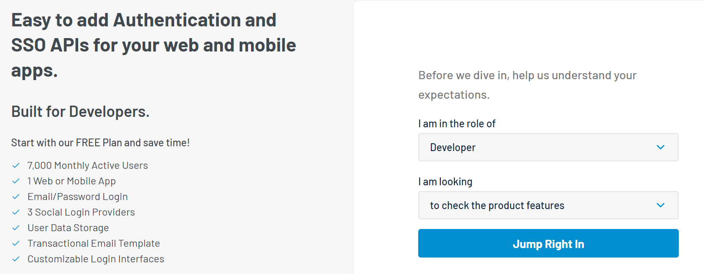

You'll then see a form with the name of your App, a URL, and a Data Center:

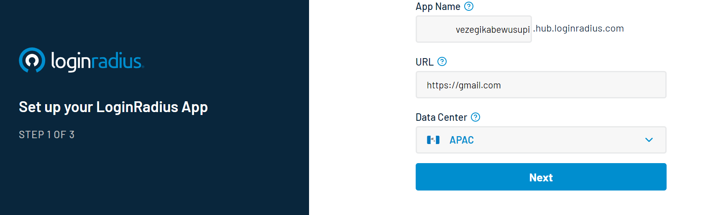

Hit **Next** and LoginRadius will set up an authentication app for you. You can try the pre-built authentication page LoginRadius provides for your app by clicking on **Try Signing Up Now**.

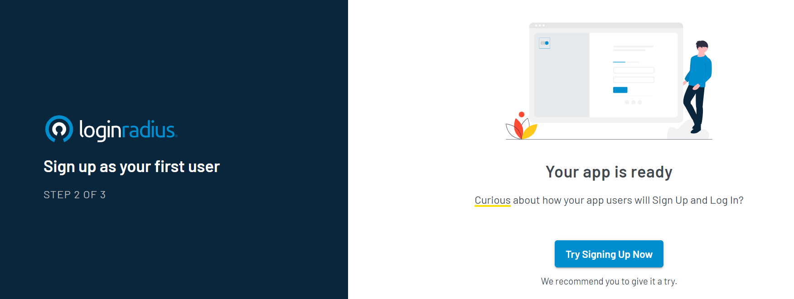

Once you do that, you'll be shown a pre-built authentication page of your LoginRadius app:

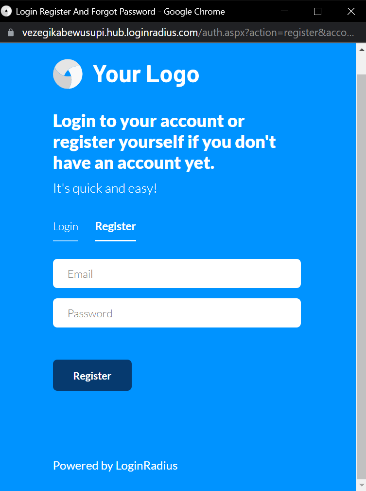

However, for this tutorial, all you need are the LoginRadius APIs since you already have a frontend (your Svelte App) in place.

### Get LoginRadius API Configurations

Once you're inside your LoginRadius account, head over to the **Configurations** tab from your dashboard. Then expand the **API Credentials** tab of your application.

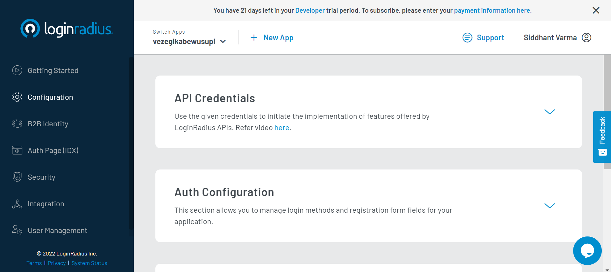

Inside that, you should see your APP Name, API Key, and API Secret.

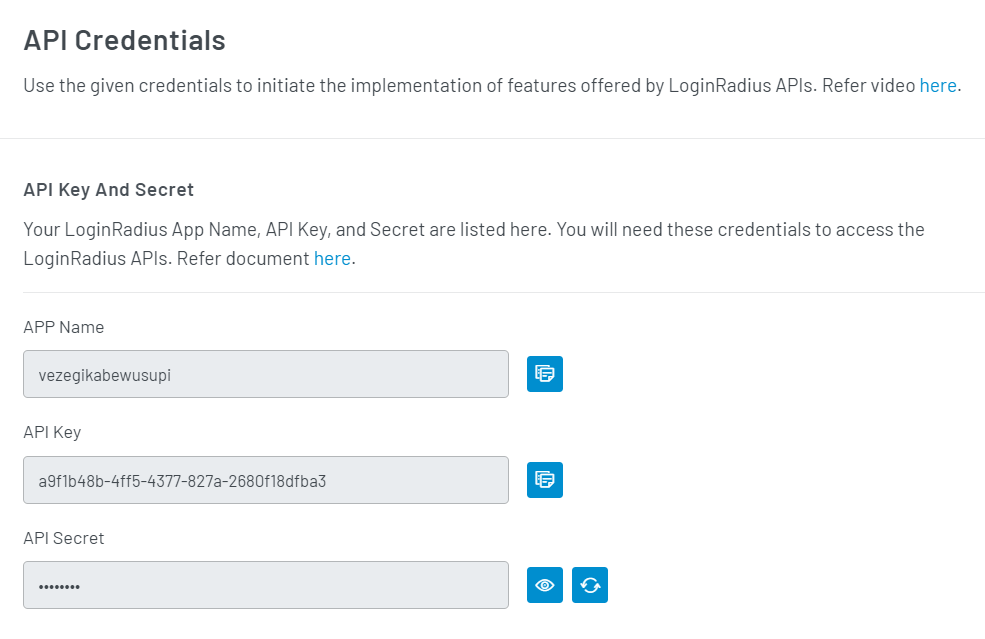

### Add API Credentials as Environment Variables

Head back to the Svelte App's `.env` file and add the above credentials inside it:

```
APP_NAME=<YOUR_APP_NAME>
API_CLIENT_KEY= <YOUR_APP_API_KEY>
API_SECRET= <YOUR_APP_API_SECRET>

```

You'll need to ensure that the above `.env` file is present inside the `.gitignore` of your Svelte project. You don't want to accidentally push this file to a public repository on Github.

```
/node_modules/
/public/build/

.DS_Store

.env
```

### Consume Environment Variables in Svelte Components

Finally, you need to extract these environment variables in your `sdkoptions` variables inside your App component file.

```javascript
...
	const sdkoptions = {
	"apiKey": __myapp["env"].API_CLIENT_KEY,
	"appName":__myapp["env"].APP_NAME,
    "apiSecret":__myapp["env"].API_SECRET
	}
...
```

And pass this variable as props to both the Login and Signup component:

```html
...
<Login {sdkoptions} />
<Signup {sdkoptions} />
...
```

Great! Now you're ready to integrate LoginRadius APIs in your Svelte app.

## Integrate LoginRadius API

You'll use two APIs — one for registering the user on the Signup page and the other for authenticating the user on the Login Page. However, both APIs will take the API key and API secret as query parameters.

```javascript
const endpoint = `${BASE_URL}?apikey=${sdkoptions.apiKey}&apisecret=${sdkoptions.apiSecret}`
```

So in the above endpoint, you'll only change the `BASE_URL` according to which API you're hitting.

### Integrate Signup API

Inside your `Signup.svelte` file, you'll create a variable called `signupResponse` to store the result of the Signup API. It also has properties like `success` and `error` to prompt the user on the status of your API calls.

```javascript
<script>
    let signupResponse={
            success:null,
            error:null,
            uid:null,
            id:null,
            fullname:null
     }
 	let loading;

</script>
```

Since an API request is an asynchronous process, you also have a' loading' variable to disable the submit button until the API responds.

#### Signup API Request on Signup Form Submission

You need to send a request to the Signup API inside your `handleSubmit()` function. First, set the `loading` to true and reset the `signupResponse` object. Then, use the fetch API to make a POST request with the `signupFields` object as post parameter:

```javascript
const handleSubmit = () => {
  const signupFields = {
    FirstName: firstName,
    LastName: lastName,
    Email: [
      {
        Type: "Primary",
        Value: email,
      },
    ],
    Password: password,
  }
  loading = true
  signupResponse = {
    success: null,
    error: null,
    uid: null,
    id: null,
    fullname: null,
  }
  const endpoint = `https://api.loginradius.com/identity/v2/manage/account?apikey=${sdkoptions.apiKey}&apisecret=${sdkoptions.apiSecret}`
  fetch(endpoint, {
    method: "POST",
    headers: {
      "Content-Type": "application/json",
    },
    body: JSON.stringify(signupFields),
  })
    .then(response => response.json())
    .then(data => {})
    .catch(error => console.log(error))
    .finally(() => (loading = false))
}
```

#### Handle API Response

Inside the callback of your fetch request, you can handle any errors returned by the API based on different error codes. In case of success, you'll populate your `signupResponse` object with data from the API. In the `finally` block, set the `loading` to false.

```javascript
...
.then(data=>{
          if(data.ErrorCode){
              if(data.ErrorCode==936){
              signupResponse={
                    ...signupResponse,
                    error:data.Message
                }
             }
            else if(data.ErrorCode==1134){
                signupResponse={
                    ...signupResponse,
                    error:data.Errors[0].ErrorMessage
                }
            }else{
                signupResponse={
                    ...signupResponse,
                    error:data.Description
                }
            }
        }else{
            signupResponse={
                ...signupResponse,
                success:"Account created successfully! Please login via the same details.",
                fullname:data.FullName,
                id:data.id,
                uid:data.Uid
            }
        }
      })
...
```

#### Disable Submit Button

You can set the disabled attribute on your Submit button based on the loading state of the API.

```html
...
<button disabled="{loading}" class="form-field">
  Signup
</button>
...
```

#### Show Signup Success and Error

Lastly, render a conditional template based on the status of your Signup API.

```html
... {#if signupResponse.error}
<p class="error">Error ❌ {signupResponse.error}</p>
{/if} {#if signupResponse.success}
<p class="success">
  Success ✔ {signupResponse.success}
</p>
{/if} ...
```

And that's it! Let's give your Signup functionality a whirl. Create a new account first:

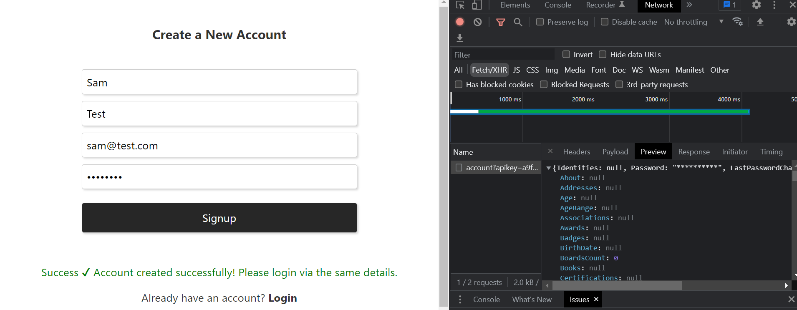

And voila! You can see in the network tab that the API is successful. And you got back a bunch of data about the newly created user. You also have a success that appears underneath the Signup form.

Let's also test an erroneous flow. What if you signup via the same credentials again?

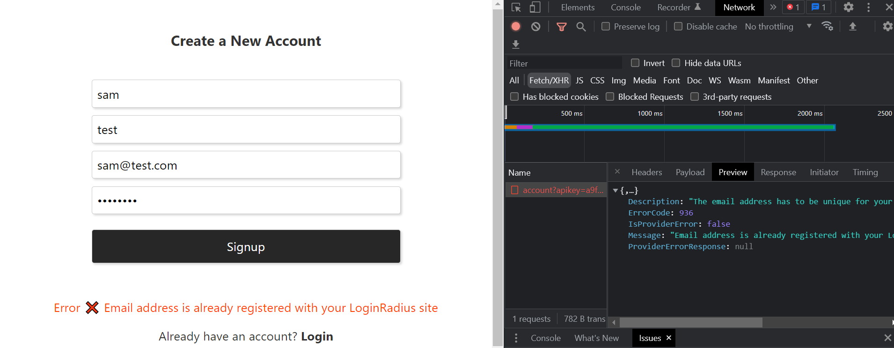

The LoginRadius Signup API returns the error message, details, error code, etc., that you've handled accordingly.

Also, if you use a simple password, the LoginRadius API returns an error based on a validation mechanism.

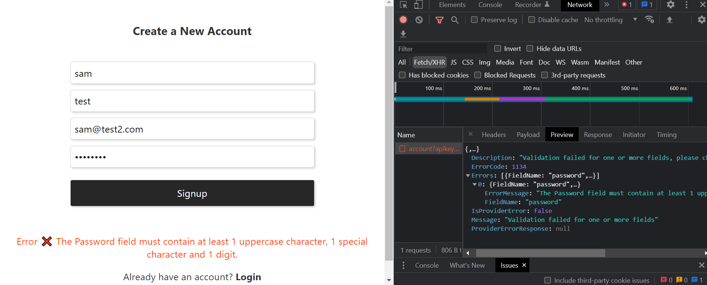

That's great because it makes your authentication workflow more air-tight.

### Integrate Login API

Similarly, you can now integrate the Login API as well in your `Login.svelte` file:

```javascript
<script>

	...
    import {user} from './stores';

    let email;
    let password;
    let loading;

    let loginResponse={
        error:null,
        success:null,
        profile:null,
        auth_token:null
    }

    export let sdkoptions;

    const handleSubmit=(e)=>{
       let loginFields={email,password};
       loading=true;
        loginResponse={
        error:null,
        success:null,
        profile:null,
        auth_token:null
    }
       const endpoint=`https://api.loginradius.com/identity/v2/auth/login?apikey=${sdkoptions.apiKey}&apisecret=${sdkoptions.apiSecret}`;
       loading=true;
    fetch(endpoint,
        {
        method:'POST',
        headers: {
        'Content-Type': 'application/json'
        },
        body:JSON.stringify(loginFields)
        }).then(response=>response.json())
        .then(data=>{
            console.log(data)
            if(data.ErrorCode){
                if(data.ErrorCode==936){
                loginResponse={
                        ...loginResponse,
                        error:data.Message
                    }
                }
                else if(data.ErrorCode==1134){
                    loginResponse={
                        ...loginResponse,
                        error:data.Errors[0].ErrorMessage
                    }
                }else{
                    loginResponse={
                        ...loginResponse,
                        error:data.Description
                    }
                }
            }else{
                loginResponse={
                    ...loginResponse,
                    success:true,
                    profile:data.Profile,
                    auth_token:{
                        access_token:data.access_token,
                        refresh_token:data.refresh_token,
                        ttl:data.expires_in
                    }
                }
                user.set(loginResponse)
                localStorage.setItem('user',JSON.stringify(loginResponse))

            }
        })
        .catch(error=>console.log(error))
        .finally(()=>loading=false);
    }
    ...

</script>

...
{#if loginResponse.error}
	<p class="error">Error ❌ {loginResponse.error}</p>
{/if}
{#if loginResponse.success}
	<p class="success">
        Success ✔
    </p>
{/if}
<p>
    Don't have an account?
    <strong class="link" on:click={navigateToSignup}>Sign up</strong>
</p>

```

If you relate it to the Signup component, it's almost identical. The only thing that has changed is the API endpoint. Additionally, if the Login API is a success, you're also storing the data in your `user` store and consequently updating your `localStorage`.

Let's also test this out:

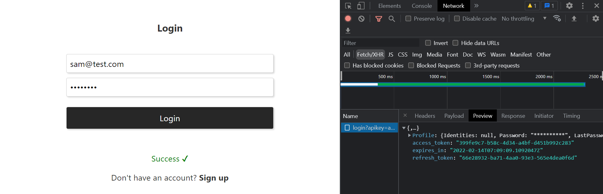

Let's also test an erroneous Login flow by entering the credentials for a user that doesn't exist:

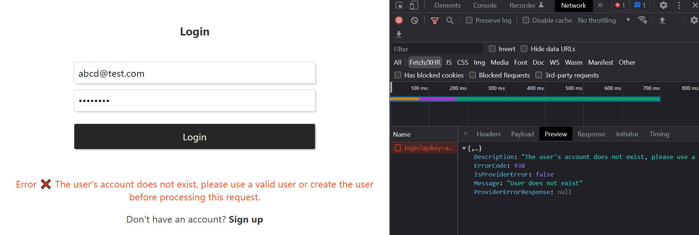

Great! Let's now tie all these individual pages together by setting up routing in your Svelte app.

## Setup Routes

You'll use the `svelte-navigator` package that you previously installed to configure routing in your app.

### Add Routing

First, you'll define the routes for the Signup, Login, and Home pages inside your `App.svelte` file:

```html
<script>

  /** IMPORTS */
  import { Router, Route } from "svelte-navigator";
  ...
</script>

<main>
  <Router>
    <div>
      <Route path="signup">
        <Signup {sdkoptions} />
      </Route>
      <Route path="login">
        <Login {sdkoptions} />
      </Route>
      <Route path="/">
        <Home />
      </Route>
    </div>
  </Router>
</main>
```

If you visit `/login`, you should see the Login Page. Similarly, if you go to `/signup`, you should see the Signup Page.

### Programmatic Redirection

Remember, you had a link to the Signup page at the bottom of the Login page and vice versa?

Also, your login page doesn't redirect anywhere after you login successfully. In order to programmatically navigate to a specific page on completion of an action, you can use the `useNavigate` hook from the `svelte-navigator` library.

To use this hook, import `useNavigate` and save its invoked reference inside a variable, as follows:

```javascript
<script>
  import {useNavigate} from "svelte-navigator"; const navigate = useNavigate();
  ...
</script>
```

Now call the `navigate()` function and pass the path of the page you wish to redirect to. So let's complete the `navigateToLogin` function inside your Signup component:

```javascript
<script>... const navigateToLogin=()=>navigate('/login'); ...</script>
```

Similarly, you can also complete the `navigateToSignup` function inside your Login component:

```javascript
<script>... const navigateToSignup=()=>navigate('/signup') ...</script>
```

Finally, you'll also navigate to the Home page on a successful response from your Login API inside your Login component's `handleSubmit` function:

```javascript
 const handleSubmit=(e)=>{
       ...
    fetch(endpoint,
       ...
        .then(data=>{
 				...
            }else{
				...
                navigate('/')
            }
        })
       ...
    }

</script>
```

Great! You can now navigate from your Login page to the Signup page and vice versa. You should also be automatically redirected to the Home page on a successful login.

### Add Protected/Private Routes

If you try to visit the Home component by entering the path `/` in the URL, you'll be able to see the Home page regardless of your authenticated state. However, you must protect this route so that it's only accessible to authenticated users in your application.

For this purpose, you have created a `RouteGuard.svelte` file inside your `routes` folder. It's a higher-order component that uses the `useNavigation` hook to programmatically redirect to the login page if an unauthenticated user visits the home page. You use the `user` object from your Svelte store to validate the authenticated state of a user.

```javascript
<script>
    import { useNavigate, useLocation } from "svelte-navigator";
    import { user } from "../stores";

    const navigate = useNavigate();
    const location = useLocation();

    $: if (!$user) {
      navigate("/login", {
        state: { from: $location.pathname },
        replace: true,
      });
    }
  </script>

  {#if $user}
    <slot />
  {/if}
```

You can then wrap another higher order Route component on top of the `RouteGuard` component inside the `PrivateRoutes.svelte` file, as follows:

```javascript
<script>
    import { Route } from "svelte-navigator";
    import RouteGuard from "./RouteGuard.svelte";

    export let path;
  </script>

  <Route {path} let:params let:location let:navigate>
    <RouteGuard>
      <slot {params} {location} {navigate} />
    </RouteGuard>
  </Route>
```

Now, all you need to do is use this `PrivateRoute` component to wrap your Home component instead of a regular Route component:

```javascript
...
	<PrivateRoute path="/" let:location>
		<Home />
	</PrivateRoute>
...
```

And now you should be able to access the `/` route or the Home page only when you're authenticated:

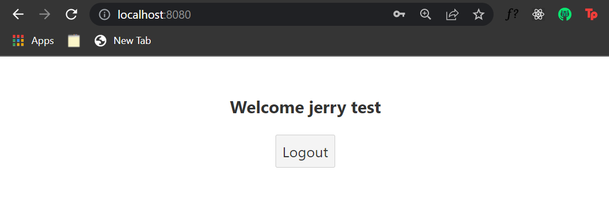

## Conclusion

I hope I've shed some light on how to authenticate Svelte apps. You can do a lot from here, like adding [Svelte Kit](https://kit.svelte.dev/) to this project to simplify the routing system for your Svelte application.

You can [refer to the entire source code for this tutorial here](https://github.com/LoginRadius/engineering-blog-samples/tree/master/Svelte/SvelteAuthApp).

You can also explore [LoginRadius](https://www.loginradius.com/) to add forgot password functionality or social signups with Facebook and Google.
