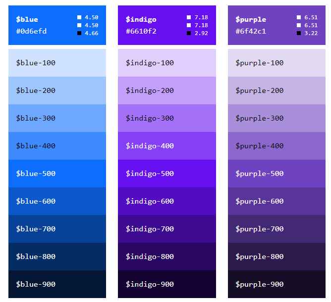
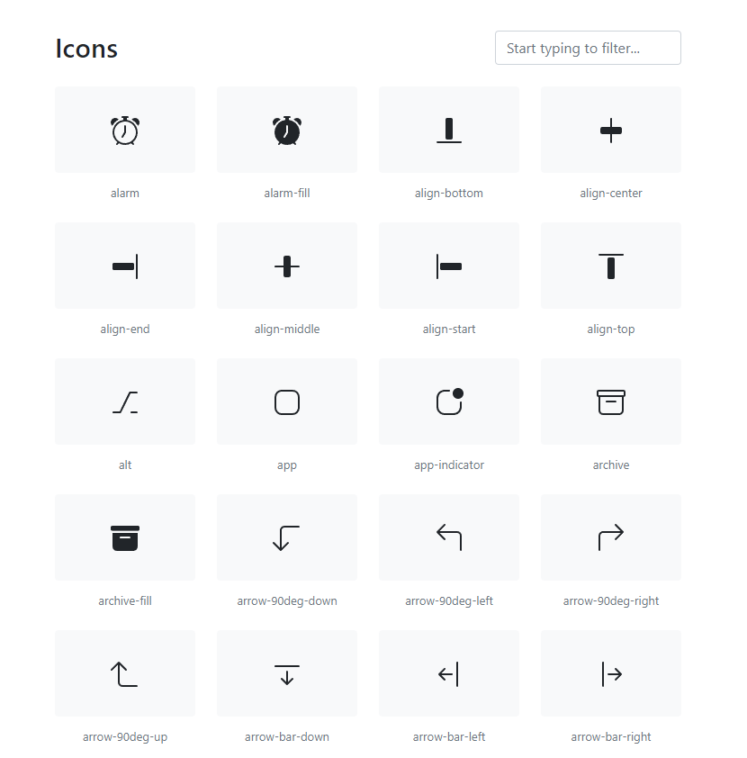
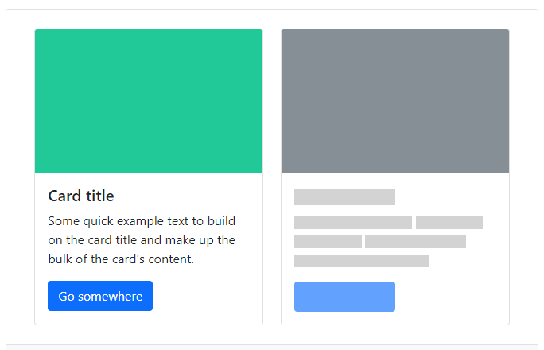
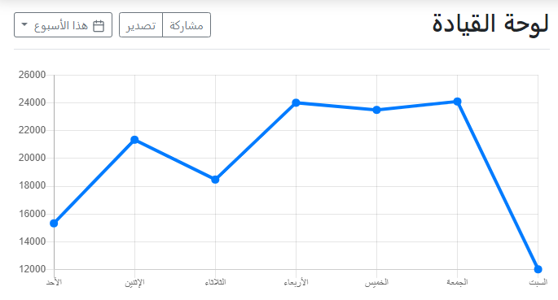
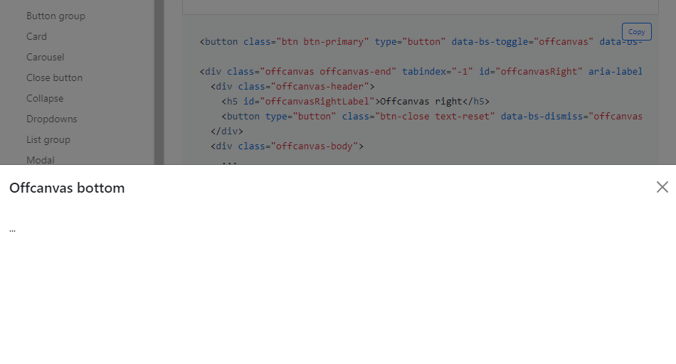

# Introduction

Bootstrap is an open-source tool collection for creating responsive web pages and web apps. It is the combination of HTML, CSS, and JavaScript framework that makes it easy to develop responsive, mobile-first websites. It mainly aims to resolve the cross-browser compatibility issue. Bootstrap is at the core of every website that is perfect for all sizes of screens and looks perfect in every modern browser.

# Getting Started with Bootstrap

In order to start using bootstrap in our web pages, we need to add a few CSS and JS tags in our template file. Here is where you can add those and those are those.

```js
CSS Link tag

<link rel="stylesheet" href="https://maxcdn.bootstrapcdn.com/bootstrap/4.0.0/css/bootstrap.min.css" integrity="sha384-Gn5384xqQ1aoWXA+058RXPxPg6fy4IWvTNh0E263XmFcJlSAwiGgFAW/dAiS6JXm" crossorigin="anonymous">
```

```js
JS Link tag

<script src="https://code.jquery.com/jquery-3.2.1.slim.min.js" integrity="sha384-KJ3o2DKtIkvYIK3UENzmM7KCkRr/rE9/Qpg6aAZGJwFDMVNA/GpGFF93hXpG5KkN" crossorigin="anonymous"></script>

<script src="https://cdnjs.cloudflare.com/ajax/libs/popper.js/1.12.9/umd/popper.min.js" integrity="sha384-ApNbgh9B+Y1QKtv3Rn7W3mgPxhU9K/ScQsAP7hUibX39j7fakFPskvXusvfa0b4Q" crossorigin="anonymous"></script>

<script src="https://maxcdn.bootstrapcdn.com/bootstrap/4.0.0/js/bootstrap.min.js" integrity="sha384-JZR6Spejh4U02d8jOt6vLEHfe/JQGiRRSQQxSfFWpi1MquVdAyjUar5+76PVCmYl" crossorigin="anonymous"></script>
```
 
> **NOTE:**  Always add the `jquery` script first, followed by the `popper` and `bootstrap` scripts. Then you can add any of your custom scripts below them.


# Bootstrap Versions

The developers have been working continuously to enrich the developer experience while using Bootstrap to customize the web pages quite easily and have released many minor and major versions. But the major releases that are the most popular are the `Bootstrap v4.x` and `Bootstrap v5.x`. Now let's take a look at what all v4.x offered and how those evolved with the v5.x release with additional features.

## Bootstrap v4.x

Bootstrap 4 was launched back in January 2018 and it was a great improvement over the existing previous versions. However, the most loved features included the following.

- ### **Flexbox Grid**

    Flexbox grids gave the power to web developers to align the columns with ease. Now one could easily position the columns at any part of the view simply by using some classes like `justify-content-center` or `align-items-end` and so on. One can also change the direction of rows which makes the vertical layouts much easier to implement and maintains the responsiveness at the same time.

- ### **Grid Tiers**

    Bootstrap 3 had only 4 tiers but with Bootstrap 4 provided improvements to those providing new device width to enhance the support from phablets to smaller devices. The new grid tiers specified the following device-widths.

    - **sm**: 576px and up
    - **md**: 768px and up
    - **lg**: 992px and up
    - **xl**: 1200px and up

- ### **Syntactically Awesome Style Sheets (SASS)**

    Bootstrap 4 added the support for SASS style sheets which is a widely-used and very popular CSS preprocessor. A SASS style sheet allows better control and customization and enables us to define how we exactly want to use Bootstrap.

- ### **Cards**

    We no longer need to design multiple single elements and combine those to provide a card view to the users. With the introduction of Cards component, we can directly use this component and further customize it using new available bootstrap classes to redefine the look and feel of card structures like profile cards or information tiles. Card component also doesn't have a fixed width and dissolves into the container it is placed into.

- ### **Spacing Utilities**

    Spacing utilities make our lives easier by providing ready-made utility margin and padding classes that we can simply apply to each visual component. The margin classes are like `mt-2` or `mx-2` and the padding classes goes like `pt-2` or `px-2`, where **m** stands for margin, **p** stands for padding and the **t** for top or **x** for both left and right side and the number says the amount we need.


## Bootstrap v5.x

   Bootstrap 5 came into play back in May 2021. This release was launched after several iterations of alpha and beta releases and hence had a stack of major additions and new features. Some of the most talked features are listed below.

   - ### **Enhanced Grid System**
   - ### **Enhanced Form elements**
   - ### **Utilities API**
   - ### **Support for IE**
   - ### **Extended Colors**
   - ### **Bootstrap Icons**


   So, now let's dive into its features by comparing how things changed in Bootstrap 5 and added better design perspectives for the developers.

## Bootstrap 5 vs Bootstrap 4

In the above section we talked about the features of both Bootstrap 4 and Bootstrap 5. In this section, we will talk about the upgrades that Bootstrap 5 provides over Bootstrap 4.

### **Enhanced Grid System**

The grid system is retained in Bootstrap 5. However, an extra grid tier `xxl` has been introduced to minimize the effort to make the pages responsive on higher resolution displays.

Columns don't have a default `relative` position in Bootstrap 5.

Classes have been added to address the `vertical spacing`.

### **Enhanced Form elements**

The form elements in Bootstrap 4 were defaulted to the browser provided view. However, in Bootstrap 5 the form elements have  custom design that enables them to have a consistent look and feel on all browsers.

The new form controls are based on completely semantic, standard form controls. This helps the developers to avoid adding extra markups for form controls.

### **Utilities API**

Unlike Bootstrap 4, Bootstrap 5 enables the developers to modify and create their own utilities.

One can simply use `sass` to create their own utilities.

The `state` option can be used to generate dummy class variations like `hover` and `focus`.

```js
$utilities: (
  "opacity": (
    property: opacity,
    class: opacity,
    state: hover,
    values: (
      0: 0,
      25: .25,
      50: .5,
      75: .75,
      100: 1,
    )
  )
);
```
### **Support for IE**

Bootstrap 5 no longer supports Internet Explorer 10 and 11 like its predecessor Bootstrap 4.

### **Extended Colors**

Bootstrap 4 had limited color options . But Bootstrap 5 has included many new color options to its color palette and this enables to choose from the various shades available. You can find some of the color shades below.




### **Bootstrap Icons**

Bootstrap 4 didn't have a SVG icon library. We had to use other 3rd-Party libraries like `Font Awesome` to use icons in our applications. But Bootstrap 5 has taken care of this issue by introducing its own SVG library with 1000+ icons.

It also includes a web font version in the stable version release of the icon library.




### **Site Generation Strategy**

Bootstrap 5 has moved to `Hugo` for its static site generation over `Jekyll`. Hugo is a fast static site generator which is implemented in `Go` and is quite popular in the industry. You can learn more about [Hugo](https://gohugo.io/) here.

### **Popper JS Update**

Bootstrap 5 update brings in an update for Popper JS as well, the `Popper JS v2`. Popper JS generally helps to design the tooltips and popovers. With v2, the following changes come in.

- `fallbackPlacement` option becomes `fallbackPlacements`

- `offset` option is no longer available. However, we can use the `popperConfig` parameter to achieve this.

### **Placeholder Components**

Bootstrap 5 allows to use loading placeholders in our pages. This means that we can utilize the space of the components by showing placeholders in their place while they are still loading the actual content.



### **Floating Labels**

Bootstrap 5 adds support for floating labels in forms for the input fields. We can simply use the `form-floating` class to enable floating label. When we enter some value into the input fields, they automatically adjust their position to their floated area.


### **RTL support**

Bootstrap 5 has added support for RTL (Right-to-Left) which means we can develop content that needs writing from the right side of the page and continues to the left. As a result, websites in languages like Arabic, Sindhi, Urdu, etc can easily be developed.



### **jQuery Deprecation**

Bootstrap used jQuery from the very beginning as a dependency to offer dynamic features. With Bootstrap 5, jQuery is dropped and `Vanilla JS` is introduced as its replacement.

> **NOTE:**  There is still JS dependencies that depend on Popper and Vanilla JS module. However, jQuery is optional and can be added based on the requirement of the project.

### **Other Significant Changes**

- Bootstrap 5 introduces new data attribute naming structure. `data-*` attribute has been renamed to `data-bs-*`.

- Bootstrap 5 now provides easier customizations on the v4 theming pages and provides code snippets to build using Bootstrap's Sass files.

- Bootstrap 5 has added a new `accordion` component which includes icons that have a state and can be clicked. The `accordion-flush` class can be used to remove the default background color, borders or corners to possibly render accordions edge-to-edge with the parent element.

- Bootstrap 5 documentation site is now enhanced to improve the user readability and new examples have been added with the code snippets.

- The `inline-block` property is removed in Bootstrap 5 and the `dropdown-menu-dark` class now loads with a default black dropdown.

- The support for `jumbotron` has been terminated in Bootstrap 5.

- With the use of vertical classes in Bootstrap 5, the columns can longer be positioned `relative`.

- Gutters can now be applied using `g*` class instead of `gutter`. The font size is now set to `rem` instead of `px`.

- Lastly, Bootstrap 5 also adds a new `offcanvas` component that enables the developers to create hidden view panes that would pop out when we interact with component tied to it for e.g., side navigation bars, shopping carts, etc. Here is an example of bottom `offcanvas` component.



## Summary

Bootstrap 4 used to do great job in providing all the flexibility and responsiveness while designing the web pages. However, Bootstrap 5 adds several new aspects that help to reduce the effort to do the same. But still we need to keep certain parameters in mind before choosing either of these two.

If you have an existing project that needs to support IE 10 and 11 or depends on jQuery, then you should probably stick to using Bootstrap 4. Bootstrap 5 can be overwhelming but might break your project structure if not migrated properly.

But if you are starting a new project and wants to provide a more immersive UI to the users, then definitely opt for Bootstrap 5 to be able to use its modern components which were discussed above.

This is all for this blog post at the moment. I hope all of you had a great time reading this and got to learn something new. Do let me know in the comments if you liked the content.


> **NOTE:**  All the images used in this blog post are taken from the official [Bootstrap](https://getbootstrap.com/) website and are used here for reference purposes only.
