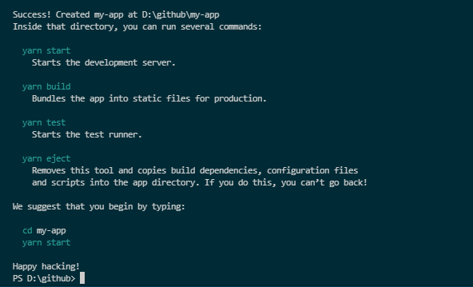
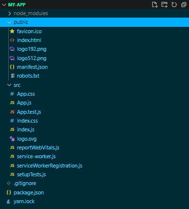
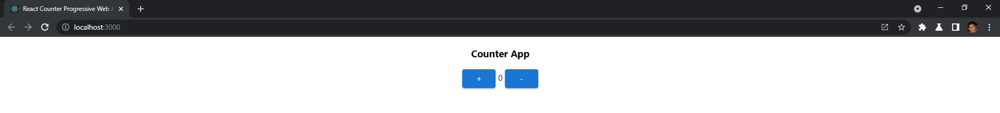
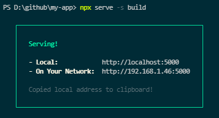
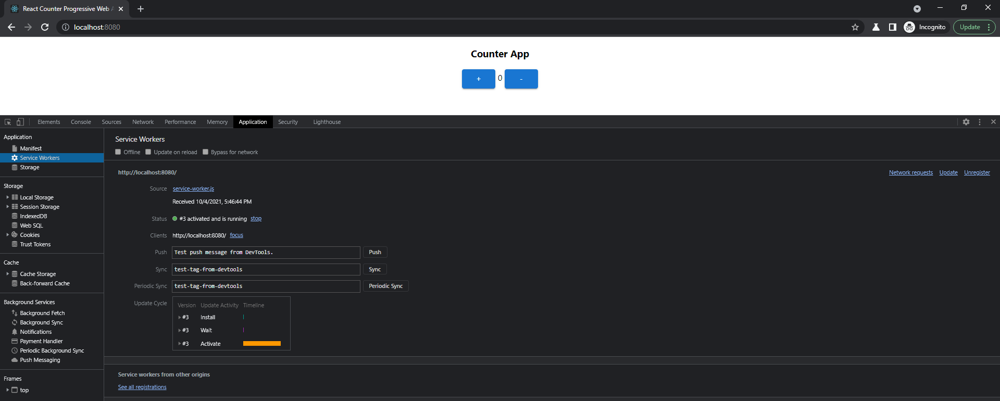
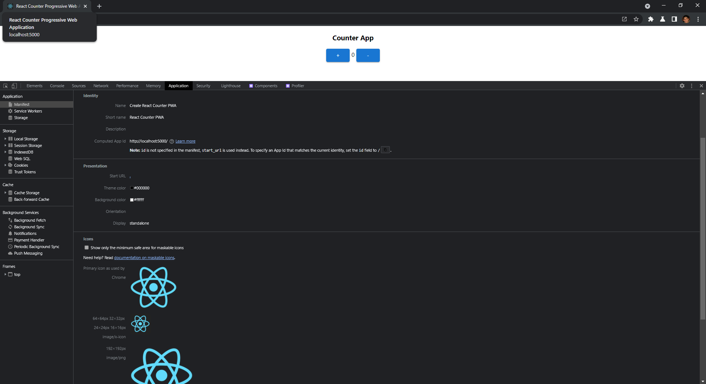
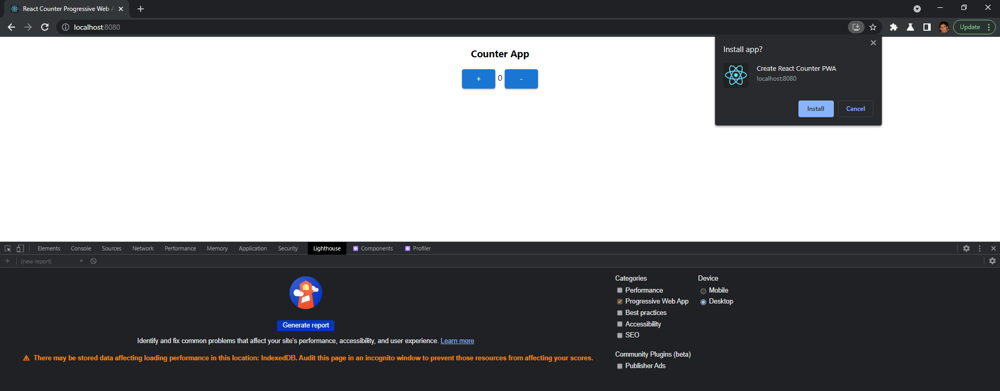

Progressive Web Apps (or "PWA"s) are more dynamic web applications with the ability to view standalone. With many benefits such as performance, working with or without internet connection, platform-specific, and even installable! 

In this article we're going to show you how you could get started in building a PWA using React. With React being a highly popular web-framework, we'll start by by going over the setup, development process and spinning it up to see how it looks. For this example we will be creating a simple Counter Page which simply adds or subtracts a number based on button controls.

Before we can begin coding we will need to set up our project. Let's start by ensuring you can use React, (if you already have been coding in React, you can probably skip this section!). With any development using web frameworks such as Angular, React or Vue, using NodeJS is needed, especially if you wish to use libraries and packages to assist in developing your project. A popular utility in using such packages and libraries is the Node Package Manager or simply referred to as "npm". This utility allows us to install/uninstall packages, start our React application build using webpack, and many more features. For our needs, we can also take advantage of npm to create a React application with a PWA template, which can allow us to begin coding right away. Whenever you may start to build a React app, you can use templates offered by Facebook using the 'create-react-app' command with npm. Let's build the PWA starter app by running the following command:

```powershell
npx create-react-app name-of-our-PWA-app --template cra-template-pwa
```
To explain the command above, it can be broken down to this structure:

- npx = every npm command needs to start with npm (or essentially with whatever node package manager you have installed, but for us we're using 'npx' which comes with npm version 5.2.0) and this will help us run npm packages and takes care of many [features](https://nodejs.dev/learn/the-npx-nodejs-package-runner)
- create-react-app = this command initiates the popular Create React App utility that helps you to build the starter react project
- name-of-our-PWA-app = this is a filler title to your application, name the app to whatever you would like (I've used the default 'my-app' name for mine)
- —template = this is a argument, when you have a argument you essentially enabling an option in the same command, for us we want to specify a specific template for our starter react application
- cra-template-pwa = the name of the PWA template for our PWA react application

Hitting 'Enter' after this command should initiate the build our our starter PWA React application, you should see a stream of prompts in your command line interface. It may take a few minutes, but if you are able to see this screen after the command, you have the project!



Hitting 'Enter' after this command should initiate the build our our starter PWA React application, you should see a stream of prompts in your command line interface. It may take a few minutes, but if you are able to see this screen after the command, you have the project!



Here we can see the following folder structure of our application so far, there are a few files that garner our attention when it comes to PWA's:

- service-worker.js
- serviceWorkerRegistration.js
- manifest.json

**service-worker.js**: This is a script that will run in the background once our application is running. The service worker makes sure that we can use our React application offline and handle multiple requests for the UI. ([learn more](https://developers.google.com/web/fundamentals/primers/service-workers?hl=en))

**manifest.json**: This is basically a configuration file that lists different properties we can customize specifically for progressive web applications. It can be noted it can determine such things as icons, names, and colors to use when the application is displayed.

**serviceWorkerRegistration.js**: This file will do the job of telling whether or not our service worker was successfully registered. If you look into the file, you will notice multiple console logs that will be displayed depending on the status of the service worker once you deploy your application.

For our project, we're going to be building a simple Counter component, similar (if not exactly the same) to the example provided in the React docs: [https://reactjs.org/docs/hooks-state.html](https://reactjs.org/docs/hooks-state.html)

Let's start by creating a Counter component, I'll name mine Counter.jsx and place it in a "components" folder.

To speed things up, you can copy/paste the following code to your specific files, I've went ahead and built out a simple page and some generic stylings for the component.

*Note: I'm using Material UI's Button components, you don't need to and can substitute the Button component with:

```jsx
<button onClick={increment}>+</button>
```

To use Material UI, run the following npm commands:

```powershell
npm install @mui/material
npm install @emotion/react @emotion/styled //these are additional dependencies for me to get Material UI working with the Counter component
```

```jsx
//Counter.jsx
import React, { useState } from 'react';
import Button from '@mui/material/Button';

function Counter(props) {
    let [count, setCount] = useState(0)

    function increment() {
        setCount(count + 1);
    }

    function decrement() {
        setCount(count - 1);
    }

    return(
        <div style={{textAlign: 'center'}}>
            <h3>Counter App</h3>
            <div>
                <Button variant="contained" onClick={increment}>+</Button>
                <span> {count} </span>
                <Button variant="contained" onClick={decrement}>-</Button>
            </div>
        </div>
    );
};

export default Counter;
```

In your command-prompt, entering 'npm start' can spin up our application to a specific [localhost](http://localhost) url. We can start to see what work we've done so far.

With these simple components, let's try to spin this application up and ensure it is working. Enter the command:

```powershell
npm start
```

This will start the application at a set [localhost](http://localhost) URL, once the dev server is working and live on the command prompt, go to the URL to view the application. You should see something similar to this:



Now it is all good and dandy to have the app live and working, but we're more interested in the PWA aspect.

Focusing our attention back to the index.js file. Make the following change:

```jsx
// If you want your app to work offline and load faster, you can change
// unregister() to register() below. Note this comes with some pitfalls.
// Learn more about service workers: https://cra.link/PWA
serviceWorkerRegistration.register(); //change the service worker registration from 'unregistered' to 'registered'
```

Essentially changing the service worker from unregistered to registered will allow us to utilize the app even when its offline, a key benefit when it comes to PWAs. Check Google's explanation on this topic for more information: [https://developers.google.com/web/fundamentals/primers/service-workers/registration](https://developers.google.com/web/fundamentals/primers/service-workers/registration)

With the PWA files setup, in order to view the difference we will need to deploy our application in a production environment, what I did was use the 'serve' package that will deploy our application to the production environment. In a nutshell, I made sure I had the 'serve' package by installing, built the application again and used serve to deploy the application:

```powershell
npm install serve
npm run build
serve -s build //if you encounter an error with this command, try 'npx serve -s build'
```

Once you use the serve command you should see the message below, having our application deployed to [http://localhost:5000](http://localhost:5000) , it will automatically add the URL to your clipboard as well for quick pasting to your browser!



If you enter the [localhost](http://localhost) URL to your browser, you should see something similar to this:



With the PWA React application live, let's take a look under hood and open up the Developer Tools (for my browser Google Chrome, entering F12 opens the Dev Tools).

After registering our service worker from index.js, we should be able to see it running in the Application tab. Inside that tab, on the left side you should see a Service Workers section. From here you can see for [http://localhost:5000](http://localhost:5000) we have a Service Worker from our service-worker.js file and is activated/running.

In the section above, you can see Manifest, opening that should show you the relevant details we listed from our manifest.json files.



With our PWA app running using React, we have successfully built our first PWA React application! From here you can test many PWA features, such as installation. Offline viewing, and Lighthouse audit testing your PWA.



(If you hit the '+' symbol on the right side of the URL bar you should be able to install your PWA just as I did.)


Use Workbox Lighthouse for testing the capabilities of your PWA: [https://developers.google.com/web/tools/lighthouse](https://developers.google.com/web/tools/lighthouse)