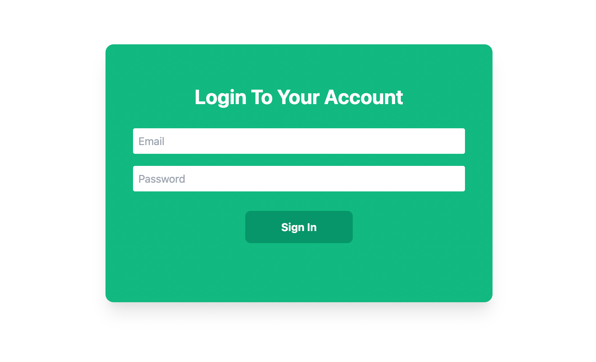

Tailwind CSS has recently gained a lot of popularity from front-end developers around the globe. 
The utility-first CSS framework enables developers to build a unique user interface.

> **NOTE:** You can find the code for this project [here on Github](https://github.com/amycruz97/tailwind-loginradius)

## What is Tailwind CSS?

According to the [official documentation](https://tailwindcss.com/), Tailwind CSS is a utility-first CSS framework for rapidly building custom user interfaces. With tailwind CSS, you can write inline styling and build an awesome user interface without leaving your HTML code and writing a single line of CSS.

In contrast to other CSS frameworks like Bootstrap or Materialize CSS, Tailwind doesn’t come with a predefined component.  instead, Tailwind CSS provides you with a set of CSS helper classes that enables you to create a custom design with ease.

In my opinion, Most sites built with Bootstrap always look alike and have the same feel. But Tailwind CSS is not opinionated and it allows you to create your own unique design.

# Setting up a project with Tailwind CSS

In this article, we would be setting up our project with tailwind CSS

### Using Tailwind via CDN

Using tailwind via CDN is a great way to quickly set up a simple tailwind  project or a quick demo.
But also note that there are a lot of tailwind features that are not available via CDN. 

Here is the latest default configuration via CDN:
```js
CSS Link tag
<link href="https://unpkg.com/tailwindcss@^2/dist/tailwind.min.css" rel="stylesheet">
```

### HTML starter template
This is what your HTML5 doctype looks like when you include tailwind CDN.

```HTMl
    <!doctype html>
    <html>
    <head>
    <meta charset="UTF-8" />
    <meta name="viewport" content="width=device-width, initial-scale=1.0" />
    <link href="https://unpkg.com/tailwindcss@^2/dist/tailwind.min.css" rel="stylesheet">
    
    </head>
    <body>
    <h1>Welcome to Tailwind CDN</h1>
    </body>
    </html>
```

### Install Tailwind via npm 

Installing tailwind via npm or yarn gives you access to  all tailwind awesome features unlike using tailwind via CDN

Before you install tailwind via npm,  create a new package.json file by using the npm command 
```powershell
npm init -y
```

Then Install tailwind  via npm
```powershell
npm install tailwindcss
```

### Include Tailwind in your CSS

The next step after installation is to include Tailwind in your CSS. You can do that by creating a new CSS folder.  You can name it whatever you like, but for the sake of the project, I would be naming it `style.css`.

Add the following to the  `style.css` file.
```CSS
/* ./css/style.css */
@tailwind base;
@tailwind components;
@tailwind utilities;
```

### Add postcss plugins
```powershell
  npm install postcss-cli autoprefixer
```

### Create your configuration file

To complete your tailwind setup, you will create a configuration file that enables  you to customize your tailwind project.

use this command to create a configuration file
```powershell
  npx tailwindcss init
```

This will create a `tailwind.config.js` file at the root of your project.
```JS

// tailwind.config.js
module.exports = {
  purge: [],
  darkMode: false, // or 'media' or 'class'
  theme: {
    extend: {},
  },
  variants: {},
  plugins: [],
}
```

## Processing CSS with Tailwind

you can add tailwind and autoprefixer to your PostCSS configuration by creating a  `postcss.config.js` file at the root of your project.

Add this to your postcss.config.js file you just created
```JS

//postcss.config.js
module.exports = {
    plugins: [
        require('tailwindcss'),
        require('autoprefixer'),
    ]
}
```

In package.json insert the following build script:
```json
"build": "postcss css/style.css -o build/style.css"
```

To execute this script just type in:
```powershell
 npm run build
```

### Create an index.html File

Let’s create a new file index.html in the build folder and insert the following HTML code.

```html

<!DOCTYPE html>
<html lang="en">
<head>
    <meta charset="UTF-8">
    <meta name="viewport" content="width=device-width, initial-scale=1.0">
    <link rel="stylesheet" href="style.css">
    <title>Tailwind CSS Demo</title>
</head>
<body>
    <div class="h-64">
        <div class="p-4 m-4 bg-purple-600">
            <h1 class="text-2xl font-bold text-white">Welcome to Tailwind CSS</h1>
        </div>
        
    </div>
</body>
</html>
```

### Set Up live server

To set up a web server for our server, you are going to use live-server. To use live-server, you can install it via npm:
```powershell
npm install -g live-server
```

Next you start up the live server by typing this command
```powershell
live-server build
```

You should then be able to open the website by pointing the browser to URL 127.0.0.1:8080. 

The result can be seen below


## Building a Login/ Registration page with Tailwind CSS

So far, you have been able to set up tailwind CSS in your project. Now let’s build a login and a registration page with tailwind CSS.

### Registration Page Demo

You are going to create a stylish and responsive registration page below:

```html

<div class="registration-card flex bg-white lg:w-3/5 w-4/5 shadow-xl rounded-xl m-auto       mt-20">
    <div class="bg-green-500 w-1/3 text-center py-40 text-white p-2">
        <h1 class="font-bold text-3xl">Welcome Back!</h1>
        <p class="py-8">To stay connected with us, please login your personal info</p>
        <button class="rounded-full border border-white px-8 py-2 
           hover:border-green-800 hover:text-green-800">Sign In</button>
    </div>
     <div class="mt-10  w-3/5 mx-auto">
        <h2 class="text-green-500 font-bold text-3xl text-center my-5">Create Account         </h2>
          <form class="flex flex-col">
            <input type="text" id="name" placeholder="Name" class="border border-green-500  my-2               h-10 p-2 rounded focus:outline-none">
            <input type="email" id="email" placeholder="Email" class="border border-green-500 
              my-2 h-10 p-2 rounded focus:outline-none">
            <input type="text" id="password" placeholder="Password" class="border border-green-500                 my-2 h-10 p-2 rounded focus:outline-none">
          </form>
            <button id="signup" class="bg-green-500 w-40 h-12 text-center mx-auto block rounded-lg             mt-5 text-white font-bold hover:text-green-800">Sign Up</button>
    </div>
</div> 
```

The following utility classes are applied:
`registration-card`: This is the class name of the card. it was a random classname, but you can name it anything you want.

`flex`: The flex  property sets how a flex item will grow or shrink to fit the space available in its flex container.

`bg-white`: This class sets the background of the card class to white.

`lg:w-3/5 w-4/5`: The class with `lg:w-3/5` sets the width of the card to 60% when on a large screen. But with `w-4/5` changes to 80% when on a smaller screen.

`shadow-xl`: This class is used for controlling the `box-shadow` of an element.

`rounded-xl`: This class is used for controlling the `box-shadow` of an element. it sets the card.

`border-radius` to `0.75rem`.

`m-auto`: This class sets the margin  property to auto to center the element within its container.

`mt-20`: This class sets the margin-top to `5rem`.

`text-center`:  This class aligns the text to the center.

`py-40`: This class sets `padding-top` and `padding-bottom` to the element.
 
`font-bold`: This class sets the `font-weight` to `bold`.

`text-3xl`: This class sets the font-size to `font-size: 1.875rem` and the `line-height: 2.25rem`.

`border border-white`: This class gives the element a border color of white.

`hover:border-green-800`: This class sets the border to green when hovered on.

`hover:text-green-800`: The class sets the text to green when hovered on.

`flex-col`: This class sets the `flex-direction` to column.

`focus:outline-none`: This class makes the outline not  appear when it is on focus.

`h-10`: This class sets the height of the element to `2.5rem`

 
Here is the result of the registration page:


### Login Page Demo

We are also going to create a login page that is quite similar to the registration page.

```html
    <div class="registration-card flex bg-green-500 lg:w-2/5 w-4/5 h-96 shadow-xl 
         rounded-xl m-auto mt-20">
      <div class="mt-10 mx-auto w-full px-10">
         <h2 class="text-white font-bold lg:text-3xl text-2xl text-center my-5">Login To 
           Your Account</h2>
          <form class="flex flex-col ">
            <input type="email" id="email" placeholder="Email" class="border border-green-500  my-2 
               h-10 p-2 rounded focus:outline-none focus:border-green-900">
             <input type="text" id="password" placeholder="Password" class="border border-green-500  
              my-2 h-10 p-2 rounded focus:outline-none focus:border-green-900">
          </form>
            <button id="login" class="bg-green-600 w-40 h-12 text-center mx-auto block rounded-lg 
              mt-5 text-white font-bold hover:text-green-800">Sign In</button>
     </div>
    </div>  
```

Here is the result of the login page.



## Login and signup functionality

we have so far highlighted how best to style both signup and login pages with tailwind CSS. Lets proceed to add login and signup functionality to our form. We will be using the loginRadius V2 JavaScript framework. You can find the finished code here.
Proceed to the loginRadius official website and create a free account. LoginRaduis provides us with a robust API for easy login and signup.


### API credentials

To implement our authentication functionality, we will use an API key, an app name and a Secure Mobile OTP Token (SCOTT) which can all be found under the configuration tab within our user dashboard. 

First step after this is to link loginRadius to our project. Proceed to add the below link to your html files.

```js
JS Link tag

<script src="https://auth.lrcontent.com/v2/js/LoginRadiusV2.js"></script>
```
The second essential sdk folder named “LoginRadiusV2SDK.11.1.1.js” can be found here under the /js folder.

Next step is to create our javascript files. we will be making use of three different files, an options.js file, a signup.js and a login.js file. You can create these files within a folder or directly on your root directory. Remember to transfer the above code for login and signup pages to a login.html and signup.html file respectively

Add the following code within your options.js file

```js

// LoginRadius V2 JS configuration
var stringVariable = window.location.href;
var domainName = stringVariable.substring(0, stringVariable.lastIndexOf('/'));
var commonOptions = {};
commonOptions.apiKey = '<LoginRadius API Key>';
commonOptions.appName = '<LoginRadius Site Name>';
commonOptions.hashTemplate = true;
commonOptions.sott = '<Sott>';
commonOptions.formValidationMessage = true;
var LRObject = new LoginRadiusV2(commonOptions);
 
 
// HTML 5 SDK initilization
var sdkoptions = {
    "apiKey": commonOptions.apiKey,
    "debugMode": true
  }
LoginRadiusSDK.initSDK(sdkoptions);
```

Proceed to fill-out the scott, api key and app name with data generated from the dashboard. The options.js file should be linked to both the login.html and signup.html files.

For signup functionality. Let’s add the below code block to our signup.js file which should be linked to the signup.html file.

```js

 function getElement(id) { return document.getElementById(id)}

    function handleSignup() {
       
        getElement("signup").addEventListener("click",  function(){
           
            const  name = getElement("name").value;
            const  email = document.getElementById("email").value
            const  password = getElement("password").value;
           
            if(!email || !password || !name) {alert("Missing input field")}
            if(password.length < 6) {alert("password must be at least 6 digits")}
            
         
            var authUserRegistrationModel = {
                email: [{
                    'Type': 'Primary',
                    'Value': email
                }],
                password: password,
                name: name
            };
            var sott = commonOptions.sott;
            var emailTemplate = "";
            var fields = "";
            var options = "";
            var verificationUrl = domainName;
            var welcomeEmailTemplate = "";
            LoginRadiusSDK.authenticationApi.userRegistrationByEmail(authUserRegistrationModel, sott, emailTemplate, fields, options, verificationUrl, welcomeEmailTemplate, function(error, data){
            
                if (error) {             
                    alert(error.Message);
                    
                }else{
                    window.location.href = "/tailwind/login.html"
                }
              
            });
        
        })
    
    }
    handleSignup()
```

From the above code, we are essentially getting our values for email, name and password from the form and passing the data to loginRadius. If signup is successful, the user is redirected to the login page. If done correctly, the signup functionality should be working fine. Remember to meet the minimum password requirement of at least 6 values with a mixture of lowercase and uppercase letters, a digit and a special character.

For our login functionality, let’s do the same as we did for signup. Proceed to paste the below code within your login.js file.
```js

function getElement(id) { return document.getElementById(id)}
function handleLogin() {
   
    getElement("login").addEventListener("click",  function(){
              
        const  email = document.getElementById("email").value
        const  password = getElement("password").value;
       
        if(!email || !password ) {alert("Missing input field")}
        if(password.length < 6) {alert("password must be at least 6 digits")}

        var emailAuthenticationModel = {
            email: email,
            password: password,
            action: "loginByEmail"
        };
        var emailTemplate = "";
        var fields = "";
        var loginUrl = window.location.href;
        var verificationUrl = "";
        LoginRadiusSDK.authenticationApi.loginByEmail(emailAuthenticationModel, emailTemplate, fields, loginUrl, verificationUrl, function(error, data){
        
            if (error) {             
                alert(error.Message);
                
            }
            if(data){
                alert("login successful")
            }
        });
    
    })
}
handleLogin()
```

Just like with signup, we are essentially passing our login details to loginRadius and letting it do the work of authentication. Also remember to link this file as we did for signup.

Our signup and login html files should look as so;

```html

<!DOCTYPE html>
<html lang="en">
<head>
    <meta charset="UTF-8">
    <meta http-equiv="X-UA-Compatible" content="IE=edge">
    <meta name="viewport" content="width=device-width, initial-scale=1.0">
    <link href="https://unpkg.com/tailwindcss@^2/dist/tailwind.min.css" rel="stylesheet">
    
    <title>Signup Form</title>
</head>
<body>
    
<div class="registration-card flex bg-white lg:w-3/5 w-4/5 shadow-xl rounded-xl m-auto       mt-20">
    <div class="bg-green-500 w-1/3 text-center py-40 text-white p-2">
        <h1 class="font-bold text-3xl">Welcome Back!</h1>
        <p class="py-8">To stay connected with us, please login your personal info</p>
        <button class="rounded-full border border-white px-8 py-2 
           hover:border-green-800 hover:text-green-800">Sign In</button>
    </div>
     <div class="mt-10  w-3/5 mx-auto">
        <h2 class="text-green-500 font-bold text-3xl text-center my-5">Create Account </h2>
          <form class="flex flex-col">
            <input type="text" placeholder="Name" id="name" class="border border-green-500  my-2 h-10 p-2 rounded focus:outline-none">
            <input type="email" placeholder="Email" id="email" class="border border-green-500 
              my-2 h-10 p-2 rounded focus:outline-none">
            <input type="text" placeholder="Password" id="password" class="border border-green-500 my-2 h-10 p-2 rounded focus:outline-none">
          </form>
          <button id="signup" class="bg-green-500 w-40 h-12 text-center mx-auto block rounded-lg mt-5 text-white font-bold hover:text-green-800">Sign Up</button>
    </div>
</div>


<script src="./js/signup.js"></script>
<script src="./js/LoginRadiusV2SDK.11.1.1.js"></script>
<script src="https://auth.lrcontent.com/v2/js/LoginRadiusV2.js"></script>
<script src="./js/options.js"></script>
</body>
</html>
```

For login
```html

<!DOCTYPE html>
<html lang="en">
<head>
    <meta charset="UTF-8">
    <meta http-equiv="X-UA-Compatible" content="IE=edge">
    <meta name="viewport" content="width=device-width, initial-scale=1.0">
    <link href="https://unpkg.com/tailwindcss@^2/dist/tailwind.min.css" rel="stylesheet">
    
    <title>Login Form</title>
</head>
<body>
    
    <div class="registration-card flex bg-green-500 lg:w-2/5 w-4/5 h-96 shadow-xl 
         rounded-xl m-auto mt-20">
      <div class="mt-10 mx-auto w-full px-10">
         <h2 class="text-white font-bold lg:text-3xl text-2xl text-center my-5">Login To 
           Your Account</h2>
          <form class="flex flex-col ">
            <input id="email" type="email" placeholder="Email" class="border border-green-500  my-2 
               h-10 p-2 rounded focus:outline-none focus:border-green-900">
             <input id="password" type="text" placeholder="Password" class="border border-green-500  
              my-2 h-10 p-2 rounded focus:outline-none focus:border-green-900">
          </form>
            <button id="login" class="bg-green-600 w-40 h-12 text-center mx-auto block rounded-lg 
              mt-5 text-white font-bold hover:text-green-800">Sign In</button>
     </div>
    </div>

<script src="./js/login.js"></script>
<script src="./js/LoginRadiusV2SDK.11.1.1.js"></script>
<script src="https://auth.lrcontent.com/v2/js/LoginRadiusV2.js"></script>
<script src="./js/options.js"></script>
</body>
</html>
```

## Summing up

In this article, i have been able to work you through the introductory aspect of tailwind CSS. 
I showed you how to set up tailwind in your project, and you also learned how to build a stylish registration and login page using tailwind CSS.

To learn more about Tailwind CSS,  The [official documentation](https://tailwindcss.com/docs) has a number of additional resources, including examples, screencasts, and tutorials.
Thanks for reading, I hope that I helped you learn something new today.


