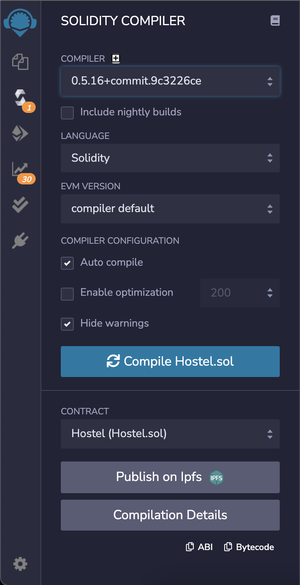
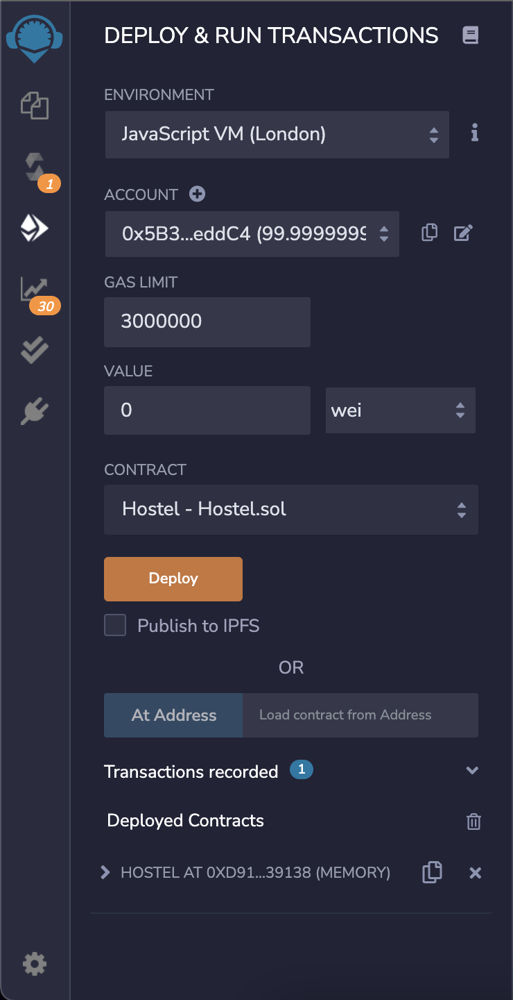
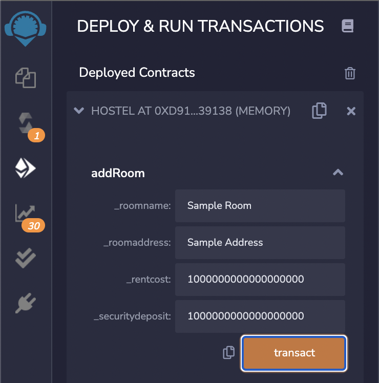
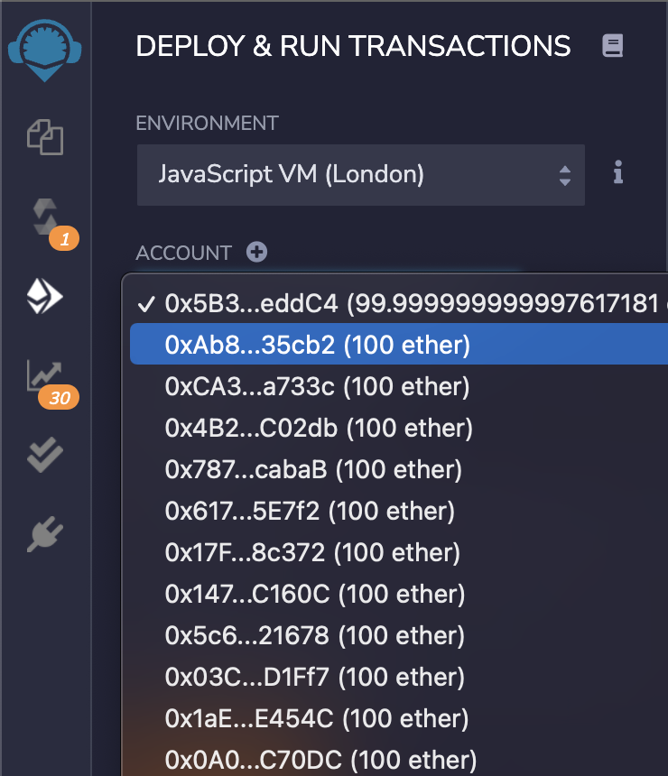
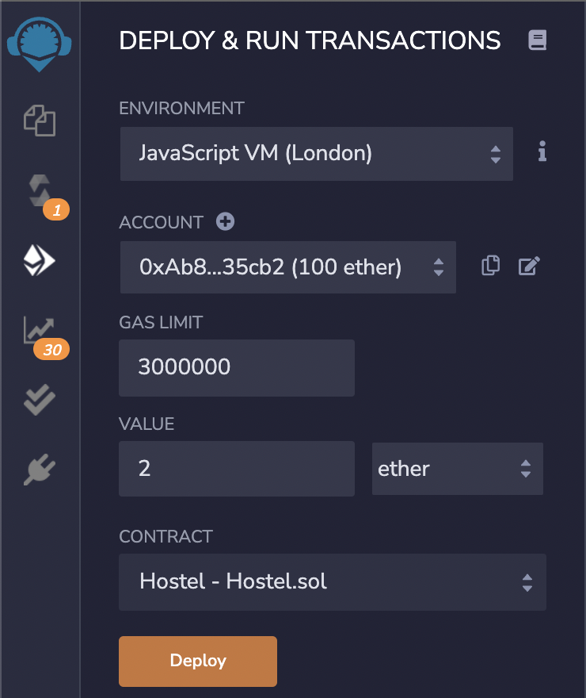
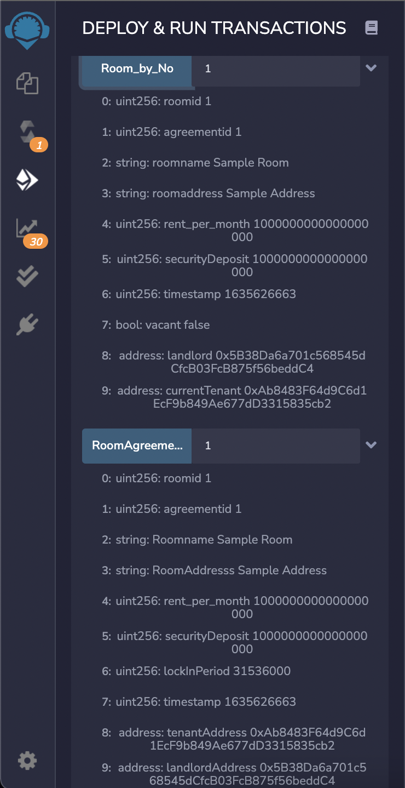
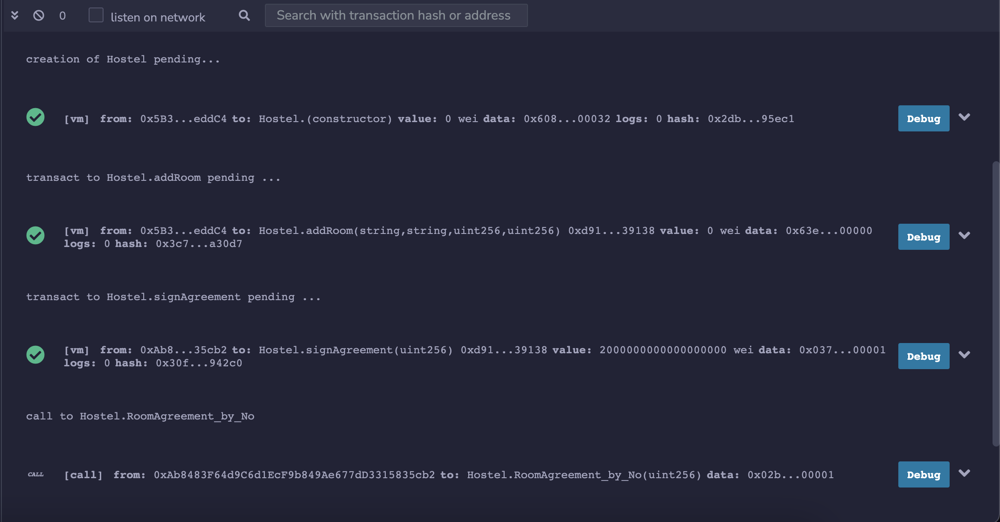

## What is a Smart Contract?

[**Smart Contracts**](https://en.wikipedia.org/wiki/Smart_contract) 📝 are simple programs that are stored on a blockchain network.

You can say it's like an agreement between two people in the form of computer code. The transactions that happen in a smart contract are processed by the blockchain and stored as **42 character hex address** with prefix `"0x"`). All of which means that they can be sent automatically without needing a third party.

**🤔 Remember :** They're stored in a public database. And once a smart contract is deployed, it cannot be changed.

## What is Solidity?

Solidity is one of the most popular languages used for building smart contracts on Ethereum Blockchain. It's also an object-oriented programming language.

## Build Your First Smart Contract

1. Open **`Remix` IDE** from [here](https://remix.ethereum.org/).
2. Click on `Sure` & then `Done`.
3. Under `default_workshop`, click on `create new file`.
4. Rename it as `Hostel.sol`.

Now you're ready to write your first **Smart Contract**. 🤩

### Contract Code

1. You have to provide the `solidity version` in the smart contract:

```ruby
pragma solidity ^0.5.16;
```

2. Now create the main contract named `Hostel`:

```ruby
contract Hostel{
    ...
}
```

3. Now, inside the `contract Hostel{...}` follow the steps below.
4. Create some variables where the smart contract will store the [**payable**](https://ethereum.stackexchange.com/questions/20874/payable-function-in-solidity) `address` (42 char hex string with prefix : `"0x"`) of the `Landlord` & the `Tenant`.

```ruby
    address payable tenant;
    address payable landlord;
```
5. Create some [**public**](https://ethereum.stackexchange.com/questions/19380/external-vs-public-best-practices) variables where the smart contract will store some integer values. For this, there's a data-type called `uint` (256-bit unsigned integer)

```ruby
    uint public no_of_rooms = 0;
    uint public no_of_agreement = 0;
    uint public no_of_rent = 0;
```
6. Now, create a `structure` to store details of each Hostel room like `Hostel no.`, `Hostel name`, `Hostel address`, `No of total agreements`, `Monthly rent`, `One time security deposit`, `Last agreement sign time`, `Vacancy`, `Landlord address`, and `Current Tenant Address`.

```ruby
    struct Room{
        uint roomid;
        uint agreementid;
        string roomname;
        string roomaddress;
        uint rent_per_month;
        uint securityDeposit;
        uint timestamp;
        bool vacant;
        address payable landlord;
        address payable currentTenant;
    }
```
7. `map` previous `structure` with an `uint`(named : `roomid`).

```ruby
mapping(uint => Room) public Room_by_No;
```

8. Similar to the above, create a `structure` for each `Rental Agreement` and map that with an `uint`(named : `agreementid`). This will store details like: `Hostel no.`,`Agreement No`, `Hostel name`, `Hostel address`, `Monthly rent`, `One time security deposit`,`Lockin Period`, `Agreement sign time`, `Landlord address`, and `Tenant Address`.

```ruby
    struct RoomAgreement{
        uint roomid;
        uint agreementid;
        string Roomname;
        string RoomAddresss;
        uint rent_per_month;
        uint securityDeposit;
        uint lockInPeriod;
        uint timestamp;
        address payable tenantAddress;
        address payable landlordAddress;
    }
```

```ruby
mapping(uint => RoomAgreement) public RoomAgreement_by_No;
```

9. Now, create a `structure` for each `Rent` payment and map that with an `uint`. This will store details like: `Rent No.`, `Hostel no.`, `Agreement No`, `Hostel name`, `Hostel address`, `Monthly rent`, `Rent payment time`, `Landlord address`, and `Tenant Address`.

```ruby
    struct Rent{
        uint rentno;
        uint roomid;
        uint agreementid;
        string Roomname;
        string RoomAddresss;
        uint rent_per_month;
        uint timestamp;
        address payable tenantAddress;
        address payable landlordAddress;
    }
```

```ruby
   mapping(uint => Rent) public Rent_by_No;
```

10. Create some [**modifiers**](https://ethereum.stackexchange.com/questions/29867/using-require-or-modifier/29868) that will help you verify a few things before running a function.

    Here `require(...);` means that if the given condition is not satisfied, then the function wOn't execute and the given string will appear as error code.

The following will check if the message sender is the Landlord.

```ruby
    modifier onlyLandlord(uint _index) {
        require(msg.sender == Room_by_No[_index].landlord, "Only landlord can access this");
        _;
    }
```

The following will check if the message sender is anyone except the Landlord.

```ruby
    modifier notLandLord(uint _index) {
        require(msg.sender != Room_by_No[_index].landlord, "Only Tenant can access this");
        _;
    }
```

The following will check whether the room is vacant or not.

```ruby   
    modifier OnlyWhileVacant(uint _index){
        
        require(Room_by_No[_index].vacant == true, "Room is currently Occupied.");
        _;
    }
```

The following will check whether the tenant has enough `Ether` in his wallet to pay the rent.

```ruby
    modifier enoughRent(uint _index) {
        require(msg.value >= uint(Room_by_No[_index].rent_per_month), "Not enough Ether in your wallet");
        _;
    }
```

The following will check whether the tenant has enough `Ether` in his wallet to pay one time security deposit & one month rent in advance.

```ruby 
    modifier enoughAgreementfee(uint _index) {
        require(msg.value >= uint(uint(Room_by_No[_index].rent_per_month) + uint(Room_by_No[_index].securityDeposit)), "Not enough Ether in your wallet");
        _;
    }
```

The following will check whether the tenant address is the same as who has signed the previous rental agreement.

```ruby   
    modifier sameTenant(uint _index) {
        require(msg.sender == Room_by_No[_index].currentTenant, "No previous agreement found with you & landlord");
        _;
    }
```

The following will check whether any time left for the agreement to end.

```ruby   
    modifier AgreementTimesLeft(uint _index) {
        uint _AgreementNo = Room_by_No[_index].agreementid;
        uint time = RoomAgreement_by_No[_AgreementNo].timestamp + RoomAgreement_by_No[_AgreementNo].lockInPeriod;
        require(now < time, "Agreement already Ended");
        _;
    }
```

The following will check whether 365 days have passed after the last agreement has been created.

```ruby
    modifier AgreementTimesUp(uint _index) {
        uint _AgreementNo = Room_by_No[_index].agreementid;
        uint time = RoomAgreement_by_No[_AgreementNo].timestamp + RoomAgreement_by_No[_AgreementNo].lockInPeriod;
        require(now > time, "Times left for contract to end");
        _;
    }
```

The following will check whether 30 days have passed after last rent payment.

```ruby 
    modifier RentTimesUp(uint _index) {
        uint time = Room_by_No[_index].timestamp + 30 days;
        require(now == time, "Time left to pay Rent");
        _;
    }
```

11. Now, create some [**functions**](https://docs.soliditylang.org/en/v0.4.24/introduction-to-smart-contracts.html)

The following function will be used to add Rooms.

```ruby
    function addRoom(string memory _roomname, string memory _roomaddress, uint _rentcost, uint  _securitydeposit) public {
        require(msg.sender != address(0));
        no_of_rooms ++;
        bool _vacancy = true;
        Room_by_No[no_of_rooms] = Room(no_of_rooms,0,_roomname,_roomaddress, _rentcost,_securitydeposit,0,_vacancy, msg.sender, address(0)); 
        
    }
```
Now we will create a function to sign rental agreement for hostel room between landlord & tenant.<br>
Before creating `signAgreement` function , we have to remember this few points :<br>
* The function will only execute : If the User is `Tenant`, means User's address & Landlord's address doesn't match.
* The function will only execute : If the user have enough ether payable 'Ether' in his/her Ether Wallet.(By enough Ether means, One time security deposit + 1st month's rent)
Now we will use those modifiers here, so that 
* The function will only execute : If the said room is vacant.

<br>
Remember those modifiers in point no. `10` ?
Now we will use those modifiers here to execute this function.

```ruby
    function signAgreement(uint _index) public payable notLandLord(_index) enoughAgreementfee(_index) OnlyWhileVacant(_index) {
        require(msg.sender != address(0));
        address payable _landlord = Room_by_No[_index].landlord;
        uint totalfee = Room_by_No[_index].rent_per_month + Room_by_No[_index].securityDeposit;
        _landlord.transfer(totalfee);
        no_of_agreement++;
        Room_by_No[_index].currentTenant = msg.sender;
        Room_by_No[_index].vacant = false;
        Room_by_No[_index].timestamp = block.timestamp;
        Room_by_No[_index].agreementid = no_of_agreement;
        RoomAgreement_by_No[no_of_agreement]=RoomAgreement(_index,no_of_agreement,Room_by_No[_index].roomname,Room_by_No[_index].roomaddress,Room_by_No[_index].rent_per_month,Room_by_No[_index].securityDeposit,365 days,block.timestamp,msg.sender,_landlord);
        no_of_rent++;
        Rent_by_No[no_of_rent] = Rent(no_of_rent,_index,no_of_agreement,Room_by_No[_index].roomname,Room_by_No[_index].roomaddress,Room_by_No[_index].rent_per_month,now,msg.sender,_landlord);
    }
```

The following function will be used to pay monthly rents: Here, the function will only run if the user's account address and the previous tenant's account address is the same, user have enough rent fee in his/her wallet, there is a gap of 30 days between previous transaction.

Now we will create a function which will be used by Tenant to pay monthly rent landlord. <br>
Before creating `payRent` function , we have to remember this few points :<br>
* The function will only execute : If the User's address & Previous Tenant's address both are same, means user can only pay rent if he/she has signed an agreement with the landlord within last 365 days.
* The function will only execute : If Tenant had paid his/her previous rent more than a month ago.
* The function will only execute : If the user have enough ether payable 'Ether' in his/her Ether Wallet(By enough Ether means, enough room rent).

```ruby
    function payRent(uint _index) public payable sameTenant(_index) RentTimesUp(_index) enoughRent(_index){
        require(msg.sender != address(0));
        address payable _landlord = Room_by_No[_index].landlord;
        uint _rent = Room_by_No[_index].rent_per_month;
        _landlord.transfer(_rent);
        Room_by_No[_index].currentTenant = msg.sender;
        Room_by_No[_index].vacant = false;
        no_of_rent++;
        Rent_by_No[no_of_rent] = Rent(no_of_rent,_index,Room_by_No[_index].agreementid,Room_by_No[_index].roomname,Room_by_No[_index].roomaddress,_rent,now,msg.sender,Room_by_No[_index].landlord);
    }
```

Now we will create a function which will be used by Landlord to marked an agreement completed. <br>
Before creating `agreementCompleted` function , we have to remember this few points :<br>
* The function will only execute : If the User's address & Landlord's address both are same.
* The function will only execute : If Tenant had signed that agreement more than a year ago.
```ruby
    function agreementCompleted(uint _index) public payable onlyLandlord(_index) AgreementTimesUp(_index){
        require(msg.sender != address(0));
        require(Room_by_No[_index].vacant == false, "Room is currently Occupied.");
        Room_by_No[_index].vacant = true;
        address payable _Tenant = Room_by_No[_index].currentTenant;
        uint _securitydeposit = Room_by_No[_index].securityDeposit;
        _Tenant.transfer(_securitydeposit);
    }
```

The following function will be used to terminate agreements before 365 days: Here, the function will only run if the user's account address and the landlord's account address are the same, there is a gap of less than 365 days after previous agreement.

Now we will create a function which will be used by Landlord to terminate an agreement. <br>
Before creating `agreementTerminated` function , we have to remember this few points :<br>
* The function will only execute : If the User's address & Landlord's address both are same.
* The function will only execute : If Tenant had signed that agreement less than a year ago.
```ruby
    function agreementTerminated(uint _index, uint _terminateno) public onlyLandlord(_index) AgreementTimesLeft(_index){
        require(msg.sender != address(0));
        Room_by_No[_index].vacant = true;
    }
```

### Compile

Now, click on the `Solidity Compile` option in the left side bar.

1. Select compiler version : `0.5.16+`
2. Then click on : `Compile Hostel.sol`

Similar to as follows:



### Deploy

Click on the `Deploy & Run Transactions` option in the left side bar.

1. Choose `Environment` : `JavaScript VM (London)`
2. Now click on `Deploy`



**🎉 Congratulations your Smart Contract has been Deployed. 🎉**

### Sample Transactions

Now, you have to remember that whenever a transaction is getting executed it stores all the details in an unique `hash` key.

Now, under `Deployed Contract` click on `> HOSTEL AT ..... (MEMORY)`

1. Click on the `V` icon (Dropdown Menu) of `addRoom` function.
2. Fill up the details.

Similar to as follows:



> **Note:** You're entering your details in `wei` not in `ether` (1 ether = 1000000000000000000 wei)
3. Then click on `transact`
    
    **🎉 Congratulations you have successfully added your 1st Room on the contract. 🎉**
    
    (You can find the same in the terminal also.)

    Now the Landlord of the room is your 1st Ether Address. (The one with 99.99 Test Ethers in wallet.)

4. change the `Account Address` from the drop down menu. (Choose anyone except one with 99.99 Ether)



5. Add the total amount you previously chosen as (rent cost + security deposit)
6. And then from the dropdown `wei` choose `ether`



7. Scroll down and click on `signAgreement`, enter `1`, and press `signAgreement`
    
    You can check the same by entering `RoomAgreementNo` : `1`



**🎉 Congratulations you have successfully signed your 1st agreement. 🎉**

#### Your all transactions will be shown in the `terminal`.



Now, you can cross verify this by checking your `ether` account address.

### Advantages oF smart ContractS

Now you may ask, "What's the use of smart contracts when there are several centralised methods?"

Let me explain some advantages of smart contracts over centralised systems:
1. Here data cannot be changed or tampered. So, it is almost impossible for malicious actors to manipulate data.
2. It's completely decentralised.
3. Unlike any centralised payment wallet, you don't have to pay any commission percentages to a middle man during any transactions.

#### Storage & Others
You may also ask "how are all transactions recorded?"

You have to remember that smart contracts store data in a block of blockchain, and all transactions are stored with an unique `hash` key.

In Remix IDE, you can download the complete transactions history as a `json` file. For that, follow these steps:
1. Click `Deploy & Run Transaction`
2. Then, expand the `Transactions Recorded (..) V` dropdown menu.
3. Then Click on the `Save` icon.
4. Press `ok`.

#### Gas Fee
Now you may have noticed that whenever a transaction is executed, a few `wei` is getting deducted from your ether wallet. 

It's called `gas fee`, which is the payment made by users to compensate for the computing energy required to process and validate transactions.

Aas more Ethereum miners will come up in near future, the `gas fee` will decrease in an inverse relation.

#### Future Possibilities
After this, in future, if you want to build a fullstack website using `React`, then you can use this `Smart Contract` as backend.

For that you need to install/download: 

**Frontend :**
1. [Node.js](https://nodejs.org/en/)

**Backend :**
1. [web3.js](https://www.npmjs.com/package/web3)
2. [Truffle](https://www.trufflesuite.com/docs/truffle/getting-started/installation)

**For Testing Purpose :**
1. [Ganache](https://www.trufflesuite.com/ganache)
2. [Metamask](https://metamask.io/)

And then just follow the [official documentation](https://web3js.readthedocs.io/en/v1.5.2/) of Web3.js to connect your smart contract with your react app.

## Conclusion
You've successfully understood what Solidity is and how smart contracts work. And you've successfully built and deployed a perfectly working smart contract (where tenant can pay rent in ether (ETH) directly to the landlord's wallet without paying a single wei to any middle man)

<!-- To download the complete code click [here](). -->