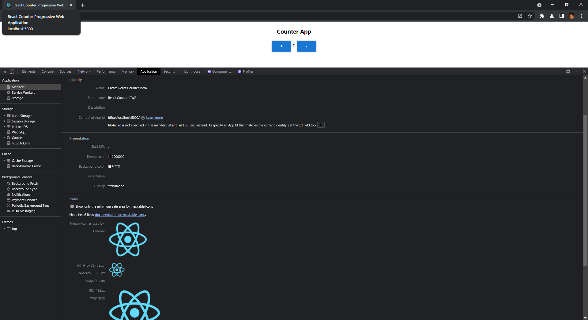

A Progressive Web App (PWA) is a more dynamic web application that can run as a standalone. It offers benefits such as: 
- performance;
- the ability to work with or without an internet connection;
- platform-specific; and, 
- installable.

> You can learn more about the [differences between native apps and PWAs here.](https://www.loginradius.com/blog/async/progressive-app-vs-native-app/)

In this article, you're going to learn how to build a PWA using React. As React is a popular web framework, this article starts by going over the setup, development process, and spinning it up to see how it looks. For this example, you'll create a simple Counter Page that simply adds or subtracts a number based on button controls.

## Create a React App with the Progressive Web App Template

Before you can begin coding, you need to set up your project. Let's start by ensuring you can use React (if you're already familiar with coding in React, you can probably skip this section!). You need to use Node.js with any development using web frameworks such as Angular, React, or Vue -- especially if you wish to use libraries and packages to assist in developing your project. 

A popular utility in using such packages and libraries is the Node Package Manager, simply referred to as "npm". This utility allows you to install/uninstall packages, start your React application build using webpack, and many more other features. For your needs, you can take advantage of npm to create a React application with a PWA template, which allows you to code right away. Whenever you start building a React app, you can use templates offered by Facebook using the 'create-react-app' command with npm. 

Let's build the PWA starter app by running the following command:

```powershell
npx create-react-app name-of-our-PWA-app --template cra-template-pwa
```
The above command can be broken down as follows:

- **npx**: Every npm command needs to start with npm (or essentially with whatever node package manager you have installed, but 'npx' is used here, which comes with npm version 5.2.0). This helps you run npm packages and [takes care of many features](https://nodejs.dev/learn/the-npx-nodejs-package-runner).

- **create-react-app**: This command initiates the popular Create React App utility that helps you build the starter react project.

- **name-of-our-PWA-app**: This is a filler title of your application. Name the app to whatever you would like. Here, the default 'my-app' name is used)

- **--template**: This is an argument. When you have an argument, you're essentially enabling an option in the same command. Here, you can specify a specific template for our starter react application.

- **cra-template-pwa**: The name of the PWA template for your PWA react application.

Hitting 'Enter' after this command should initiate the build of your starter PWA React application. You should see a stream of prompts in your command-line interface. It may take a few minutes, but if you can see this screen after the command, you have created the project.


Here, you can see the following folder structure of your application so far. There are a few files that you shall pay attention to when it comes to PWA's:

- **`service-worker.js`**: This is a script that runs in the background once your application starts running. The service worker makes sure that you can use your React application offline and handle multiple requests for the UI. ([learn more here](https://developers.google.com/web/fundamentals/primers/service-workers?hl=en))

- **`manifest.json`**: This is basically a configuration file that lists different properties that you can customize specifically for progressive web applications. It can determine such things as icons, names, and colors to use when the application is displayed.

- **`serviceWorkerRegistration.js`**: This file does the job of telling whether or not your service worker was successfully registered. If you look into the file, you'll notice multiple console logs that will be displayed depending on the status of the service worker once you deploy your application.

## Adding a Simple React Component

For your project, you'll build a simple Counter component, similar (if not exactly the same) to the example provided in the React docs: [https://reactjs.org/docs/hooks-state.html](https://reactjs.org/docs/hooks-state.html)

Let's start by creating a Counter component. Here, it is named as `Counter.jsx` and placed in a `components` folder.

To speed things up, you can copy and paste the following code in your specific files. Here, it is built out as a simple page and some generic stylings for the component.

```jsx
//Counter.jsx
import React, { useState } from 'react';
import Button from '@mui/material/Button';

function Counter(props) {
    let [count, setCount] = useState(0)

    function increment() {
        setCount(count + 1);
    }

    function decrement() {
        setCount(count - 1);
    }

    return(
        <div style={{textAlign: 'center'}}>
            <h3>Counter App</h3>
            <div>
                <Button variant="contained" onClick={increment}>+</Button>
                <span> {count} </span>
                <Button variant="contained" onClick={decrement}>-</Button>
            </div>
        </div>
    );
};

export default Counter;
```
**Note:** Here, Material UI's Button component is used. You don't need to and can substitute the Button component with:

```jsx
<button onClick={increment}>+</button>
```

To use Material UI, run the following npm commands:

```powershell
npm install @mui/material
npm install @emotion/react @emotion/styled //these are additional dependencies for me to get Material UI working with the Counter component
```

## Running Your Application

In your command prompt, entering 'npm start' can spin up your application to a specific [localhost](http://localhost) url. You can start to see what work you've done so far.

With these simple components, let's try to spin this application up and ensure it is working. 

Enter the command:

```powershell
npm start
```

This starts the application at a set [localhost](http://localhost) URL. Once the dev server is working and live on the command prompt, go to the URL to view the application. You should see something similar to this:


Now, it's all good and ready to have the app live and working, but more interested in the PWA aspect.

## Running Your Progressive Web Application

Focus back on the `index.js` file. Make the following change:

```jsx
// If you want your app to work offline and load faster, you can change
// unregister() to register() below. Note this comes with some pitfalls.
// Learn more about service workers: https://cra.link/PWA
serviceWorkerRegistration.register(); //change the service worker registration from 'unregistered' to 'registered'
```

Essentially, changing the service worker from unregistered to registered will allow you to utilize the app even when it's offline, a key benefit when it comes to PWAs. Check Google's explanation on this topic for more information: [https://developers.google.com/web/fundamentals/primers/service-workers/registration](https://developers.google.com/web/fundamentals/primers/service-workers/registration)

With the PWA files setup, in order to view the difference, you can deploy your application to a static server using the `serve` package that will serve your application to localhost. In a nutshell, make sure you have the `serve` package by installing, building the application again, and using `serve` to deploy the application:

```powershell
npm install serve
npm run build
serve -s build //if you encounter an error with this command, try 'npx serve -s build'
```

Once you use the `serve` command, you should see the following message, having your application deployed to [http://localhost:5000](http://localhost:5000). It automatically adds the URL to your clipboard as well for quick pasting in your browser.


If you enter the [localhost](http://localhost) URL in your browser, you should see something similar to this:


## PWA Features

With the PWA React application live, let's take a look under the hood and open up the Developer Tools (for Google Chrome, entering F12 opens the Dev Tools).

After registering your service worker from `index.js`, you should be able to see it running in the Application tab. Inside that tab, on the left side you should see a Service Workers section. From here, you can see for [http://localhost:5000](http://localhost:5000). You have a Service Worker from your `service-worker.js` file and is activated/running.

In the section above, you can see `Manifest` -- opening that should show you the relevant details you listed from your `manifest.json` files.



With your PWA app running using React, you've successfully built your first PWA React application! From here, you can test many PWA features, such as installation, offline viewing, and Lighthouse audit testing.


If you hit the '+' symbol on the right side of the URL ba,r you can install your PWA, just as done here.


Use Workbox Lighthouse for testing the capabilities of your PWA: [https://developers.google.com/web/tools/lighthouse](https://developers.google.com/web/tools/lighthouse)

## Conclusion

You've learned about what PWAs are and how to build a PWA with React. 