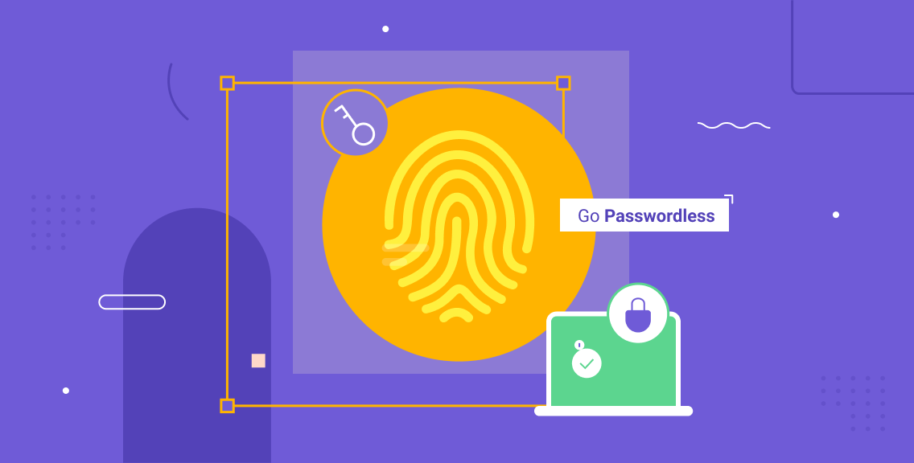

### **How to Improve User Experience with Password less Authentication**

As we all know that, now ecommerce isn’t a novelty anymore. It has become an important part of our day-to-day life. According to a report by UN trade, ecommerce sales soared to more than $26 trillion in 2020, which is 4% more than 2018. Another 2020 report by the IBM suggests that the pandemic accelerated the shift to online retail by at least five years. However, as online retail has grown, so have customer expectations.

Today’s consumers expect an effortless experience from the moment they enter any webstore. Although they still care a lot about their privacy and security, customers are less willing to sacrifice a seamless experience for some weird improvements to safety. Now the emphasis is on making everything smooth and fast: smoother shopping, faster shipping and seamless logins.
But nothing stops an online shopper in their tracks like a forgotten password or account lockout. Authentication issues are among the worst obstacles a customer can face when shopping online, and ecommerce organizations must address them if they want to maintain a competitive edge to hold their customers more friendly than their competitors.

So here in this article, we’ll discuss about how online retailers can take advantage of password less authentication to earn loyal customers, reduce support overhead and drive deeper revenue. Truly password less authentication removes passwords from all parts of the login process, meaning it’s built from the zero level up with password less authentication in mind. First, let’s talk about giving your customers the authentication experience they want — not the one they’re conditioned to put up with. 

 -	**Improve customer loyalty**

    Now here is the question. What makes a good shopping experience? For most of the shoppers, it’s convenience. If something can’t be found, ordered and delivered straight to their door with a minimum of fuss, consumers will take their business elsewhere. That sentiment applies across the entire customer experience. And, crucially, that includes authentication.
 

    

    As you can see in the flowchart above, authentication is a crucial stepping stone in making a purchasing decision. It’s this step that can make or break an ecommerce shopping experience. If customers are put off by a difficult authentication process, they might become frustrated and at last give up. Worse still, they may take their business to a competitor who provides a more comfortable authentication experience. According to research from Mastercard, a 30-35% of customers will simply walk away if they get locked out of their account.
    Whenever customers are forced to register a new account with a username and password, they’re constrain to add yet another entry to their ever-expanding virtual keyring. Considering that most online consumers frequent dozens of digital storefronts, it can be quite a hassle to remember all these different credentials. Since it’s so easy to get confused or forget passwords, customers are often confronted with an account lockout and are forced to reset their logins. A Transmit Security survey discovered that more than 60% of customers will leave a site if they’re forced to register a new username and password again and again.
    When authentication is smooth process, customers are free to enjoy an uninterrupted shopping experience. They’re notably more likely to make a purchase, return to the webstore and recommend it to others. At the same time, it prevents losing an angry customer because they were locked out of their account. That lost customer will undoubtedly express their frustration to others, which is harmful to the store's reputation and sells.

 -	**Drive deeper revenue by smoothing out the visitor journey**

    With password or knowledge-based authentication, customers are obliged to generate new user IDs and difficult-to-crack passwords with every store they visit. It’s such a road breaker that retailers forfeit potential customers with each forced registration page. In recent report on the business impact of passwords, that discovered that about 60% of consumers will abandon a website altogether if they’re asked to create a username and password.
    Even after long registration, many customers depend heavily on browser-based cookies to remember their credentials for them. This is especially true for infrequent customers who only shop occasionally — unfortunately, the cookies that store their logins will eventually expire or wiped out. They must inevitably reset their account’s password, and this creates a broad obstacle to purchasing decisions. These customers would happily leave the shopping site rather than recovering their accounts. More than 90% of users that surveyed prefer to beat a hasty exit over resetting their logins. 
    Going password less with a biometric-powered authentication service puts the curb back into the customer’s hands. Instead of forcing shoppers to ask “How much do I really want this product?” when faced with a registration page, they’re simply directed to a handful of easy authentication steps that organically drive them to checkout. 
    Likewise, eliminating the obligation to remember a password or store it as a browser cookie means users can simply scan their fingerprints and get back to shopping. This simple process can really help the consumer to leave hectic authentication as well as seller to raise their sells. 
    To reduce the friction between online shoppers and their next satisfying purchase. The seller should work on eliminating passwords from every part of the authentication process, which means no user IDs, no passwords, and no resets. Instead of registering with a set of login credentials, customers can use software to link biometric data, like a fingerprint or face scan, to their account. Whenever they want to log in, they receive a prompt on that device and gain access when it’s complete. It will be as easy as opening your device just by your biometric data that has been stored in the software. This will really help customers to get rid of resetting their passwords again and again.

    > **NOTE:**  All the images used in this blog post are randomly taken from the Google and are used here for reference purposes only.
