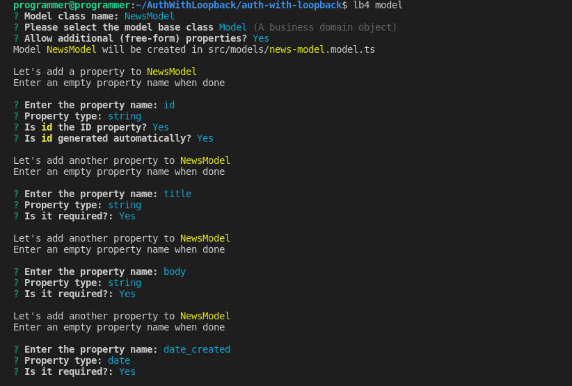

Authentication and authorization are critical in every software application to secure user data and allow access to trsuted users. In some case, impmenting autentication and authorization is not an easy process.

However, LoopBack 4 offers an authentication package **@loopback/authentication** that helps secure your application's API endpoints. For this, it provides custom authentication strategies and a **@authenticate** decorator that requires minimal boilerplate code.

## What is LoopBack?

According to the [LoopBack 4 documentation](https://loopback.io/doc/en/lb4/index.html):

> LoopBack is a flexible, open source Node.js and TypeScript framework built on Express. It helps you easily develop APIs and microservices built on backend systems such as databases and SOAP or REST services.

Loopback provides several features that allow you to build your application with less boilerplate code.

## What is JSON Web Token (JWT)

JSON Web Token (JWT) is an open standard [defined by Internet Engineering Task Force (IETF) in RFC 7519](https://datatracker.ietf.org/doc/html/rfc7519.html).

It is a standard used for securely transferring claims between two parties over the internet. It uses JSON Web Signature (JWS) or JSON Web Signature (JWS) for secure transfer of claims and eliminate the possibility of tampering. Accordingly, JWTs can be signed with either a secret (using the HMAC technique) or a public/private key pair (using RSA or ECDSA).

In simple words, it is used for authentication and secure information sharing. A JWT token is made up of three components that are separated by three dots:

- **Header:** The header is made up of two parts — the kind of token, which is JWT, and the signature technique used, which is either HMAC SHA256 or RSA.
- **Payload:** The payload is the token, which includes the claims. Claims are assertions about an entity that provides extra information.
- **Signature:** The encoded header, encoded payload, a secret, and the algorithm provided in the header comprise the signature.

> You can learn more about [JWT and its best practices here](https://www.loginradius.com/blog/async/guest-post/jwt-authentication-best-practices-and-when-to-use/).

## Prerequisites

This tutorial is a hands-on demonstration. To follow along, be sure you have the following in place:

- A Linux machine – This tutorial will use Ubuntu 20.04.3 LTS (Focal Fossa). The tutorial also works well on other Linux distributions and operating systems.
- [**NodeJS**](https://nodejs.org/) – JavaScript runtime built on Chrome's V8 JavaScript engine.
- [**MongoDB**](https://www.mongodb.com/) — Document-oriented database program.

## Install LoopBack CLI

To start building your LoopBack REST API, first install LoopBack CLI, which provides the quickest method to get started with a LoopBack 4 project that follows best practices.

Use the command below to install the Loopback CLI globally:

```bash
    npm i -g @loopback/cli
```

You can grab a cup of coffee while you wait for the installation to complete. Then open your command line, create an `AuthWithLooback` folder, and change directory to the `AuthWithLooback` folder with commands below:

```bash
    mkdir AuthWithLooback
    cd AuthWithLooback
```

## Scaffold Your LoopBack Project

So, you've installed Loopback CLI and created a project directory. Let's run the following command to create a LoopBack project:

```bash
    lb4 app
```

Select the options as in the following screenshot to complete the prompts.


After completing the prompts, LoopBack will configure the TypeScript compiler and install all the required dependencies. Change directory into the `auth-with-loopback` folder.

```bash
  cd auth-with-loopback
```

## Create Model

You've successfully created your Loopback application. Now, let’s create a Model to store the news details with the command below:

```bash
  lb4 model
```

Select the options as in the following screenshot to complete the prompts.



After the `date_created` property definition, press the enter key to exit the prompt.

Loopback will create a `NewsModel` file in the `src/models` — the folder where `NewsModel` will be defined.

Next, you need to create a data source to connect to your preferred database. For demonstration, this tutorial connects to a MongoDB database.

Run the follwing command in your terminal to create a data source:

```bash
  lb4 datasource
```

Select the options as in the following screenshot to complete the prompts.


After completing the prompts, LoopBack will create the `News` file in the `src/datasource` folder.

Then, create a [Repository](https://loopback.io/doc/en/lb4/Repository.html) for CRUD operations of your NewModel with the command below:

```bash
  lb4 repository
```

After completing the prompts, LoopBack will create the `NewsModelRepository` file in the `src/repository` folder.

Select `NewsDatasource` as the data source, `NewsModel` as the to generate repository for, and `DefaultCrudRepository` as the base repository class.

Your selection for the prompts shsll look like the screenshot below.


After completing the prompts, LoopBack will create the `*NewsModelRepository` file in the `src/repository` folder.

Lastly, create a controller for the `NewsModel` you created with the command below:

```bash
  lb4 controller
```

Your selection for the prompts should look like the screenshot below.


After completing the prompts, LoopBack will create the `NewsController` file in the `src/controller` folder. So far your project structure omitting the `node_modules` folder should look as follows.

📦auth-with-loopback
┣ 📂public
┃ ┗ 📜index.html
┣ 📂src
┃ ┣ 📂**tests**
┃ ┃ ┣ 📂acceptance
┃ ┃ ┃ ┣ 📜home-page.acceptance.ts
┃ ┃ ┃ ┣ 📜ping.controller.acceptance.ts
┃ ┃ ┃ ┗ 📜test-helper.ts
┃ ┃ ┗ 📜README.md
┃ ┣ 📂controllers
┃ ┃ ┣ 📜README.md
┃ ┃ ┣ 📜index.ts
┃ ┃ ┣ 📜news-controller.controller.ts
┃ ┃ ┗ 📜ping.controller.ts
┃ ┣ 📂datasources
┃ ┃ ┣ 📜README.md
┃ ┃ ┣ 📜index.ts
┃ ┃ ┗ 📜news.datasource.ts
┃ ┣ 📂models
┃ ┃ ┣ 📜README.md
┃ ┃ ┣ 📜index.ts
┃ ┃ ┗ 📜news-model.model.ts
┃ ┣ 📂repositories
┃ ┃ ┣ 📜README.md
┃ ┃ ┣ 📜index.ts
┃ ┃ ┗ 📜news-model.repository.ts
┃ ┣ 📜application.ts
┃ ┣ 📜index.ts
┃ ┣ 📜migrate.ts
┃ ┣ 📜openapi-spec.ts
┃ ┗ 📜sequence.ts
┣ 📜.dockerignore
┣ 📜.eslintignore
┣ 📜.eslintrc.js
┣ 📜.gitignore
┣ 📜.mocharc.json
┣ 📜.prettierignore
┣ 📜.prettierrc
┣ 📜.yo-rc.json
┣ 📜DEVELOPING.md
┣ 📜Dockerfile
┣ 📜README.md
┣ 📜package-lock.json
┣ 📜package.json
┗ 📜tsconfig.json

## Add Custom Data

Now that you have the Model setup, run the sever, and add some custom data to the News collection in MongoDB.

```bash
    #start the server
    npm run start
```

The above command will start the TypeScript compiler, which will build the project and check for possible errors. If everything goes well with the code, you should see the output on the terminal, as follows:


Next, open your favorite browser and navigate to [localhost:3000](http://localhost:3000). You should see an output, as follows:


Now, click on the explorer link, where you can make requests tp your LoopBack application. On the explorer page, locate the post endpoint and add some custom data to the news collection by clicking the **try it out** button with the data below on the request body.

```json
{
  "title": "Upgrade to Loopback V4",
  "body": "The developers of Loopback urges the V3 users to upgrade to            V4 as soon as possible",
  "date_created": "2021-12-14T00:57:43.197Z"
}
```

Then, click the **execute** button to run the query.


You can add as many records as you like to experiment with the endpoints. The important thing to note here is that the endpoints are not protected. Anyone may create, read, update, and delete records.

In a moment, this tutorial explains how to secure the endpoints so that only logged-in users may access them.

To begin, install LoopBack `authentication` and `authentication-jwt`, as follows:

```bash
  npm i --save @loopback/authentication @loopback/authentication-jwt
```

## Setup Authentication Components

To protect the application, you'll implement user authentication and authorization, which implies that only logged-in users will be able to access your APIs. You'll create two endpoints in User controller:

- `/Signup` endpoint: To handle user’s sign up.
- `/Login` endpoint: To handle user’s login.

### Create Your Signup Endpoint

You’ll start with the sign up controller to enable user’s create an account. Create an empty controller with command below:

```bash
    lb4 controller
```

Your selection for the prompts should be as follows:


Then, open the `src/controllers/user.controller.ts` file, and import the required modules with the following code snippet:

```javascript
    import { authenticate, TokenService } from '@loopback/authentication';
    import {
      Credentials,
      MyUserService,
      TokenServiceBindings,
      User,
      UserRepository,
      UserServiceBindings,
    } from '@loopback/authentication-jwt';
    import { inject } from '@loopback/core';
    import { model, property, repository } from '@loopback/repository';
    import {
      get,
      getModelSchemaRef,
      post,
      requestBody,
      SchemaObject,
    } from '@loopback/rest';
    import { SecurityBindings, securityId, UserProfile } from '@loopback/security';
    import { genSalt, hash } from 'bcryptjs';
    import _ from 'lodash';
    ........
```

Next, set up your user credential objects, and verify the user credentials using the `UserService`, injecting `MyUserService` into the `authentication-jwt` extension.

```javascript
    @model()
    export class CreateUser extends User {
      @property({
        type: 'string',
        required: true,
      })
      password: string;
    }

    const UserSchema: SchemaObject = {
      type: 'object',
      required: ['email', 'password'],
      properties: {
        email: {
          type: 'string',
          format: 'email',
        },
        password: {
          type: 'string',
          minLength: 6,
        },
      },
    };

    export const RequestBody = {
      description: 'The input of login function',
      required: true,
      content: {
        'application/json': { schema: UserSchema },
      },
    };

    export class UserController {
      constructor(
        @inject(TokenServiceBindings.TOKEN_SERVICE)
        public jwtService: TokenService,
        @inject(UserServiceBindings.USER_SERVICE)
        public userService: MyUserService,
        @inject(SecurityBindings.USER, { optional: true })
        public user: UserProfile,
        @repository(UserRepository) protected userRepository: UserRepository,
      ) { }
    ..........
```

Finally, you'll build your signup endpoint, which will listen to POST requests. Here, you shall save the hashed version of the user's password in the database to keep it safe.

```javascript
     @post('/signup', {
      responses: {
        '200': {
          description: 'User',
          content: {
            'application/json': {
              schema: {
                'x-ts-type': User,
              },
            },
          },
        },
      },
    })
    async signUp(
      @requestBody({
        content: {
          'application/json': {
            schema: getModelSchemaRef(CreateUser, {
              title: 'NewUser',
            }),
          },
        },
      })
      newUserRequest: CreateUser,
    ): Promise<User> {
      const password = await hash(newUserRequest.password, await genSalt());
      const savedUser = await this.userRepository.create(
        _.omit(newUserRequest, 'password'),
      );

      await this.userRepository.userCredentials(savedUser.id).create({ password });

      return savedUser;
    }
    .........
```

### Create Your Login Controller

Now that you've set up the signup endpoint, create the login endpoint so that registered users may log in to the API.

Set up the login route in the `src/controllers/user.controller.ts` file using the code snippet below. In the event of a successful login, a token is sent tp the user.

```javascript
      @post('/signin', {
      responses: {
        '200': {
          description: 'Token',
          content: {
            'application/json': {
              schema: {
                type: 'object',
                properties: {
                  token: {
                    type: 'string',
                  },
                },
              },
            },
          },
        },
      },
    })
    async signIn(
      @requestBody(RequestBody) credentials: Credentials,
    ): Promise<{ token: string }> {
      const user = await this.userService.verifyCredentials(credentials);
      const userProfile = this.userService.convertToUserProfile(user);
      const token = await this.jwtService.generateToken(userProfile);
      return { token };
    }
```

Perhaps, you can show the currently logged-in user by adding a `/whoami` endpoint.

In the `src/controllers/user.controller.ts` file get the details of the currently logged-in user using the code snippet below. Users should access this endpoint only when they are logged in.

```javascript
      @authenticate('jwt')
      @get('/whoami', {
        responses: {
          '200': {
            description: 'Return current user',
            content: {
              'application/json': {
                schema: {
                  type: 'string',
                },
              },
            },
          },
        },
      })
      async whoAmI(
        @inject(SecurityBindings.USER)
        loggedInUserProfile: UserProfile,
      ): Promise<string> {
        return loggedInUserProfile[securityId];
      }
```

Now, open `src/application.ts` and bind the authentication components to your application class. First, import Loopback `AuthenticationComponent`, `JWTAuthenticationComponent`, and `NewsDataSource` from your `datasources` using the following code snippet:

```javascript
//...
import { AuthenticationComponent } from "@loopback/authentication"
import {
  JWTAuthenticationComponent,
  UserServiceBindings,
} from "@loopback/authentication-jwt"
import { NewsDataSource } from "./datasources"
//...
```

Then, mount the jwt authentication system and bind your `NewsDataSource` to the `UserService` data source.

```javascript
//...
// ------ ADD SNIPPET INSIDE THE CONTRUCTOR BLOCK ---------
this.component(AuthenticationComponent)
this.component(JWTAuthenticationComponent)
this.dataSource(NewsDataSource, UserServiceBindings.DATASOURCE_NAME)
//...
```

Finally, add the authenticate action in the Sequence. Also modify the error when authentication fails to return status code 401 (Unauthorized). Open the `src/sequence.ts` file and add the code snippet below:

```javascript
    import { FindRoute, InvokeMethod, MiddlewareSequence, ParseParams, Reject, RequestContext, Send, SequenceActions, SequenceHandler } from '@loopback/rest';
    import {
        AuthenticateFn,
        AuthenticationBindings,
        AUTHENTICATION_STRATEGY_NOT_FOUND,
        USER_PROFILE_NOT_FOUND,
    } from '@loopback/authentication';
    import { inject } from "@loopback/core"
    export class MySequence implements SequenceHandler {
        constructor(
            @inject(SequenceActions.FIND_ROUTE) protected findRoute: FindRoute,
            @inject(SequenceActions.PARSE_PARAMS)
            protected parseParams: ParseParams,
            @inject(SequenceActions.INVOKE_METHOD) protected invoke: InvokeMethod,
            @inject(SequenceActions.SEND) protected send: Send,
            @inject(SequenceActions.REJECT) protected reject: Reject,
            @inject(AuthenticationBindings.AUTH_ACTION)
            protected authenticateRequest: AuthenticateFn,
        ) { }
        async handle(context: RequestContext) {
            try {
                const { request, response } = context;
                const route = this.findRoute(request);
                //call authentication action
                await this.authenticateRequest(request);
                // Authentication successful, proceed to invoke controller
                const args = await this.parseParams(request, route);
                const result = await this.invoke(route, args);
                this.send(response, result);
            } catch (error) {
                if (
                    error.code === AUTHENTICATION_STRATEGY_NOT_FOUND ||
                    error.code === USER_PROFILE_NOT_FOUND
                ) {
                    Object.assign(error, { statusCode: 401/* Unauthorized */ });
                }
                this.reject(context, error);
                return;
            }
        }
    }
```

## Protect News Endpoints

So far, you've implemented user authentication for your API. Now, protect your News endpoints so that only authenticated users can access those routes.

Open the `src/controllers/news.controller.ts` file and import **authenticate** from jwt authentication.

```javascript
import { authenticate } from "@loopback/authentication"
```

Then on each of the endpoints in your news controller add `@authenticate('jwt')` before the `NewsController` class, which will protect all the routes in `NewsController`.

```javascript
    //...
    @authenticate('jwt')
    export class NewsController {
    //...
```

Perhaps, you may not want to protect all the routes, simply add the `@authenticate('jwt')` method before the route you wish to protect. You can protect the POST route as follows:

```javascript
    @authenticate('jwt')
    @post('/news-models')
      @response(200, {
        description: 'NewsModel model instance',
        content: { 'application/json': { schema: getModelSchemaRef(NewsModel) } },
      })
      async create(
        @requestBody({
          content: {
            'application/json': {
              schema: getModelSchemaRef(NewsModel, {
                title: 'NewNewsModel',
                exclude: ['id'],
              }),
            },
          },
        })
        newsModel: Omit<NewsModel, 'id'>,
      ): Promise<NewsModel> {
        return this.newsModelRepository.create(newsModel);
      }
```

## Test Your Application

You've implemented user authentication in your REST API and secured the routes against unauthorized users. Let's put your application to the test. Press `CTRL-C` to exit the server, and restart it with the follwing command:

```bash
    npm start
```

Now if you open the explorer page, you should see the `UserController` endpoints.


If you try to execute any query on `NewsController`, you get a 404 (Unauthorized) error. So, signup by clicking the `/signup` endpoint — and log in from the `/users/login` endpoint. On successful login, copy the token, scroll to the top, click on the **Authorize** button, and paste the token.


Now you can execute queries on the `NewController` endpoints.

## User Authentication with Loginradius

LoginRadius is a customer identity and access management (CIAM) platform for developers.

What does this mean for developers, like you?

LoginRadius simplifies the process of user authentication, authoorization, and management across web and mobile apps and APIs. It helps developers quickly implement this funcationality so that developers, like you, can focus more on building core features that are essential to their apps.

Loginradius includes a plethora of enticing CIAM features such as passwordless authentication and social SSO (Twitter, Facebook, etc., based single sign-on).

Implementing user authentication with LoginRadius is a simple procedure. First, sign up for a Developer Pro trial or simply [sign up for a forever free account here](https://accounts.loginradius.com/auth.aspx?action=register).

And you can explore what LoginRadius can do by using it for a Node.js application. You can learn more by going through [LoginRadius Node.js developer documentation](https://www.loginradius.com/docs/developer/tutorial/node-js/ "Node.js documentation for implementing LoginRadius")

## Conclusion

In this tutorial, you learned how to create user authentication in a LoopBack REST API by creating a small news database application.

You can use the steps outlined in this tutorial to create any type of LoopBack REST API that requires user authentication and authorisation.

I hope you enjoyed this tutorial! Feel free to contact me on [Twitter](https://twitter.com/EkekentaZion).
