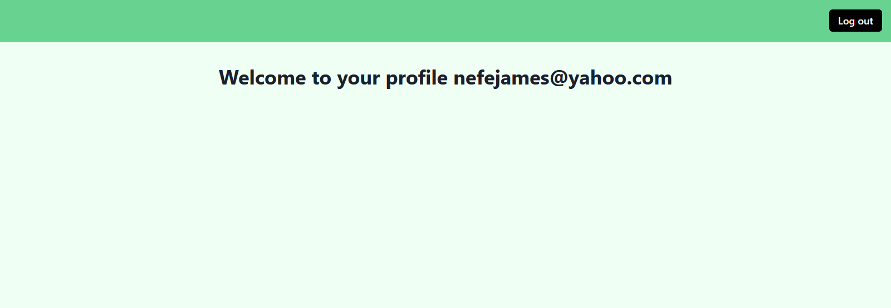

In this article, you'll learn about authentication in Next.js and how you can authenticate Next.js applications with [LoginRadius](https://www.loginradius.com/).

> **Note:** An understanding of [React](https://reactjs.org/), [Hooks](https://www.loginradius.com/blog/async/react-hooks-guide/), and [Next.js](https://nextjs.org/) is beneficial to follow this tutorial.

## What is Authentication?

Authentication is the process of validating that an individual is who they claim to be. Authentication is an essential feature for applications, particularly those that store user data.

You should not mistake authentication for authorization. Authorization is the process of verifying that whether a user has required permission to access an asset or data set.

Authentication deals with identifying a user, while authorization checks what resources or data an authenticated user has permission to access.

Some of the methods used to implement authentication are:

- Username/email and password
- Fingerprint
- Face recognition
- Security questions
- One time pins (OTPs)
- Magic links

## Should You Build Your Authentication System or Use a Third-party Solution?

Authentication is one of the most critical parts of an application’s security, so you should address it adequately.

A few aspects you should consider when assessing if you should build your authentication system or use a third-party solution:

- **Progressive Enhancements:** Security systems require frequent enhancements and upgrades to keep users safe from evolving threats and techniques. How much time and resources can you commit to keeping your security system up-to-date with the latest countermeasures to safeguard data and access against emerging threats?

- **Identity Provider Support:** How many identity providers do you plan to support, if any? With third-party solutions, you can authenticate users with email/password as well as identity providers such as Google, Github, Facebook, and more. Third-party solutions are always working hard to add support to even more providers. They also provide other authentication methods like Magic Link for passwordless authentication.

  Can you build an authentication system that allows users to use their preferred authentication method, or will they be restricted?

- **Advanced Security Features:** Security and authentication go beyond email/password sign-in. Most third-party solutions provide necessary features, such as email confirmation, two-factor authentication (2FA), etc.

  You should let the security experts such as LoginRadius do what they do best while focusing on your main tasks — building excellent applications.

Considering these factors, it's pretty easier to rely on a third-party solution, and it's also cheaper and more secure than building your own authentication system.

## What is LoginRadius?

> Loginradius is the world's first no-code identity platform. It is a simple, implementable solution for adding user authentication and authorization to your website.

LoginRadius provides no-code services for authorization, authentication, account security, and much more. It has several interesting features, and some of them are:

- [Social login](https://www.loginradius.com/social-login/)
- [Passwordless login](https://www.loginradius.com/passwordless-login/)
- [Standard login (email and password)](https://www.loginradius.com/standard-login/)
- [Multi-factor authentication](https://www.loginradius.com/multi-factor-authentication/)
- [Phone login](https://www.loginradius.com/phone-login/)
- [Single sign-on](https://www.loginradius.com/single-sign-on/)
- [User management](https://www.loginradius.com/profile-management/)

## Understanding Next.js Authentication Patterns

Next.js offers two authentication patterns — client-side and server-side authentication.

### Client-Side Authentication

With client-side authentication, the authentication logic and user redirection are done in the browser. The page component fully loads before the redirect logic is executed.

When this authentication approach is used, developers usually use a loading indicator to indicate to the user that a process is running in the background. The loading indicator helps boost user experience. If the user’s authentication fails, redirect the user to a login page.

The following example shows how to handle client-side redirects:

```javascript
import { useEffect } from "react"
import { useRouter } from "next/router"
import authService from "auth-service" //imaginary auth service

export default function ProtectedPage() {
  const router = useRouter()

  useEffect(() => {
    const authUser = authService.getUser()

    // if there is no authenticated user, redirect to login page_

    if (!authUser) {
      router.push("/login")
    }
  }, [])

  return (
    <>
      <h1>Welcome {user.name}. This is a protected page</h1>`
    </>
  )
}
```

The above code snippet handles client-side redirects in the browser using [next/router](https://nextjs.org/docs/api-reference/next/router). It also uses an imaginary authentication service, `auth-service`, for illustration purposes. You’ll work with LoginRadius later in this tutorial.

It checks if there is an authenticated user with the `authService.getUser()` method in the `useEffect`. If there is none, it redirects the user to the `/login` page using Next.js’s router object.

This is a simple illustration of client-side authentication and redirection.

### Server-Side Authentication

With server-side authentication, you can redirect a user from, say, `pages/profile` to `pages/login`. When non-authenticated users try to access a protected page, they are redirected to a login page. All of this is done on the server — before the request reaches the browser.

A benefit of this pattern is that non-authenticated users do not see flashes of unauthenticated content before they are redirected.

The following example below shows how to handle server-side redirects:

```javascript
export default function ProtectedPage({ user }) {
	return (
		<>
			<h1>Welcome {user.name}. This is a protected page</h1>
		</>
	)
}

export const getServerSideProps = async context => {
	const { user } = authService.getUser(context.req)

	// if there is no authenticated user, redirect to login page

	if (!user)
		return {
			props: {},

			redirect: { destination: "/login" },
		}

		return { props: { user } }
	}
}
```

Using `getServerSideProps` enables rendering pages on the server. You can take advantage of that to also handle the redirection on the server.

The above code snippet uses the `authService.getUser()` method to get the authenticated user’s object. If there is no user, it returns an object with a `redirect` object. The `redirect` object contains a `destination` key, where you can put the page you want to redirect the user to, which is your application’s login page.

Now that you’ve understood the authentication patterns available, let’s see how to authenticate a Next.js application with LoginRadius.

## Authenticating Next.js Apps with LoginRadius

The steps below highlight how you can integrate and authenticate your Next.js applications with LoginRadius:

### Create a LoginRadius Account

You should [create an account](https://accounts.loginradius.com/auth.aspx?return_url=https://dashboard.loginradius.com/login&action=register) to get started with LoginRadius. There is a free plan you can start with.

### Get Account Credentials

Now that you have an account, you should [get the credentials](https://www.loginradius.com/docs/developer/faq/#how-to-retrieve-api-key-and-secret) for your `appName` and `apiKey` from the dashboard. You'll need them later to use the React SDK.

### Start a New Next.js Application

Run the following command in your terminal to create a new Next.js application:

```javascript
npx create-next-app <name-of-project>
//or
yarn add create-next-app <name-of-project>
```

### Install LoginRadius React SDK

Next, install the [React SDK](https://github.com/LoginRadius/loginradius-react) into the project:

    ```javascript
    npm install loginradius-react
    //or
    yarn add loginradius-react
    ```

### Integrate the React SDK

You need to wrap the root component with the SDK’s authentication provider.

You also need to pass the account credentials to the provider. You can get these credentials from your LoginRadius account dashboard.

Navigate to `pages/_app.js` and update it with the code below:

```javascript
import Head from "next/head"
import { LRAuthProvider } from "loginradius-react"
import { ChakraProvider } from "@chakra-ui/react"
import Layout from "../layout"
import "../styles/globals.css"

function MyApp({ Component, pageProps }) {
  return (
    <>
      <Head>
        <title>Loginradius Next</title>
      </Head>

      <LRAuthProvider
        appName="your-app-name"
        apiKey="your-api-key"
        redirectUri={"http://localhost:3000/"}
      >
        <ChakraProvider>
          <Layout>
            <Component {...pageProps} />
          </Layout>
        </ChakraProvider>
      </LRAuthProvider>
    </>
  )
}

export default MyApp
```

The above code snippet imports the `LRAuthProvider` component from `loginradius-react`. It passes the `appName` and `apiKey` taken from the LoginRadius account dashboard earlier to `LRAuthProvider`. It also sets the `redirectUri` to `http://localhost:3000/`.

The `redirectUri` is the callback URL where you want to redirect users after being authenticated. You should [whitelist the `redirect_uri` in your LoginRadius account dashboard](https://www.loginradius.com/docs/developer/faq/#how-to-whitelist-domain-in-loginradius-dashboard). Localhost URLs are whitelisted by default.

Now that you've integrated the SDK, let’s add the authentication functionality.

### Add Login and Logout Functionality

Your users should be able to log in and out of our application, so let’s set that up.

We will add the log in and log out functionality to a `Nav` component. Let’s set up the component.

Create a `layout` folder in the root directory, and create a `Nav.js` file there. Add the following code to `Nav.js`:

```javascript
import { Button, Flex, Stack } from "@chakra-ui/react"
import { useLRAuth } from "loginradius-react"

export default function Nav() {
  const { loginWithRedirect, logout } = useLRAuth()

  return (
    <Flex>
      <Stack spacing={[6, 8]}>
        <Button onClick={() => loginWithRedirect()}>Login to continue</Button>
        <Button onClick={() => logout()}>Log out</Button>
      </Stack>
    </Flex>
  )
}
```

Here, [Chakra UI](https://chakra-ui.com/) is used for UI components.

First, it imports the `useLRAuth` hook from the SDK. Next, it accesses the `loginWithRedirect` and `logout` methods from the `useLRAuth` hook.

Then, it passes `loginWithRedirect` and `logout` to the login and logout buttons’ `onClick` event handlers, respectively.

Having created the `Nav` component, we need to create the `Layout` component we mentioned earlier.

Create an `index.js` file in the `layout` folder, and paste the code below:

```javascript
import { Box } from "@chakra-ui/react"
import Nav from "./Nav"

export default function Layout({ children }) {
  return (
    <Box h="100vh" bg="green.50">
      <Nav />
      <Box>{children}</Box>
    </Box>
  )
}
```

With that, you've added authentication to your application. However, you need a way to track the authentication state. You need to know if there is a logged-in user and do something with that information.

### Tracking Authentication State

The SDK also provides `error` and `user` objects, along with `isLoading` and `isAuthenticated` booleans. You'll use these to track the authentication state.

You can access information about an authenticated user, such as their email address, from the `user` object. If any, you can display error messages from the `error` object.

`isAuthenticated` returns true if there is an authenticated user and false if there is not.

We are currently rendering both the login and logout buttons in the `Nav` component. However, we don’t want that. We want to display the login button when there is no authenticated user and logout when there is an authenticated user.

Let’s update the `Nav.js` file with the code below to fix that:

```javascript
import { Button, Flex, Stack } from "@chakra-ui/react"
import { useLRAuth } from "loginradius-react"

export default function Nav() {
  const { isAuthenticated, user, loginWithRedirect, logout } = useLRAuth()
  return (
    <Flex as="nav">
      <Stack spacing={[6, 8]}>
        {!user && (
          <Button onClick={() => loginWithRedirect()}>Login to continue</Button>
        )}

        {isAuthenticated && user && (
          <Button onClick={() => logout()}>Log out</Button>
        )}
      </Stack>
    </Flex>
  )
}
```

We conditionally display the login and logout buttons based on the authentication state.

If there is a logged-in user, we want to redirect them to the profile page.

Navigate to `pages/index.js` file and update it with the code below:

```javascript
import { useEffect } from "react"
import { useRouter } from "next/router"
import { useLRAuth } from "loginradius-react"
import { Button, Heading, VStack, Center } from "@chakra-ui/react"

export default function Home() {
  const { isLoading, isAuthenticated, error, user } = useLRAuth()
  const router = useRouter()

  useEffect(() => {
    if (user && isAuthenticated) {
      router.push("/profile")
    }
  }, [router, user, isAuthenticated])

  if (isLoading) {
    return <div>Loading...</div>
  }

  if (error) {
    return <div>Oops... {error.message}</div>
  }

  return (
    <Center pt={10}>
      <VStack spacing={[6, 8]}>
        <Heading as="h2">Welcome</Heading>
        <Text fontSize="3xl">Login to continue</Text>
      </VStack>
    </Center>
  )
}
```

Let’s break down the above code snippet:

- In the `useEffect`, it checks if there is a user object and if `isAuthenticated` is true. If these conditions are true, it redirects the user to their profile page. These conditions will only be true when the user has logged in. You'll set up the profile page later.
- It checks if the page is loading using the `isLoading` boolean. If true, it displays “loading…”. In a production-ready application, you would display a loading spinner.
- If there is an error during the authentication process, it accesses the message from the `error` object and displays it to the user.

* Finally, return some JSX.

### Displaying Authenticated User Data

You have to display information about the authenticated user. Let’s set that up.
Create a profile.js file in the pages directory and paste the code below:

```javascript
import { Box, Center, Heading } from "@chakra-ui/react"
import { useLRAuth } from "loginradius-react"

export default function Profile() {
  const { user, isLoading, isAuthenticated } = useLRAuth()

  if (isLoading) {
    return <div>Loading...</div>
  }

  if (isAuthenticated) {
    return (
      <Box>
        <Center mt={10}>
          <Heading a="h2">
            Welcome to your profile {user.Email[0].Value}
          </Heading>
        </Center>
      </Box>
    )
  }
}
```

You should display a user’s information if they're authenticated. Here, you check that they're authenticated with the `isAuthenticated` hook. If they're authenticated, return some JSX and display the user’s email address.

### Protecting a Route

You can create protected routes to ensure only authenticated users can access those routes.

```javascript
import { withAuthenticationRequired } from "loginradius-react"

const Profile = () => {
	if (isAuthenticated) {
		return (
			<Box
				...markup goes here
			</Box
		)
	}
}

export default withAuthenticationRequired(Profile,
	//Show a message while the user waits to be redirected to the login page.
	onRedirecting: () => (
		<div>Redirecting you to LoginRadius awesome Login page</div>
	),
});
```

Here, the code snippet uses the `withAuthenticationRequired` higher-order component to wrap the `Profile` component. With this, anytime an unauthenticated user tries to access the `/profile` route, they'll be redirected to LoginRadius’s login page and then back to `/profile` after they log in.

The image below shows an authenticated user's profile page.



## Conclusion

In this tutorial, you have learned about user authentication and understood whether you should develop an authentication system in-house or use a modern identity platform like LoginRadius.

Then, you have briefly learned different authentication patterns available in Next.js. And you step-by-step understood how to authenticate Next.js applications with LoginRadius’s React SDK.

A working version of the code used in this tutorial [is available on Github](https://github.com/LoginRadius/engineering-blog-samples/tree/master/Nextjs/next-auth-demo).
