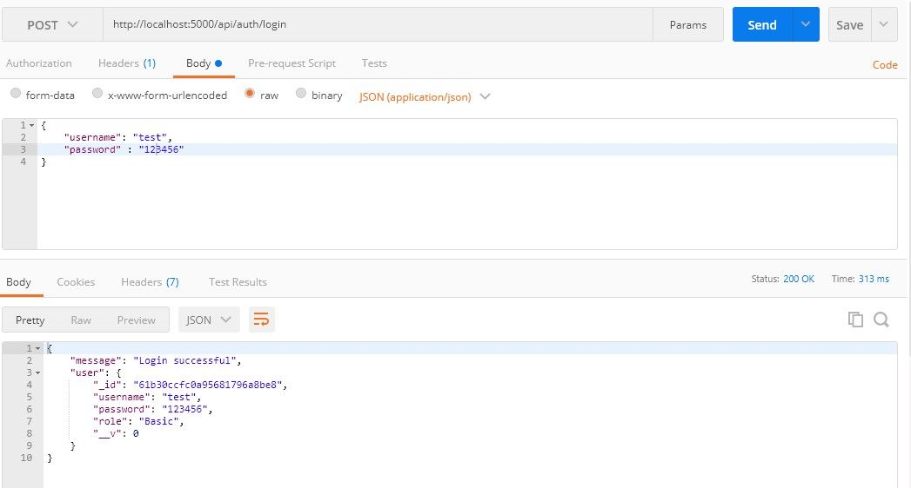
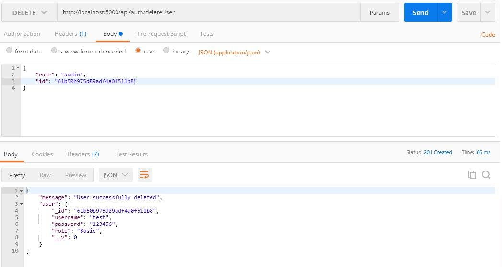

## **Introduction**

Creating a user registration form employs the management of the registered user. This is where user role authentication comes into play. Role authentication ensures that non-admin users cannot make changes or have access to exclusive information. It grants administrative privileges to admin users and basic privileges to basic users.
Authentication is carried out using trusted third-party customer identity and access management (CIAM) software like LoginRadius and web tokens like JSON Web Token (JWT).

## **Goal**

The goal of this tutorial is to show the differences between the Admin role and the Basic user role. Learn about JWT and how to use it to authenticate users.

## **Prerequisites**

This tutorial requires that you have [Node](https://nodejs.org/en/download/) already installed, [MongoDB](https://www.mongodb.com/try/download/community) installed, a [Text Editor](https://code.visualstudio.com/download), and at least a little knowledge of JavaScript [E56 Syntax](https://www.w3schools.com/js/js_es6.asp). Now that we have everything in place, let’s setup our database

## **Setting up database** 

We will be storing all our user's data, which includes username, password, and role, in **MongoDB**.

**Setting up database** 
We need to install a node package called Mongoose that will connect us to MongoDB and create a user `schema` for our application.

    npm init
    npm install mongoose

`npm init` sets up our new project and creates a `package.json` file with the credentials. 

After we have installed mongoose, name a new file `db.js` in the project's directory and require `mongoose`.

    const Mongoose = require('mongoose')

With the help of mongoose, we can connect our application to MongoDB:

    // db.js
    const Mongoose = require("mongoose");
    const localDB = `mongodb://localhost:27017/role_auth`;
    const connectDB = async () => {
      await Mongoose.connect(localDB, {
        useNewUrlParser: true,
        useUnifiedTopology: true,
      });
      console.log("MongoDB Connected");
    };
    module.exports = connectDB;

We connected to  `mongodb://localhost:27017` and then we specified the name of our database `/role_auth`. The function `connectDB` awaits for the connection, which contains the `URI` and `options` as a second parameter. If it connects without errors, it will log out `MongoDB Connected`. Error issues will be fixed when we are connecting  to the database. After this, we exported the function to be used in our server. 

## **Setting up the Server**

We need to install some dependencies that we will use in this tutorial. 

    npm i express nodemon

[Express.js](https://expressjs.com/) is a Node.js framework for building web applications quickly and easily.
[Nodemon](https://www.npmjs.com/package/nodemon) is a tool that watches the file system and automatically restarts the server when there is a change.
We require `express` in our application to listen for a connection on port `5000`. Create a new file `server.js` in the root directory and create the listening event:

    const express = require("express");
    const app = express();
    const PORT = 5000;
    app.listen(PORT, () => console.log(`Server Connected to port ${PORT}`));

The next step is to test our application. We will open up our `package.json` file and add the following to `scripts`

      "scripts": {
        "start": "node server.js",
        "dev": "nodemon server.js"
      }

Open your terminal and run `npm run dev` to start up the server. 

## **Connecting the Database**

Earlier, we created a function that connects to MongoDB and exported that function. Let us import that function into our `server.js`:

    const connectDB = require("./db");
    ...
    //Connecting the Database
    connectDB();

We also need to create an error handler that catches every `unhandledRejection` error.

    ...
    const server = app.listen(PORT, () =>
      console.log(`Server Connected to port ${PORT}`)
    );
    // Handling Error
    process.on("unhandledRejection", (err) => {
      console.log(`An error occurred: ${err.message}`);
      server.close(() => process.exit(1));
    });

The listening event is assigned to a constant `server`. If an `unhandledRejection` error occurs, we log out the error and close the `server` with an exit code of 1.

## **Creating User Schema**

[Schema](https://en.wikipedia.org/wiki/Database_schema) can be seen as a blueprint that shows how the database will be constructed. We will structure a user schema that contains username, password, and role. Let us name a new folder `model` in the project's directory and create a file called `User.js`. Now open `User.js` and create the user's schema:

    // user.js
    const Mongoose = require("mongoose");
    const UserSchema = new Mongoose.Schema({
      username: {
        type: String,
        unique: true,
        required: true
      },
      password: {
        type: String,
        minlength: 6,
        required: true
      },
      role: {
        type: String,
        default: "Basic",
        required: true
      },
    });

In the schema, the `username` will be unique, required, and will accept `strings`. We specified the minimum characters (6) the `password` field will accept. The `role` field grants a default value (basic) that can be changed if desired.
We need to create a user model and export it:

    ...
    const User = Mongoose.model("user", UserSchema);
    module.exports = User;

We created the user model by passing the `UserSchema` as the second argument while the first argument is the name of the model `user`.

## **Performing CRUD Operations**

We will create functions that take care of adding users, getting all users, updating the role of users, and deleting users.

**Register Function**
As the name implies, this function will handle the registrations of users. Let us create a new folder named `Auth`. it will contain the Authentication file and the Route set-up file. Once we have created the folder `Auth`, we will add two files to it, `Auth.js` and `Route.js`.
Let us open up our `Auth.js` file and import that `User` model:

    const User = require("../model/User");

The next step is to create an `async` `express` function that will take the user's data and register it in the database. We need to make use of an [Express middleware](https://expressjs.com/en/guide/writing-middleware.html) function that will grant us access to the user's data from the body. We will make use of this function in the `server.js` file:

    ...
    const app = express();
    app.use(express.json());

Let us go back to our `Auth.js` file and create the register funcation:

    // auth.js
    exports.register = async (req, res, next) => {
      const { username, password } = req.body;
       if (password.length < 6) {
        return res.status(400).json({ message: "Password less than 6 characters" });
      }
      try {
        await User.create({
          username,
          password,
        }).then((user) =>
          res.status(200).json({
            message: "User successfully created",
            user,
          })
        );
      } catch (err) {
        res.status(401).json({
          message: "User not successful created",
          error: error.mesage,
        });
      }
    };

The `register` function we exported will be used to set up our routes. We got the username and password from the `req.body` and created a `tryCatch` block that will create the user if successful else, it returns a status code of `401` with the error message.
**Setting up Register route**
We will create a route to `/register` using `express.Router`, import the `register` function into our `route.js` file, and use it as the route's function:

    const express = require("express");
    const router = express.Router();
    const { register } = require("./auth");
    router.route("/register").post(register);
    module.exports = router;

The last step is to import our `route.js` file as middleware in `server.js`:

    ...
    app.use("/api/auth", require("./Auth/route"));
    ...

Our server will use the `router` middleware function if there is a request to `/api/auth`,
**Testing the Register route**
We will use [Postman](https://www.postman.com/downloads/) to test all our routes.
Open up Postman to make a `POST` request to `http://localhost:5000/api/auth/register` and pass the username and password to the body:

**Login Function**
We created a function that adds registered users to the database. We have to create another function that will authenticate the credentials of the user and check if the user is registered.
Open the `Auth.js` file and let's create the Login function:

    // auth.js
    exports.login = async (req, res, next) => {
      const { username, password } = req.body;
      // Check if username and password is provided
      if (!username || !password) {
        return res.status(400).json({
          message: "Username or Password not present",
        });
      }
    }

In the `login` function, we returned a status code of `400` if the username and password were not provided. We need to find a user with the provided `username` and `password`:

    exports.login = async (req, res, next) => {
      
      ...
      
      try {
        const user = await User.findOne({ username, password });
        if (!user) {
          res.status(401).json({
            message: "Login not successful",
            error: "User not found",
          });
        } else {
          res.status(200).json({
            message: "Login successful",
            user,
          });
        }
      } catch (error) {
        res.status(400).json({
          message: "An error occurred",
          error: error.message,
        });
      }
    };

We returned a status code of `401`when a user isn't found and a status code `200`of when a user is found. We wrapped all this in a `tryCatch` block to detect and output errors if any.
**Setting up Login route**
To set up the login route, we will import the `login` function into our `route.js`:

    const express = require("express");
    const router = express.Router();
    const { register, login } = require("./auth");
    ...
    router.route("/login").post(login);
    module.exports = router;

**Testing the Login route**
Make a `POST` request at `http://localhost:5000/api/auth/login` and pass a valid username and password to the body:

**Update Function**
This function will be charged with the responsibility of updating the role of a basic user to an admin user. Open the `auth.js` file and create the `update` function:

    //auth.js
    exports.update = async (req, res, next) => {
      const { role, id } = req.body;
      // Verifying if role and id is presnt
      if (role && id) {
        // Verifying if the value of role is admin
        if (role === "admin") {
          await User.findById(id);
        } else {
          res.status(400).json({
            message: "Role is not admin",
          });
        }
      } else {
        res.status(400).json({ message: "Role or Id not present" });
      }
    };

The first `if` statement verifies if `role` and `id` are present in the request body. The second `if` statement checks if the value of `role` is admin. We need to do this to avoid having over two roles. 
After finding a user with that ID, we will create a third `if` block that will check for the role of the user: 

    exports.update = async (req, res, next) => {
      const { role, id } = req.body;
      // First - Verifying if role and id is presnt
      if (role && id) {
        // Second - Verifying if the value of role is admin
        if (role === "admin") {
          // Finds the user with the id
          await User.findById(id)
            .then((user) => {
              // Third - Verifies the user is not an admin
              if (user.role !== "admin") {
                user.role = role;
                user.save((err) => {
                  //Monogodb error checker
                  if (err) {
                    res
                      .status("400")
                      .json({ message: "An error occurred", error: err.message });
                    process.exit(1);
                  }
                  res.status("201").json({ message: "Update successful", user });
                });
              } else {
                res.status(400).json({ message: "User is already an Admin" });
              }
            })
            .catch((error) => {
              res
                .status(400)
                .json({ message: "An error occurred", error: error.message });
            });
      
           ...

The third `if` block prevents us from giving an admin role to an admin user, while the last `if` block checks if an error occurred when saving the role in the database.

> The numerous `if` statements might be a little bit tricky but understandable. Please read the comments in the above block of code for better understanding.

**Set up update route**
We will import the `update` function in our `route.js`:

    const { register, login, update } = require("./auth");
    ...
    router.route("/update").put(update);

**Testing the update route**
Make a `put` request to `http://localhost:5000/api/auth/update`:

**Delete Function** 
The `deleteUser` function will remove a specific user from the database. Let us create this function in our `auth.js` file:

    exports.deleteUser = async (req, res, next) => {
      const { id } = req.body;
      await User.findById(id)
        .then((user) => user.remove())
        .then((user) =>
          res.status(201).json({ message: "User successfully deleted", user })
        )
        .catch((error) =>
          res
            .status(400)
            .json({ message: "An error occurred", error: error.message })
        );
    };

We removed the user based on the `id` we got from `req.body`.
**Setting up the** `**deleteUser**` **route**
Let us open our `route.js` file to create a `delete` request to `/deleteUser`, using the `deleteUser` as its function:

    const { register, login, update, deleteUser } = require("./auth");
    ...
    router.route("/deleteUser").delete(deleteUser);

**Testing the** `**deleteUser**` **route**
We will make a `delete` request to `http://localhost:5000/api/auth/deleteUser` by passing a valid `id` to the body:

## **Hashing Users' Password**

Saving users' passwords in the database in plain text format is reckless. It is preferable to hash your password before storing it. For instance, it will be very difficult to decipher the passwords in our database if they were leaked. Hashing password is a cautious and reliable practice.
We will use `bcryptjs` to hash our users' passwords.
Let's install `bcryptjs`:

    npm i bcryptjs

After installing `bcryptjs`, we will import it in our `auth.js`

    const bcrypt = require("bcryptjs");

**Refactoring register function**
Instead of sending a plain text format to our database, let's hash the password using `bcrypt`:

    exports.register = async (req, res, next) => {
      const { username, password } = req.body;
      
      ...
      
      bcrypt.hash(password, 10).then(async (hash) => {
        await User.create({
          username,
          password: hash,
        })
          .then((user) =>
            res.status(200).json({
              message: "User successfully created",
              user,
            })
          )
          .catch((error) =>
            res.status(400).json({
              message: "User not successful created",
              error: error.message,
            })
          );
      });
    };

`bcrypt` takes in our password as the first argument, and the number of times it will hash the password. The larger the number, the longer it will take to decipher. Passing a large number will take `bcrypt` a long time to hash the password so pass a moderate number like 10. 
`bcrypt` will return a promise with the hashed password then we send that hashed password to the database.
**Testing the register function**
Make a `POST` request to `http://localhost:5000/api/auth/register` and pass the username and password to the body:

**Refactoring login function**

    exports.login = async (req, res, next) => {
      const { username, password } = req.body;
      // Check if username and password is provided
      if (!username || !password) {
        return res.status(400).json({
          message: "Username or Password not present",
        });
      }
      try {
        const user = await User.findOne({ username });
        if (!user) {
          res.status(400).json({
            message: "Login not successful",
            error: "User not found",
          });
        } else {
          // comparing given password with hashed password
          bcrypt.compare(password, user.password).then(function (result) {
            result
              ? res.status(200).json({
                  message: "Login successful",
                  user,
                })
              : res.status(400).json({ message: "Login not succesful" });
          });
        }
      } catch (error) {
        res.status(400).json({
          message: "An error occurred",
          error: error.message,
        });
      }
    };

`bcrypt.compare` checks if the password that was given and the hashed password in the database is the same.
**Testing the login function** 
Make a `POST` request to `http://localhost:5000/api/auth/login` and pass a valid username and password to the body:

## **Authenticating Users using JSON Web Token (JWT)**

JSON Web Token helps shield a route from an unauthenticated user. Using `Jwt` on our application will prevent unauthenticated users from accessing our users' home page and will prevent unauthorized users from accessing our admin page.
Jwt` creates a token, sends it to the client, and then the client uses the token when making requests. `Jwt` helps to verify that you're a valid user making those requests.
We have to install `Jwt` before using it in our application:

    npm i jsonwebtoken

**Refactoring Register function**
When a user registers, we will send a token using `Jwt` as a cookie to the client. To create this token, we need to set a secret string. We will make use of the node's in-built package called `crypto` to make random strings:

    node
    require('crypto').randomBytes(35).toString('hex')

Output:

Storing this secret string in an environment variable is a safe practice to avoid it getting leaked. If this secret string is leaked, unauthenticated users can create fake tokens to get access to the route. We will store our secret string in a variable:

    const jwtSecret = '4715aed3c946f7b0a38e6b534a9583628d84e96d10fbc04700770d572af3dce43625dd'

Once we have created our `jwtSecret`, we will now create  an import of `jsonwebtoken` as the token in the `register` function:

    ...
    const jwt = require('jsonwebtoken')
    const jwtSecret = '4715aed3c946f7b0a38e6b534a9583628d84e96d10fbc04700770d572af3dce43625dd'
    exports.register = async (req, res, next) => {
      const { username, password } = req.body;
      
      ...
      
      bcrypt.hash(password, 10).then(async (hash) => {
        await User.create({
          username,
          password: hash,
        })
          .then((user) => {
            const maxAge = 3 * 60 * 60;
            const token = jwt.sign(
              { id: user._id, username, role: user.role },
              jwtSecret,
              {
                expiresIn: maxAge, // 3hrs in sec
              }
            );
            res.cookie("jwt", token, {
              httpOnly: true,
              maxAge: maxAge * 1000, // 3hrs in ms
            });
            res.status(201).json({
              message: "User successfully created",
              user: user._id,
            });
          })
          .catch((error) =>
            res.status(400).json({
              message: "User not successful created",
              error: error.message,
            })
          );
      });
    };

We created the token using jwt's `sign` function. This function takes in three (3) parameters. The payload is the first parament we will pass to the function. This payload holds data concerning the user and this data should not contain sensitive information like passwords. We passed our `jwtSecret` as the second parameter and how long the token will last as the third parameter. After passing all these arguments on to it, `jwt` will now generate a token.
After the token is generated, we send it as a cookie to the client.
**Refactoring Login function**
We will also generate a token for logged in users:

    exports.login = async (req, res, next) => {
          
        ...
          
          bcrypt.compare(password, user.password).then(function (result) {
            if (result) {
              const maxAge = 3 * 60 * 60;
              const token = jwt.sign(
                { id: user._id, username, role: user.role },
                jwtSecret,
                {
                  expiresIn: maxAge, // 3hrs in sec
                }
              );
              res.cookie("jwt", token, {
                httpOnly: true,
                maxAge: maxAge * 1000, // 3hrs in ms
              });
              res.status(201).json({
                message: "User successfully Logged in",
                user: user._id,
              });
            } else {
              res.status(400).json({ message: "Login not succesful" });
            }
          });
        }
      } catch (error) {
        res.status(400).json({
          message: "An error occurred",
          error: error.message,
        });
      }
    };

**Protecting Routes**
To prevent unauthenticated users from accessing our private route, we need to take the token from the cookie, verify the token, and redirect users based on role.
We will get the token from the client using a node package called `cookie-parser`. Let us install the package before using it:

    npm i cookie-parser

After installing it, we will import it into our `server.js` file and use it as a *middleware*:

    const cookieParser = require("cookie-parser");
    ...
    app.use(cookieParser());

We will create our middleware that will verify the token and grant access to our private route.
Let's create a new folder in the project's folder named `middleware` and create a file in it called `auth.js`. 

**Admin authentication**
Open the `auth.js` file and let's create the middleware:

    const jwt = require("jsonwebtoken");
    const jwtSecret =
      "4715aed3c946f7b0a38e6b534a9583628d84e96d10fbc04700770d572af3dce43625dd";
    exports.adminAuth = (req, res, next) => {
      const token = req.cookies.jwt;
      if (token) {
        jwt.verify(token, jwtSecret, (err, decodedToken) => {
          if (err) {
            return res.status(401).json({ message: "Not authorized" });
          } else {
            if (decodedToken.role !== "admin") {
              return res.status(401).json({ message: "Not authorized" });
            } else {
              next();
            }
          }
        });
      } else {
        return res
          .status(401)
          .json({ message: "Not authorized, token not available" });
      }
    };

We requested a token from the client, checked if a token is available, and verified that token. `Jwt` verifies our token with our `jwtSecret` and returns a callback function. This function returns a status code of `401` if the token fails the authentication test.
When we created the token, we passed a payload that contained the credentials of the user. We will get the role from the credentials and check if the role of the user is admin. If the user is not an admin, we return a status code of `401` but if the user is an admin, we will call the `next` function.
**Basic user authentication** 
We will also authenticate basic users before granting them access to the users route. Let's create another middleware in our `auth.js` file that will authenticate basic users:

    exports.userAuth = (req, res, next) => {
      const token = req.cookies.jwt;
      if (token) {
        jwt.verify(token, jwtSecret, (err, decodedToken) => {
          if (err) {
            return res.status(401).json({ message: "Not authorized" });
          } else {
            if (decodedToken.role !== "Basic") {
              return res.status(401).json({ message: "Not authorized" });
            } else {
              next();
            }
          }
        });
      } else {
        return res
          .status(401)
          .json({ message: "Not authorized, token not available" });
      }
    };

**Protecting Routes**
We will have two routes, one for the user and the other for the admin. Let us import this middleware into our `server.js` file and protect our routes:

    const { adminAuth, userAuth } = require("./middleware/auth.js");
    ...
    app.get("/admin", adminAuth, (req, res) => res.send("Admin Route"));
    app.get("/basic", userAuth, (req, res) => res.send("User Route"));

The updating users' roles and deleting users should be done by an Admin, so we need to import this `auth.js` middleware into our `route.js` file to protect the `update` and `delete` routes.
`route.js`:

    const { adminAuth } = require("../middleware/auth");
    router.route("/update").put(adminAuth, update);
    router.route("/deleteUser").delete(adminAuth, deleteUser);
## **Populating the database with Admin User**

We need to create an admin user in our database. Open up your terminal and let's run some [MongoDB methods](https://docs.mongodb.com/manual/reference/method/):

    mongo

After mongo is started, we need to use the `role_auth` database:

    use role_auth

Before we can add our admin user to the database, we need to hash the password using `bcrypt` in `node` terminal. Open node terminal in our projects directory:

    const password = require("bcryptjs").hash("admin", 10)
    password

After we've created the constant `password`, we need to enter `the` `password` in the node terminal to get our hashed password.

We will use the hashed password to create our admin

    db.users.insert({
      username: "admin",
      password: "$2a$10$mZwU9AbYSyX7E1A6fu/ZO.BDhmCOIK7k6jXvKcuJm93PyYuH2eZ3K",
      role: "admin",
    });

To check if it was successfully created, run `db.users.find().pretty()`, this will output all users in the database.

## **Creating the form using EJS**

We will use Embedded JavaScript (EJS) to create the front-end of our application.
Install  the `ejs` package:

    npm i ejs

After we have installed `ejs`, we need to set `ejs` as our default *view engine* in our `server.js` file:

    app.set("view engine", "ejs");

**Rendering Embedded JavaScript**
When making a `GET` request to specific routes, we will render an `ejs` file:

    app.get("/", (req, res) => res.render("home"));
    app.get("/register", (req, res) => res.render("register"));
    app.get("/login", (req, res) => res.render("login"));
    app.get("/admin", adminAuth, (req, res) => res.render("admin"));
    app.get("/basic", userAuth, (req, res) => res.render("user"));

**Creating EJS files**
By default, our application will look into the `views` folder when rendering an `ejs` file. We need to create the `views` folder in our project's folder and add our `ejs` files to it:

**Creating** **a** **Home page**
Our Home page will contain the links to `/login` and `/register` ejs file. Open up `home.ejs` and let's add these links:

    <!DOCTYPE html>
    <html lang="en">
    <head>
      <meta charset="UTF-8">
      <meta name="viewport" content="width=device-width, initial-scale=1.0">
      <title>Home page</title>
    </head>
    <body>
      <h1> Home Page </h1>
      <a href="/register"> Register</a>  
      <a href="/login">Login</a>
    </body>
    </html>

**Creating** **a Registration** **form**
Embedded JavaScript (EJS) supports HTML syntax. We will create the registration form in `register.ejs` using normal HTML Syntax:

    <!DOCTYPE html>
    <html lang="en">
    <head>
      <meta charset="UTF-8">
      <meta name="viewport" content="width=device-width, initial-scale=1.0">
      <title>Register Page</title>
    </head>
    <body>
      <h1>Register Page</h1>
      <form >
        

 
        <label for="username">Username</label> 
        <input type="text" id="username" required/> 
        <label for="password">Password</label> 
        <input type="password" id="password" required> 
        <input type="submit" value="register"> 
      </form>
      <a href="/login">Already registered? Login</a>
    </body>
    </html>

**Adding POST request functionality** 
We need to get the username and password the user entered and pass it to the body when making the `POST` request:

    ...
    
    </body>
    </html>

We made use of JavaScript's in-built library called `fetch` to make a POST request to `/api/auth/register`, After the request has been made, we stored the response to a constant `res`. `res.json` will return the JSON we passed as a response in the API. When `res.json` returns the data, we store that data in a constant `data`. If we get an error while making the request, we will display the error to the user. If an error isn't found, we will now redirect the users based on their role on different routes.
**Creat****e** **Login form**
Creating our login form and adding functionality to it will be similar to that of our registration. Open `login.ejs` and create this form:

    <!DOCTYPE html>
    <html lang="en">
    <head>
      <meta charset="UTF-8">
      <meta name="viewport" content="width=device-width, initial-scale=1.0">
      <title>Login Page</title>
    </head>
    <body>
      <h1>Login Page</h1>
      <form>
        

 
        <label for="username" >Username</label> 
        <input type="text" id="username" required/> 
        <label for="password">Password</label> 
        <input type="password" id="password" required> 
        <input type="submit" value="login"> 
        </form>
      <a href="/register">Don't have an accout? Register</a>
    </body>
    </html>

**Adding POST request functionality** 

    
    </body>
    </html>
## **Adding Registered users to the Route**

Once we have redirected users based on role to different routes, we will display all registered users on that route. We need to make a `GET` request to `/getUsers`.
Open `auth.js` file in `Auth` folder:

    exports.getUsers = async (req, res, next) => {
      await User.find({})
        .then((users) => {
          const userFunction = users.map((user) => {
            const container = {};
            container.username = user.username;
            container.role = user.role;
            return container;
          });
          res.status(200).json({ user: userFunction });
        })
        .catch((err) =>
          res.status(401).json({ message: "Not successful", error: err.message })
        );
    };

The `User.find` method returns an array of users. After we mapped through this array, we stored the username and role in the constant `container` and returned the `container`.
**Displaying registered user in** `**user**` **route**
We rendered `user.ejs` when accessing the `/user` route. Now we will display all registered users to that route.
`user.ejs`:

    <!DOCTYPE html>
    <html lang="en">
    <head>
      <meta charset="UTF-8">
      <meta http-equiv="X-UA-Compatible" content="IE=edge">
      <meta name="viewport" content="width=device-width, initial-scale=1.0">
      <title>User page</title>
    </head>
    <body>
      <h1>Users</h1>
      <ul></ul>
      
    </body>
    </html>

**Add Update and Delete function to the Admin Route**
We will also display registered users to the admin route but we will add `update` and `delete` functionality to the route:
`admin.ejs`:

    <!DOCTYPE html>
    <html lang="en">
    <head>
      <meta charset="UTF-8">
      <meta http-equiv="X-UA-Compatible" content="IE=edge">
      <meta name="viewport" content="width=device-width, initial-scale=1.0">
      <title>Admin page</title>
    </head>
    <body>
      

      <h1>Users</h1>
      <ul></ul>
      
    </body>
    </html>

**Editing** **the** **user's role**
We will create an event listener that will listen for a click on the `Edit Role` button. When the button is clicked, we will send a `PUT` request to `/api/auth/update`:

    

**Deleting Users**
Deleting Users from the database should be the duty of an admin.
`admin.ejs`

    

We created an event listener that listens for a click on the `Delete User`  button. When the button is clicked, we will send a `DELETE` request to `/api/auth/deleteUser`.

> Please make sure the admin user is first on the list to avoid populating the database with an admin user again.
## **Logout**

To log out users, we need to remove the token from the client and redirect the client to the home page.
We will create a `GET` request to `/logout` in the `server.js` file:

    app.get("/logout", (req, res) => {
      res.cookie("jwt", "", { maxAge: "1" });
      res.redirect("/");
    });

We replaced the `Jwt` token with an empty string and gave it a lifespan of 1 second.
After creating the `GET` request, we will add a logout button to the admin's route and user's route:

    ...
    <ul></ul>
    <button class="logout"> <a href="/logout">Log Out</a></button>
    ...

## **Login Radius**
[LoginRadius](https://www.loginradius.com/docs/api/v2/getting-started/introduction/) is a SaaS-based customer identity and access management (CIAM) system with features to manage customer identity, privacy, and access. It is a simple, implementable solution for adding user authentication and authorization to your website.
Login radius handles user registration, login, and authentication. More features of Login radius includes:
    - **Forms**: Login radius can automatically generate registration and login forms
    - [**Authentication and Authorization**](https://www.loginradius.com/docs/developer/tutorial/node-js/): It generates and sends token to the user when login or user registration is successful. Instead of using `Jwt`, we can use this token to authenticate users
    - **Security**: When using Login radius, you automatically have access to an admin console where you can control authentication factors regarding the app.
To get started with Login radius, you need to [create an account](https://accounts.loginradius.com/auth.aspx?action=register) with either the Free plan or the Developers pro plan, customize your registration and login forms, and start managing your users.
**How to authenticate using Login Radius**
In this section, we will briefly cover how  authentication works using **Login Radius**.
Sign up to [Login radius](https://accounts.loginradius.com/auth.aspx?return_url=https://dashboard.loginradius.com/login&action=register), and choose a name for the app.
> 

After we are through with the registration process, we can get our **App Name**, **API Key**, and **API Secret** from the `[configuration](https://dashboard.loginradius.com/configuration)` link on the side bar. With these configurations, we can easily link the server side of our application to **LoginRadius**.

**LoginRadius** automatically generates a link that will be used to authenticate  users. This link contains the name of our **LoginRadius** application and a `url` that authenticated users will be redirected to.
`https://<LoginRadius-APP-Name>.hub.loginradius.com/auth.aspx?action=login&return_url=<Return-URL>`
An instance of the link is given below:
`https://noderoleauth.hub.loginradius.com/auth.aspx?action=login&return_url=http://localhost:5000`.

## **Conclusion**

We have successfully learned how to perform CRUD operations using MongoDB as database, hash passwords, authenticate using `Jwt`, and render Embedded JavaScript (EJS). You can put all these together to build more complex applications.

## **Resources** 
- [GitHub Repo](https://github.com/uma-victor1/role_auth)
- [Login radius with NodeJS article](https://www.loginradius.com/docs/developer/tutorial/node-js/)
- [Login radius with NodeJS video](https://www.youtube.com/watch?v=efM46qNSaeg)

