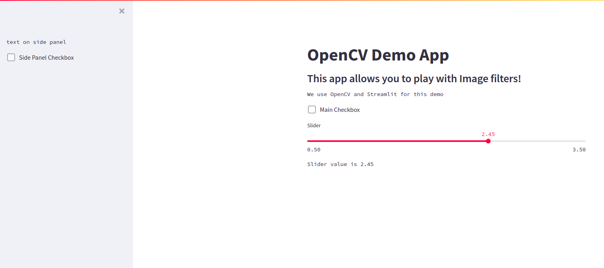
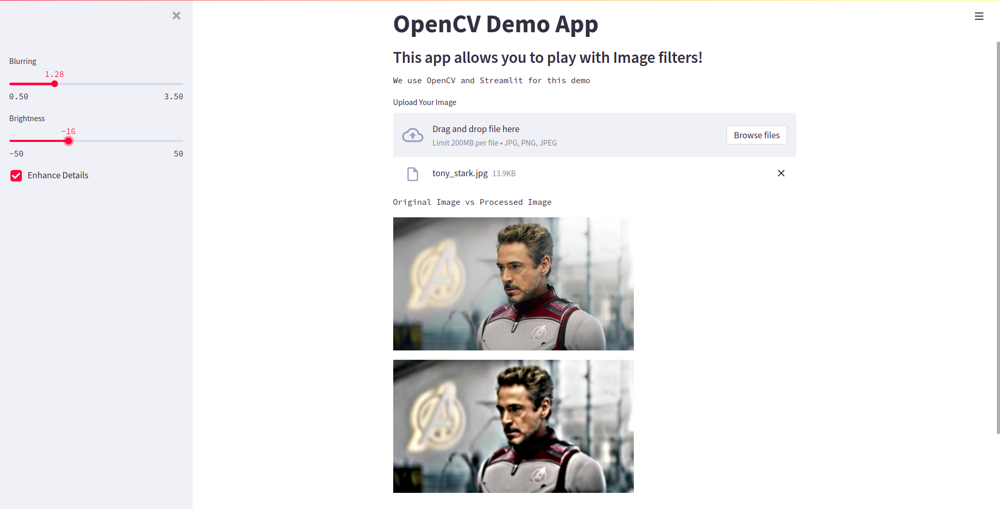

In this tutorial, you'll learn how to easily convert an OpenCV project into a web app that you can showcase. You'll use a library called Streamlit, which helps you easily build a web user interface in Python. Yes, you heard it right — no HTML, CSS, or JavaScript required. Just Python!

## Prerequisites
- You should be comfortable using basic [OpenCV](https://opencv.org/) functions.
- You should be comfortable coding in Python.

Let's get started.

## Install Dependencies

Install OpenCV and Streamlit using pip. You would also need Pillow — another image library.

```py
pip install opencv-python streamlit Pillow
```
> If you use Python 2.7, note that OpenCV doesn't directly support Python 2.7 in their latest versions. Accordingly, you have to specify an older version like this `pip install opencv-python==4.2.0.32`

## Create a Small OpenCV Project

```py
import cv2

def brighten_image(image, amount):
    img_bright = cv2.convertScaleAbs(image, beta=amount)
    return img_bright

def blur_image(image, amount):
    img = cv2.cvtColor(image, 1)
    blur_img = cv2.GaussianBlur(img, (11, 11), amount)
    return blur_img

def enhance_details(img):
    hdr = cv2.detailEnhance(img, sigma_s=12, sigma_r=0.15)
    return hdr

img = cv2.imread(filename='tony_stark.jpg')

# do some cool image processing stuff
img = enhance_details(img)
img = brighten_image(img, amount=25)
img = blur_image(img, amount=0.2)

cv2.imshow('Tony Stark', img)
cv2.waitKey(0)
cv2.destroyAllWindows()
```

Here are three image processing functions that accept an image, do some processing, and return the processed image.
1. `brighten_image` — increases the brightness of the image.
2. `blur_image` — applies a blur effect on the image.
3. `enhance_details` — applies an effect to enhance the details of the image.

These functions make use of the OpenCV functions to do the actual processing — for e.g.: cv2.GaussianBlur, etc. I'm not explaining in-depth about them and the various parameters they accept since this tutorial is more focused on integrating OpenCV with Streamlit. However, feel free to jump to the OpenCV documentation to know more details about them. 

This program reads the image from the `filepath` using `cv2.imread()`; then, it passes the image to these functions that do the processing. Finally, the image is displayed using `cv2.imshow()`. `cv2.waitKey(0)` is to wait till the user presses any key, after which the program is exited.

## Streamlit Basics

Streamlit offers some common UI components out of the box that you can place on your webpage. This makes it super easy to code up something real quick. The way Streamlit works is that it reruns the Python script every time a user interacts with the components. They have some caching and optimizations, but this simple design makes it easy to build interactive webpages using Streamlit.

> Someone said, “Talk is cheap. Show me the code.” So, let's see some code.

Open an editor and copy-paste this to `demo-app.py`

```py
import streamlit as st

st.title("OpenCV Demo App")
st.subheader("This app allows you to play with Image filters!")
st.text("We use OpenCV and Streamlit for this demo")
if st.checkbox("Main Checkbox"):
    st.text("Check Box Active")

slider_value = st.slider("Slider", min_value=0.5, max_value=3.5)
st.text(f"Slider value is {slider_value}")

st.sidebar.text("text on side panel")
st.sidebar.checkbox("Side Panel Checkbox")
```
To start a streamlit app, simply run the command `streamlit run` with the filename — for example:

```py
streamlit run demo-app.py
```

You should get a similar output as follows. 

```
  You can now view your Streamlit app in your browser.

  Local URL: http://localhost:8501
  Network URL: http://192.168.1.8:8501
```
Click on the links in the output to open the Streamlit app in your browser. You'll see something as follows. 



If you see the code, it's very straightforward. It imports streamlit as st. The default is a simple linear layout where you can place components on the webpage in a sequential manner.

For example, `st.title() , st.checkbox(), st.slider()` places the components on the main page in the order they're called.. 

Streamlit also offers a side panel. In order to place components in the sidepanel, you can do as follows:

`st.sidebar.title() , st.sidebar.checkbox(), st.sidebar.slider()`

There are other components also apart from these. You can [explore more in the docs](https://docs.streamlit.io/library/get-started).

## Integrate Streamlit into Your OpenCV Project

Let's integrate your OpenCV program into Streamlit. Here is the complete code:

```py
import cv2
import streamlit as st
import numpy as np
from PIL import Image


def brighten_image(image, amount):
    img_bright = cv2.convertScaleAbs(image, beta=amount)
    return img_bright


def blur_image(image, amount):
    blur_img = cv2.GaussianBlur(image, (11, 11), amount)
    return blur_img


def enhance_details(img):
    hdr = cv2.detailEnhance(img, sigma_s=12, sigma_r=0.15)
    return hdr


def main_loop():
    st.title("OpenCV Demo App")
    st.subheader("This app allows you to play with Image filters!")
    st.text("We use OpenCV and Streamlit for this demo")

    blur_rate = st.sidebar.slider("Blurring", min_value=0.5, max_value=3.5)
    brightness_amount = st.sidebar.slider("Brightness", min_value=-50, max_value=50, value=0)
    apply_enhancement_filter = st.sidebar.checkbox('Enhance Details')

    image_file = st.file_uploader("Upload Your Image", type=['jpg', 'png', 'jpeg'])
    if not image_file:
        return None

    original_image = Image.open(image_file)
    original_image = np.array(original_image)

    processed_image = blur_image(original_image, blur_rate)
    processed_image = brighten_image(processed_image, brightness_amount)

    if apply_enhancement_filter:
        processed_image = enhance_details(processed_image)

    st.text("Original Image vs Processed Image")
    st.image([original_image, processed_image])


if __name__ == '__main__':
    main_loop()
```

**Let's understand what's happening here.**

Apart from the image processing functions, you have a 'main_loop' function to add the logic for the webpage.

Nothing fancy about `st.title(), st.subheader(), st.text()` — they just print some text in different sizes.

Next, there are two sliders to get the amount by which you need to apply the blur and brightness filters.

Note that `st.sidebar` places these components in the sidebar.

`slider()` takes in some arguments: name of the slider, min value, max value, and the default value of the slider. This function returns the current value of the slider.

Next, there's a checkbox component.

`checkbox()` returns _True_ if the checkbox is checked; else, it would return _False_.

Next, there's a `file_uploader` component, through which users can upload files of different types specified by the `type` parameter. Here, it's restricted to the image file types needed for the demo usecase.

When the program starts, there are no files selected by the user. At this time, this component returns _None_. When a file is uploaded from the UI, this component returns the path of the file. 

This is why there's an if-check on the return value of this component. If no files are selected, you can skip the rest of the program by returning from the `main_loop()` function.

Remember that the entire program is rerun whenever there's user interaction on any components of the page. When a user uploads a file, the whole program is executed again — and the if-check fails so that the program executes the image processing logic.

`Pillow.Image()` is used to open this file, then it's converted to a numpy array using `np.array()` so that OpenCV can process it.

Now, it's passed to the different processing functions along with the `amount` parameter.

Finally, the program displays the original and processed images using the `st.image()` component.

The web app is ready! 

To start the app, simply run:

```
streamlit run demo-app.py
```
Now you can play with the filters. Of course, these are some basic filters, but you can extend it to more interesting filters — like cartoonify filters, etc. — using the rich features of OpenCV.



## How to Publish Your App?

To publish your app, you need to host this program somewhere. There are different hosting providers for complex projects. But for this hobby project, is there a simple and quick solution?

Yes, there's one!

You can host the Streamlit application in [Streamlit Cloud](https://streamlit.io/cloud) for free. You can host up to 3 apps in an account for free with up to 1GB of memory.

Check out [this tutorial](https://docs.streamlit.io/streamlit-cloud/community) from the community to host your app in Streamlit Cloud.

## Conclusion
You can find the source code for this tutorial [here](https://github.com/LoginRadius/engineering-blog-samples/tree/master/Python/OpenCV-Streamlit-Integration). The web app discussed above is [hosted here](https://share.streamlit.io/dingusagar/opencv-streamlit-demo/main/demo-app.py) if you want to try it out.

Want to add user authentication and registration in your app quickly? Check out the [LoginRadius Python integration](https://www.loginradius.com/integrations/python/).