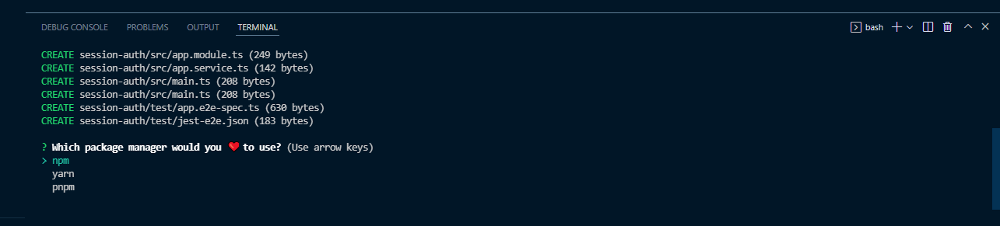
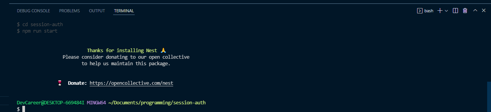
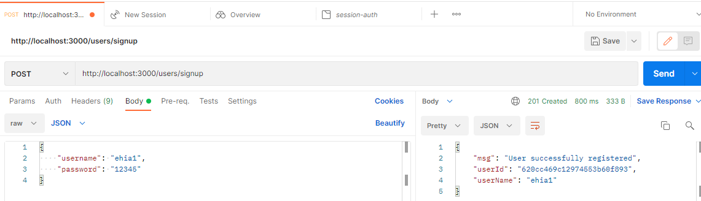
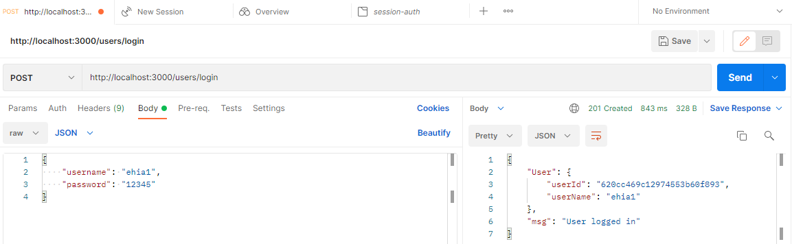
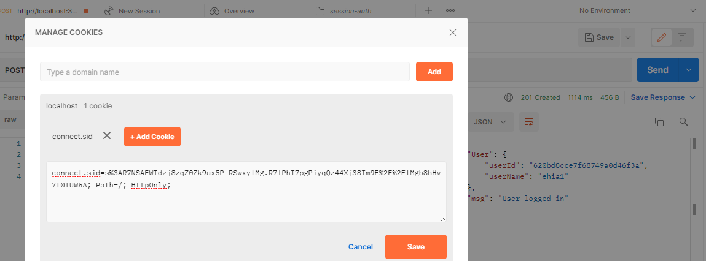
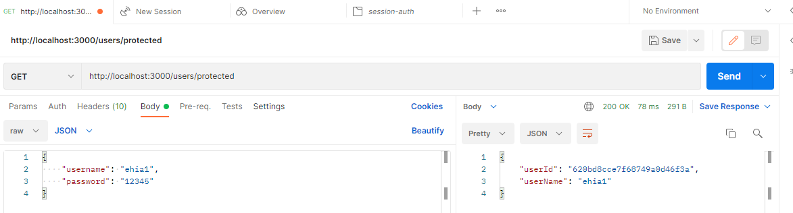
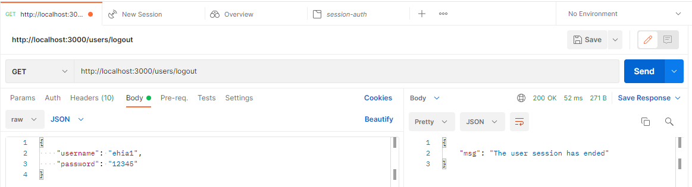

# Session Based Authentication with NestJS and MongoDB

## **Introduction**

 It is an indisputable reality that authentication is critical in any application or system if the users' data are to be kept secured and information accessed properly. Authentication is the procedure of establishing or demonstrating that something is true, legitimate, or valid. 

## **Prerequisites**

****This tutorial is a hand-on-demonstration to follow along, ensure you have the following in place:

- You have [Nodejs](https://www.google.com/url?sa=t&rct=j&q=&esrc=s&source=web&cd=&cad=rja&uact=8&ved=2ahUKEwiQmdvdron2AhX9i_0HHVPhB60QFnoECAMQAQ&url=https%3A%2F%2Fnodejs.org%2F&usg=AOvVaw1tY2p-vJFWJmxWlq4sTxCn) running in your system because NestJS is a Node.js framework.
- [MongoDB](https://www.googleadservices.com/pagead/aclk?sa=L&ai=DChcSEwj_95v8ron2AhUYp3cKHfJiAhMYABAAGgJlZg&ohost=www.google.com&cid=CAESWOD25sTjxoYA5Ghzh2zT3L9DaO2Ioxi88MQFmkeMIE5RtE5Rj8H3WXe48rA_D1UxuaVjVEfJTiVmqH15VvyiiwSgN4iYLs5m-GPx9Oj3-VfqYYUHpwiawQI&sig=AOD64_0-5XcErPSG2VDjqHDMKERNSmKcyg&q&adurl&ved=2ahUKEwi2xpD8ron2AhXylP0HHeoXDgIQ0Qx6BAgDEAE) installed.

## What is NestJS?

Nest (NestJS) is a Node.js server-side application framework for building scalable, efficient applications. It is written in TypeScript and combines the programming paradigms (Object-Oriented Programming, Functional Programming, and Functional Reactive Programming). 
NestJS is built on Express, a very minimalistic framework that is great on its own but lacks structure. It is a framework to use if you want a lot of structure on your backend; its syntax and structure are very similar to angular, a front-end framework; it uses typescript, services, and dependency injection in the same way that angular does.
It employs modules and controllers, and you can build controllers for a file using the command-line interface.
NestJS modules allow you to group related controllers and service providers into a single code file. Simply put, a NestJS module is a TypeScript file with a module class, annotated with a @Module() decorator; NestJS uses the metadata provided by the @Module() decorator to organize the application structure. This decorator informs the NestJS framework about which controllers, service providers, and other associated resources will be instantiated and used by the app code later.

## **What is Session-based Authentication?**

Session-based authentication is a method of user authentication in which the server creates a session after a successful log-in, with the session ID stored on a cookie or local storage in your browser. Upon subsequent requests, your cookie is validated against the session ID stored on the server. If there is a match, the request is considered valid and is processed. When using this method of authentication, it is critical to keep the following security best practices in mind:

- Generate long and random Session IDs (128 bits is the recommended length) to prevent brute force attacks. 
- Avoid storing any sensitive or user-specific data. 
- Make HTTPS communications mandatory for all session-based apps. 
- Make cookies that have secure and HTTP-only attributes. 

## **Why Session-based Authentication****?**

****Session-based authentication is more secure than most authentication methods because it is simple to use, secure, and has a limited storage size. It is also thought to be the best option for websites in the same root domain.

## **Project Setup**

We start our project setup by installing Nest CLI globally; you don’t need to do this if you already have NestJS CLI installed. The Nest CLI is a command-line interface tool for setting up, developing and maintaining Nest applications.

    npm i -g @nestjs/cli

Now, let’s set up our project by running the command below:

    nest new session-based-auth

The above command will create a Nest application with some boilerplates, then prompts you to choose your preferred package manager to install the required modules to run your application. For the demonstration in this tutorial, we’ll use **npm**. Hit the enter key to continue with **npm**.

If everything went well, you should see an output like the one on the screenshot below on your terminal.

Once the installation is complete, move into your project directory, and run the application with the command below:

    npm run start:dev

The above command will run the application and watch for changes. Our project **src** folder structure should look like this.

    └───src
    │   └───app.controller.ts
    │   └───app.modules.ts
    │   └───app.service.ts
    │   └───main.ts

## Install Dependencies
****
Now that our application is setup, let's install the dependencies needed to get us started.

    npm install --save @nestjs/passport passport passport-local

Passport.js is the most popular nest.js authentication library. 
 
Also install the types for the strategy with the command below:
It contains type definitions for passport-local.

    npm install --save-dev @types/passport-local

## **Setting up MongoDB Database in NestJS**

To set-up/connect your database, install Mongoose package and the NestJS wrapper with the command below:.

    npm install --save @nestjs/mongoose mongoose

The mongoose NestJS wrapper helps you use mongoose in the NestJS application and gives approved typescript support.

Now, head over to your app.module.ts file, import the **Mongoose** ****Module from **@nestjs/mongoose,** and call the **forRoot()** method, a method provided by the Mongoose Module, pass in your database URL string. 

Setting up your database connection in the **app.module.ts** file helps your application connect to the database immediately server starts; after running your application since it’s the first module to be loaded.

app.module.ts 

    import { Module } from '@nestjs/common';
    import { MongooseModule } from '@nestjs/mongoose';
    import { AppController } from './app.controller';
    import { AppService } from './app.service';
    
    @Module({
      imports: [MongooseModule.forRoot(
        'mongodb+srv://<username>:<password>@cluster0.kngtf.mongodb.net/session-auth?retryWrites=true&w=majority'
        )],
      controllers: [AppController],
      providers: [AppService],
    })
    export class AppModule {}

## **C****reating Users Module**

 For separation concerns, to make your code clean and well organized, create a module specifically for users using the NestJS CLI by running the below command:

    nest g module users

The above command will create a users folder with the users.module.ts file and update the app.module.ts file. 

Also, create users.service.ts and *users.controller.ts* files with the commands below: 

    nest g service users
    nest g controller users

Note that you can create your folders and files manually without using the nest CLI, but using the CLI automatically update the necessary folders and make your life easier.

## **Creating the User Schema**

The next step is to create your UserSchema, but first, add a *users.model.ts* file, where you will create **UserSchema**. 

This should be the shape of our application **src** folder now.

    └───src
    │   └───users
    │   │   └───users.controller.ts
    │   │   └───users.model.ts
    │   │   └───users.module.ts
    │   │   └───users.service.ts
    │   └───app.controller.ts
    │   └───app.module.ts
    │   └───app.service.ts
    │   └───main.ts

To create the **UserSchema**, import everything as mongoose from the mongoose package in the *users.model.ts* file,  call the new mongoose schema, a blueprint of the user Model, pass in a JavaScript object where you will define the user object and data. 

users.model.ts

    import * as mongoose from 'mongoose';
    export const UserSchema = new mongoose.Schema({
        username: {
            type: String,
            required: true,
            unique: true
        },
        password: {
            type: String,
            required: true
        },
    }, { timestamps: true });
    
    export interface User extends mongoose.Document {
        _id: string;
        username: string;
        password: string;
    }

Also, create an interface for your Model that extends mongoose*.* A document that will help you populate your MongoDB collections. 

Head over to your *users.module.ts* file and import MongooseModule in the imports array, call the **forFeature()** method provided by MongooseModule, then pass in an array of object that takes in name and schema. 

This will enable you to share the file anywhere with the help of dependency injection. 

users.module.ts

    import { Module } from "@nestjs/common";
    import { MongooseModule } from "@nestjs/mongoose";
    import { UsersController } from "./users.controller";
    import { UserSchema } from "./users.model";
    import { UsersService } from "./users.service";
    @Module({
        imports: [MongooseModule.forFeature([{name: 'user', schema: UserSchema}])],
        controllers: [UsersController],
        providers: [UsersService],
    })
    export class UsersModule{}

In your *users.module.ts* file, export the **UsersService**, to enable you to access it in another module.

users.module.ts

    import { Module } from "@nestjs/common";
    import { MongooseModule } from "@nestjs/mongoose";
    import { UsersController } from "./users.controller";
    import { UserSchema } from "./users.model";
    import { UsersService } from "./users.service";
    @Module({
        imports: [MongooseModule.forFeature([{name: 'user', schema: UserSchema}])],
        controllers: [UsersController],
        providers: [UsersService],
        exports: [UsersService]
    })
    export class UsersModule{}

It's usually a good idea to encapsulate the business logic in a separate class. Such a class is known as a service. The job of this class is to process the controller's requests and perform the business logic. 

In your *users.service.ts* file, import Model from mongoose, User from your **users.model.ts** and **InjectModel** from **@nestjs/mongoose**; add a method to the **UsersService** class that takes a username and password, call the method **insertUser().** 

users.service.ts

    import { Injectable } from '@nestjs/common';
    import { InjectModel } from '@nestjs/mongoose';
    import { Model } from 'mongoose';
    import { User } from './users.model';
    @Injectable()
    export class UsersService {
      constructor(@InjectModel('user') private readonly userModel: Model<User>) {}
      async insertUser(userName: string, password: string) {
        const username = userName.toLowerCase();
        const newUser = new this.userModel({
          username,
          password,
        });
        await newUser.save();
        return newUser;
      }
    }

 
Now that the **UsersService** class is ready, you need to inject it into your controller but first, let us talk about storing the users' passwords securely. 

The most critical aspect of the registration procedure is the users’ passwords, which **must** not be saved in plain text. It is the responsibility of the user to create a strong password, but it is your obligation as a developer to keep their passwords secure. If a database breach occurs, the users' passwords would be exposed, and what happens if it’s stored in plain text? I believe you know the answer. To address this, hash the passwords using bcrypt.

So, install **bcrypt** and **@types/bcrypt** with the command below:

    npm install @types/bcrypt bcrypt

With that out of the way, set up your controller. First, import your **UsersService** class and everything from **bcrypt**, then add a constructor and a method that allows you to add a user; it will handle incoming post requests, call it **addUser,** with a function body where you will hash the password.

users.controller.ts

    import { Body, Controller, Post } from '@nestjs/common';
    import { UsersService } from './users.service';
    import * as bcrypt from 'bcrypt';
    @Controller('users')
    export class UsersController {
      constructor(private readonly usersService: UsersService) {}
      //post / signup
      @Post('/signup')
      async addUser(
        @Body('password') userPassword: string,
        @Body('username') userName: string,
      ) {
        const saltOrRounds = 10;
        const hashedPassword = await bcrypt.hash(userPassword, saltOrRounds);
        const result = await this.usersService.insertUser(
          userName,
          hashedPassword,
        );
        return {
          msg: 'User successfully registered',
          userId: result.id,
          userName: result.username
        };
      }
    }

The registration happens in the *app.module.ts* file, so it is achieved by adding the UsersModule to the **@Module()** decorator's imports' array in the *app.module.ts* file.

app.module.ts

    import { Module } from '@nestjs/common';
    import { MongooseModule } from '@nestjs/mongoose';
    import { AppController } from './app.controller';
    import { AppService } from './app.service';
    import { UsersModule } from './users/users.module';
    
    @Module({
      imports: [MongooseModule.forRoot(
        'mongodb+srv://<username>:<password>@cluster0.kngtf.mongodb.net/session-auth?retryWrites=true&w=majority'
        ), UsersModule],
      controllers: [AppController],
      providers: [AppService],
    })
    export class AppModule {}

Congratulations! you are done with the registration, you can now register a user with a username and password.
 
Now, with registration out of the way, add a getUser function to your **UsersService** with the **findOne** method to find a user by username.
 
 users.service.ts

    import { Injectable } from '@nestjs/common';
    import { InjectModel } from '@nestjs/mongoose';
    import { Model } from 'mongoose';
    import { User } from './users.model';
    @Injectable()
    export class UsersService {
      constructor(@InjectModel('user') private readonly userModel: Model<User>) {}
      async insertUser(userName: string, password: string) {
        const username = userName.toLowerCase();
        const newUser = new this.userModel({
          username,
          password,
        });
        await newUser.save();
        return newUser;
      }
      async getUser(userName: string) {
        const username = userName.toLowerCase();
        const user = await this.userModel.findOne({ username });
        return user;
      }
    }

## **C****reating an Authentication Module**

Just as for users, create an auth module and service specifically for all the **authentications/verifications**. To do that, run the following commands:

    nest g module auth
    nest g service auth

The above will create an auth folder, *auth.module.ts*, *auth.service.ts*; update the *auth.module.ts* and *app.module.ts* files.

At this point, the shape of your application **src** folder should look like this.

    └───src
    │   └───auth
    │   │   └───auth.module.ts
    │   │   └───auth.service.ts
    │   └───users
    │   │   └───users.controller.ts
    │   │   └───users.model.ts
    │   │   └───users.module.ts
    │   │   └───users.service.ts
    │   └───app.controller.ts
    │   └───app.module.ts
    │   └───app.service.ts
    │   └───main.ts

## Authenticating a User

Go to your *auth.module.ts* file and add **UsersModule** in the imports array to enable access to the **UsersService** exported from the *users.module.ts* file.

auth.module.ts

    import { Module } from '@nestjs/common';
    import { UsersModule } from 'src/users/users.module';
    import { AuthService } from './auth.service';
    
    @Module({
      imports: [UsersModule],
      providers: [AuthService]
    })
    export class AuthModule {}

In your *auth.service.ts* file, call the constructor so you can inject the **UsersService**, add a method for validation that will take a username and password.

To add some basic validations, check if the user exists in the database, compare the given password with the one in your database to ensure it matches, then returns the user in *request.user* object if exist, else return null.

auth.service.ts

    import { Injectable, NotAcceptableException } from '@nestjs/common';
    import { UsersService } from 'src/users/users.service';
    import * as bcrypt from 'bcrypt';
    
    @Injectable()
    export class AuthService {
      constructor(private readonly usersService: UsersService) {}
      async validateUser(username: string, password: string): Promise<any> {
        const user = await this.usersService.getUser(username);
        const passwordValid = await bcrypt.compare(password, user.password)
        if (!user) {
            throw new NotAcceptableException('could not find the user');
          }
        if (user && passwordValid) {
          return {
            userId: user.id,
            userName: user.username
          };
        }
        return null;
      }
    }

Going further, add a new file and call it local.strategy.ts. This file will represent the strategy from *Passport.js*, which you installed earlier, that is the **local strategy**, and within it, pass in the strategy, which is the **Strategy** from passport-local,

Create a constructor and inject the **AuthService**, call the **super()** method. 

local.strategy.ts

    import { Injectable, UnauthorizedException } from '@nestjs/common';
    import { PassportStrategy } from '@nestjs/passport';
    import { Strategy } from 'passport-local';
    import { AuthService } from './auth.service';
    @Injectable()
    export class LocalStrategy extends PassportStrategy(Strategy) {
      constructor(private readonly authService: AuthService) {
        super();
      }
      async validate(username: string, password: string): Promise<any> {
        const userName = username.toLowerCase();
        const user = await this.authService.validateUser(userName, password);
        if (!user) {
          throw new UnauthorizedException();
        }
        return user; 
      }
    } 

Go back to your *auth.module.ts* file, add **PassportModule** to imports and **LocalStrategy** to providers.

auth.module.ts

    import { Module } from '@nestjs/common';
    import { PassportModule } from '@nestjs/passport';
    import { UsersModule } from 'src/users/users.module';
    import { AuthService } from './auth.service';
    import { LocalStrategy } from './local.strategy';
    
    @Module({
      imports: [UsersModule, PassportModule],
      providers: [AuthService, LocalStrategy]
    })
    export class AuthModule {}

Now, add the login route to your users.controller.ts.

users.controller.ts

    import {
      Body,
      Controller,
      Post,
      Request,
    } from '@nestjs/common';
    import * as bcrypt from 'bcrypt';
    import { UsersService } from './users.service';
    @Controller('users')
    export class UsersController {
      constructor(private readonly usersService: UsersService) {}
      //post / signup
      @Post('/signup')
      async addUser(
        @Body('password') userPassword: string,
        @Body('username') userName: string,
      ) {
        const saltOrRounds = 10;
        const hashedPassword = await bcrypt.hash(userPassword, saltOrRounds);
        const result = await this.usersService.insertUser(
          userName,
          hashedPassword,
        );
        return {
          msg: 'User successfully registered',
          userId: result.id,
          userName: result.username
        };
      }
      //Post / Login
      @Post('/login')
      login(@Request() req): any {
        return {User: req.user,
                msg: 'User logged in'};
      }
    }

Now that you have all these put in place, you still can not log in a user because there is nothing to trigger the login route. We will use [GUARD](https://docs.nestjs.com/guards) to achieve that.
 
Create a file and call it local.auth.guard.ts, then a class LocalAuthGuard that extends AuthGuard from NestJS/passport, where you will provide the name of the strategy and pass in the name of your strategy, ‘local’.

local.auth.guard.ts.

    import { Injectable } from '@nestjs/common';
    import { AuthGuard } from '@nestjs/passport';
    @Injectable()
    export class LocalAuthGuard extends AuthGuard('local') {}

Add the **UseGuard** decorator to your login route in the *users.controller.ts* file and pass in the **LocalAuthGuard**.

users.controller.ts

    import {
      Body,
      Controller,
      Post,
      UseGuards,
      Request,
    } from '@nestjs/common';
    import * as bcrypt from 'bcrypt';
    import { LocalAuthGuard } from 'src/auth/local.auth.guard';
    import { UsersService } from './users.service';
    @Controller('users')
    export class UsersController {
      constructor(private readonly usersService: UsersService) {}
      //post / signup
      @Post('/signup')
      async addUser(
        @Body('password') userPassword: string,
        @Body('username') userName: string,
      ) {
        const saltOrRounds = 10;
        const hashedPassword = await bcrypt.hash(userPassword, saltOrRounds);
        const result = await this.usersService.insertUser(
          userName,
          hashedPassword,
        );
        return {
          msg: 'User successfully registered',
          userId: result.id,
          userName: result.username
        };
      }
      //Post / Login
      @UseGuards(LocalAuthGuard)
      @Post('/login')
      login(@Request() req): any {
        return {User: req.user,
                msg: 'User logged in'};
      }
    }

Finally, you can login a user with a registered username and password.

## Protecting Authentication Route

You have successfully set up user authentication; now, protect your routes from unauthorized access by limiting access to just authenticated users. Go to your *users.controller.ts* file, add another route, call it ‘protected’ and make it return the **req*****.*****user** object.

users.controller.ts

    import {
      Body,
      Controller,
      Get,
      Post,
      UseGuards,
      Request,
    } from '@nestjs/common';
    import * as bcrypt from 'bcrypt';
    import { LocalAuthGuard } from 'src/auth/local.auth.guard';
    import { UsersService } from './users.service';
    @Controller('users')
    export class UsersController {
      constructor(private readonly usersService: UsersService) {}
      //signup
      @Post('/signup')
      async addUser(
        @Body('password') userPassword: string,
        @Body('username') userName: string,
      ) {
        const saltOrRounds = 10;
        const hashedPassword = await bcrypt.hash(userPassword, saltOrRounds);
        const result = await this.usersService.insertUser(
          userName,
          hashedPassword,
        );
        return {
          msg: 'User successfully registered',
          userId: result.id,
          userName: result.username
        };
      }
      //Post / Login
      @UseGuards(LocalAuthGuard)
      @Post('/login')
      login(@Request() req): any {
        return {User: req.user,
                msg: 'User logged in'};
      }
    // Get / protected
      @Get('/protected')
      getHello(@Request() req): string {
        return req.user;
      }
    }

The protected route in the above code will return an empty object instead of returning the user’s details when a logged-in user makes a request to it because it already lost the login.

To get that sorted, this is where the session-based authentication comes in. In session-based authentication, when a user logs in, the user is saved in a session so that any subsequent request by the user after login will grab the details from the session and grant the user easy access. The session expires when the user logs out.

To start session-based auth, Install [express-session](https://docs.nestjs.com/techniques/session) and the NestJS types using the command below:

    npm install express-session @types/express-session

When the installation is completed, go to your *main.ts* file, the root of your application, and do the configurations there; import everything from passport and express-session, then add passport initialize and passport session. 

It is preferable to keep your secret key in your environment variables.

main.ts

    import { NestFactory } from '@nestjs/core';
    import { AppModule } from './app.module';
    import * as session from 'express-session';
    import * as passport from 'passport';
    async function bootstrap() {
      const app = await NestFactory.create(AppModule);
      app.use(
        session({
          secret: 'keyboard',
          resave: false,
          saveUninitialized: false,
        }),
      );
      app.use(passport.initialize());
      app.use(passport.session());
      
      await app.listen(3000);
    }
    bootstrap();

Add a new file *authenticated.guard.ts* in your auth folder and create a new Guard that checks if there is a session for the user making the request; call it **authenticatedGuard**.

authenticated.guard.ts

    import { CanActivate, ExecutionContext, Injectable } from "@nestjs/common";
    
    @Injectable()
    export class AuthenticatedGuard implements CanActivate {
        async canActivate(context: ExecutionContext) {
            const request =context.switchToHttp().getRequest();
            return request.isAuthenticated();
        }
    }

In the above code, the request is gotten from the context and checked if authenticated. **isAuthenticated()** comes from passport.js automatically; it says hey! Does a session exist for this user? If so, keep going. 

To trigger the login, import authenticated from *authenticated.guard.ts*, add the useGuard decorator to the **protected** route and pass in **AuthenticatedGuard**, in your *users.controller.ts* file.

 users.controller.ts

    import {
      Body,
      Controller,
      Get,
      Post,
      UseGuards,
      Request,
    } from '@nestjs/common';
    import * as bcrypt from 'bcrypt';
    import { AuthenticatedGuard } from 'src/auth/authenticated.guard';
    import { LocalAuthGuard } from 'src/auth/local.auth.guard';
    import { UsersService } from './users.service';
    @Controller('users')
    export class UsersController {
      constructor(private readonly usersService: UsersService) {}
      //signup
      @Post('/signup')
      async addUser(
        @Body('password') userPassword: string,
        @Body('username') userName: string,
      ) {
        const saltOrRounds = 10;
        const hashedPassword = await bcrypt.hash(userPassword, saltOrRounds);
        const result = await this.usersService.insertUser(
          userName,
          hashedPassword,
        );
        return {
          msg: 'User successfully registered',
          userId: result.id,
          userName: result.username
        };
      }
      //Post / Login
      @UseGuards(LocalAuthGuard)
      @Post('/login')
      login(@Request() req): any {
        return {User: req.user,
                msg: 'User logged in'};
      }
      //Get / protected
      @UseGuards(AuthenticatedGuard)
      @Get('/protected')
      getHello(@Request() req): string {
        return req.user;
      }
    }

At this point, it will still fail because we have only configured express-session but have not implemented it; when a user logs in, you will need to save the user in a session so the user can access other routes with the session.

One thing to keep in mind is that by default, the express-session library stores the session in the memory of the Web Server. 

Before it goes into the session, you will need to serialize the user; as it comes out of the session, deserialize the user. 
So, create a new file in the auth folder for serializer and deserializer, call it session.serializer.ts.

At this point, the shape of our application **src** folder should look like this.

    └───src
    │   └───auth
    │   │   └───auth.module.ts
    │   │   └───auth.service.ts
    │   │   └───authenticated.guard.ts
    │   │   └───local.auth.guard.ts
    │   │   └───local.strategy.ts
    │   │   └───session.serializer.ts
    │   └───users
    │   │   └───users.controller.ts
    │   │   └───users.model.ts
    │   │   └───users.module.ts
    │   │   └───users.service.ts
    │   └───app.controller.ts
    │   └───app.module.ts
    │   └───app.service.ts
    │   └───main.ts

session.serializer.ts

    import { Injectable } from "@nestjs/common";
    import { PassportSerializer } from "@nestjs/passport";
    
    @Injectable()
    export class SessionSerializer extends PassportSerializer {
        serializeUser (user: any, done: (err:Error, user: any) => void): any {
            done(null, user); 
        }
        deserializeUser(payload: any, done: (err: Error, payload: string) => void): any {
            done(null, payload);
        }
    }

Go back to your auth.module.ts file, provide the SessionSerializer, and add the register method to the PassportModule.

auth.module.ts

    import { Module } from '@nestjs/common';
    import { PassportModule } from '@nestjs/passport';
    import { UsersModule } from 'src/users/users.module';
    import { AuthService } from './auth.service';
    import { LocalStrategy } from './local.strategy';
    import { SessionSerializer } from './session.serializer';
    
    @Module({
      imports: [UsersModule, PassportModule.register({ session: true })],
      providers: [AuthService, LocalStrategy, SessionSerializer]
    })
    export class AuthModule {}

Within the **LocalAuthGuard** in the local.auth.guard.ts file, add some codes; call the login method in super, pass in the request toa trigger the actual login via creating a session. If you want to use sessions, you must remember to trigger the **super.login()**. 

local.auth.guard.ts

    import { ExecutionContext, Injectable } from '@nestjs/common';
    import { AuthGuard } from '@nestjs/passport';
    @Injectable()
    export class LocalAuthGuard extends AuthGuard('local') {
      async canActivate(context: ExecutionContext) {
        const result = (await super.canActivate(context)) as boolean;
        const request = context.switchToHttp().getRequest();
        await super.logIn(request);
        return result;
      }
    }

If you log in now, you will see the section ID stored in a cookie, which is just a key to the session store, and the cookie gets saved in the browser. The cookie is automatically attached to the rest of the request.

Now that the session is working, you can access the protected route, it will return the expected user’s details.
 

## Logout a User

As mentioned earlier, once a user logs out, we destroy all sessions. To log out a user, go to the *users.controller.ts* file, add a logout route, and call the **req.session.session()** method. You can return a message notifying you that the user’s session has ended.

    import {
      Body,
      Controller,
      Get,
      Post,
      UseGuards,
      Request,
    } from '@nestjs/common';
    import * as bcrypt from 'bcrypt';
    import { AuthenticatedGuard } from 'src/auth/authenticated.guard';
    import { LocalAuthGuard } from 'src/auth/local.auth.guard';
    import { UsersService } from './users.service';
    @Controller('users')
    export class UsersController {
      constructor(private readonly usersService: UsersService) {}
      //signup
      @Post('/signup')
      async addUser(
        @Body('password') userPassword: string,
        @Body('username') userName: string,
      ) {
        const saltOrRounds = 10;
        const hashedPassword = await bcrypt.hash(userPassword, saltOrRounds);
        const result = await this.usersService.insertUser(
          userName,
          hashedPassword,
        );
        return {
          msg: 'User successfully registered',
          userId: result.id,
          userName: result.username
        };
      }
      //Post / Login
      @UseGuards(LocalAuthGuard)
      @Post('/login')
      login(@Request() req): any {
        return {User: req.user,
                msg: 'User logged in'};
      }
       //Get / protected
      @UseGuards(AuthenticatedGuard)
      @Get('/protected')
      getHello(@Request() req): string {
        return req.user;
      }
       //Get / logout
      @Get('/logout')
        logout(@Request() req): any {
          req.session.destroy();
          return { msg: 'The user session has ended' }
        }
    }

So, once you log out, it returns a message notifying you that the user session has ended. The code for this tutorial is hosted [here](https://github.com/icode247/Session-based-Auth-with-Nestjs-MongoDB-) on my Github repository.

## Implementing User Authentication in Loginradius

LoginRadius provides a variety of registration and authentication services to assist you in better connecting with your consumers.
On any web or mobile application, LoginRadius is the developer-friendly Identity Platform that delivers a complete set of APIs for authentication, identity verification, single sign-on, user management, and account protection capabilities like multi-factor authentication. It offers a range of registration and authentication solutions.
To implement LoginRadius in NestJS application, go to [loginradius.com](https://www.loginradius.com/) and signup for free with your details, it will take you to the loginradius dashboard, open the support document and choose the NodeJS application; it will walk you through how to implement loginradius auth page in your NodeJS application.
Go to configurations session, there you will get App name, API key, and API secret.
You can also customize how you want your page to look in the auth page customization. For more info, visit [here](https://www.loginradius.com/docs/developer/tutorial/node-js).

## **Test Your Application**

You have successfully implemented user signup, authentication, and protected the route from authorized users. It’s time to test the application. If everything is in order, your server should be running, else restart your server with the following command:

        npm run start:dev

Head over to your postman, let’s finally test our application.

## signup a user:

## login a user:

## Logged in user’s cookie id

## Request the protected route**:**

## Log user out:

## **Conclusion**

Congratulations! in this tutorial, you learned how to implement session-based authentication in NestJS application with MongoDB database, we created and authenticated a user, and protected our route from unauthorized access. 

****Note that session storage is saved by default in 'MemoryStore,' which is not intended for production use. So, while no external datastore is required for development, once in production, a data store such as redis or another is suggested for stability and performance.

