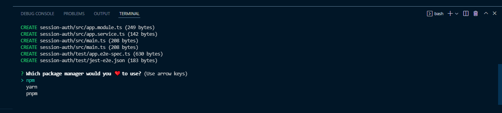
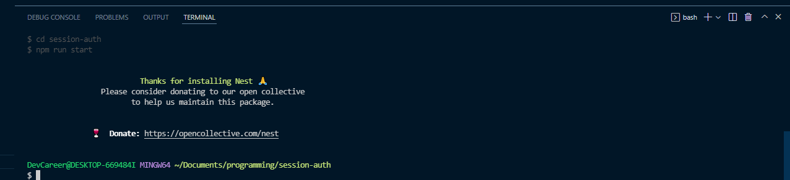
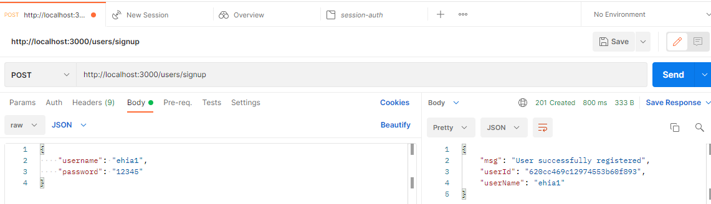
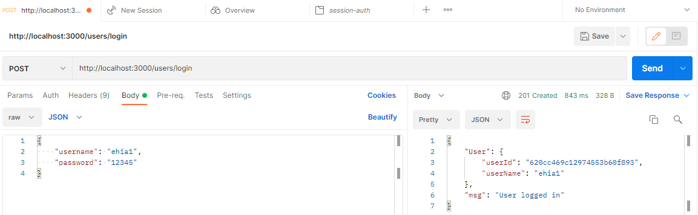
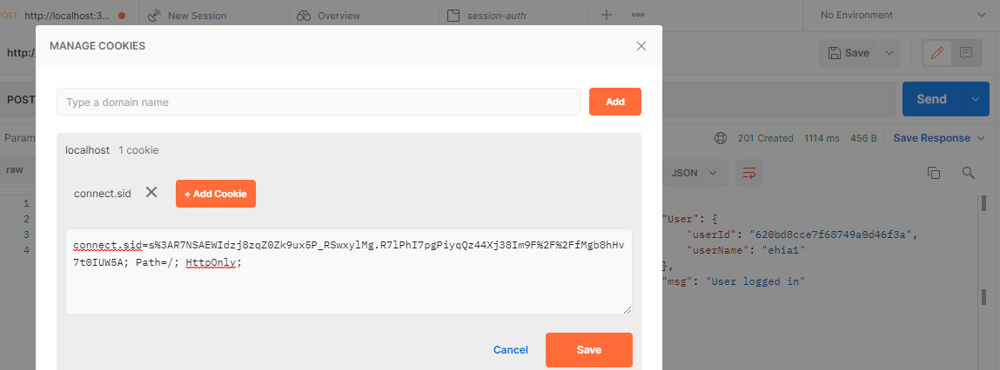
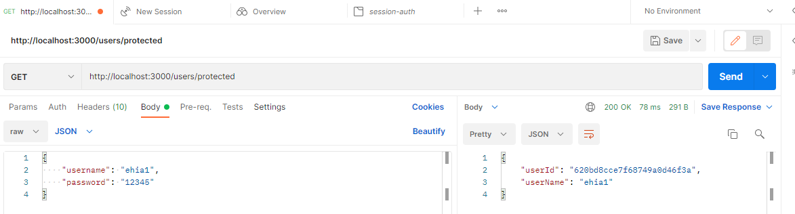
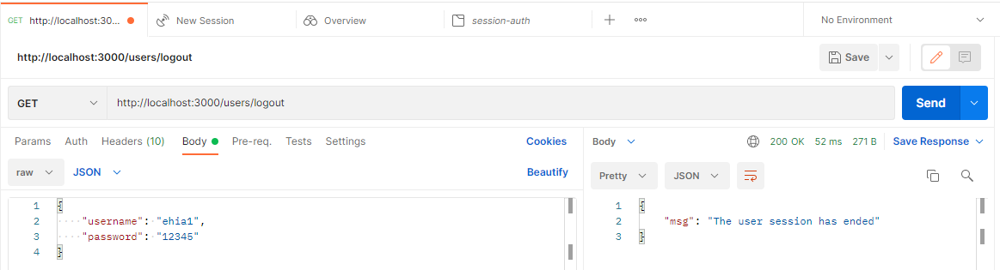

## Introduction

It is an indisputable reality that authentication is critical in any application or system if you want to secure user data and enable protected access to information. Authentication is the procedure of establishing or demonstrating that something is true, legitimate, or valid.

## Prerequisites

This tutorial is a hands-on demonstration. To follow along, ensure you have the following in place:

- [Node.js](https://nodejs.org/en/) running in your system because NestJS is a Node.js framework
- [MongoDB](https://www.mongodb.com/) installed

## What is NestJS?

Nest (NestJS) is a Node.js server-side application framework for building scalable, efficient applications.

It is written in TypeScript and built on Express, a very minimalistic framework that is great on its own but lacks structure. It combines the programming paradigms such as object-oriented programming, functional programming, and functional reactive programming.

It is a framework to use if you want a lot of structure on your backend. Its syntax and structure are very similar to AngularJS, a front-end framework. And it uses TypeScript, services, and dependency injection in the same way that AngularJS does.

It employs modules and controllers, and you can build controllers for a file using the command-line interface.

NestJS modules allow you to group related controllers and service providers into a single code file. Simply put, a NestJS module is a TypeScript file with the **@Module** annotation (). This decorator informs the NestJS framework about which controllers, service providers, and other associated resources will be instantiated and used by the app code later.

## What is Session-based Authentication?

Session-based authentication is a method of user authentication in which the server creates a session after a successful log-in, with the session ID stored in a cookie or local storage in your browser.

Upon subsequent requests, your cookie is validated against the session ID stored on the server. If there is a match, the request is considered valid and is processed.

When using this authentication method, it is critical to keep the following security best practices in mind:

- Generate long and random session IDs (128 bits is the recommended length) to make brute force attacks ineffective
- Avoid storing any sensitive or user-specific data
- Make HTTPS communications mandatory for all session-based apps
- Create cookies that have secure and HTTP-only attributes

## Why Session-based Authentication?

Session-based authentication is more secure than most authentication methods because it is simple to use, secure, and has a limited storage size. It is also thought to be the best option for websites in the same root domain.

## Project Setup

Start your project setup by installing Nest CLI globally. You don’t need to do this if you already have NestJS CLI installed.

The Nest CLI is a command-line interface tool for setting up, developing, and maintaining Nest applications.

```bash
npm i -g @nestjs/cli
```

Now, let’s set up your project by running the following command:

```
nest new session-based-auth
```

The above command creates a Nest application with some boilerplates, then prompts you to choose your preferred package manager to install the required modules to run your application. For demonstration, this tutorial uses **npm**. Hit the enter key to continue with **npm**.



If everything went well, you should see an output like the one on the screenshot below on your terminal.



Once the installation is complete, move into your project directory, and run the application with the command below:

```
npm run start:dev
```

The above command runs the application and watches for changes. Your project `src` folder structure should look like as follows.

```
└───src
│   └───app.controller.ts
│   └───app.modules.ts
│   └───app.service.ts
│   └───main.ts
```

## Install Dependencies

Now that your application is setup, let's install the dependencies needed to get started.

```
npm install --save @nestjs/passport passport passport-local
```

The above command installs [Passport.js](https://www.passportjs.org/), a popular nest.js authentication library.

Also install the types for the strategy with the command below:

It contains type definitions for `passport-local`.

```
npm install --save-dev @types/passport-local
```

## Set Up MongoDB Database in NestJS

To set up and connect your database, install Mongoose package and the NestJS wrapper with the following command:

```
npm install --save @nestjs/mongoose mongoose
```

The Mongoose NestJS wrapper helps you use Mongoose in the NestJS application and gives approved TypeScript support.

Now, head over to your `app.module.ts`, import the `mongoose` module from `@nestjs/mongoose`. Then call the `forRoot()` method, a method provided by the Mongoose module, and pass in your database URL string.

Setting up your database connection in `app.module.ts` helps your application connect to the database immediately as server starts — after running your application since it’s the first module to be loaded.

`app.module.ts`

```js
import { Module } from "@nestjs/common"
import { MongooseModule } from "@nestjs/mongoose"
import { AppController } from "./app.controller"
import { AppService } from "./app.service"

@Module({
  imports: [
    MongooseModule.forRoot(
      "mongodb+srv://<username>:<password>@cluster0.kngtf.mongodb.net/session-auth?retryWrites=true&w=majority"
    ),
  ],
  controllers: [AppController],
  providers: [AppService],
})
export class AppModule {}
```

## Create Users Module

For separation concerns, to make your code clean and well organized, create a module specifically for users using the NestJS CLI by running the following command:

```
nest g module users
```

The above command creates a `users` folder with `users.module.ts` and updates `app.module.ts`

Also, create `users.service.ts` and `users.controller.ts` files with the following commands:

```
nest g service users
nest g controller users
```

Note that you can create your folders and files manually without using the nest CLI, but using the CLI automatically updates the necessary folders and makes your life easier.

## Create User Schema

The next step is to create your UserSchema, but first, add a `users.model.ts` file, where you will create `UserSchema`

This should be the shape of our application `src` folder now.

```
└───src
│   └───users
│   │   └───users.controller.ts
│   │   └───users.model.ts
│   │   └───users.module.ts
│   │   └───users.service.ts
│   └───app.controller.ts
│   └───app.module.ts
│   └───app.service.ts
│   └───main.ts
```

To create `UserSchema`, import everything as mongoose from the mongoose package in `users.model.ts`. Then call the new mongoose schema, a blueprint of the user Model, and pass in a JavaScript object where you will define the user object and data.

`users.model.ts`

```js
import * as mongoose from "mongoose"
export const UserSchema = new mongoose.Schema(
  {
    username: {
      type: String,
      required: true,
      unique: true,
    },
    password: {
      type: String,
      required: true,
    },
  },
  { timestamps: true }
)

export interface User extends mongoose.Document {
  _id: string;
  username: string;
  password: string;
}
```

Also, create an interface for your Model that extends mongoose, a document that helps you populate your MongoDB collections.

Head over to your `users.module.ts` and import `MongooseModule` in the imports array. Then call the `forFeature()` method provided by `MongooseModule`, and pass in an array of object that takes in name and schema.

This will enable you to share the file anywhere with the help of dependency injection.

`users.module.ts`

```js
import { Module } from "@nestjs/common"
import { MongooseModule } from "@nestjs/mongoose"
import { UsersController } from "./users.controller"
import { UserSchema } from "./users.model"
import { UsersService } from "./users.service"
@Module({
  imports: [MongooseModule.forFeature([{ name: "user", schema: UserSchema }])],
  controllers: [UsersController],
  providers: [UsersService],
})
export class UsersModule {}
```

In `users.module.ts`, export the `UsersService` to enable you to access it in another module.

`users.module.ts`

```js
import { Module } from "@nestjs/common"
import { MongooseModule } from "@nestjs/mongoose"
import { UsersController } from "./users.controller"
import { UserSchema } from "./users.model"
import { UsersService } from "./users.service"
@Module({
  imports: [MongooseModule.forFeature([{ name: "user", schema: UserSchema }])],
  controllers: [UsersController],
  providers: [UsersService],
  exports: [UsersService],
})
export class UsersModule {}
```

It's usually a good idea to encapsulate the business logic in a separate class. Such a class is known as a service. The job of this class is to process the controller's requests and perform the business logic.

In `users.service.ts` file, import `Model` from `mongoose`, `User` from `users.model.ts`, and `InjectModel` from `@nestjs/mongoose`. Then add a method to the `UsersService` class that takes a username and password, and call the method `insertUser()`.

`users.service.ts`

```js
import { Injectable } from '@nestjs/common';
import { InjectModel } from '@nestjs/mongoose';
import { Model } from 'mongoose';
import { User } from './users.model';
@Injectable()
export class UsersService {
  constructor(@InjectModel('user') private readonly userModel: Model<User>) {}
  async insertUser(userName: string, password: string) {
    const username = userName.toLowerCase();
    const newUser = new this.userModel({
      username,
      password,
    });
    await newUser.save();
    return newUser;
  }
}
```

Now that the `UsersService` class is ready, you need to inject it into your controller. But first, let's talk about storing the users' passwords securely.

The most critical aspect of the registration procedure is the users’ passwords, which must not be saved in plain text. It is the responsibility of the user to create a strong password, but it is your obligation as a developer to keep their passwords secure. If a database breach occurs, the users' passwords would be exposed. And what happens if it’s stored in plain text? I believe you know the answer. To address this, hash the passwords using bcrypt.

So, install `bcrypt` and `@types/bcrypt` with the following command:

```
npm install @types/bcrypt bcrypt
```

With that out of the way, set up your controller. First, import your `UsersService` class and everything from `bcrypt`. Then add a constructor and a method that allows you to add a user; it will handle incoming post requests, call it `addUser`, with a function body where you'll hash the password.

`users.controller.ts`

```js
import { Body, Controller, Post } from '@nestjs/common';
import { UsersService } from './users.service';
import * as bcrypt from 'bcrypt';
@Controller('users')
export class UsersController {
  constructor(private readonly usersService: UsersService) {}
  //post / signup
  @Post('/signup')
  async addUser(
    @Body('password') userPassword: string,
    @Body('username') userName: string,
  ) {
    const saltOrRounds = 10;
    const hashedPassword = await bcrypt.hash(userPassword, saltOrRounds);
    const result = await this.usersService.insertUser(
      userName,
      hashedPassword,
    );
    return {
      msg: 'User successfully registered',
      userId: result.id,
      userName: result.username
    };
  }
}
```

The registration happens in the `app.module.ts` file, so it is achieved by adding the `UsersModule` to the `@Module()` decorator's imports' array in `app.module.ts`.

`app.module.ts`

```js
import { Module } from "@nestjs/common"
import { MongooseModule } from "@nestjs/mongoose"
import { AppController } from "./app.controller"
import { AppService } from "./app.service"
import { UsersModule } from "./users/users.module"

@Module({
  imports: [
    MongooseModule.forRoot(
      "mongodb+srv://<username>:<password>@cluster0.kngtf.mongodb.net/session-auth?retryWrites=true&w=majority"
    ),
    UsersModule,
  ],
  controllers: [AppController],
  providers: [AppService],
})
export class AppModule {}
```

Congratulations! You are done with the registration. You can now register a user with a username and password.

Now, with registration out of the way, add a `getUser` function to your `UsersService` with the `findOne` method to find a user by username.

`users.service.ts`

```js
import { Injectable } from '@nestjs/common';
import { InjectModel } from '@nestjs/mongoose';
import { Model } from 'mongoose';
import { User } from './users.model';
@Injectable()
export class UsersService {
  constructor(@InjectModel('user') private readonly userModel: Model<User>) {}
  async insertUser(userName: string, password: string) {
    const username = userName.toLowerCase();
    const newUser = new this.userModel({
      username,
      password,
    });
    await newUser.save();
    return newUser;
  }
  async getUser(userName: string) {
    const username = userName.toLowerCase();
    const user = await this.userModel.findOne({ username });
    return user;
  }
}
```

## Create Authentication Module

Just as for users, create an auth module and service specifically for all the authentications/verifications. To do that, run the following commands:

```
nest g module auth
nest g service auth
```

The above will create an auth folder, `auth.module.ts`, and `auth.service.ts`, and updates the `auth.module.ts` and `app.module.ts` files.

At this point, the shape of your application `src` folder should look like as follows.

```
└───src
│   └───auth
│   │   └───auth.module.ts
│   │   └───auth.service.ts
│   └───users
│   │   └───users.controller.ts
│   │   └───users.model.ts
│   │   └───users.module.ts
│   │   └───users.service.ts
│   └───app.controller.ts
│   └───app.module.ts
│   └───app.service.ts
│   └───main.ts
```

## Authenticate Users

Go to your `auth.module.ts` file and add `UsersModule` in the imports array to enable access to the `UsersService` exported from the `users.module.ts` file.

`auth.module.ts`

```js
import { Module } from "@nestjs/common"
import { UsersModule } from "src/users/users.module"
import { AuthService } from "./auth.service"

@Module({
  imports: [UsersModule],
  providers: [AuthService],
})
export class AuthModule {}
```

In your `auth.service.ts` file, call the constructor so you can inject the `UsersService`, and add a method for validation that will take a username and password.

To add some basic validations, check if the user exists in the database, and compare the given password with the one in your database to ensure it matches. If exists, return the user in `request.user` object — else, return null.

`auth.service.ts`

```js
    import { Injectable, NotAcceptableException } from '@nestjs/common';
    import { UsersService } from 'src/users/users.service';
    import * as bcrypt from 'bcrypt';

    @Injectable()
    export class AuthService {
      constructor(private readonly usersService: UsersService) {}
      async validateUser(username: string, password: string): Promise<any> {
        const user = await this.usersService.getUser(username);
        const passwordValid = await bcrypt.compare(password, user.password)
        if (!user) {
            throw new NotAcceptableException('could not find the user');
          }
        if (user && passwordValid) {
          return {
            userId: user.id,
            userName: user.username
          };
        }
        return null;
      }
    }
```

Going further, create a new file and name it `local.strategy.ts`. This file will represent the strategy from `Passport.js`, which you installed earlier, that is the `local strategy`. And within it, pass in the strategy, which is the `Strategy` from `passport-local`.

Create a constructor and inject the `AuthService`, call the `super()` method; ensure to call the `super()` method.

`local.strategy.ts`

```js
    import { Injectable, UnauthorizedException } from '@nestjs/common';
    import { PassportStrategy } from '@nestjs/passport';
    import { Strategy } from 'passport-local';
    import { AuthService } from './auth.service';
    @Injectable()
    export class LocalStrategy extends PassportStrategy(Strategy) {
      constructor(private readonly authService: AuthService) {
        super();
      }
      async validate(username: string, password: string): Promise<any> {
        const userName = username.toLowerCase();
        const user = await this.authService.validateUser(userName, password);
        if (!user) {
          throw new UnauthorizedException();
        }
        return user;
      }
    }
```

Go back to your `auth.module.ts` file. Then add `PassportModule` to imports and `LocalStrategy` to providers.

`auth.module.ts`

```js
import { Module } from "@nestjs/common"
import { PassportModule } from "@nestjs/passport"
import { UsersModule } from "src/users/users.module"
import { AuthService } from "./auth.service"
import { LocalStrategy } from "./local.strategy"

@Module({
  imports: [UsersModule, PassportModule],
  providers: [AuthService, LocalStrategy],
})
export class AuthModule {}
```

Now, add the login route to your `users.controller.ts`:

`users.controller.ts`

```js
    import {
      Body,
      Controller,
      Post,
      Request,
    } from '@nestjs/common';
    import * as bcrypt from 'bcrypt';
    import { UsersService } from './users.service';
    @Controller('users')
    export class UsersController {
      constructor(private readonly usersService: UsersService) {}
      //post / signup
      @Post('/signup')
      async addUser(
        @Body('password') userPassword: string,
        @Body('username') userName: string,
      ) {
        const saltOrRounds = 10;
        const hashedPassword = await bcrypt.hash(userPassword, saltOrRounds);
        const result = await this.usersService.insertUser(
          userName,
          hashedPassword,
        );
        return {
          msg: 'User successfully registered',
          userId: result.id,
          userName: result.username
        };
      }
      //Post / Login
      @Post('/login')
      login(@Request() req): any {
        return {User: req.user,
                msg: 'User logged in'};
      }
    }
```

Now that you have all these put in place, you still cannot log in a user because there is nothing to trigger the login route. Here, use [Guards](https://docs.nestjs.com/guards) to achieve that.

Create a file and name it `local.auth.guard.ts`, then a class `LocalAuthGuard` that extends `AuthGuard` from `NestJS/passport`, where you will provide the name of the strategy and pass in the name of your strategy, ‘local’.

`local.auth.guard.ts.`

```js
import { Injectable } from "@nestjs/common"
import { AuthGuard } from "@nestjs/passport"
@Injectable()
export class LocalAuthGuard extends AuthGuard("local") {}
```

Add the `UseGuard` decorator to your login route in the `users.controller.ts` file and pass in the `LocalAuthGuard`.

`users.controller.ts`

```js
    import {
      Body,
      Controller,
      Post,
      UseGuards,
      Request,
    } from '@nestjs/common';
    import * as bcrypt from 'bcrypt';
    import { LocalAuthGuard } from 'src/auth/local.auth.guard';
    import { UsersService } from './users.service';
    @Controller('users')
    export class UsersController {
      constructor(private readonly usersService: UsersService) {}
      //post / signup
      @Post('/signup')
      async addUser(
        @Body('password') userPassword: string,
        @Body('username') userName: string,
      ) {
        const saltOrRounds = 10;
        const hashedPassword = await bcrypt.hash(userPassword, saltOrRounds);
        const result = await this.usersService.insertUser(
          userName,
          hashedPassword,
        );
        return {
          msg: 'User successfully registered',
          userId: result.id,
          userName: result.username
        };
      }
      //Post / Login
      @UseGuards(LocalAuthGuard)
      @Post('/login')
      login(@Request() req): any {
        return {User: req.user,
                msg: 'User logged in'};
      }
    }
```

Finally, you can log in a user with a registered username and password.

## Protect Authentication Routes

You have successfully set up user authentication. Now, protect your routes from unauthorized access by limiting access to just authenticated users. Go to your `users.controller.ts` file, and add another route — name it ‘protected’ and make it return the `req.user` object.

`users.controller.ts`

```js
    import {
      Body,
      Controller,
      Get,
      Post,
      UseGuards,
      Request,
    } from '@nestjs/common';
    import * as bcrypt from 'bcrypt';
    import { LocalAuthGuard } from 'src/auth/local.auth.guard';
    import { UsersService } from './users.service';
    @Controller('users')
    export class UsersController {
      constructor(private readonly usersService: UsersService) {}
      //signup
      @Post('/signup')
      async addUser(
        @Body('password') userPassword: string,
        @Body('username') userName: string,
      ) {
        const saltOrRounds = 10;
        const hashedPassword = await bcrypt.hash(userPassword, saltOrRounds);
        const result = await this.usersService.insertUser(
          userName,
          hashedPassword,
        );
        return {
          msg: 'User successfully registered',
          userId: result.id,
          userName: result.username
        };
      }
      //Post / Login
      @UseGuards(LocalAuthGuard)
      @Post('/login')
      login(@Request() req): any {
        return {User: req.user,
                msg: 'User logged in'};
      }
    // Get / protected
      @Get('/protected')
      getHello(@Request() req): string {
        return req.user;
      }
    }
```

The protected route in the above code will return an empty object instead of returning the user’s details when a logged-in user makes a request to it because it already lost the login.

To get that sorted, this is where the session-based authentication comes in.

In session-based authentication, when a user logs in, the user is saved in a session so that any subsequent request by the user after login will grab the details from the session and grant the user easy access. The session expires when the user logs out.

To start session-based auth, install [express-session](https://docs.nestjs.com/techniques/session) and the NestJS types using the following command:

```js
npm install express-session @types/express-session
```

When the installation is completed, go to your `main.ts` file, the root of your application, and do the configurations there.

Import everything from `passport` and `express-session`, then add passport initialize and passport session.

It is preferable to keep your secret key in your environment variables.

`main.ts`

```js
import { NestFactory } from "@nestjs/core"
import { AppModule } from "./app.module"
import * as session from "express-session"
import * as passport from "passport"
async function bootstrap() {
  const app = await NestFactory.create(AppModule)
  app.use(
    session({
      secret: "keyboard",
      resave: false,
      saveUninitialized: false,
    })
  )
  app.use(passport.initialize())
  app.use(passport.session())

  await app.listen(3000)
}
bootstrap()
```

Add a new file `authenticated.guard.ts` in your `auth` folder. And create a new Guard that checks if there is a session for the user making the request — name it `authenticatedGuard`.

`authenticated.guard.ts`

```js
import { CanActivate, ExecutionContext, Injectable } from "@nestjs/common"

@Injectable()
export class AuthenticatedGuard implements CanActivate {
  async canActivate(context: ExecutionContext) {
    const request = context.switchToHttp().getRequest()
    return request.isAuthenticated()
  }
}
```

In the above code, the request is gotten from the context and checked if authenticated. `isAuthenticated()` comes from `passport.js` automatically; it says hey! does a session exist for this user? If so, keep going.

To trigger the login, in your `users.controller.ts` file:

- import `authenticated` from `authenticated.guard.ts`;
- add the `useGuard` decorator to the `protected` route; and,
- pass in `AuthenticatedGuard`.

`users.controller.ts`

```js
    import {
      Body,
      Controller,
      Get,
      Post,
      UseGuards,
      Request,
    } from '@nestjs/common';
    import * as bcrypt from 'bcrypt';
    import { AuthenticatedGuard } from 'src/auth/authenticated.guard';
    import { LocalAuthGuard } from 'src/auth/local.auth.guard';
    import { UsersService } from './users.service';
    @Controller('users')
    export class UsersController {
      constructor(private readonly usersService: UsersService) {}
      //signup
      @Post('/signup')
      async addUser(
        @Body('password') userPassword: string,
        @Body('username') userName: string,
      ) {
        const saltOrRounds = 10;
        const hashedPassword = await bcrypt.hash(userPassword, saltOrRounds);
        const result = await this.usersService.insertUser(
          userName,
          hashedPassword,
        );
        return {
          msg: 'User successfully registered',
          userId: result.id,
          userName: result.username
        };
      }
      //Post / Login
      @UseGuards(LocalAuthGuard)
      @Post('/login')
      login(@Request() req): any {
        return {User: req.user,
                msg: 'User logged in'};
      }
      //Get / protected
      @UseGuards(AuthenticatedGuard)
      @Get('/protected')
      getHello(@Request() req): string {
        return req.user;
      }
    }
```

At this point, it still fails because you've only configured `express-session` but didn't implemente it.

When a user logs in, you need to save the user in a session, so the user can access other routes with the session.

One thing to keep in mind is that by default, the `express-session` library stores the session in the memory of the web server.

Before it goes into the session, you need to serialize the user. As it comes out of the session, deserialize the user.

So, create a new file in the auth folder for serializer and deserializer, name it `session.serializer.ts`.

At this point, the shape of our application `src` folder should look like this.

```
    └───src
    │   └───auth
    │   │   └───auth.module.ts
    │   │   └───auth.service.ts
    │   │   └───authenticated.guard.ts
    │   │   └───local.auth.guard.ts
    │   │   └───local.strategy.ts
    │   │   └───session.serializer.ts
    │   └───users
    │   │   └───users.controller.ts
    │   │   └───users.model.ts
    │   │   └───users.module.ts
    │   │   └───users.service.ts
    │   └───app.controller.ts
    │   └───app.module.ts
    │   └───app.service.ts
    │   └───main.ts
```

`session.serializer.ts`

```js
import { Injectable } from "@nestjs/common"
import { PassportSerializer } from "@nestjs/passport"

@Injectable()
export class SessionSerializer extends PassportSerializer {
  serializeUser(user: any, done: (err: Error, user: any) => void): any {
    done(null, user)
  }
  deserializeUser(
    payload: any,
    done: (err: Error, payload: string) => void
  ): any {
    done(null, payload)
  }
}
```

Go back to your `auth.module.ts` file, provide the `SessionSerializer` and add the `register` method to the `PassportModule`.

`auth.module.ts`

```js
import { Module } from "@nestjs/common"
import { PassportModule } from "@nestjs/passport"
import { UsersModule } from "src/users/users.module"
import { AuthService } from "./auth.service"
import { LocalStrategy } from "./local.strategy"
import { SessionSerializer } from "./session.serializer"

@Module({
  imports: [UsersModule, PassportModule.register({ session: true })],
  providers: [AuthService, LocalStrategy, SessionSerializer],
})
export class AuthModule {}
```

Within the `LocalAuthGuard` in the `local.auth.guard.ts` file, add some codes.

Call the `login` method in `super`, pass in the request to trigger the actual login via creating a session. If you want to use sessions, you must remember to trigger the `super.login()`.

`local.auth.guard.ts`

```js
    import { ExecutionContext, Injectable } from '@nestjs/common';
    import { AuthGuard } from '@nestjs/passport';
    @Injectable()
    export class LocalAuthGuard extends AuthGuard('local') {
      async canActivate(context: ExecutionContext) {
        const result = (await super.canActivate(context)) as boolean;
        const request = context.switchToHttp().getRequest();
        await super.logIn(request);
        return result;
      }
    }
```

If you log in now, you would see the session ID stored in a cookie, which is just a key to the session store, and the cookie gets saved in the browser. The cookie is automatically attached to the rest of the request.

Now that the session is working, you can access the protected route, it would return the expected user’s details.

## Logout Users

As mentioned earlier, once a user logs out, you destroy all sessions.

To log out a user, go to the `users.controller.ts` file, add a logout route, and call the `req.session.session()` method. You can return a message notifying that the user’s session has ended.

```js
    import {
      Body,
      Controller,
      Get,
      Post,
      UseGuards,
      Request,
    } from '@nestjs/common';
    import * as bcrypt from 'bcrypt';
    import { AuthenticatedGuard } from 'src/auth/authenticated.guard';
    import { LocalAuthGuard } from 'src/auth/local.auth.guard';
    import { UsersService } from './users.service';
    @Controller('users')
    export class UsersController {
      constructor(private readonly usersService: UsersService) {}
      //signup
      @Post('/signup')
      async addUser(
        @Body('password') userPassword: string,
        @Body('username') userName: string,
      ) {
        const saltOrRounds = 10;
        const hashedPassword = await bcrypt.hash(userPassword, saltOrRounds);
        const result = await this.usersService.insertUser(
          userName,
          hashedPassword,
        );
        return {
          msg: 'User successfully registered',
          userId: result.id,
          userName: result.username
        };
      }
      //Post / Login
      @UseGuards(LocalAuthGuard)
      @Post('/login')
      login(@Request() req): any {
        return {User: req.user,
                msg: 'User logged in'};
      }
       //Get / protected
      @UseGuards(AuthenticatedGuard)
      @Get('/protected')
      getHello(@Request() req): string {
        return req.user;
      }
       //Get / logout
      @Get('/logout')
        logout(@Request() req): any {
          req.session.destroy();
          return { msg: 'The user session has ended' }
        }
    }
```

So, once you log out, it returns a message notifying you that the user session has ended. The code for this tutorial is hosted [here](https://github.com/icode247/Session-based-Auth-with-Nestjs-MongoDB-) on my Github repository.

## Test Your Application

You have successfully implemented user signup, authentication, and protected the route to enable authorized access only.

It’s time to test the application. If everything is in order, your server should be running. Else, restart your server with the following command:

```
npm run start:dev
```

Head over to your Postman. And let’s finally test our application.

### Sign Up As a User



### Log In As a User



### Logged-in User’s Cookie ID



### Request the Protected Route



### User Logout



## Alternatively Implement User Authentication with LoginRadius

LoginRadius provides a variety of registration and authentication services to assist you in better connecting with your consumers.
On any web or mobile application, LoginRadius is the developer-friendly Identity Platform that delivers a complete set of APIs for authentication, identity verification, single sign-on, user management, and account protection capabilities like multi-factor authentication.

To implement LoginRadius in your NestJS application, navigate to [loginradius.com](https://www.loginradius.com/) and signup for a free account. It will take you to the loginradius dashboard, open the support document and choose the NodeJS application; it will walk you through how to implement loginradius auth page in your NodeJS application.

Go to configurations session, there you will get App name, API key, and API secret.

You can also customize how you want your page to look in the auth page customization. For more info, visit [here](https://www.loginradius.com/docs/developer/tutorial/node-js).

## **Conclusion**

Congratulations! In this tutorial, you've learned how to implement session-based authentication in a NestJS application with MongoDB database. You've created and authenticated a user, and protected your routes from unauthorized access.

> **Note:** Session storage is saved by default in 'MemoryStore,' which is not intended for production use. So, while no external datastore is required for development, once in production, a data store such as [Redis](https://redis.io/) or another is suggested for stability and performance. You can [learn more about session storage here](https://www.loginradius.com/blog/async/guest-post/local-storage-vs-session-storage-vs-cookies/).
