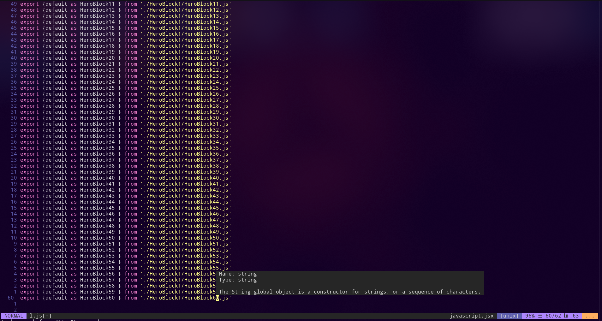

## Prerequisites
You should know the basics of VIM beforehand. You may refer to a previous blog [Vim: Getting started](https://www.loginradius.com/blog/async/vim-getting-started/).

This tutorial explores the following concepts:

- Macros
- Buffers and splitting
- Global  command

In addition, this tutorial explores a few other tips and tricks. It is not uncommon for folks who have been using Vim for a long time and not being familiar with these handy, useful features.

## Macros
You don't want to miss out on macros if you want to level up your vim game. Vim macro is a powerful feature that allows you to record a sequence of keys on the fly. It helps you to automate a lot of stuff. 

Macros are based on the concept of registers. If you don't know what registers are, you can think of them as a bunch of spaces in memory that Vim uses to store some text.

Macros are editable registers, which you can record, store, and edit whenever you want.

Here's the basic syntax of  macros:

```
q<key you want to record your macro into><series of commands>q
```

Example:

```
q1f;xq
```

Let's break it down for you:

q : Starts recording a macro  
1 : The recorded macro will be stored on key 1  
f;x : Find the first occurrence of `;`in that line and delete `;`  
q : stop recording the macro  

That's it. Now, you can use this macro by `@<your key>` i.e `@1`

If you want to repeat a macro _n_ number of times, then `n@1`is the syntax.

### Use Case
Not impressed yet? Huhh! Let's show you a practical use case to demonstrate the power of a macro. I work in ReactJs a lot and like to export all my components in one file. Let's try exporting 99 HeroBlocks in one go.

The desired result is:

```
export {default as HeroBlock1 } from './HeroBlock1/HeroBlock1.js'
export {default as HeroBlock2 } from './HeroBlock1/HeroBlock2.js'
export {default as HeroBlock3 } from './HeroBlock1/HeroBlock3.js'
...
..
so on
```
Perform `vim index.js`

And, write this line:

```export {default as HeroBlock1 } from './HeroBlock1/HeroBlock1.js'```

Now, follow along:

```q1yyp4E ^A6e ^Aq```

Breaking it down:

q1 : Start recording a macro in key 1.  
yy : yank the current line.  
p : paste the yanked line.  
4E : Get the cursor to 1 of Heroblock1. (*`f1` might be tempting but it will give you wrong results as not all lines will have 1, they can have any number. Try making the macro very generalized.*)  
^A : this is `ctrl + a`. It increments the current version by one.  
6e : Get the cursor to the second number.  
^A : increment the number by one.  
q : stop recording.  

Now, to repeat your macro 99 times:

```99@1```

And that's all.



## Buffers & Splitting
In simple terms, a _buffer_ is a file that has been loaded into memory. Everything you do in VIM is in a buffer. You can list all the buffers by `:buffers`. And then, if you want to check out a particular buffer, use `:b n` -- where n is the buffer number. 

If you want to delete a buffer, use `:bd n` is the command.

To create a new buffer in the same view -- creating a split in the current window -- use `:sp filename`. 

For a vertical split, use `:vsp filename`.

> To be honest, using buffer numbers to switch buffers is not what I prefer to do. I prefer to switch based on what I see, like `ctrl-w` then `j`to focus on a buffer below if I'm splitting the window. `:tabprevious` to move a tab on the left if I'm using tabs.

Here are some key bindings you might want to use for a smooth workflow.

```
nnoremap <C-t> :tabnew<CR>
nnoremap <C-Left> :tabprevious<CR>
nnoremap <C-Right> :tabnext<CR>
nnoremap <C-J>  <C-W><C-J>
nnoremap <C-K>  <C-W><C-K>
nnoremap <C-L>  <C-W><C-L>
nnoremap <C-H>  <C-W><C-H>
```

## Global Command
The global command in vim is very powerful and will solve a lot of your problems quickly.

The basic syntax goes something as follows:

```
:[range]global/{pattern}/{command}
```
Let's go through some use cases to learn more about it.

The following will delete any line containing the word console in the entire file:

```
:g/console/d
```
The following will delete any line between line 10-20 containing the word console in it:

```
:10,20g/console/d
```
You can even do the inverse of it by using `:g!`

The following will delete any line **not** containing the word console in it in the entire file:

```
:g!/console/d
```
You can even combine the two.

The following will delete any line containing *console* and not containing *hello* in it in the entire file.

The global command can work on any regular expression, which makes it even more powerful, provided you're creative enough...

```
:g/console/g!/Hello/d
```
The following will delete any line starting with `#` i.e., comments in python will be deleted in one go:

```
:g/^#/d
```

So far, we've been using d as the command, but it can be anything else like `m` for move `t` for copy etc.

One of the very powerful commands is `norm`. This command allows you to do anything that would have worked in normal mode.

The following will comment out all the print statements in a python code in one go.

```
:g/print/norm I#
```

The global command can be coupled with macros using _norm_, which means you can apply a macro to certain lines matching the regex given. This was enough to blow my mind, and it made the time I spent reading about vim worthy.

Here's the syntax for using macros with global commands:

```
:g/const/normal @q
```
## You Made It
Congratulations! You made it this far. You now have leveled up your vim game. All these tips and tricks will eventually be useful to you. Here's a little something for reading this far https://pintovim.dev/. You can use this tool to make your own customized vim color scheme.

Thanks for reading!
