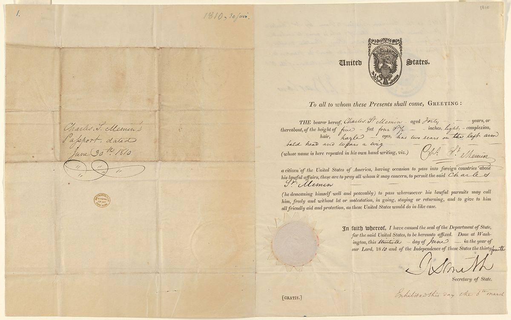

 Sketch of a Māori chief by [Sydney Parkinson](https://en.wikipedia.org/wiki/Sydney_Parkinson) (1784) [https://commons.wikimedia.org/wiki/File:MaoriChief1784.jpg](https://commons.wikimedia.org/wiki/File:MaoriChief1784.jpg)

In Part II of the History of Human Identity, we showed examples of identity verification such as names and unique markings. This blog is the final instalment of our 3-part series. In it, we'll focus on cultural identifiers—their use _and_ their abuse.

One of the oldest forms of cultural identifiers is still alive today: physical alterations. In fact, the Maori of New Zealand use [tattoos](https://brewminate.com/the-ancient-and-mysterious-history-of-tattoos/) in part as a marker of identity; the earliest recording of this dates back to the 1700s. Maori facial decorations include tattoos with detailed and stylized designs called _moko._ Moko is used to communicate information about an individual’s heritage and rank in society. 

In fact, the [Smithsonian.com](https://www.smithsonianmag.com/history/tattoos-144038580/) notes that the Maori use of tattoos “has accurately been described as a form of id card or passport, a kind of aesthetic bar code for the face.”

## Personal identification documents

The earliest documented account of something resembling a passport can be found in the Hebrew Bible, in the book of Nehemiah, which refers to “[safe passage](https://www.theguardian.com/travel/2006/nov/17/travelnews)” to Judah. 

In 1540, the granting of “[travelling papers](https://www.theguardian.com/travel/2006/nov/17/travelnews)” became the business of Britain’s Privy Council. The actual term _passport_ was also recognized at that point. Some say that the term reflects the act of passing through maritime ports, although that is up for debate.

**Charles de Saint-Mémin’s United States passport, June 30, 1810**

 Charles de Saint-Mémin’s United States passport, June 30, 1810 [https://www.metmuseum.org/art/collection/search/656327](https://www.metmuseum.org/art/collection/search/656327)

A passport is also a form of personal identification that indicates national identity.

Around 100 countries now have compulsory [national identity cards](https://en.wikipedia.org/wiki/List_of_national_identity_card_policies_by_country). Another 28 countries have optional national identity cards, but their citizens often use other forms of ID such as passports or driving licenses. 

[**West German**](https://en.wikipedia.org/wiki/West_Germany) **identity card issued between 1 January 1951 and 31 March 1987**

 [West German](https://en.wikipedia.org/wiki/West_Germany) identity card issued between 1 January 1951 and 31 March 1987 [https://commons.wikimedia.org/wiki/File:1979\_identity\_card\_of\_West\_Germany\_original\_size.jpg](https://commons.wikimedia.org/wiki/File:1979_identity_card_of_West_Germany_original_size.jpg)

A Social Security number (SSN) is another unique identifier. The US  government assigned this for taxation and benefits. Issued by the US Social Security Administration in November 1935, SSN numbers were part of the New Deal Social Security program. Today, US citizens still use SSNs to access benefits, pay taxes, receive wages, and show one’s identity.

**A Social Security card issued by the** [**Railroad Retirement Board**](https://en.wikipedia.org/wiki/Railroad_Retirement_Board) **in 1943 to a now-deceased person.**

 A Social Security card issued by the [Railroad Retirement Board](https://en.wikipedia.org/wiki/Railroad_Retirement_Board) in 1943 to a now deceased person. [https://commons.wikimedia.org/wiki/File:PD\_social\_security\_card.png](https://commons.wikimedia.org/wiki/File:PD_social_security_card.png)

A Social Insurance Number (SIN) is a 9-digit form of identification that every individual residing and/or working in Canada must have in order to access government benefits, file income taxes, and legally receive payment. [SIN cards were first issued in 1964](https://blog.wagepoint.com/all-content/the-complete-history-of-the-social-insurance-number) but have not been printed as cards since 2014 due to the risk of theft. Today, Canadian citizens do not carry SIN cards on their person.

## Name changes

Many countries have a process for officially changing one’s legal name. 

In Western society, some marriage partners decide to change their surnames. However, taking a new surname is not as commonplace as it once was. In fact, sometimes men and women change both of their surnames to a hyphenated or a combined version of the two. 

A name change can pose issues for your personal identity, including [losing your professional identity or brand.](https://www.healthyway.com/content/heres-why-changing-your-name-when-you-get-married-can-actually-be-a-terrible-idea/) 

As a rule, US citizens who wish to change their surnames after marriage must endure a lengthy process. Here's what they must do:

- After you get a copy of your marriage license, you must visit the Social Security Administration online or in person.
- From there, you fill out the necessary paperwork and show proof of your US citizenship (for example, a birth certificate, passport, or a photo ID like a driver’s license). 
- Once you receive your new social security card (new name, same number), you can change your driver’s license. This change also requires two forms of identification, proof of address, and a certified copy of your marriage license.
- With your new official identification in hand, you can change your name on your banking information, utility bills, and credit cards.

## Personal vs. legal identification

As governments began to regulate identity verification, conflicts arose between personal and legal identification. The ways that people identify themselves sometimes clash with the ways that governments want to identify them.

For example, Canada has a controversial history when it comes to identifying Inuit communities. In the 1930s, a personal identification program in the Canadian Arctic [required Inuit fingerprints](https://www.thecanadianencyclopedia.ca/en/article/project-surname) to identify and document Inuit communities. Shortly after, missionaries and federal agents successfully halted the program, due to the association of fingerprinting with criminal activity. 

It took roughly 10 years for the Canadian government to approve and implement a substitute identification system for Canada’s Northern Territories. This was known as the [personal identification disk system](https://www.vice.com/en_ca/article/xd7ka4/the-little-known-history-of-how-the-canadian-government-made-inuit-wear-eskimo-tags). The government required Inuit people to wear these small, numbered disks at all times. As a result, many complained that these looked and felt like dog tags. Due to public outcry, the government ceased the program in the 1970s (1980s in Quebec). And in its place, they created a new program called Project Surname.

**Public domain photo: Inupiat family, 1929**

 Public domain photo: Inupiat family, 1929 [https://commons.wikimedia.org/wiki/File:Inupiat\_Family\_from\_Noatak,\_Alaska,\_1929,\_Edward\_S.\_Curtis\_(restored).jpg](https://commons.wikimedia.org/wiki/File:Inupiat_Family_from_Noatak,_Alaska,_1929,_Edward_S._Curtis_(restored).jpg)

## Project Surname

In the 1940s the Canadian government created Project Surname as a way to identify the Inuit population. Instead of a number, Project Surname assigned Anglicized last names to Inuit peoples in northern Canada. 

While some Inuit and non-Inuit peoples viewed Project Surname as an effective new identification system, others saw it as a demeaning act of paternalism. 

In essence, it stripped people of a meaningful and spiritual tradition. 

Before the arrival of Europeans, the [Inuit](https://www.thecanadianencyclopedia.ca/en/article/inuit/) used a complex naming tradition that reflected their culture, environment, animals, family, and spirits. Today, Inuit surnames may contain both Euro-Canadian and traditional Inuit names. However, [the sting of Project Surname remains](https://acresofsnow.ca/canadas-mandatory-eskimo-identification-tags/), demonstrating what happens when legal identification gets _too_ personal.

As cofounder and CTO of LoginRadius, a customer identity and access management solution, I enjoy researching and writing about cultural identifiers. Likewise, I hope that you enjoyed this History of Human Identity series and will return to read our next series.

