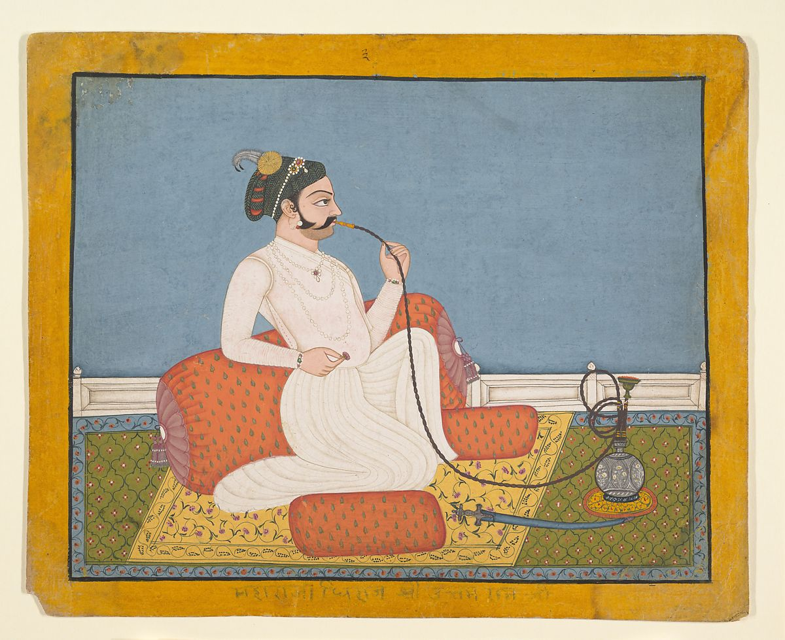

 Portrait of Thakur Utham Ram, ca. 1760 [https://www.metmuseum.org/art/collection/search/37876](https://www.metmuseum.org/art/collection/search/37876)

The concept of human identity stretches back thousands of years into unrecorded history. 

Long before our identities were digitized and stored in databases, we used language, objects, and documents to represent and confirm our individuality.

This pictorial history in 3 parts explores all the creative ways that we’ve developed to identify ourselves and each other over the millennia. 

## Prehistoric identity

It’s impossible to know when humans first recognized that they had individual identities.

We assume that early hominins knew each other by sight, sound, smell, and touch, as animals do. 

 High school students in Binghamton NY, USA, holding replicas of hominin skulls. Photo by Carolyn WIlczynski [https://commons.wikimedia.org/wiki/File:Students\_explore\_hominid\_evolution.jpg](https://commons.wikimedia.org/wiki/File:Students_explore_hominid_evolution.jpg)

Presumably they could tell one Neanderthal from another by their faces, the noises they made, and the way they moved. 

There is even [research](https://www.nature.com/articles/ncomms5800) showing that human faces evolved in ways that made it easier for humans to recognize each other. The fact that facial recognition was supported by natural selection implies that it’s very important for social interaction and the success of the species. 

 Hands, ca. 7300 BC, at the Cuevas de las Manos upon Río Pinturas, Argentina. Photo by Mariano Cecowski [https://commons.wikimedia.org/wiki/File:SantaCruz-CuevaManos-P2210651b.jpg](https://commons.wikimedia.org/wiki/File:SantaCruz-CuevaManos-P2210651b.jpg)

For an example of written identity in prehistory, we can look at cave markings showing stencilled handprints. [Archeologists disagree on the meaning behind cave handprints](https://www.bradshawfoundation.com/news/cave_art_paintings.php?id=The-Secrets-of-Prehistoric-Hand-Paintings)—they could be warning messages or part of shamanic practice—but to our modern eyes they look like signatures or graffiti tags, a way of saying, “I was here.” 

 Forensic reconstruction of Oase 2 skull dating to 35,000 BC [https://commons.wikimedia.org/wiki/File:Neanderthaler,\_Oase,\_Rum%C3%A4nien\_(Daniela\_Hitzemann).jpg](https://commons.wikimedia.org/wiki/File:Neanderthaler,_Oase,_Rum%C3%A4nien_(Daniela_Hitzemann).jpg)

Spoken language emerged 100,000 years ago. In fact, the structure of the brain and the size of the spinal cord of Cro-Magnon people suggests that they would have been capable of producing the [same sounds that we use in speech today](https://australianmuseum.net.au/learn/science/human-evolution/how-do-we-know-if-they-could-speak/).

But since we’ve only been writing for the last 6,000 years, we’ll never know if Cro-Magnons  developed names for one another, or if so, how these were chosen. 

## The first recorded names

The earliest known names go back to the dawn of ancient history, around 3000 BC. These were the names of royalty passed down through oral history and written down much later: [Alulim, first king of Sumer](https://en.wikipedia.org/wiki/Alulim), and [Narmer, an ancient Egyptian pharaoh](https://en.wikipedia.org/wiki/Narmer).

The oldest artifacts with written names have more everyday origins. 

There are several candidates for the distinction of first recorded name. 

 A photo of the Kushim Tablet. © [The Schøyen Collection, Oslo and London](https://www.schoyencollection.com/24-smaller-collections/wine-beer/ms-1717-beer-inanna-uruk) [https://www.ancient-origins.net/artifacts-ancient-writings/leaving-mark-history-oldest-known-named-person-007882](https://www.ancient-origins.net/artifacts-ancient-writings/leaving-mark-history-oldest-known-named-person-007882)

One is a Mesopotamian clay tablet, ca. 3100 BC, found in Iran that appears to document a business transaction. The receipt for barley delivery to the brewery at Inanna Temple is presumably signed with the name of Kushim, an accountant or record keeper.

\[caption id="attachment\_5348" align="aligncenter" width="1684"\] Jamdat Nasr administrative tablet, ca. 3100-2900 BC. Image copyright © The Metropolitan Museum of Art [https://www.metmuseum.org/toah/works-of-art/1988.433.1/](https://www.metmuseum.org/toah/works-of-art/1988.433.1/)\[/caption\]

The second is another Mesopotamian tablet from the same era that bears the name of a slaveholder, Gal-Sal, and two slaves, En-pap X and Sukkalgir.

## The origins of personal names

 A Machiguenga woman dressed in traditional garb [https://commons.wikimedia.org/wiki/File:Machiguenga\_woman.jpg](https://commons.wikimedia.org/wiki/File:Machiguenga_woman.jpg)

Almost every known society refers to individuals by a fixed personal name, but there are some exceptions. One is the Machiguenga of the Amazon, a small tribe that refers to others by their kin relationship, such as “sister.”

Ancient cultures generally used single names, what we might now consider a first name or given name. Single names are also called _mononyms_. 

 Dead Sea Scroll, part of Isaiah Scroll (Isa 57:17 - 59:9), ca. 100 BC [https://commons.wikimedia.org/wiki/File:1QIsa\_b.jpg](https://commons.wikimedia.org/wiki/File:1QIsa_b.jpg)

Most Biblical names are mononyms, for example. This fragment of the Hebrew Bible contains the name יַעֲקֹב (Jacob). 

Both the Hebrew and Christian scriptures give great significance to names within the narrative. The meanings of names are often described in the text: The man called his wife Eve \[which probably means “living”\] because she would be the mother of all the living.” People sometimes take or receive new names to indicate a change in their identity, such as when God renames Abram and Sarai to Abraham and Sarah as part of a promise to make them a great nation.

 Zeno of Citium. Bust in the Farnese collection, Naples. Photo by Paolo Monti, 1969 [https://commons.wikimedia.org/wiki/File:Paolo\_Monti\_-\_Servizio\_fotografico\_(Napoli,\_1969)\_-\_BEIC\_6353768.jpg](https://commons.wikimedia.org/wiki/File:Paolo_Monti_-_Servizio_fotografico_(Napoli,_1969)_-_BEIC_6353768.jpg)

The ancient Greeks used mononyms as well, although historians added qualifiers called _epithets_ when they needed to distinguish between two people with the same name. Epithets might be descriptive of the person or refer to their home or ancestry, but they are not considered part of their official name. For example, we have Zeno the Stoic (also known as Zeno of Citium) and Zeno of Elea.

For a history of identity in the modern world, read Part II of this series next week. 

 A newborn’s hospital name tag [https://pixabay.com/photos/baby-medicine-child-foot-care-3169975/](https://pixabay.com/photos/baby-medicine-child-foot-care-3169975/)

 

Learn how to create a unified digital identity for all of your customers. Book a demo today with LoginRadius." the link is to this [https://www.loginradius.com/book-a-demo/](https://www.loginradius.com/book-a-demo/)

