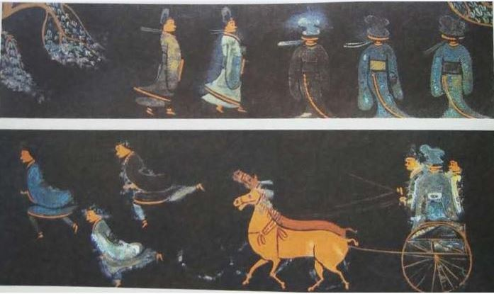
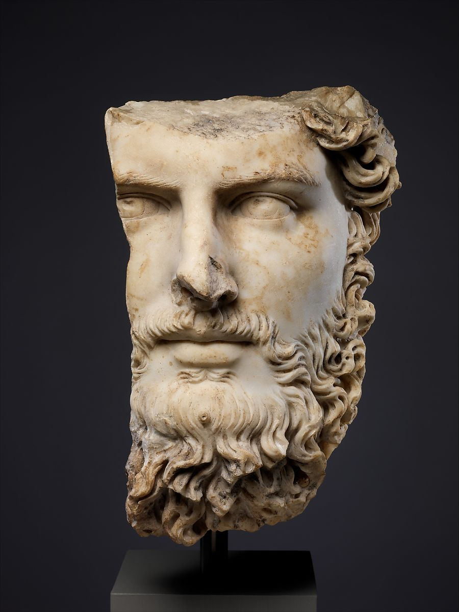
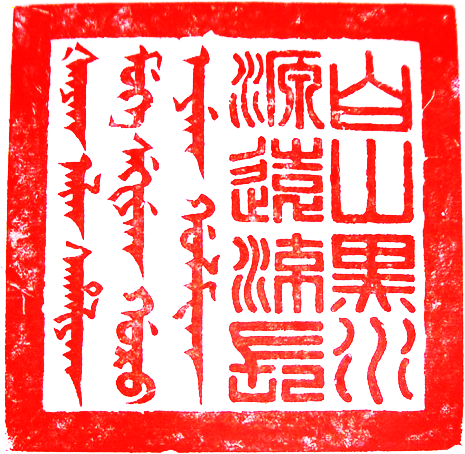

In Part I of The History of Identity, we covered how identity began in ancient times. For Part II, we focus on current times, where personal names are now considered fundamental to identity and dignity. 

## The emergence of family names

The United Nations Convention on the Rights of the Child declares that every child “shall be registered immediately after birth and shall have the right from birth to a name.” Family names or surnames identify a person’s origins. Family names appear to have developed first in China, originally among the nobility, and then spread to commoners.

Clan names that seem to indicate matrilineal heritage, called _xìng_ (姓), emerged in China around 4000–3000 BC. Many of these names include the character for woman (女), and the character for _xìng_ reads as “born of a woman.” People with the same _xìng_ were not allowed to marry each other.

**Lacquer painting from State of Ch'u (704–223 BC)**

Another type of clan name appeared during the Zhou dynasty from 1046–256 BC. As society became more complex and patrilineal, the _shì_ name (氏) allowed people to differentiate themselves from others with the same _xìng_.

A person’s _shì_ name might be derived from their state or fiefdom, their position within their family, or their profession.

Chinese surnames were standardized in 221 BC under the first emperor of the Qin dynasty. The _xìng_ and _shì_ names, which people had been using interchangeably, were merged into the single concept of a family name.

**Marble portrait of the co-emperor Lucius Verus (130 - 169 AD).** **His name at birth was Lucius Ceionius Commodus, changed to Lucius Aelius Aurelius Commodus when he was adopted.**

Family names first evolved in the Western world during the time of the Roman Empire, 750 BC to 500 AD. Romans developed [a system of _tria_ _nomina_](https://heraldry.sca.org/names/roman.html) (“three names”):

- _Praenomen_ (given name)—a personal name chosen by a child’s parents. Praenomen had standard abbreviations. i.e. Tiberius, abbreviated as Ti.
- _Nomen_ (clan name)—a public name that indicated social status, i.e. Valerius.
- _Cognomen_ (nickname)—a name describing physical or moral characteristic, i.e. Rufus, meaning “red-haired.”

The Roman three-name system started with the aristocracy and spread to the general citizenry as the population grew and people needed more names to distinguish among themselves.

**Bishop** [**Jón Ögmundsson**](https://commons.wikimedia.org/w/index.php?title=J%C3%B3n_%C3%96gmundsson&action=edit&redlink=1) **of Hólar, from the 19th century Icelandic manuscript JS 629 4to, now in the care of the Icelandic National Library**

Surnames developed in the rest of Europe starting in the 11th century. Norman barons brought them to England after the invasion of 1066. Most of these surnames grew organically from one of the following characteristics.

**Lineage**: _Patronymic_ and _matronymic_ surnames originate from a father or mother’s name.

Iceland developed a system where children receive a new surname based on their father’s name (or occasionally mother’s name). For example, Iceland's current prime minister is Jóhanna Sigurðardóttir. Her father’s name is Sigurður, so her surname becomes Sigurðardóttir, meaning “daughter of Sigurður.”

**Part of Offa’s Dyke, an 8th-century earthwork boundary in Britain.**

**Location**: Many Anglophone names come from the names of towns or regions (Hamilton, Murray), local topology (Landon means “long hill”), or features (Dyke, Wood, Fields).

**A German tailor pictured in die Nürnberger Hausbücher, 1612.**

**Profession**: [Occupational names](https://en.wikipedia.org/wiki/Surname#Occupational_surname) are based on the work performed by that family. The German name Eisenhauer means “iron hewer,” Schneider means “tailor,” and Schmidt refers to a blacksmith. Occupational names were also taken by servants of masters in certain professions. There is speculation, for example, that the English surname Vickers would have been adopted by the servant of a vicar.

## Additional names

[Middle names](https://www.rd.com/culture/why-do-we-have-middle-names/) have their origins in social class and religion. As mentioned earlier, more names indicated more respect during Roman times. Men had three names; women had two; their slaves had one. 

Aristocrats considered long names a show of their high place in society. Spanish and Arabic families would give their children paternal or maternal names from previous generations. This practice allowed them to keep track of the child’s family tree. 

**"Rosette Bearing the Names and Titles of Shah Jahan," ca. 1645. The central inscription reads, “His Majesty Shihab al-Din Muhammad Shah Jahan, the king, the vanquisher, may God perpetuate his dominion and sovereignty.”**

This tradition of middle names spread across Western cultures in the 1700s. But this time, three names were not exclusive to men. When faced with choosing between a family name and a saint name for their children, Europeans decided to go with both: given name first, baptismal (saint) name second, and surname third. The practice then spread to America through immigration.

Today, many cultures use a beloved relative’s name for a child’s middle name. And some families may even have two middle names to reflect both maternal and paternal relatives. Practically speaking, middle names can help differentiate people who share common first and last names. For this reason, [middle names may be required](https://www.businessinsider.com/why-you-cant-board-flights-if-your-middle-name-isnt-on-your-ticket-2018-4) on important documents, such as flight tickets.

## The order of names

The [placement of surnames](https://en.wikipedia.org/wiki/Personal_name#Name_order), or family names, varies by country. 

Eastern name order is typical in East Asia, South Asia, Southeast Asia, and parts of India.

The convention in China is to have the family name appear first, followed by the given name. For example, Gāo Xíngjiàn (高行健), who won the Nobel Prize for Literature in 2000, has the family name Gāo and the given name Xíngjiàn.

Western name order is common throughout Europe, the Americas, Australia, and New Zealand. The given name comes first, and then the family name, although for alphabetized lists, the names are reversed and separated by a comma. 

When Eastern names are used in the West and vice versa, there can be some confusion about whether they are following their traditional name order or not. The cellist known as Yo-Yo Ma uses the Western ordering, even though his Chinese name is Ma Youyou (马友友). 

## Identity verification

The need to confirm someone’s identity also goes back to ancient times. As society grew larger and political and financial systems developed, humans created ways to verify that a person’s identity was valid.

Some civilizations developed stamps and seals that represented a person’s identity. 

**Modern impression of a Cypriot cylinder seal: female figure, ibex, lion, ca. 14th–13th century B.C.**

Cylinder seals go back to the fourth millennium BC in Mesopotamia. These [carved cylinders](https://www.historyonthenet.com/mesopotamian-cylinder-seals) were rolled across wet clay to create an impression that signified ownership or identity. The seals were sometimes crafted from semi-precious stone such as carnelian or lapis lazuli and worn as jewellery. They were used by people from all strata of society to sign business deals, treaties, and marriage contracts.

The earliest seals in China originated during the Shang Dynasty, 1600 to 1046 BC. Chinese seals known as [chops](https://www.thoughtco.com/chinese-chops-seals-2278409) were carved from jade, stone, or ivory and dipped in red paste to stamp a unique symbol on documents, letters, and artwork.

.png#/media/Bestand:Chinese_seal_(Han_Dynasty).png)

**Chinese seal with Han and Manchu characters** 

Other types of signature seals can also be found across East Asia. In Japan, signature ink stamps are called [_hanko_](https://www.nippon.com/en/features/jg00077/hanko-and-inkan-japanese-stamps-and-personal-seals.html). These are commonly accepted as a signature when validating documents and official forms. Hanko stamps can be made from wood, plastic, and other materials and again, the ink, is generally red.

In the 5th century BC, the Romans started to write sentences and names at the bottom of documents, in addition to creating wax seals with [signet rings](https://www.thehistorypress.co.uk/articles/a-brief-history-of-signet-rings/). The earliest surviving signature from a famous historical figure is that of Rodrigo Díaz de Vivar, a medieval Spanish nobleman known as El Cid, dated to 1098. 

**Autograph signature of Rodrigo Díaz, \[also\] called El Cid, Archive of the Cathedral of Salamanca.** **It reads in Latin: ego ruderico, "I, Rodrigo".**

To see how modern society uses and abuses identity, be sure to read Part III of our History of Human Identity series next week.

Learn how to create a unified digital identity for all of your customers. Book a demo today with LoginRadius." the link is to this [https://www.loginradius.com/book-a-demo/](https://www.loginradius.com/book-a-demo/)

