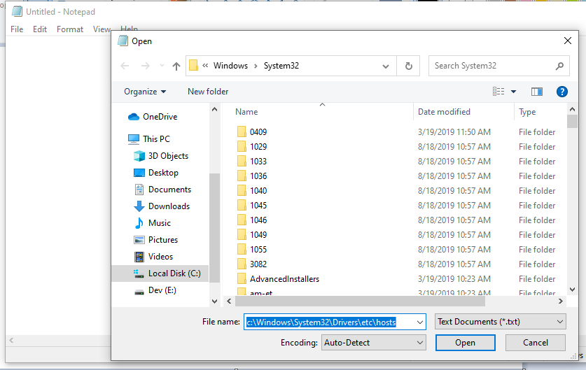

## What is the “hosts” file
A hosts file which is used by operating systems to map a connection between an IP address and domain names before going to domain name servers. This file is a simple text file with the mapping of IPs and domain names.

### Let’s talk about the usage of the hosts file  
##### Protecting Privacy
You can use this to block advertisers, trackers, block marketing, or third party websites, block ads, banners, 3rd party page counters, or sites to protect your privacy. 

##### Block website for your kids
If you don’t want your children to open some websites you can block them by the hosts file. You can decide entirely what you wish to block and even most hijackers and possibly unwanted programs. 

##### Security
We can utilize it as a firewall in our local system. The hosts file is to block Spyware and/or ad Networks you can add all the Spyware sites & ad Networks domain names in your hosts file also you can block dangerous sites, ransomware sites, blockchain sites. 

##### Development 
You know during the development, you need to run your web application on the localhost for verification. Websites can run on the localhost, 127.0.0.1, or localhost IP address. There are some limitations in the localhost, you want to review your website on the custom domain before launching on the public domain suppose you have developed the e-commerce. You want to debug some payment gateway issue but your payment gateway is not supporting localhost URL or IP in the case of successful payment. You can add custom domain in the hosts file and validate the payment process on localhost 

#### How to edit hosts file

##### Windows 8 or 10
Windows operating system we need to open the host file 
1. Go to the Start menu and start typing the Notepad.

2. Right-click Notepad and choose Run as administrator

  

3. Open the hosts file. Click on File > Open and Copy and Paste the following path`
 
    `c:\Windows\System32\Drivers\etc\hosts`

  

You can edit the hosts file


Suppose you want to block facebook.com on your system and want to add a custom domain for your website. Just Copy and Paste following Lines

```
0.0.0.0         www.facebook.com
127.0.0.1       www.customdomain.com
```
  

After finishing the Editing, **Save your hosts file**

  


Open your browser and try to access www.facebook.com and see you can’t access this site

  


##### Linux
Use following instructions for Linux 
1. In the Linux terminal window, open hosts file using a favorite text editor 
```
  $ sudo vim /etc/hosts
```

  


  It will prompt for the password, enter your administrator password.


2. Using the vim or your favorite text editor you can easily edit. The Linux hosts file is similar to the windows hosts file. Now again I am blocking Facebook and adding a custom domain 

  
  
3. Save the Changes

  
##### Mac OS
Use following instructions for macOS 
1. Find the terminal application on your system 
 -- We can use Spotlight application to search 

  


  
2. Type `sudo vim /etc/hosts` in the terminal 
-- It will prompt for the password, enter your administrator password 
-- Enter administrator Password 
            
  
  
*Using the vim text editor you can easily edit you. The macOS hosts file is also similar to the windows and Linux hosts file. I am blocking Facebook and adding custom domain here as well*.

  


3. Save Changes
Open your browser and try to access www.facebook.com and see you can’t access this site.

  


### Conclusion
The hosts file is found on all operating systems. The hosts file is a powerful tool. It can make your computer more secure and safer by blocking malicious sites    

