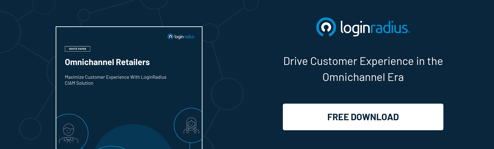

---
type: fuel
title: "5 Key CIAM Benefits and Challenges in the Retail Industry"
date: "2021-09-17"
coverImage: "retail-industry.jpg"
category: ["loginradius"]
featured: false 
author: "Navanita Devi"
description: "The modern retail industry has several challenges that can be solved by deploying a CIAM solution. Read this blog to learn how CIAM goes beyond just streamlining a platform to make it more intuitive, and how it boosts the marketing and sales efforts of a business in the retail industry."
metadescription: "CIAM solutions are an integral aspect of the online shopping experience. This blog explains how CIAM solves the challenges of the modern retail industry."
metatitle: "5 Key Challenges in the Retail Industry and How CIAM Solves them"
---

Over the past two years, the retail industry has changed to such an extent that it is no longer recognizable. This is primarily because a major portion of the revenue that retail businesses are bringing in happens through online sales. This dependency on online platforms can be a problem for retailers, especially when it comes to access management. Fortunately, there’s a solution—Consumer Identity and Access Management (CIAM).

## What is CIAM for the Retail Industry

CIAM is generally deployed on a platform in two ways, either as a service or embedded into applications or websites through APIs, so it carries out identity and access management for users. Typically, CIAM authentication involves identity management tools like [logins, authentication](https://www.loginradius.com/authentication/), and compliance.

## 5 Challenges that Consumer-Facing Enterprises Face Today

The modern retail industry has several challenges that can be solved by deploying a CIAM solution. These problems include a need for:

  

-   Fluid platform experience
    

Customers always expect a seamless [experience on an e-commerce platform](https://www.loginradius.com/blog/fuel/improve-customer-experience-ecommerce/). This experience is facilitated by the fact that the online store should have more or less the same products as that of the offline store. The other aspect involves the wish to have an easily accessible customer profile by integrating the customer data collected from all integration points, both online as well as offline.

  

-   Multichannel purchasing
    

  

One of the more challenging aspects that enterprises face when extending their business online is visiting both online and offline stores. This means that both stores have to deliver the customer’s needs and engage them irrespective of which channel they plan on making the purchase.

  

-   Presence of data silos
    

Marketing in the modern [retail industry](https://www.loginradius.com/industry-retail-and-ecommerce/) occurs on various platforms. It can take place through SMS, email, social media, and more. Therefore, there is a chance that data silos will appear because the marketing efforts are spread out across so many channels.

  

-   Underdeveloped marketing procedures
    

  

It has been established that an [effective marketing strategy](https://www.loginradius.com/blog/fuel/Top-5-Marketing-Strategies-to-Power-up-Your-Business/) involves the use of technology for data collection and analysis. However, the challenge that enterprises face is finding a solution that can manage such vast volumes of customer information and create a cohesive picture.

  

-   Need for customer loyalty
    

Another challenging aspect that online platforms face is the problem of personalization. Personalization, if executed properly, can urge the customer to make several purchases at a time and keep them coming back for more. In other words, it can improve the loyalty of the customer. However, this requires the platform to get to know the customer and their wants and needs, which is difficult.

## 5 Benefits of Implementing CIAM for E-commerce Platforms

If an enterprise is on the fence about the ability to create a digital identity for B2C users, it can help to consider its benefits. These include:

  

-   Storage of customer data
    

Customer data can be a very useful resource while devising a marketing strategy and making sales. [Top CIAM providers](https://www.loginradius.com/press/loginradius-named-a-top-customer-identity-and-access-management-ciam-vendor-by-gartner-and-forrester/) make it possible to collect certain information about the customer while also protecting it from hackers. The data that this software can collect extends beyond just the login registration form that they fill. It can also collect information from third-party social media sites regarding their preferences.

  

-   Secure authentication
    

One major aspect of CIAM solutions is the [multi-factor authentication](https://www.loginradius.com/resource/buyers-guide-to-multi-factor-authentication/) feature that it provides. By having more than one requirement to gain access to a profile, customers can receive an extra level of protection. This feature can significantly improve the existing business customer identity as users can utilize social media logins for a more streamlined process.

  

Also Download: [Identity Management Architectures for Ecommerce Products](https://www.loginradius.com/resource/identity-management-architectures-ecommerce-whitepaper)

  

-   Password reset ease
    

In case customers forget their passwords, the CIAM software solution offers customers the option to reset their passwords on their own. The new password is sent directly to the user’s email or SMS. Therefore, there is no need for intervention from an IT professional to reset it.

  

-   Scalability
    

  

CIAM solutions are a requirement for every user’s profile, whether several hundred or millions visit the platform. Therefore, the software must be capable of managing multiple identities at a time while also not interfering with the seamless running of the platform.

  

-   Streamlined experience
    

CIAM also helps to improve the overall intuitiveness of the platform. Research shows that the more [convenient a user experience](https://www.loginradius.com/blog/start-with-identity/new-age-ciam/) is on an e-commerce platform, the higher the sales skyrocket.

  

Therefore, CIAM solutions are an integral aspect of the online shopping experience. It goes beyond just streamlining the platform to make it more intuitive, and can also help to boost the marketing and sales efforts of a business in the retail industry.

