# How Git Local Repository Works

Let's understand how git set up a local repository
Once we initialize or clone any git project that will set up a local project environment.

that whole environment will look like the below picture 

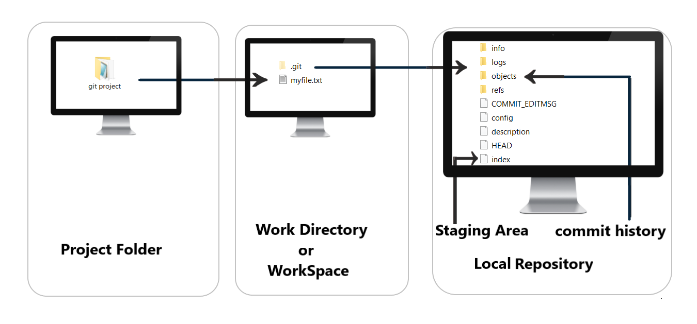

**Project Folder**: The main folder consists of a workspace and local repository

**Work Directory**: Inside Project Folder where we actually work,  we keep all files and perform many operations like addition, update, deletion of files

**Local Repository**: Here we don't actually change anything, this is handled automatically by git. this consists **staging area**, **commit history**, **stash area** etc.

Let's get into it step by step and see how we perform command or action and behind the scene, git do its own activity. 

- Step 1. Git clone and project:
  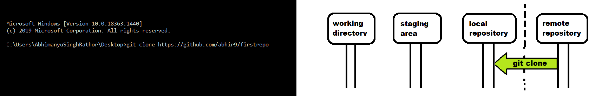

  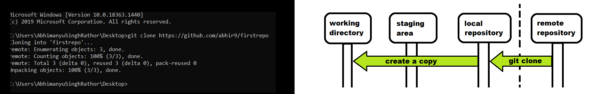
- Step 2. Explore what we got in repository
  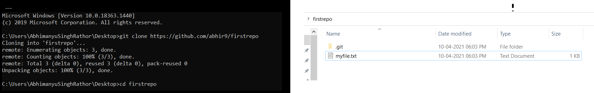

  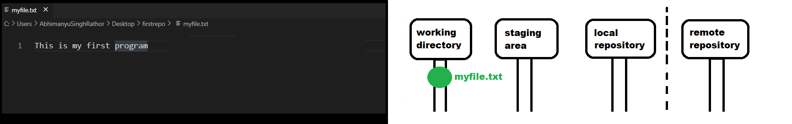
- Step 3. Do some modification in a files
  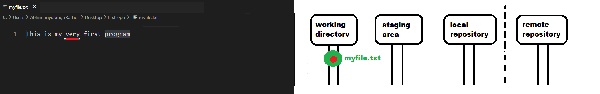

  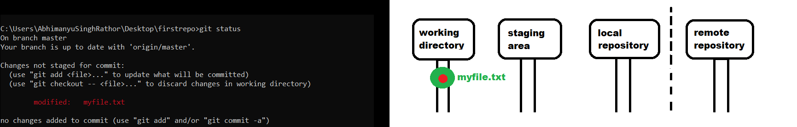
- Step 4. Add this file in to staging (ready for commit)
  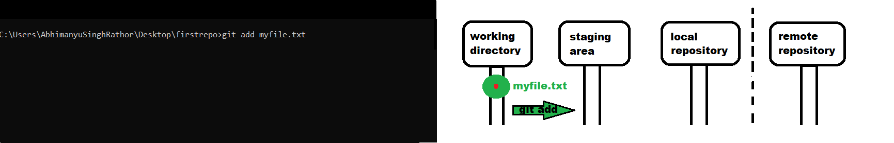

  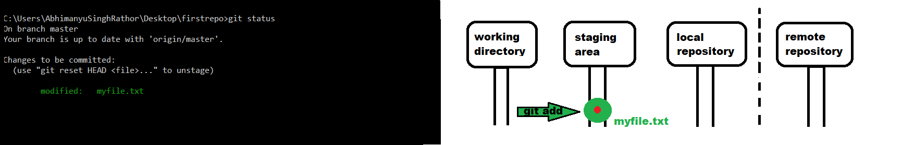
- Step 5. Commit the file 
  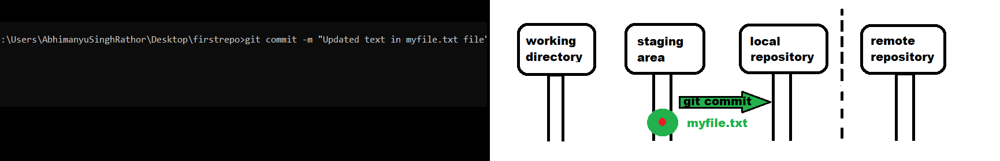

  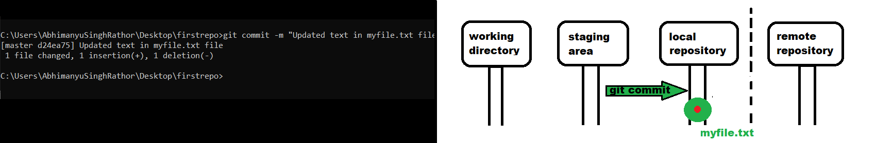
- Step 6. Push the changes
  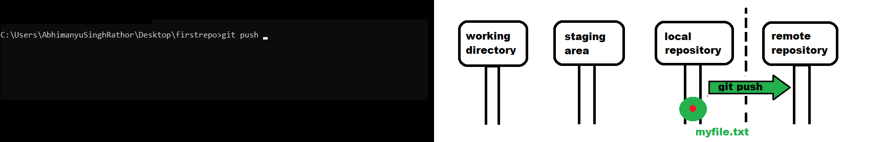

  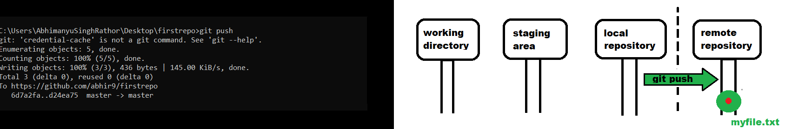

Hope this makes clear how git handling things at the local repository.